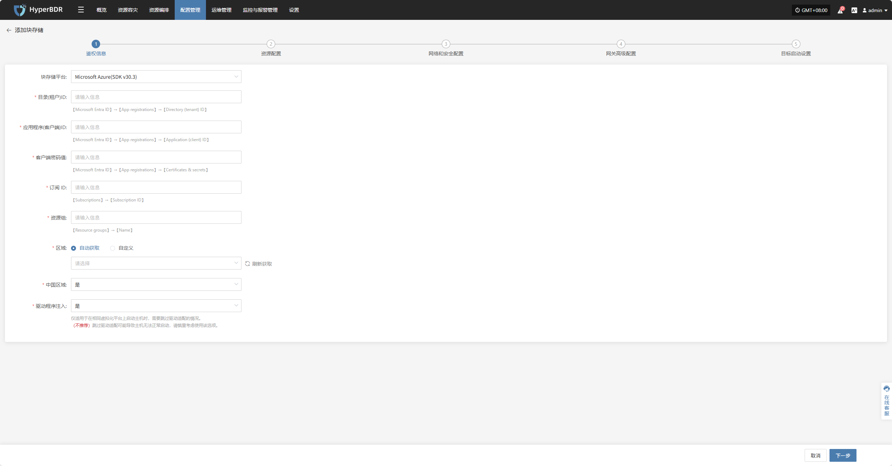
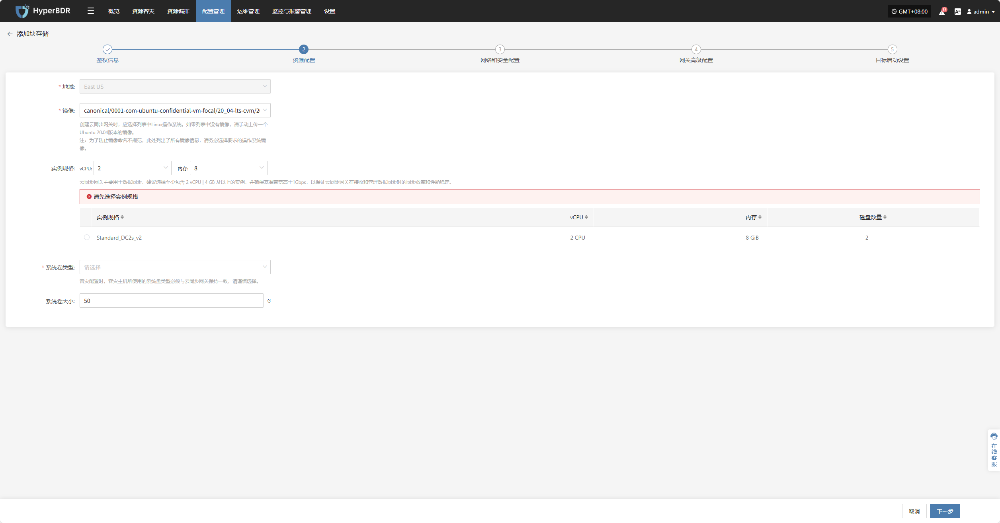
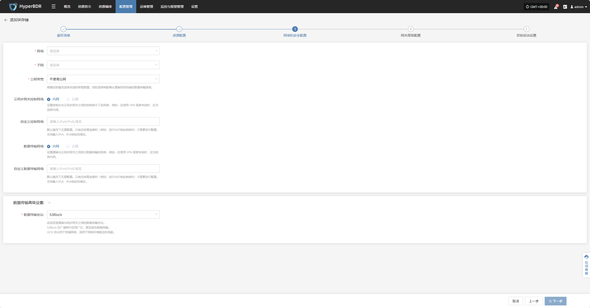
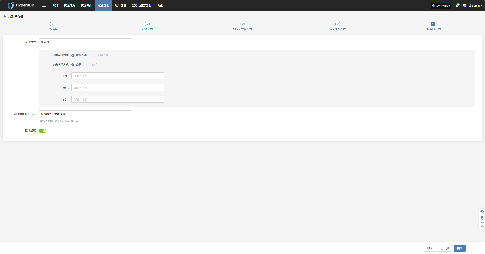
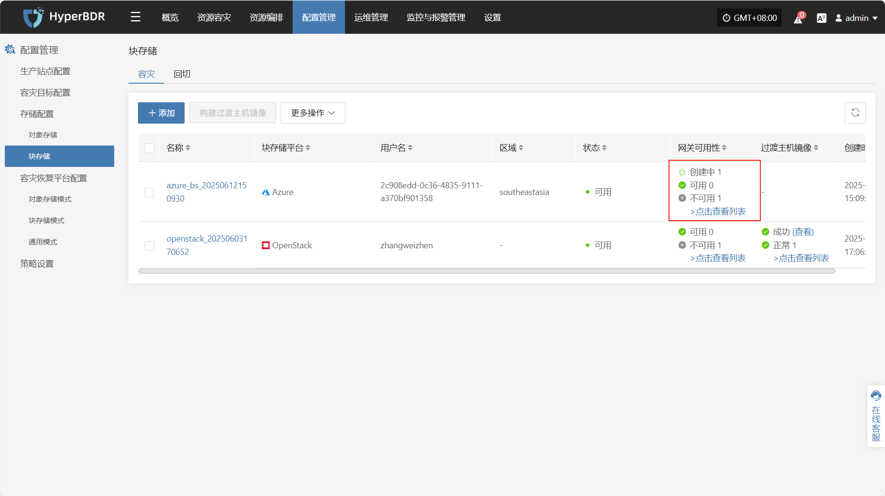
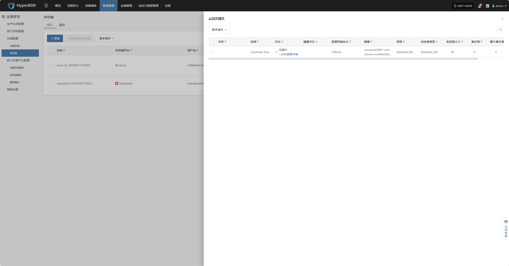
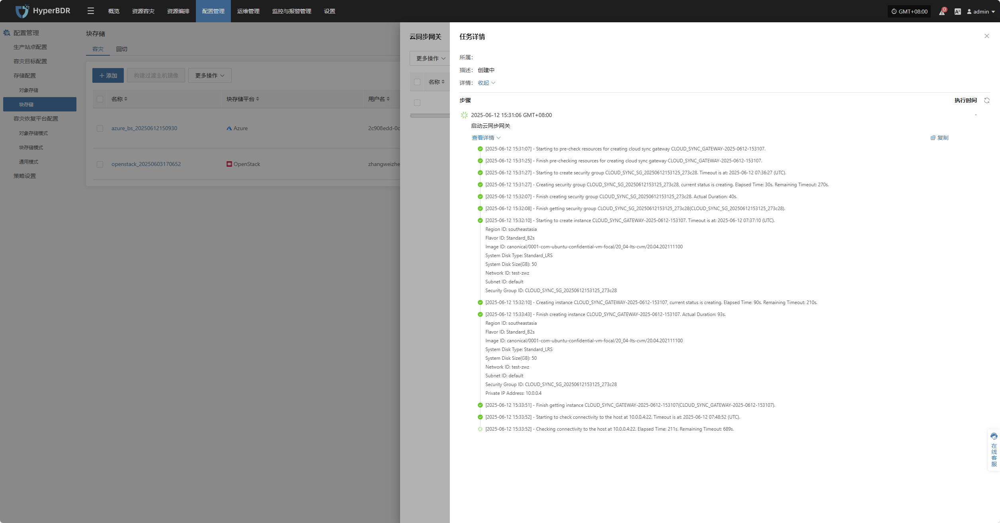

# **Microsoft Azure(SDK v30.3)**

## **添加块存储**

通过顶部导航栏依次选择 **“配置管理” → “存储配置” → “块存储”** 进入块存储页面，点击右上角 “添加” 按钮，可进行块存储的新增配置操作。

### **鉴权信息**

块存储平台通过下拉列表选择“Microsoft Azure(SDK v30.3)”，根据接入块存储的实际情况，填写以下平台鉴权信息：

> 若您不确定相关信息如何获取，可点击下方“点击查看”了解详细操作说明。 
> [👉 点击查看](../../poc/azure-target-pre-settings.html#obtain-the-required-authentication-information)

* 鉴权信息说明

| **配置项**     | **示例值**                          | **说明**                                                                                                        |
| ----------- | -------------------------------- | ------------------------------------------------------------------------------------------------------------- |
| 块存储平台       | Microsoft Azure(SDK v30.3)       | 通过下拉列表找到并选择Microsoft Azure(SDK v30.3)                                                                         |
| 目录(租户)ID    | HPUAAG0B2•••••••••••••••         | 【Microsoft Entra ID】→【App registrations】→【Directory (tenant) ID】                                              |
| 应用程序(客户端)ID | •••••••••••••••••••••••••••••••• | 【Microsoft Entra ID】→【App registrations】→【Application (client) ID】                                            |
| 客户端密码值      | 具体以实际为准                          | 【Microsoft Entra ID】→【App registrations】→【Certificates & secrets】注意：无法查看客户端密钥值，除非在创建后立即查看。请务必在离开页面之前保存创建时的密钥。 |
| 订阅 ID       | 自动获取 / 自定义                       | 【Subscriptions】→【Subscription ID】                                                                             |
| 资源组         | test-zwz                         | 【Resource groups】→【Name】                                                                                      |
| 区域          | 自动获取 / 自定义                       | 当模式为自动获取时点击“刷新获取”按钮拉取最新区域信息，可通过下拉列表选则对应 Azure 区域                                                       |
| 中国区域        | 是 / 否                            | 标记是否为中国区域 Azure 账号                                                                                            |
| 驱动程序注入      | 是 / 否                            | 仅适用于在相同虚拟化平台上启动主机时，需要跳过驱动适配的情况。&#xA;（不推荐）跳过驱动适配可能导致主机无法正常启动，请慎重考虑使用该选项。                                       |

鉴权信息填写完毕后，点&#x51FB;**"下一步"**&#x5F00;始进&#x884C;**"资源配置"**

### **资源配置**

为云同步网关分配计算、存储资源，确保其在目标环境中稳定高效运行。

* 资源配置说明

| **配置项** | **示例值**                                  | **说明**                                                                                                     |
| ------- | ---------------------------------------- | ---------------------------------------------------------------------------------------------------------- |
| 地域      | asia-southeastl                          | 请选择云同步网关安装的地域                                                                                              |
| 镜像      | 通过下拉列表选择对应Linux主机镜像                      | 创建云同步网关时，应选择列表中Linux操作系统。如果列表中没有镜像，请手动上传一个Ubuntu 20.04版本的镜像。&#xA;注：为了防止镜像命名不规范，此处列出了所有镜像信息，请务必选择要求的操作系统镜像。 |
| 实例规格    | 可通过下拉列表按需选择vCPU和内存，选择后自动刷新下列示例规格，具体以实际为准 | 云同步网关主要用于数据同步，建议选择至少包含 2 vCPU \| 4 GB 及以上的实例，并确保基准带宽高于1Gbps，以保证云同步网关在接收和管理数据同步时的同步效率和性能稳定                  |
| 系统卷类型   | 标准 HDD(本地冗余)                             | 具体以实际为准                                                                          |
| 系统卷大小   | 用户自定义（视实例需求而定）                           | 根据同步网关工作负载选择合适大小，默认为50G，建议大小50G                                                                            |

资源配置完毕后，点&#x51FB;**"下一步"**&#x5F00;始进&#x884C;**"网络和安全配置"**

### **网络和安全配置**

为云同步网关分配网络资源，确保其在目标环境中稳定高效运行。

* 网络和安全设置说明

| **配置项**   | **示例值**                                                 | **说明**                                                       |
| --------- | ------------------------------------------------------- | ------------------------------------------------------------ |
| 网络        | project-vpc (xxx.xxx.xxx.xxx/xx)                        | 通过下拉列表选择云同步网关所属的私有网络，仅显示同地区的网络配置，具体以实际为准                     |
| 子网        | project-subnet-public1-cn-north-1a (xxx.xxx.xxx.xxx/xx) | 通过下拉列表选择所属可用区中的子网，具体以实际为准                                    |
| 公网带宽      | 不使用公网1 Mbps20 Mbps50 Mbps100 Mbps                       | 根据实际情况选择合适的带宽数值。您的选择将影响从源端到目标端的数据传输速率。                       |
| 云同步网关控制网络 | 内网 / 公网                                                 | 设置控制台与云同步网关之间的控制指令下发网络，例如：在使用 VPN 或者专线时，应当选择内网。              |
| 自定义控制网络   | 输入IPv4/IPv6/域名                                          | 默认情况下无需配置。只有在按需连接时（例如：进行NAT地址转换时）才需要进行配置。支持输入IPv4、IPv6地址和域名。 |
| 数据传输网络    | 内网 / 公网                                                 | 设置源端与云同步网关之间进行数据传输的网络，例如：在使用 VPN 或者专线时，应当选择内网。               |
| 自定义数据传输网络 | 输入IPv4/IPv6/域名                                          | 默认情况下无需配置。只有在按需连接时（例如：进行NAT地址转换时）才需要进行配置。支持输入IPv4、IPv6地址和域名。 |

* 数据传输高级设置说明

| **配置项** | **可选值**                   | **说明**                                                                                 |
| ------- | ------------------------- | -------------------------------------------------------------------------------------- |
| 数据传输协议  | S3Block / iSCSI(即将退役，不推荐) | 该选项是源端与同步网关之间的数据传输协议。&#xA;S3Block 在广域网中应用广泛，更加适合数据传输。&#xA;iSCSI 协议用于存储网络，适用于网络环境稳定的场景。 |

网络和安全配置完毕后，点&#x51FB;**"下一步"**&#x5F00;始进&#x884C;**"网关高级配置"**

### **网关高级配置**

> 由于Azure云镜像的限制，必须使用ubuntu作为镜像的用户名。

* 网关高级配置说明

| **配置项** | **示例值** | **说明**                                       |
| ------- | ------- | -------------------------------------------- |
| 登录方式    | 密码 / 密钥 | 指定登录云主机的认证方式。密钥暂不可选                          |
| 用户名     | ubuntu  | 由于Azure云镜像的限制，必须使用ubuntu作为镜像的用户名。            |
| 密码      | —       | 如果选择“密码”登录方式，在此处填写对应的用户密码。后续使用该密码登录云主机。      |
| 端口      | 22      | 云主机 SSH 登录默认端口，建议保持为 `22`，如有安全策略要求，可配置为其他端口。 |

**网关高级配置**完毕后，点&#x51FB;**"下一步"**&#x5F00;始进&#x884C;**"目标启动设置"**

### **目标启动设置**

* 目标启动设置说明

| **配置项**  | **示例值**                                                       | **说明**                                                                                   |
| -------- | ------------------------------------------------------------- | ---------------------------------------------------------------------------------------- |
| 启动方式     | 卷启动 / 镜像启动                                                    | 选择过渡主机的启动方式：如果你是在云平台上运行长期业务，推荐用**卷启动**；如果是一次性的测试或演练，可以用**镜像启动**。                         |
| 过渡主机镜像   | 自动创建 / 选择镜像                                                   | 若选择“自动创建”，系统将自动创建所需镜像。若选择“选择镜像”，请在下拉列表中指定已有镜像。                                           |
| 镜像访问方式   | 密码 / 密钥                                                       | 创建主机实例时用于访问镜像的认证方式：\  **密码** ：使用设置的用户名密码进行登录；\  **密钥** ：使用密钥文件登录，推荐方式，安全性更高（暂不可用）。 |
| 用户名      | ubuntu                                                        | 由于Azure云镜像的限制，必须使用ubuntu作为镜像的用户名。                                                        |
| 密码       | ••••••••••••••                                                | 当镜像访问方式为“密码”时需填写此项，使用“密钥”方式则此项可留空。                                                       |
| 端口       | 22                                                            | 云主机 SSH 登录默认端口，建议保持为 `22`，如有安全策略要求，可配置为其他端口。                                             |
| 驱动适配网络方式 | 公网网络不使用代理 内网网络不使用代理 公网网络并通过云同步网关代理 内网网络并通过云同步网关代理 | 该选项是驱动适配主机的网络连接方式。 根据实际网络环境选择是否通过云同步网关代理进行通信。                                        |
| 驱动适配     | 是 / 否                                                         | 通过按钮控制是否开启                                                                               |

目标启动设置完成后，点&#x51FB;**“完成”**，系统将开始自动创建云同步网关及过渡主机镜像

### **查看详情**

创建过程中，点击“点击查看列表”即可查看创建云同网关详细列表。

选择相应主机并点击“点击查看详情”，可查看任务创建过程中产生的详细日志，便于快速掌握执行状态以及故障排除。

<!-- @include: ./huawei.md{110-150} -->