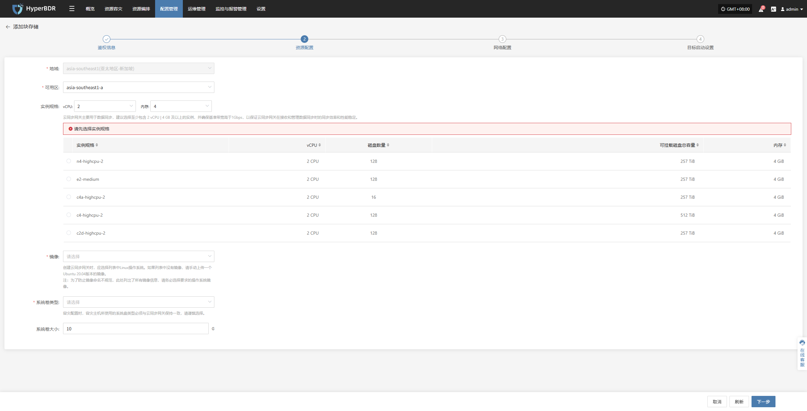
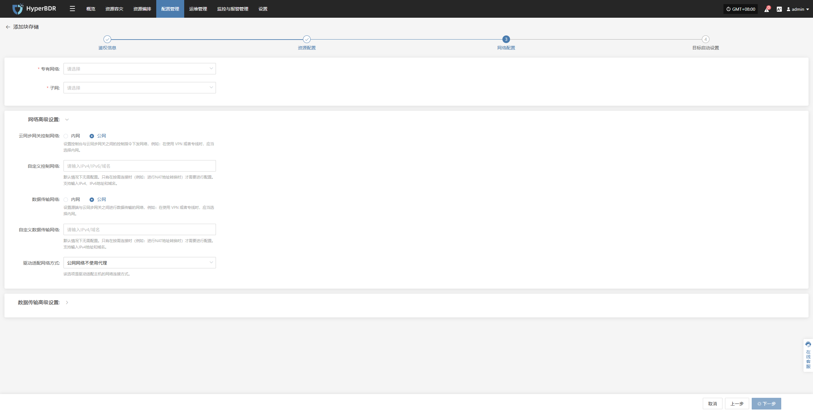
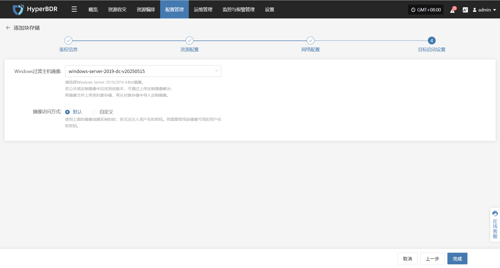
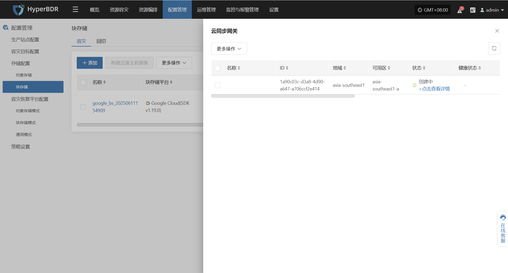
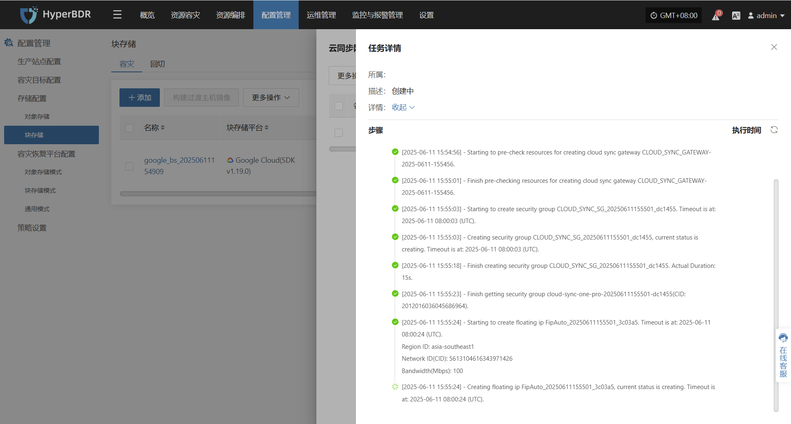

# **Google Cloud(sDK v1.19.0)**

## **添加块存储**

通过顶部导航栏依次选择 **“配置管理” → “存储配置” → “块存储”** 进入块存储页面，点击右上角 “添加” 按钮，可进行块存储的新增配置操作。

### **鉴权信息**

块存储平台通过下拉列表选择“Google cloud(sDK v1.19.0)”，根据接入块存储的实际情况，填写以下平台鉴权信息：

> 若您不确定相关信息如何获取，可点击下方“点击查看”了解详细操作说明。 
> [👉 点击查看](../../poc/googlecloud-pre-settings.html#create-a-service-account-key)

* 鉴权信息说明

| **配置项**     | **示例值**                          | **说明**                                                                                                                                                                                      |
| ----------- | -------------------------------- | ------------------------------------------------------------------------------------------------------------------------------------------------------------------------------------------- |
| 块存储平台       | Google Cloud(SDK v1.19.0)        | 通过下拉列表找到并选择Google Cloud(SDK v1.19.0)                                                                                                                                                        |
| 项目ID        | HPUAAG0B2•••••••••••••••         | 登录管理控制台 → 点击左上角图标【导航菜单】→【查看所有产品】→【IAM和管理】→ 点击下方【管理资源】→ 在此页面找到【ID】。                                                                                                                          |
| 电子邮件        | •••••••••••••••••••••••••••••••• | 登录管理控制台 → 点击左上角图标【导航菜单】→【查看所有产品】→【IAM和管理】→ 点击【服务账号】→ 在此页面找到【服务账号】→【电子邮件】。                                                                                                                   |
| Private Key | 具体以实际为准                          | 登录管理控制台 → 点击左上角图标【导航菜单】→【查看所有产品】→【IAM和管理】→ 点击【服务账号】→ 在此页面找到【服务账号】→ 点击列表中操作列并选择【管理密钥】→ 在此页面点击【添加密钥】→ 选择【创建新密钥】创建完成后下载JSON密钥类型文件，打开该文件找到private\_key值。注意：如果已有JSON密钥类型文件，打开该文件找到private\_key值。 |
| 区域          | 自动获取 / 自定义                       | 当模式为自动获取时点击“刷新获取”按钮拉取最新区域信息，可通过下拉列表选则对应 Google Cloud 区域                                                                                                                                     |

* 高级设置说明

| **配置项** | **示例值** | **说明**                    |
| ------- | ------- | ------------------------- |
| 名称      | test    | 如果不填写名称，系统将自动为您生成一个默认的名称。 |

### **资源配置**

为云同步网关分配计算、存储资源，确保其在目标环境中稳定高效运行。

* 资源配置说明

| 配置项   | 示例值                                      | 说明                                                                                                         |
| ----- | ---------------------------------------- | ---------------------------------------------------------------------------------------------------------- |
| 区域    | asia-southeastl(亚太地区-新加坡)                | 请选择云同步网关安装的地域                                                                                              |
| 可用区   | asia-southeastl-a                        | 可通过下拉列表选择对应区域内的可用区                                                                                         |
| 实例规格  | 可通过下拉列表按需选择vCPU和内存，选择后自动刷新下列示例规格，具体以实际为准 | 云同步网关主要用于数据同步，建议选择至少包含 2 vCPU \| 4 GB 及以上的实例，并确保基准带宽高于1Gbps，以保证云同步网关在接收和管理数据同步时的同步效率和性能稳定                  |
| 镜像    | 通过下拉列表选择对应Linux主机镜像                      | 创建云同步网关时，应选择列表中Linux操作系统。如果列表中没有镜像，请手动上传一个Ubuntu 20.04版本的镜像。&#xA;注：为了防止镜像命名不规范，此处列出了所有镜像信息，请务必选择要求的操作系统镜像。 |
| 系统卷类型 | 平衡 Hyperdisk                             | 具体以实际为准                                                                                                    |
| 系统卷大小 | 用户自定义（视实例需求而定）                           | 根据同步网关工作负载选择合适大小，默认为10G，建议大小50G                                                                            |

资源配置完毕后，点&#x51FB;**"下一步"**&#x5F00;始进&#x884C;**"网络配置"**

### **网络配置**

为云同步网关分配网络资源，确保其在目标环境中稳定高效运行。

* 网络配置说明

| **配置项** | **示例值**                                                 | **说明**                       |
| ------- | ------------------------------------------------------- | ---------------------------- |
| 专有网络    | project-vpc (xxx.xxx.xxx.xxx/xx)                        | 通过下拉列表选择云同步网关所属的私有网络，具体以实际为准 |
| 子网      | project-subnet-public1-cn-north-1a (xxx.xxx.xxx.xxx/xx) | 通过下拉列表选择所属可用区中的子网，具体以实际为准    |

* 网络高级设置

| **配置项**   | **示例值**                                                            | **说明**                                                       |
| --------- | ------------------------------------------------------------------ | ------------------------------------------------------------ |
| 云同步网关控制网络 | 内网 / 公网                                                            | 设置控制台与云同步网关之间的控制指令下发网络，例如：在使用 VPN 或者专线时，应当选择内网。              |
| 自定义控制网络   | 输入IPv4/IPv6/域名                                                     | 默认情况下无需配置。只有在按需连接时（例如：进行NAT地址转换时）才需要进行配置。支持输入IPv4、IPv6地址和域名。 |
| 数据传输网络    | 内网 / 公网                                                            | 设置源端与云同步网关之间进行数据传输的网络，例如：在使用 VPN 或者专线时，应当选择内网。               |
| 自定义数据传输网络 | 输入IPv4/IPv6/域名                                                     | 默认情况下无需配置。只有在按需连接时（例如：进行NAT地址转换时）才需要进行配置。支持输入IPv4、IPv6地址和域名。 |
| 驱动适配网络方式  | 公网网络不使用代理\ 内网网络不使用代理\ 公网网络并通过云同步网关代理\ 内网网络并通过云同步网关代理\  | 驱动适配主机的网络连接方式                                                |

* 数据传输高级设置

| **配置项** | **可选值**                   | **说明**                                                                                 |
| ------- | ------------------------- | -------------------------------------------------------------------------------------- |
| 数据传输协议  | S3Block / iSCSI(即将退役，不推荐) | 该选项是源端与同步网关之间的数据传输协议。&#xA;S3Block 在广域网中应用广泛，更加适合数据传输。&#xA;iSCSI 协议用于存储网络，适用于网络环境稳定的场景。 |

网络配置完毕后，点&#x51FB;**"下一步"**&#x5F00;始进&#x884C;**"目标启动设置"**

### **目标启动设置**

用于配置目标端在恢复或演练过程中启动所需的关键参数，确保资源能够顺利接管与运行。

* 目标启动设置说明

| **配置项**       | **示例值**                                          | **说明**                                                                                                |
| ------------- | ------------------------------------------------ | ----------------------------------------------------------------------------------------------------- |
| Windows过渡主机镜像 | Windows Server-2019-English-Full-Base-2025.05.15 | 请选择Windows Server 2019/2016 64bit镜像。&#xA;若公共或定制镜像中没找到该版本，可通过上传定制镜像解决：&#xA;将镜像文件上传到对象存储，再从对象存储中导入定制镜像。 |
| 镜像访问方式        | 默认 / 自定义                                         | 使用上面的镜像创建实例的时，若无法注入用户名和密码。则需要使用该镜像可用的用户名和密码。                                                          |

目标启动设置完成后，点&#x51FB;**“完成”**，系统将开始自动创建云同步网关及过渡主机镜像

### **查看详情**

创建过程中，点击“点击查看列表”即可查看创建云同网关详细列表。

选择相应主机并点击“点击查看详情”，可查看任务创建过程中产生的详细日志，便于快速掌握执行状态以及故障排除。

<!-- @include: ./huawei.md{110-150} -->
