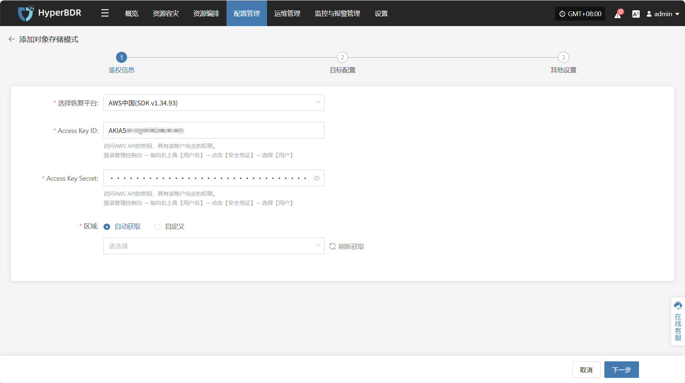
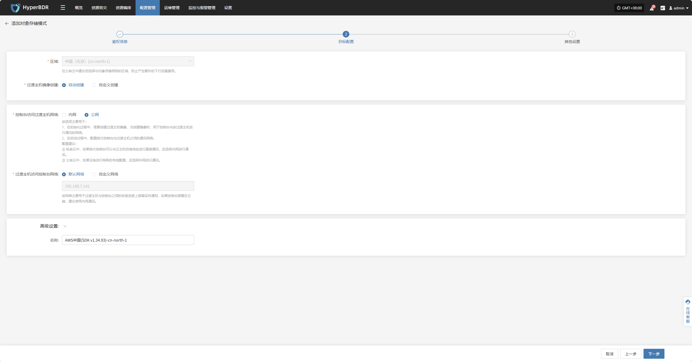
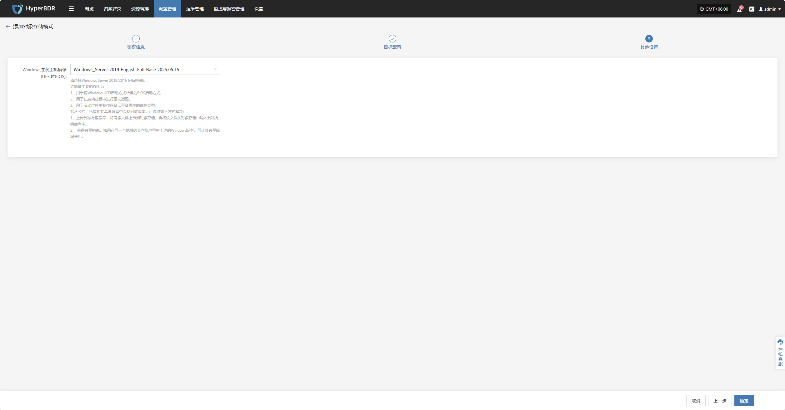
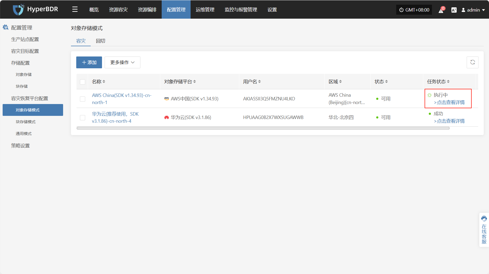
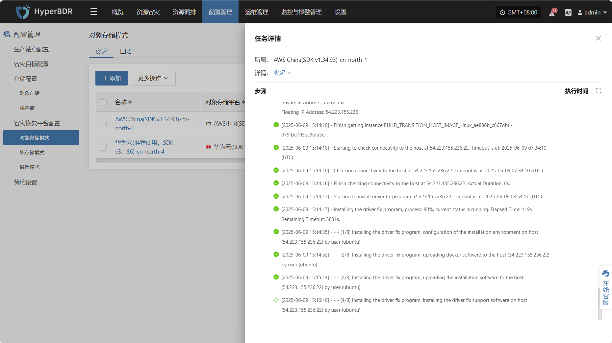
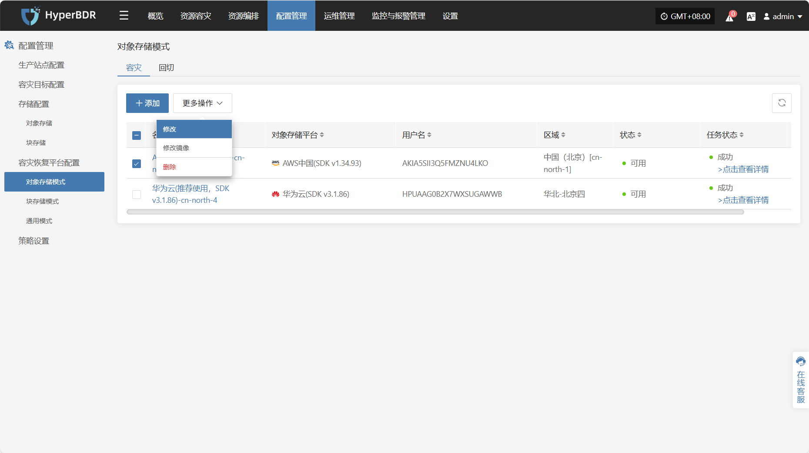
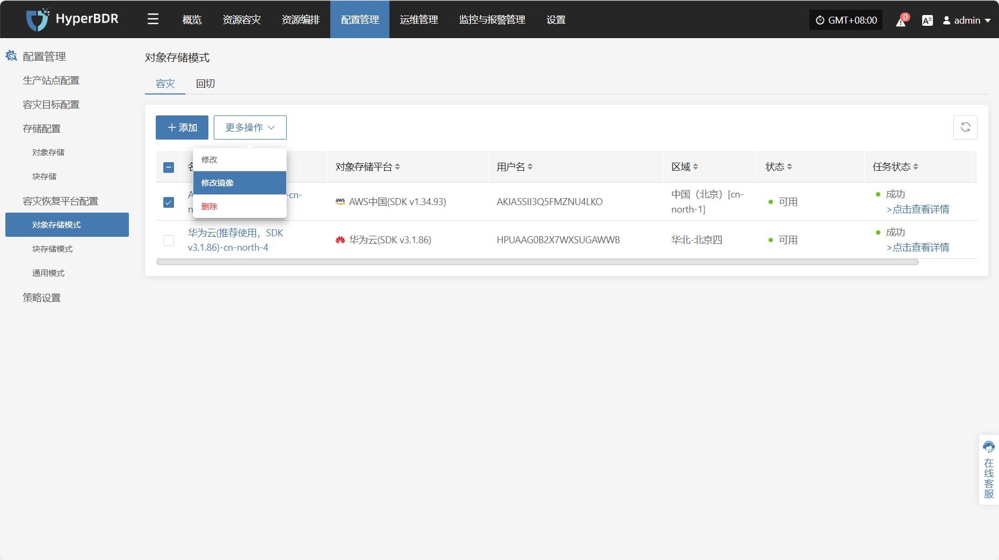
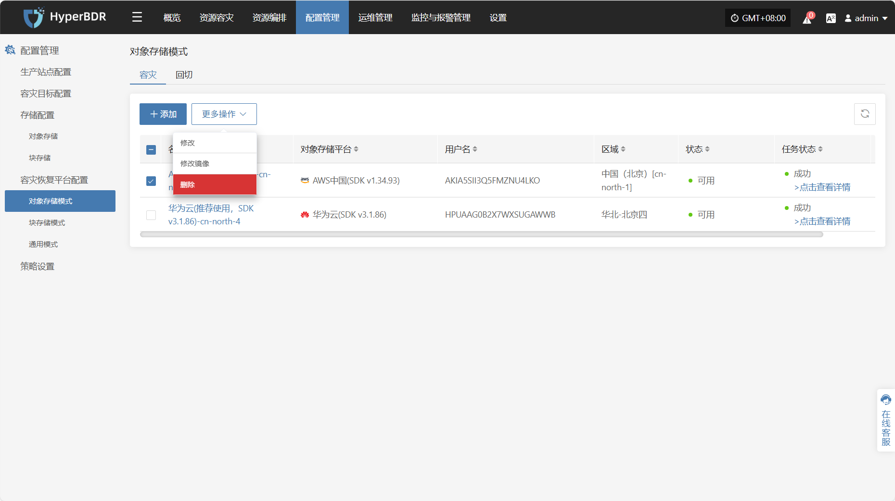
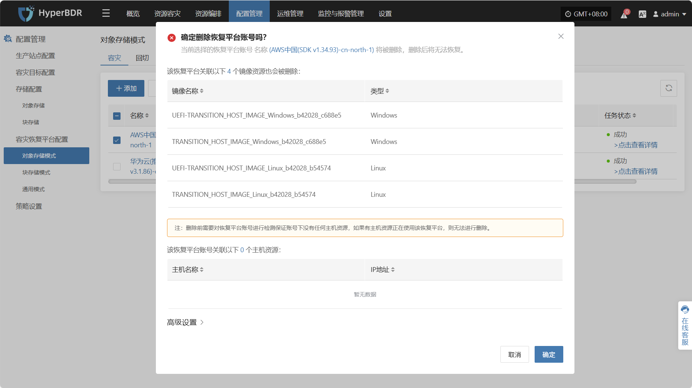

# **AWS中国(SDK v1.34.93)**

## **添加**

通过顶部导航栏依次选择 **“配置管理” → “容灾恢复平台配置” → “对象存储”** 进入对象存储页面，点击右上角 “添加” 按钮，可进行对象存储的新增配置操作。

### **鉴权信息**

选择恢复平台通过下拉列表选择“AWS中国(SDK v1.34.93)”，根据接入对象存储的实际情况，填写以下平台鉴权信息：

* 鉴权信息说明

| **配置项**           | **示例值**                          | **说明**                                                                           |
| ----------------- | -------------------------------- | -------------------------------------------------------------------------------- |
| 选择恢复平台            | AWS中国（SDK v1.34.93）              | 通过下拉列表找到并选择AWS中国(SDK v1.34.93)                                                   |
| Access Key ID     | AKIA5SII3Q•••••••••••••••        | 访问 AWS API 的密钥 ID，具有该账户完全权限\ 获取方式：登录 AWS 管理控制台 → 指向右上角【用户名】→ 点击【安全凭证】→ 选择【用户】 |
| Access Key Secret | •••••••••••••••••••••••••••••••• | 访问 AWS API 的密钥 Secret，具有该账户完全权限\ 获取方式同上，填写时建议隐藏显示                             |
| 区域                | 自动获取 / 自定义                       | 当模式为自动获取时点击“刷新获取”按钮拉取最新区域信息，可通过下拉列表选则对应 AWS 区域                                   |

鉴权信息填写完毕后，点&#x51FB;**"下一步"**&#x5F00;始进&#x884C;**"目标配置"**

### **目标配置**

* **目标配置说明**

| **配置项**         | **示例值**                           | **说明**                                                                                                                                                                                     |
|--------------------|--------------------------------------|----------------------------------------------------------------------------------------------------------------------------------------------------------------------------------------------|
| 区域               | 中国（北京）\[cn-north-1]            | 由鉴权信息配置时选定，不可修改，公有云中建议您选择与对象存储相同的区域，防止产生额外的下行流量费用                                                                                         |
| 过渡主机镜像创建   | 自动创建 / 自定义创建                | 自动创建时会按照系统要求，自行创建对应过渡主机镜像，当选择自定义创建时，需要选择可用区系统类型等相关配置信息，详细可见下列过度主机自定义创建说明                                           |
| 控制台访问过渡主机网络 | 内网 / 公网                         | 该选项主要用于： 1、在初始化过程中，需要创建过渡主机镜像，当创建镜像时，用于控制台与该过渡主机进行通讯的网络。 2、在启动过程中，配置容灾控制台与过渡主机之间的通讯网络。 配置建议： ① 私有云中，如果容灾控制台可以与云主机自身地址进行直接通讯，应选择内网进行通讯。 ② 公有云中，如果没有进行特殊的专线配置，应选择外网进行通讯。 |
| 过渡主机访问控制台网络 | 默认网络 / 自定义网络               | 当选择默认网络时会自动绑定当前控制台IP，该网络主要用于过渡主机与控制台之间的恢复进度上报等实时通知，如果控制台部署在云端，建议使绑定内网IP进行通讯                                                 |
| 高级设置            | 名称：AWS中国(SDK v1.34.93)-cn-north-1 | 如果不输入ID则会自动生成                                                                                                                                                                     |

* **自定义创建过度主机说明**

| **配置项**               | **示例值**                                          | **说明**                                                                                          |
|--------------------------|-----------------------------------------------------|-----------------------------------------------------------------------------------------------------|
| 可用区                   | cn-north-la                                         | 选择业务部署的可用区（根据实际业务需求选择）                                                                 |
| 实例规格                 | 2/4GB/c6i.large                                     | 根据业务负载需求选择实例规格（CPU / 内存 / 规格型号）                                                         |
| 网络                     | 项目-vpc (10.0.0.0/16)                              | 选择已规划好的 VPC 网络                                                                                   |
| 子网                     | 项目-subnet-public1-cn-north-1a (10.0.0.0/20)       | 选择对应可用区下的子网                                                                                     |
| Linux过渡主机基础镜像     | ubuntu-focal-20.04-amd64-server-20250530            | 用于数据恢复和驱动适配的临时主机镜像 推荐使用 Ubuntu 20.04 / 24.04 **注意：**源端内核 ≥ 6.x 时必须使用 24.04 |
| Windows过渡主机基础镜像   | Windows Server-2019-English-Full-Base-2025.05.15    | 用于数据恢复和驱动适配的临时主机镜像 推荐使用 Windows Server 2016 / 2019 64bit                       |
| 系统卷类型               | 通用型 SSD (gp3)                                    | 根据性能需求选择云盘类型                                                                                   |

目标配置填写完毕后，点&#x51FB;**"下一步"**&#x5F00;始进&#x884C;**"其他配置"**

### **其他设置**

* **其他设置说明**

| **配置项**                     | **示例值**                                          | **说明**                                                                                                                                                                                                                                                                     |
|------------------------------|-----------------------------------------------------|------------------------------------------------------------------------------------------------------------------------------------------------------------------------------------------------------------------------------------------------------------------------------|
| Windows过渡主机镜像 (UEFI转BIOS) | Windows Server-2019-English-Full-Base-2025.05.15    | **主要功能：** 1. 将 Windows UEFI 启动方式转换为 BIOS 启动方式 2. 启动过程中进行驱动适配 3. 制作符合云平台需求的磁盘类型  **镜像获取方式：** 1. 上传到私有镜像库：将镜像文件上传至对象存储后导入 2. 获取共享镜像：通过同地域其他账户共享获得  **版本要求：** 必须使用 Windows Server 2019/2016 64bit 版本 |

其他设置完成后，点击 **“完成”** ，系统将开始自动创建过渡主机镜像

### **查看详情**

创建过程中，点击“点击查看详细”可查看任务创建过程中产生的详细日志，便于快速掌握执行状态以及故障排除。

## **更多操作**

### **修改**

点击“修改”，可对鉴权信息，目标配置，其他设置进行编辑操作

### **修改镜像**

点击“修改镜像”，可对过渡主机镜像进行重建操作

> 注：如果已有过渡主机镜像，再次构建过渡主机镜像时会删除以前的镜像，再创建新镜像。

当选择自动创建时会自动按照系统预设进行构建，选择自定义时，需要选择可用区系统类型等相关配置信息，详细可见上列过度主机自定义创建说明

### **删除**

