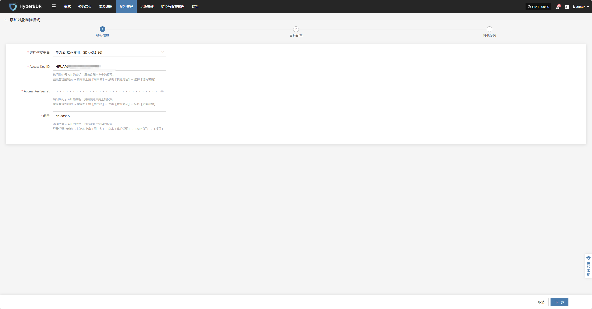
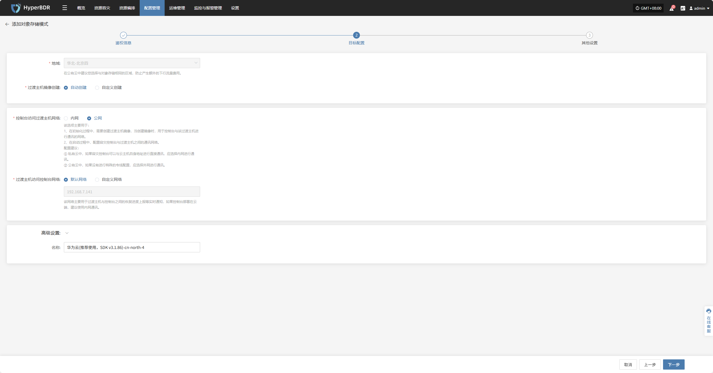
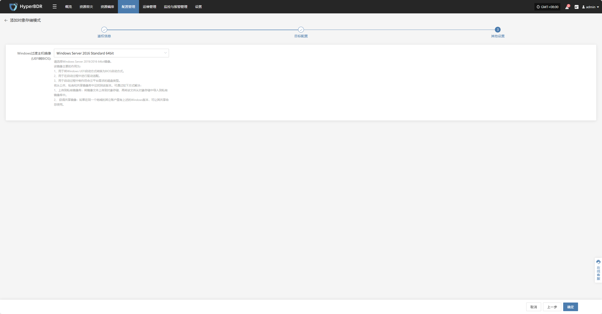
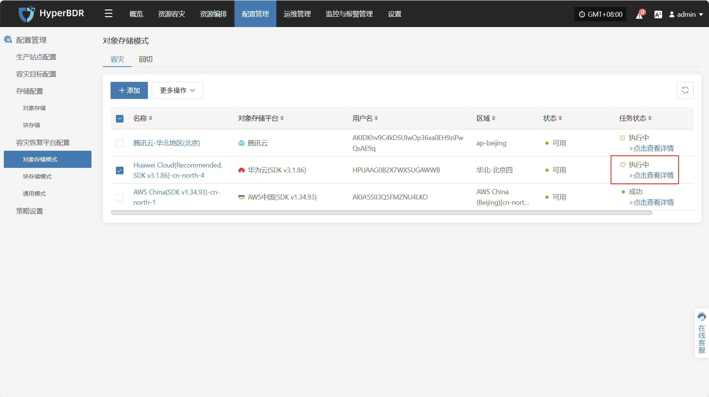
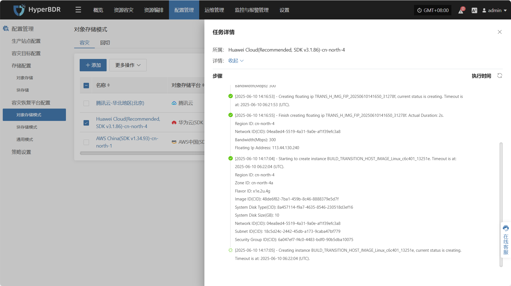
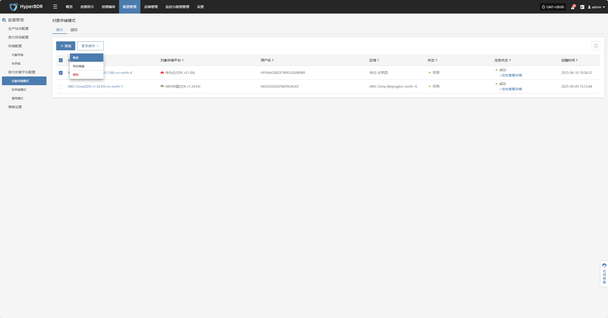
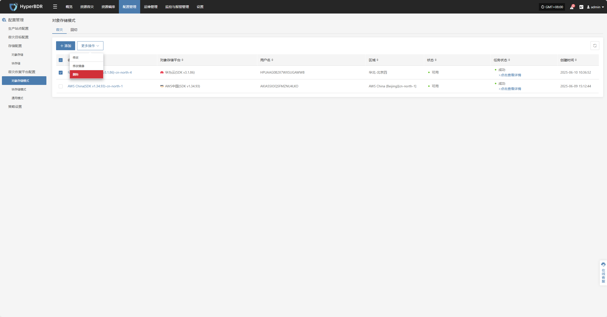
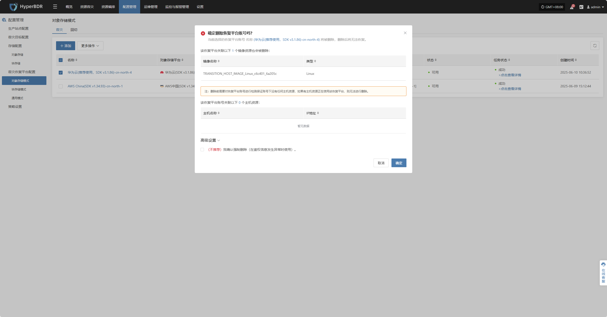

# **华为云(推荐使用，SDKv3.1.86)**

## **添加对象存储**

通过顶部导航栏依次选择 **“配置管理” → “容灾恢复平台配置” → “对象存储”** 进入对象存储页面，点击右上角 “添加” 按钮，可进行对象存储的新增配置操作。

### **鉴权信息**

选择恢复平台通过下拉列表选择“华为云(推荐使用，SDKv3.1.86)”，根据接入对象存储的实际情况，填写以下平台鉴权信息：

* **鉴权信息说明**

| **配置项**           | **示例值**                          | **说明**                                                                      |
| ----------------- | -------------------------------- | --------------------------------------------------------------------------- |
| 选择恢复平台            | 华为云(推荐使用，SDKv3.1.86)             | 通过下拉列表找到并选择华为云(推荐使用，SDKv3.1.86)                                             |
| Access Key ID     | AKIA5SII3Q•••••••••••••••        | 访问华为云 API 的密钥，具有该账户完全的权限。&#xA;登录管理控制台 → 指向右上角【用户名】→ 点击【我的凭证】→ 选择【访问密钥】      |
| Access Key Secret | •••••••••••••••••••••••••••••••• | 访问华为云 API 的密钥，具有该账户完全的权限。&#xA;登录管理控制台 → 指向右上角【用户名】→ 点击【我的凭证】→ 选择【访问密钥】      |
| 区域                | cn-east-5                        | 访问华为云 API 的密钥，具有该账户完全的权限。&#xA;登录管理控制台 → 指向右上角【用户名】→ 点击【我的凭证】→ 【API凭证】→ 【项目】 |

鉴权信息填写完毕后，点&#x51FB;**"下一步"**&#x5F00;始进&#x884C;**"目标配置"**

### **目标配置**

* **目标配置说明**

| **配置项**             | **示例值**                                         | **说明**                                                                                                                                                                                                                             |
|------------------------|---------------------------------------------------|--------------------------------------------------------------------------------------------------------------------------------------------------------------------------------------------------------------------------------------|
| 区域                   | 华北-北京四                                        | 由鉴权信息配置时选定，不可修改。 公有云中建议您选择与对象存储相同的区域，防止产生额外的下行流量费用。                                                                                                                               |
| 过渡主机镜像创建        | 自动创建 / 自定义创建                                 | 自动创建时会按照系统要求，自行创建对应过渡主机镜像。 当选择自定义创建时，需要选择可用区、系统类型等相关配置信息，详细可见下列过渡主机自定义创建说明。                                                                                          |
| 控制台访问过渡主机网络    | 内网 / 公网                                         | 该选项主要用于： 1. 在初始化过程中，需要创建过渡主机镜像时，用于控制台与该过渡主机进行通讯的网络。 2. 在启动过程中，配置容灾控制台与过渡主机之间的通讯网络。  配置建议： ① 私有云中，如果容灾控制台可以与云主机自身地址直接通讯，应选择内网。 ② 公有云中，如未配置专线，建议选择公网。 |
| 过渡主机访问控制台网络    | 默认网络 / 自定义网络                                 | 当选择默认网络时会自动绑定当前控制台 IP。 该网络主要用于过渡主机与控制台之间的恢复进度上报等实时通知。 如果控制台部署在云端，建议使用内网通讯。                                                                                                  |
| 高级设置               | 名称：华为云(推荐使用，SDK v3.1.86)-cn-north-4       | 如果不输入 ID 则会自动生成。                                                                                                                                                                                                          |

* **自定义创建过度主机说明**

| **配置项**             | **示例值**                                              | **说明**                                                                                     |
|------------------------|--------------------------------------------------------|----------------------------------------------------------------------------------------------|
| 可用区                 | cn-north-la                                            | 选择业务部署的可用区（根据实际业务需求选择）                                                              |
| 实例规格                | 2/4GB/c6i.large                                        | 根据业务负载需求选择实例规格（CPU / 内存 / 规格型号）                                                       |
| 网络                   | 项目-vpc(10.0.0.0/16)                                  | 选择已规划好的 VPC 网络                                                                      |
| 子网                   | 项目-subnet-public1-cn-north-1a(10.0.0.0/20)           | 选择对应可用区下的子网                                                                        |
| Linux过渡主机基础镜像   | ubuntu-focal-20.04-amd64-server-20250530              | 用于数据恢复和驱动适配的临时主机镜像。 推荐 Ubuntu 20.04 / 24.04。 源端内核 ≥ 6.x 必须使用 24.04。   |
| Windows过渡主机基础镜像 | Windows Server-2019-English-Full-Base-2025.05.15       | 用于数据恢复和驱动适配的临时主机镜像。 推荐 Windows Server 2016 / 2019 64bit。              |
| 系统卷类型             | 通用型 SSD (gp3)                                       | 根据性能需求选择云盘类型                                                                      |

### **其他设置**

* **其他设置说明**

| **配置项**                         | **示例值**                                          | **说明**                                                                                                                                                                                                                                                                                                                                                                           |
|----------------------------------|----------------------------------------------------|------------------------------------------------------------------------------------------------------------------------------------------------------------------------------------------------------------------------------------------------------------------------------------------------------------------------------------------------------------------------------------|
| Windows过渡主机镜像 (UEFI转BIOS) | Windows Server-2019-English-Full-Base-2025.05.15   | 该镜像主要的作用为： 1. 用于将 Windows UEFI 启动方式转换为 BIOS 启动方式。 2. 用于在启动过程中进行驱动适配。 3. 用于启动过程中制作符合云平台需求的磁盘类型。  若从公共、私有和共享镜像库中没找到该版本，可通过如下方式解决： 1. 上传到私有镜像库：将镜像文件上传到对象存储，再将该文件从对象存储中导入到私有镜像库中。 2. 获得共享镜像：如果在同一个地域的其它账户里有上述的 Windows 版本，可让其共享给您使用。 |

其他设置完成后，点击 **“完成”** ，系统将开始自动创建过渡主机镜像

### **查看详情**

创建过程中，点击“点击查看详细”可查看任务创建过程中产生的详细日志，便于快速掌握执行状态以及故障排除。

## **更多操作**

### **修改**

点击“修改”，可对鉴权信息，目标配置，其他设置进行编辑操作

### **修改镜像**

点击“修改镜像”，可对过渡主机镜像进行重建操作

> 注：如果已有过渡主机镜像，再次构建过渡主机镜像时会删除以前的镜像，再创建新镜像。

当选择自动创建时会自动按照系统预设进行构建，选择自定义时，需要选择可用区系统类型等相关配置信息，详细可见上列过度主机自定义创建说明

### **删除**

