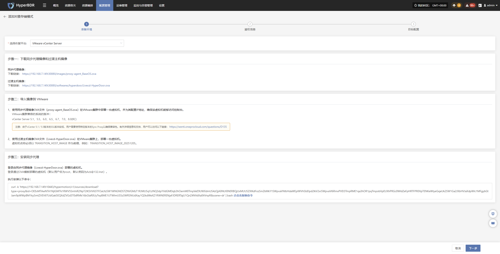
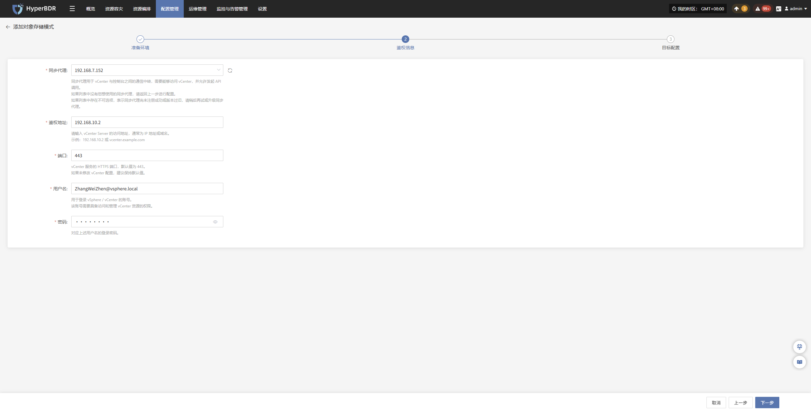
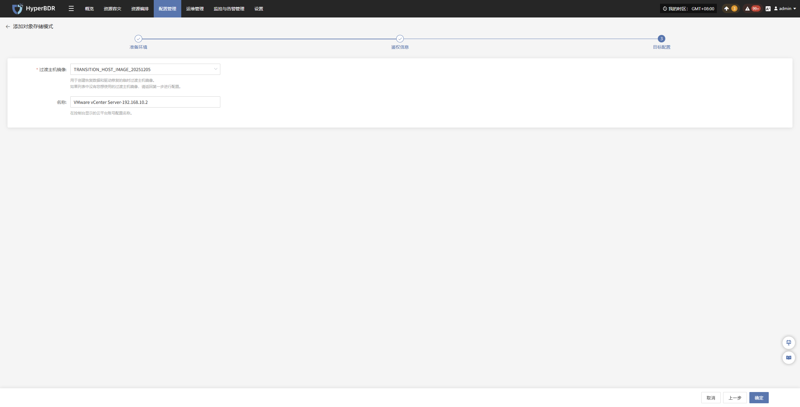
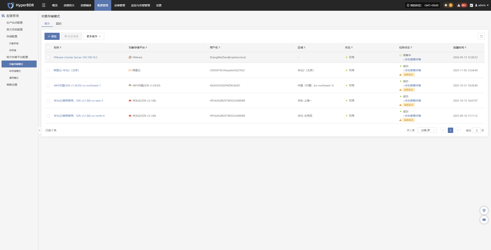
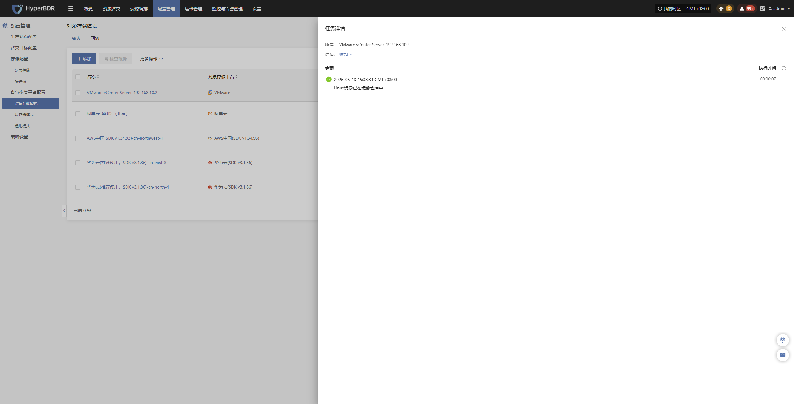
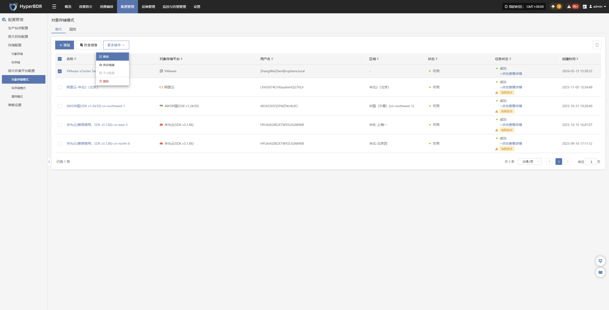
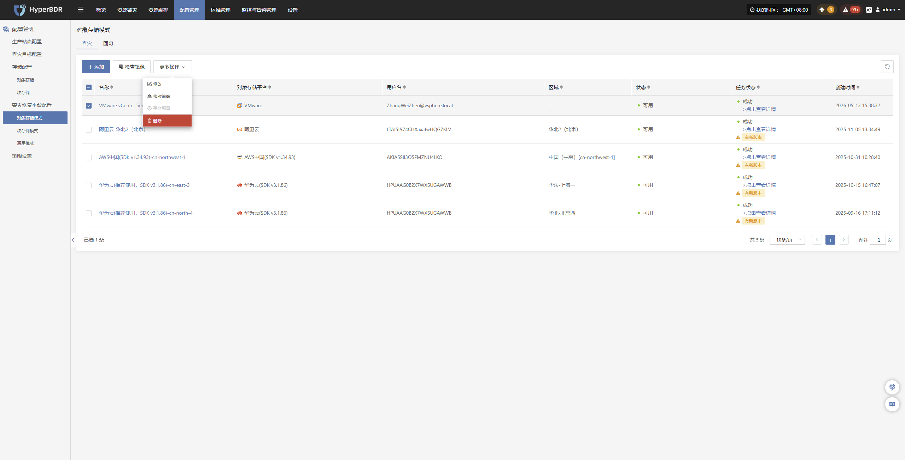
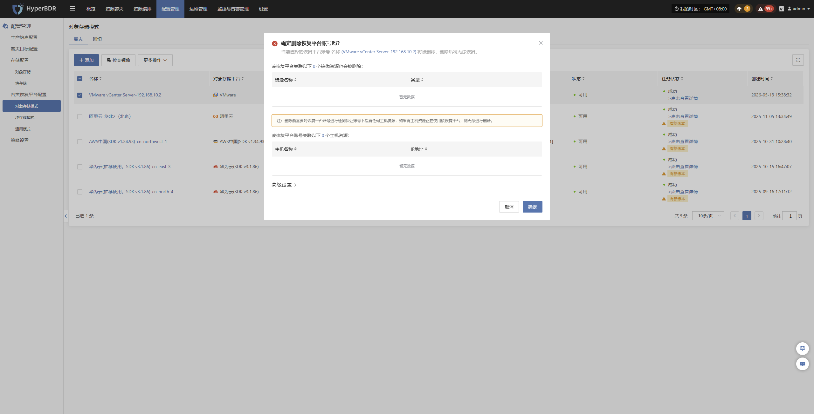

# VMware vCenter Server

## **添加对象存储**

通过顶部导航栏依次选择 **“配置管理” → “容灾恢复平台配置” → “对象存储”** 进入对象存储页面，点击右上角 “添加” 按钮，可进行对象存储的新增配置操作。

### **准备环境**

选择恢复平台通过下拉列表选择“VMware vCenter Server”，根据页面提示信息准备相关环境：

- **准备环境说明**
    - 步骤一：
        - 按照页面指引获取所需的主机镜像资源。

    - 步骤二：
        - 使用同步代理镜像OVA文件（proxy-agent_BaseOS.ova）在VMware集群中部署一台虚拟机，并为其配置IP地址，确保该虚拟机能够访问控制台。
        - 使用过渡主机镜像OVA文件（Livecd-HyperDoor.ova）在VMware集群上，部署一台虚拟机。
        >虚拟机名称必须以 TRANSITION_HOST_IMAGE 作为前缀，例如：TRANSITION_HOST_IMAGE_20251205。
    - 步骤三：
        - 登录由同步代理镜像（Livecd-HyperDoor.ova）部署的虚拟机。
        >登录通过OVA模板部署的虚拟机（默认用户名为root，默认密码为Acb@132.Inst）。
        - 复制页面提供的安装命令，去该主机内执行安装。

准备工作完成后可点击 **“下一步”** 开始进行 **“鉴权信息”** 填写

### **鉴权信息**

准备工作完成后，根据实际情况填写以下平台鉴权信息：

- **鉴权信息说明**

| 配置项 | 示例值 | 说明 |
|---|---|---|
| 同步代理 | 192.168.7.152 | 第一步配置的同步代理服务器地址，用于与平台建立同步通信。 |
| 鉴权地址 | 192.168.10.2 | 平台登录地址，用于用户身份认证与登录。 |
| 端口 | 443 | 平台登录服务对应的访问端口，默认使用 HTTPS 443 端口。 |
| 用户名 | ZhangWeiZhen@vsphere.local | 平台登录账号，需具备对应的访问与管理权限。 |
| 密码 | •••••••• | 平台登录账号对应的密码。 |

鉴权信息填写完毕后，点&#x51FB;**"下一步"**&#x5F00;始进&#x884C;**"目标配置"**

### **目标配置**

* **目标配置说明**

| 配置项 | 示例值 | 说明 |
|---|---|---|
| 过渡主机镜像 | TRANSITION_HOST_IMAGE_20251205 | 用于创建过渡主机的镜像资源，需提前在VMware平台中使用ova模板完成创建。 |
| 名称 | VMware vCenter Server-192.168.10.2 | 显示在 HyperBDR 列表中的名称，建议根据平台类型及 IP 地址进行命名，便于后续识别与管理。|

目标配置完成后，点击 **“确定”**，系统将开始创建目标存储平台信息。待任务状态显示为完成后，即可正常使用。

### **查看详情**

创建过程中，点击“点击查看详细”可查看任务创建过程中产生的详细日志，便于快速掌握执行状态以及故障排除。

## **更多操作**

### **修改**

点击“修改”，可对鉴权信息，目标配置进行编辑操作

### **修改镜像**

点击“修改镜像”，可对过渡主机镜像进行重建操作

> 注：如果选择【自动上传】选项，点击【确定】按钮后，会先删除以前自动上传的镜像，再自动上传一个新的镜像。

### **平台配置**

点击“平台配置”，可修改目标平台部分启动信息，支持自定义主机、磁盘、快照及镜像的创建超时时间，用于适配不同环境下的资源创建耗时需求。

注意：该功能当前VMware平台不可用

### **删除**

