# **主机容灾**

资源容灾为HyperBDR容灾的主要流程操作步骤引导页面，所有的容灾操作在此页面完成，包含了正向的主机容灾、主机回切两部分的流程操作。

主机容灾步骤主要有三部分，其中包含选择主机、容灾配置、开始容灾三个主流程步骤，您可以通过三步骤引导来完成所有容灾的主机到容灾演练/接管的闭环操作。

点击顶部"资源容灾"导航栏，点击左侧"主机容灾"导航栏，可以进行主机容灾的主流程操作。

## **操作流程**

| **操作步骤**   | **说明**                                                                   |
| ---------- | ------------------------------------------------------------------------ |
| 准备工作       | 注册HyperBDR用户添加HyperBDR产品授权                                               |
|  步骤一 选择主机  | 点击顶部 **"资源容灾"** 导航栏，点击左侧 **"主机容灾"** ，点击 **"选择主机"** 菜单开始进行 **选择主机** 的步骤操作 |
|  步骤二 容灾配置  | 点击顶部 **"资源容灾"** 导航栏，点击左侧 **"主机容灾"** ，点击 **"容灾配置"** 菜单开始进行 **容灾配置** 的步骤操作 |
|  步骤三 开始容灾  | 点击顶部 **"资源容灾"** 导航栏，点击左侧 **"主机容灾"** ，点击 **"开始容灾"** 菜单开始进行 **开始容灾** 的步骤操作 |

## **准备工作**

### **注册HyperBDR用户**

在添加容灾主机之前，首先你需要注册或添加一个容灾账号，你可以使用安装完成的默认admin账号来登录平台使用。也可以创建一个新的容灾账号，平台支持多租户模式。

TODO：

(创建一个新的容灾账户)

如果您已经有账号，请忽略此步骤。

### **为HyperBDR产品添加容灾授权**

容灾产品安装完成后，首先你需要添加一个容灾产品授权，你可以联系与您对接的项目经理或者发送邮件到<support@oneprocloud.com>来申请一个可用授权。

TODO：

[点击查看授权License申请指导步骤](../../poc/failback-hyperbdr-pre-settings.md#申请hyperbdr容灾回切授权)

如果您已经添加过授权，请忽略此步骤。&#x20;

### **完成生产站点配置**

此步骤为源端生产平台无代理模式，包含源端为VMware、OpenStack、AWS 、FusionCompute、Oracle五种类型

* [添加VMware生产站点](../configuration/production-site.md#添加vmware平台)

* [添加OpenStack生产站点](../configuration/production-site.md#添加openstack平台)

* [添加AWS生产站点](../configuration/production-site.md#添加aws平台)

* [添加FusionCompute生产站点](../configuration/production-site.md#添加fusioncompute平台)

* [添加Oracle生产站点](../configuration/production-site.md#添加oracle平台)

如果您的源端为**代理模式**或者您已经完成了**生产站点配置**请忽略此步骤。

### **完成容灾目标配置**

此步骤为容灾目标平台为已经做过自动化对接的平台，需要提前完成**容灾目标配置**。

如果您还未进行配置，请先进&#x884C;**(容灾目标平台配置)**&#x6765;添加一个容灾恢复平台。

如果您使用的模式为对象存储，请忽略此步骤。

### **网络策略开通**

当您在进行**选择主机、容灾配置及开始容灾**步骤时，需要提前开通源端生产平台访问HyperBDR容灾控制台及容灾目标的网络，才能保证源端生产平台的正常添加注册以及后续的数据同步，不然无法进行主机的添加。

* (无代理模式网络架构及网络策略)

* (有代理模式网络架构及网络策略)

### **规划容灾目标平台的VPC和子网等网络资源**

当您在进行**容灾配置**时，需要提前对待容灾备份主机进行目标资源的配置指定，此时需要选择已经规划好的VPC、子网、安全组等信息，如果没有提前创建规划此部分信息，那么将无法进行后续步骤操作。

您必须保证容灾目标云账号下有且至少一个的VPC、子网和安全组可以使用。

此步骤适用于容灾目标为自动化块存储模式及对象存储自动化恢复模式，其他通用方式请忽略此步骤。

## **选择主机**

登录控制台，点击顶部 **"资源容灾"** 导航栏，点击左侧 **"主机容灾"**，点击 **"选择主机"** 菜单， 点击 **"添加主机"** 按钮来添加待容灾生产主机。

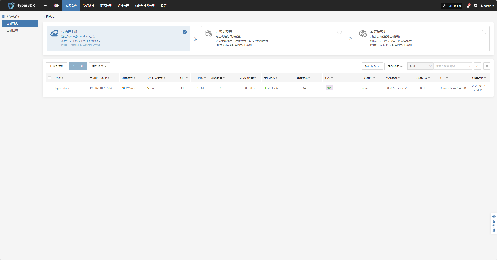

在添加主机页面，你可以选择生产平台类型，源端无代理模式和源端代理程序。

| **生产平台类型** | **支持资源**                                   | **说明**                                                                                                                                                                                                                                                          |
|:---------------:|:--------------------------------------------:|:-----------------------------------------------------------------------------------------------------------------------------------------------------------------------------------------------------------------------------------------------------------------:|
|    源端无代理    | VMware OpenStack AWS FusionCompute Oracle | 生产源端为VMware、OpenStack、AWS、FusionCompute及Oracle时，则可以进行无代理模式进行备份                                                                                                                                                                                        |
|   源端代理程序   | Linux Windows                             | 生产源端代理程序，适用于所有源端Linux、Windows主机，前提是操作系统需要在支持范围内。 操作系统支持矩阵（Agentless）：[点击查看](https://oneprocloud.feishu.cn/sheets/VRqksSPEPhRTPStp3kVcItXNnyh?sheet=0MJNYC) 操作系统支持矩阵（Agent）：[点击查看](https://oneprocloud.feishu.cn/sheets/VRqksSPEPhRTPStp3kVcItXNnyh?sheet=Y9fpqO) |

### **源端无代理模式**

源端无代理模式支持源端生产平台为VMware、OpenStack、AWS、FusionCompute 、Oracle五种类型。

无代理模式要求源端必须部署一台或多台Sync Proxy代理，由Sync Proxy代理来统一对接调用源端生产API接口进行数据的获取，需要提前进行网络规划配置。

* VMware平台创建Sync Proxy虚拟机

可以直接下载OVA模版导入VMware生产Sync Proxy虚拟机进行使用。

OVA下载链接：[点击下载](https://hyperbdr-system-image-do-not-delete.obs.ap-southeast-3.myhuaweicloud.com/proxy-agent_BaseOS.ova)

* 其他平台创建Sync Proxy虚拟机

其他平台可以自行进行Ubuntu 20.04操作系统的虚拟机创建，如果为OpenStack平台或者其他KVM虚拟化平台，可以下载标准的Ubuntu 20.04 QCOW镜像导入进行使用。

QCOW镜像下载链接：[点击下载](https://downloads.oneprocloud.com/docs_images/ubuntu-20.04-server-cloud-init-amd64.qcow2)

> 注意：此Ubuntu20.04的镜像是没有默认登录密码的，镜像内部包含cloud-init服务，要求你导入的云平台必须可以支持通过cloud-init服务进行密码的注入，否则无法使用此镜像。

* 前提准备

| 生产平台      | 基础条件                                              | 指导文档                                                                                                                   |
| :----------: | :--------------------------------------------------: | :-----------------------------------------------------------------------------------------------------------------------: |
| VMware       | 完成Sync Proxy同步代理的部署安装，完成源端VMware生产平台的添加        | [添加VMware生产平台](../configuration/production-site.md#添加vmware平台)           |
| OpenStack    | 完成Sync Proxy同步代理的部署安装，完成源端OpenStack Ceph生产平台的添加 | [添加OpenStack生产平台](../configuration/production-site.md#添加openstack平台) |
| AWS          | 完成Sync Proxy同步代理的部署安装，完成源端AWS生产平台的添加           | [添加AWS生产平台](../configuration/production-site.md#添加aws平台)             |
| FusionCompute| 完成Sync Proxy同步代理的部署安装，完成源端FusionCompute生产平台的添加 | [添加FusionCompute生产平台](../configuration/production-site.md#添加fusioncompute平台)                                                                                                  |
| Oracle       | 完成Sync Proxy同步代理的部署安装，完成源端Oracle生产平台的添加        | [添加Oracle生产平台](../configuration/production-site.md#添加oracle平台)                                                                                                         |

#### **VMware**

点击 **"选择主机"** 菜单， 点击 **"添加主机"** 按钮来添加主机，选择生产平台类型，选&#x62E9;**"源端无代理模式"**，并选&#x62E9;**"VMware"**&#x5E73;台，选择生产平台中，选择已经添加完成的VMware平台链接，并点&#x51FB;**"下一步"**&#x8FDB;行选择VMware待容灾主机列表。

如果你还没有添加生产平台，可以点击 "添加生产平台" 按钮来添加一个新的VMware生产平台，参考步骤：[添加VMware平台](../configuration/production-site.md#添加vmware平台)

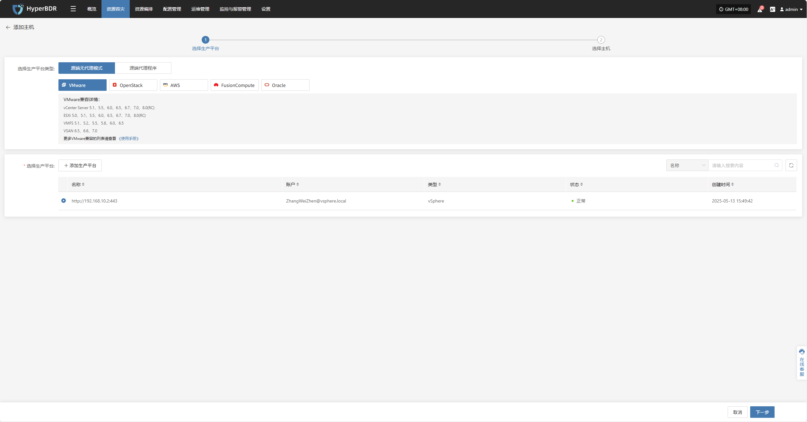

从当前VMware平台中勾选需要容灾备份的虚拟机，可以翻页进行手动进行批量勾选，也可以使用搜索功能根据名称和系统类型进行搜索需要备份的主机。

在选择备份主机时，可以参考选择主机磁盘数量变化及源端同步代理信息，目前源端同步代理数量、最大挂载磁盘数量、已挂载磁盘数量及剩余可挂载磁盘数量，可以根据信息来随时扩展源端同步代理的规格及数量来支持大批量的备份。

可以从列表中看到所有虚拟机的清单、包含操作系统、磁盘数量、磁盘总容量、支持同步及支持增量等内容。

**"重载虚拟机"** 功能，如果您在平台上新建的主机未展示在下方列表中，请点击“重载虚拟机”按钮，将其重新加载至此列表。

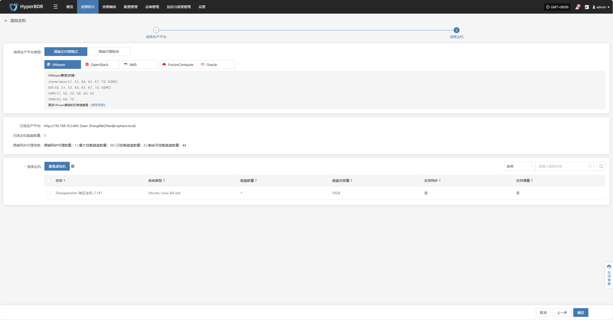

选择完成虚拟机后，点&#x51FB;**"确定"**&#x6309;钮，将备份虚拟机加入到平台侧。

添加完成后，可以勾选要备份的虚拟机，点&#x51FB;**"下一步"**&#x6309;钮将备份主机切换到第二步骤进行进行后续的容灾配置操作。

#### **OpenStack**

点击 **"选择主机"** 菜单， 点击 **"添加主机"** 按钮来添加主机，选择生产平台类型，选&#x62E9;**"源端无代理模式"**，并选&#x62E9;**"OpenStack"**&#x5E73;台，选择生产平台中，选择已经添加完成的OpenStack平台链接，并点&#x51FB;**"下一步"**&#x8FDB;行选择OpenStack待容灾主机列表。

如果你还没有添加生产平台，可以点击 "添加生产平台" 按钮来添加一个新的OpenStack生产平台，参考步骤：[添加OpenStack生产平台](../configuration/production-site.md#添加openstack平台)

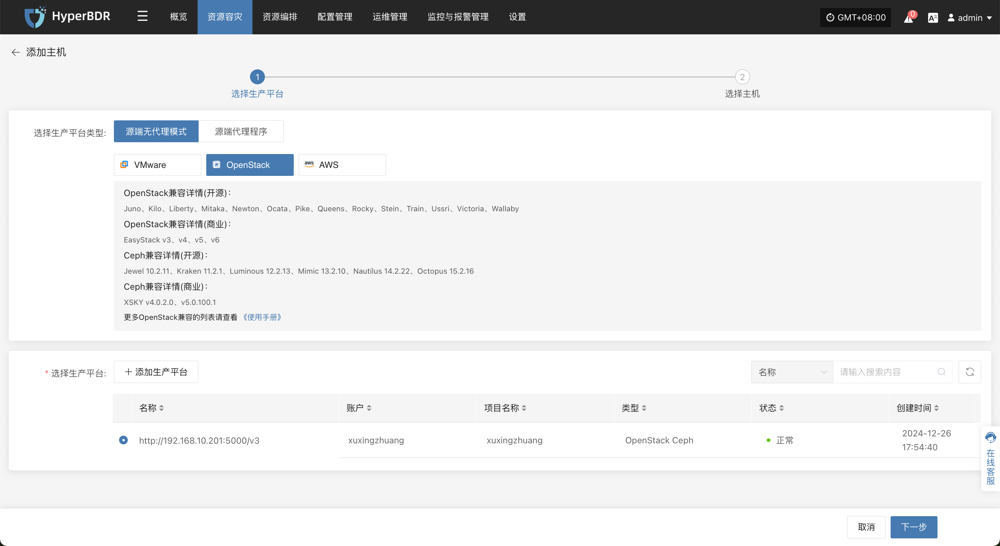

从当前OpenStack平台中勾选需要容灾备份的虚拟机，可以翻页进行手动进行批量勾选，也可以使用搜索功能根据名称和系统类型进行搜索需要备份的主机。

在选择备份主机时，可以参考选择主机磁盘数量变化及源端同步代理信息，目前源端同步代理数量、最大挂载磁盘数量、已挂载磁盘数量及剩余可挂载磁盘数量，可以根据信息来随时扩展源端同步代理的规格及数量来支持大批量的备份。

可以从列表中看到所有虚拟机的清单、包含系统类型、磁盘数量、磁盘总容量、支持同步及支持增量等内容。

**"重载虚拟机"** 功能，如果您在平台上新建的主机未展示在下方列表中，请点&#x51FB;**"重载虚拟机"**&#x6309;钮，将其重新加载至此列表。

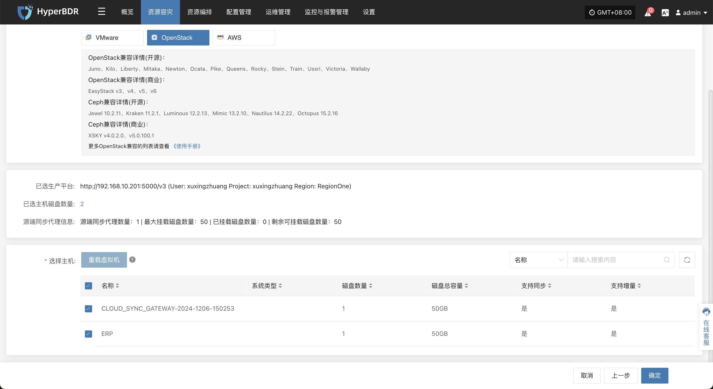

选择完成虚拟机后，点&#x51FB;**"确定"**&#x6309;钮，将备份虚拟机加入到平台侧。

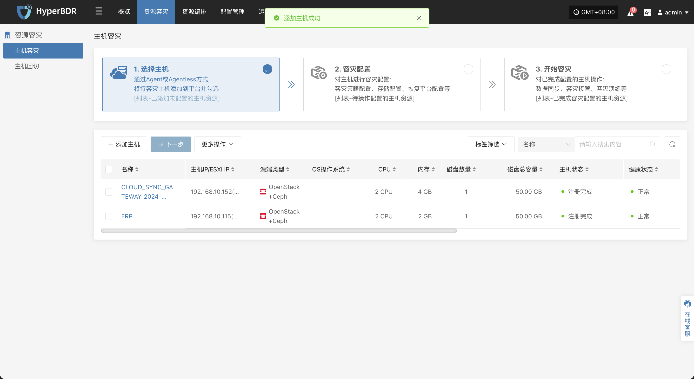

添加完成后，可以勾选要备份的虚拟机，点&#x51FB;**"下一步"**&#x6309;钮将备份主机切换到第二步骤进行进行后续的容灾配置操作。

#### **AWS**

点击 **"选择主机"** 菜单， 点击 **"+ 添加主机"** 按钮来添加主机，选择生产平台类型，选&#x62E9;**"源端无代理模式"**，并选&#x62E9;**"AWS"**&#x5E73;台，选择生产平台中，选择已经添加完成的AWS平台链接，并点&#x51FB;**"下一步"**&#x8FDB;行选择AWS待容灾主机列表。

如果你还没有添加生产平台，可以点击 "添加生产平台" 按钮来添加一个新的AWS生产平台，参考步骤：[添加AWS生产平台](../configuration/production-site.md#添加aws平台)

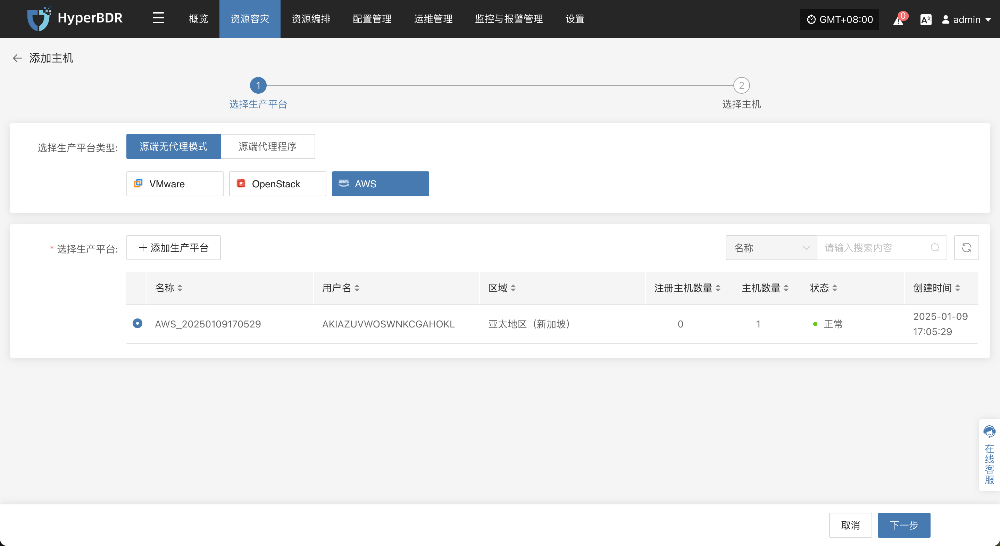

从当前AWS平台中勾选需要容灾备份的虚拟机，可以翻页进行手动进行批量勾选，也可以使用搜索功能根据名称和系统类型进行搜索需要备份的主机。

在选择备份主机时，可以参考选择主机磁盘数量变化及源端同步代理信息，目前源端同步代理数量、最大挂载磁盘数量、已挂载磁盘数量及剩余可挂载磁盘数量，可以根据信息来随时扩展[源端同步代理](https://hypermotion.yuque.com/fe338c/qzb4z6/hbgii4h7vi73hh3k#k0D0X)的规格及数量来支持大批量的备份。

可以从列表中看到所有虚拟机的清单、包含操作系统、磁盘数量、磁盘总容量、支持同步及支持增量等内容。

**"重载虚拟机"** 功能，如果您在平台上新建的主机未展示在下方列表中，请点击“重载虚拟机”按钮，将其重新加载至此列表。

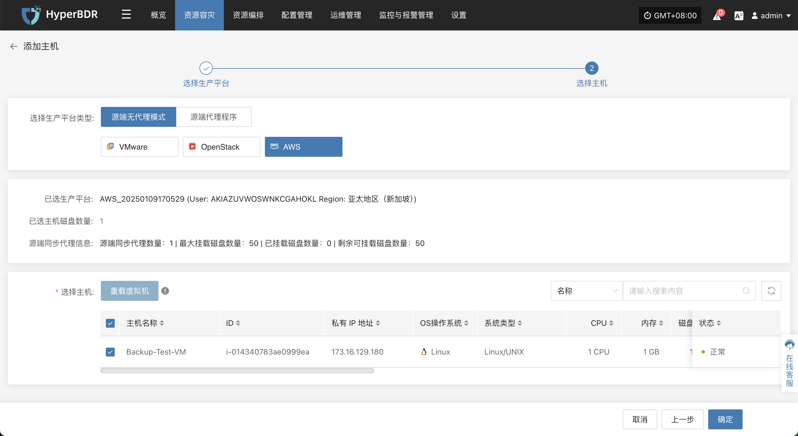

选择完成虚拟机后，点&#x51FB;**"确定"**&#x6309;钮，将备份虚拟机加入到平台侧。

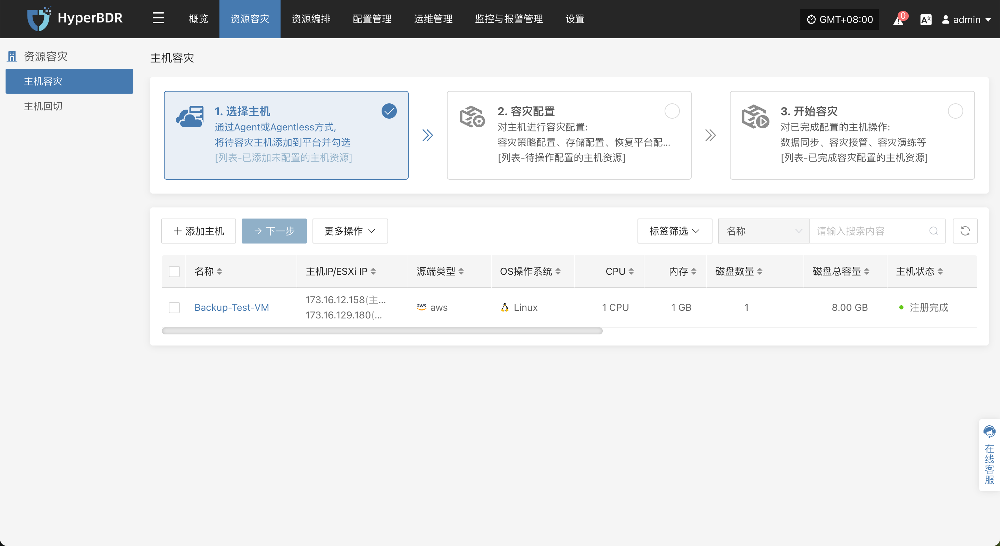

#### **FusionCompute**

点击 **"选择主机"** 菜单， 点击 **"+ 添加主机"** 按钮来添加主机，选择生产平台类型，选&#x62E9;**"源端无代理模式"**，并选&#x62E9;**"FusionCompute"**&#x5E73;台，选择生产平台中，选择已经添加完成的AWS平台链接，并点&#x51FB;**"下一步"**&#x8FDB;行选择FusionCompute待容灾主机列表。

如果你还没有添加生产平台，可以点击 "添加生产平台" 按钮来添加一个新的AWS生产平台，参考步骤：[添加FusionCompute生产平台](../configuration/production-site.md#添加fusioncompute平台)

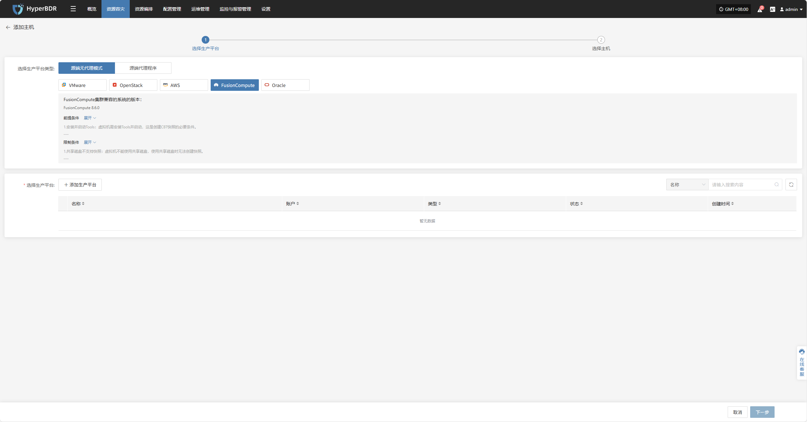

从当前FusionCompute平台中勾选需要容灾备份的虚拟机，可以翻页进行手动进行批量勾选，也可以使用搜索功能根据名称和系统类型进行搜索需要备份的主机。

在选择备份主机时，可以参考选择主机磁盘数量变化及源端同步代理信息，目前源端同步代理数量、最大挂载磁盘数量、已挂载磁盘数量及剩余可挂载磁盘数量，可以根据信息来随时扩展源端同步代理的规格及数量来支持大批量的备份。

可以从列表中看到所有虚拟机的清单、包含操作系统、磁盘数量、磁盘总容量、支持同步及支持增量等内容。

**"重载虚拟机"** 功能，如果您在平台上新建的主机未展示在下方列表中，请点击“重载虚拟机”按钮，将其重新加载至此列表。

#### **Oracle**

点击 **"选择主机"** 菜单， 点击 **"添加主机"** 按钮来添加主机，选择生产平台类型，选&#x62E9;**"源端无代理模式"**，并选&#x62E9;**"Oracle"**&#x5E73;台，选择生产平台中，选择已经添加完成的AWS平台链接，并点&#x51FB;**"下一步"**&#x8FDB;行选择Oracle待容灾主机列表。

如果你还没有添加生产平台，可以点击 "添加生产平台" 按钮来添加一个新的AWS生产平台，参考步骤：[添加Oracle生产平台](../configuration/production-site.md#添加oracle平台)

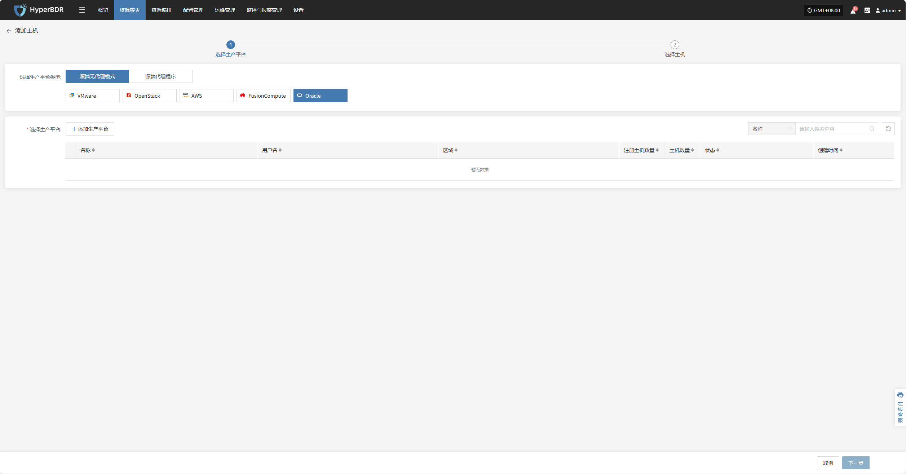

从当前FusionCompute平台中勾选需要容灾备份的虚拟机，可以翻页进行手动进行批量勾选，也可以使用搜索功能根据名称和系统类型进行搜索需要备份的主机。

在选择备份主机时，可以参考选择主机磁盘数量变化及源端同步代理信息，目前源端同步代理数量、最大挂载磁盘数量、已挂载磁盘数量及剩余可挂载磁盘数量，可以根据信息来随时扩展源端同步代理的规格及数量来支持大批量的备份。

可以从列表中看到所有虚拟机的清单、包含操作系统、磁盘数量、磁盘总容量、支持同步及支持增量等内容。

**"重载虚拟机"** 功能，如果您在平台上新建的主机未展示在下方列表中，请点击“重载虚拟机”按钮，将其重新加载至此列表。

### **源端代理程序**

#### **Linux**

点击 **"选择主机"** 菜单， 点击 **"添加主机"** 按钮来添加主机，选择生产平台类型，选&#x62E9;**"源端代理模式"**，并选&#x62E9;**"Linux"**&#x5E73;台，根据Linux主机的兼容性详情来选择要容灾的主机是否可以支持。

点击下方的安装命令，在源端Linux主机终端中执行即可完成Linux备份主机的添加。

详细安装步骤操作参考：[点击查看](../configuration/production-site.md#linux-agent)

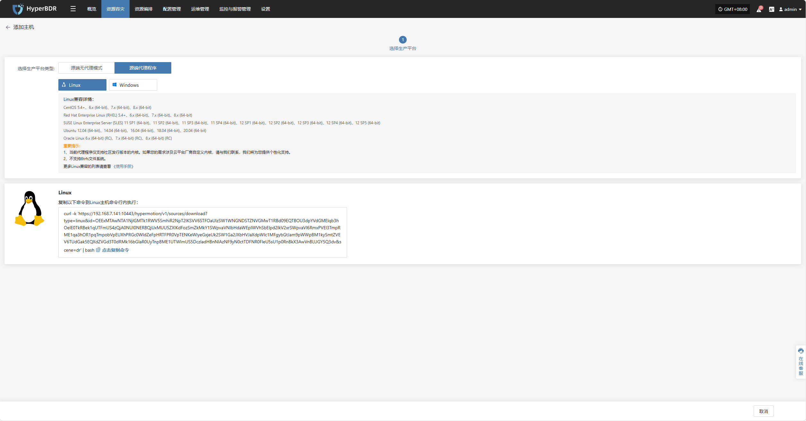

等待安装完成后，源端主机自动注册到平台，可以查看注册主机的状态。

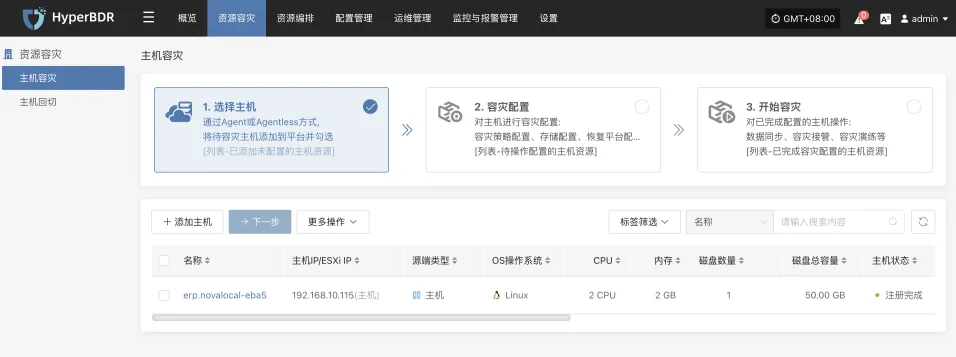

添加完成后，可以勾选要备份的虚拟机，点&#x51FB;**"下一步"**&#x6309;钮将备份主机切换到第二步骤进行进行后续的容灾配置操作。

#### **Windows**

点击 **"选择主机"** 菜单， 点击 **"添加主机"** 按钮来添加主机，选择生产平台类型，选&#x62E9;**"源端代理模式"**，并选&#x62E9;**"Windows"**&#x5E73;台，根据Windows主机的兼容性详情来选择要容灾的主机是否可以支持。

根据操作系统版本点&#x51FB;**"立即下载"**&#x6765;下载Windows Agent安装包，并将安装包上传至Windows主机进行安装

详细安装步骤操作参考：[点击查看](../configuration/production-site.md#windows-agent)

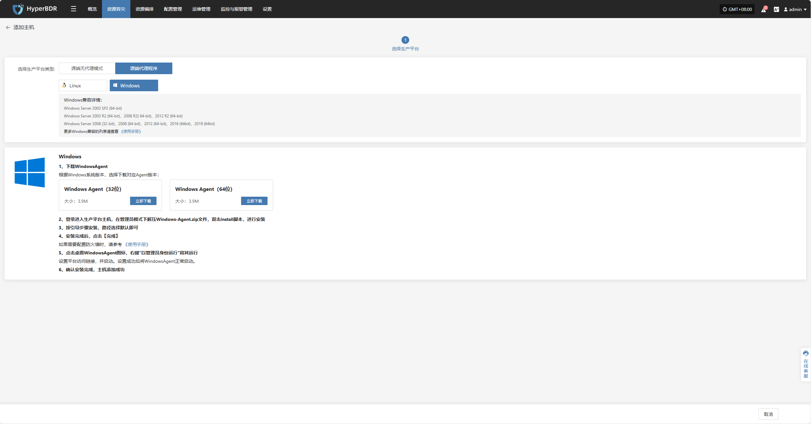

等待安装完成后，源端主机自动注册到平台，可以查看注册主机的状态。

### **更多设置**

#### **源端同步设置**

备份主机的源端参数配置设定。

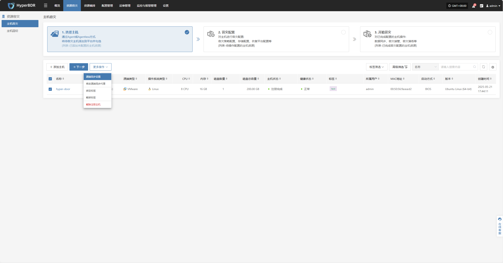

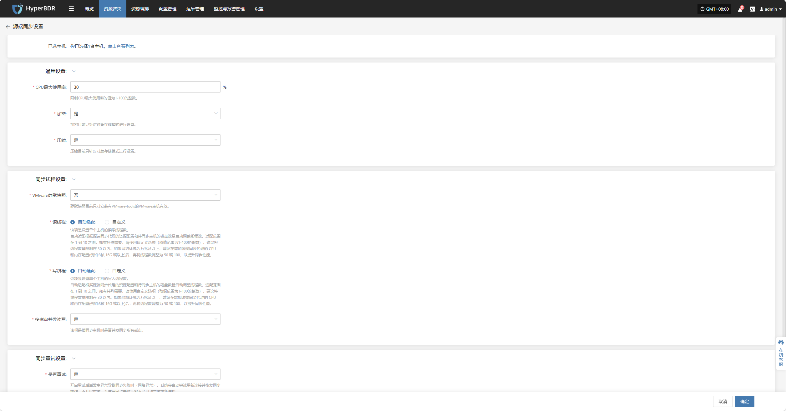

##### **通用设置**

| 参数           | 配置           | 说明                                                                                   |
|:----------------:|:----------------:|:----------------------------------------------------------------------------------------:|
| CPU最大使用率   | 1-100          | 配置源端主机在备份时可占用的系统 CPU 资源。 建议不要设置过低，以免影响备份效率。     |
| 加密           | 是 否       | 仅适用于对象存储模式。 开启后将占用更多 CPU 资源进行加密处理。                     |
| 压缩           | 是 否       | 仅适用于对象存储模式。 开启后将占用更多 CPU 资源进行压缩处理。                     |

##### **源端无代理模式**

| 参数           | 配置         | 说明                                                                                           |
|----------------|--------------|------------------------------------------------------------------------------------------------|
| VMware静默快照 | 是 否     | 静默快照目前仅适用于已安装 VMware Tools 的 VMware 主机。                                        |
| 读线程         | 自动适配 自定义 | 设置单个主机的读取线程数。 自动适配模式会根据同步代理资源配置及待同步主机的磁盘数量，自动调整线程数，范围为 1~10。 如有特殊需求，可选择自定义模式（取值范围为 1~100 的整数），建议线程数控制在 30 以内。 若网络环境为万兆及以上，建议提升同步代理的 CPU 和内存配置（例如：8核16G 或以上），然后将线程数调整为 50 或 100，以提升同步性能。 |
| 写线程         | 自动适配 自定义 | 设置单个主机的写入线程数。 自动适配模式会根据同步代理资源配置及待同步主机的磁盘数量，自动调整线程数，范围为 1~10。 如有特殊需求，可选择自定义模式（取值范围为 1~100 的整数），建议线程数控制在 30 以内。 若网络环境为万兆及以上，建议提升同步代理的 CPU 和内存配置（例如：8核16G 或以上），然后将线程数调整为 50 或 100，以提升同步性能。 |
| 多磁盘并发读写 | 是 否     | 同步主机时是否并发同步所有磁盘。                                                               |

##### **同步重试设置**

| 参数   | 配置     | 说明                                                                    |
| ---- | ------ | --------------------------------------------------------------------- |
| 是否重试 | 是否     | 开启重试后当发生异常导致同步失败时（网络异常），系统会自动尝试重新连接并恢复同步操作。不开启重试，系统在同步失败后将不会自动尝试重新连接。 |
| 重试次数 | 1-100  | 设置最多尝试重试的次数。                                                          |
| 间隔时间 | 1-3600 | 每次重试之间的等待时间，单位为秒。                                                     |

#### **修改源端同步代理**

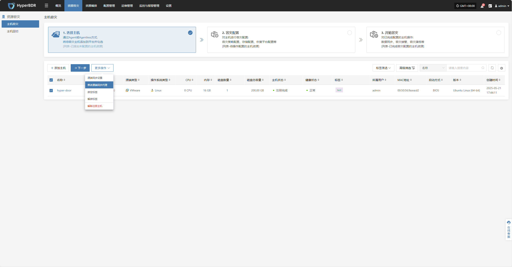

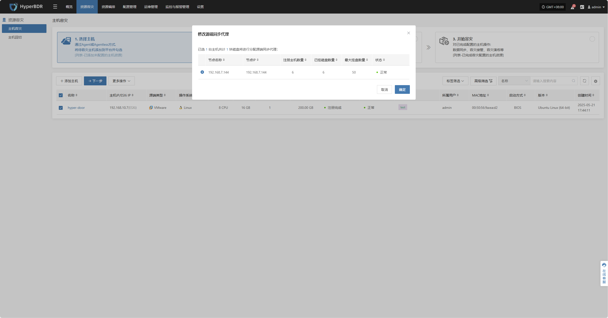

#### **绑定标签**

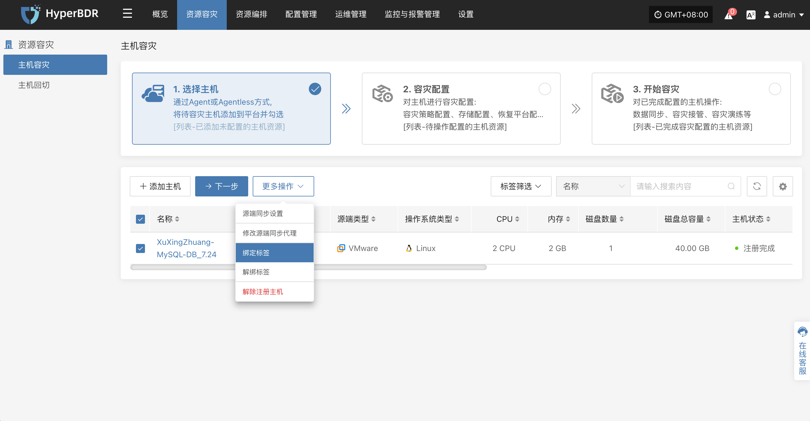

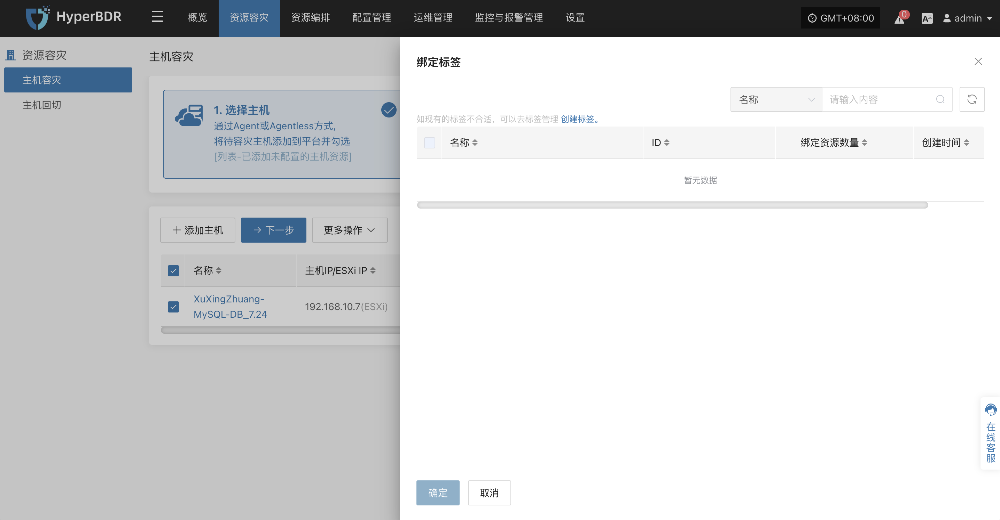

#### **解绑标签**

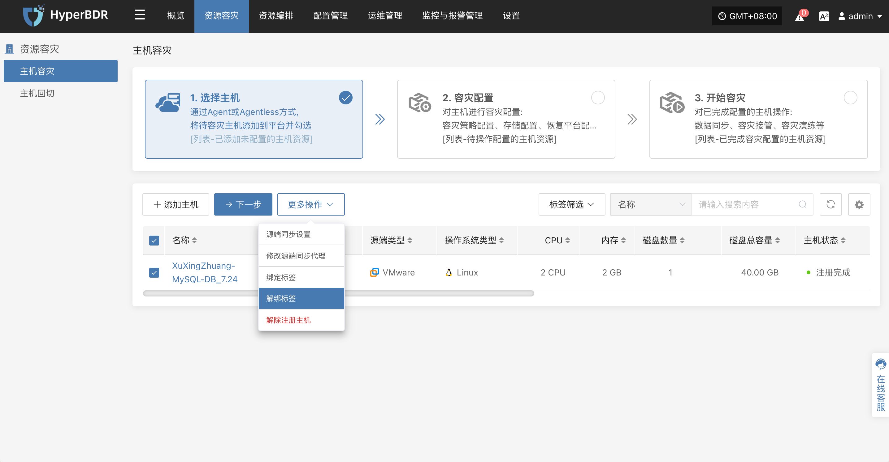

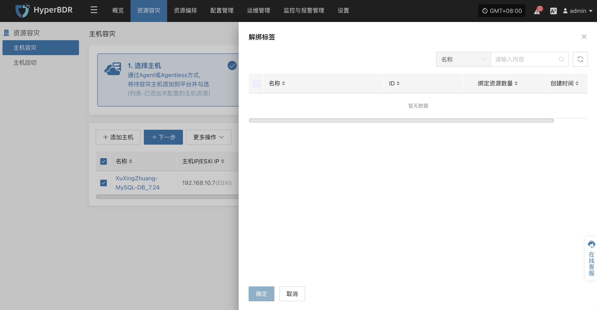

#### **解除注册主机**

将备份主机从容灾管理平台移除注册。

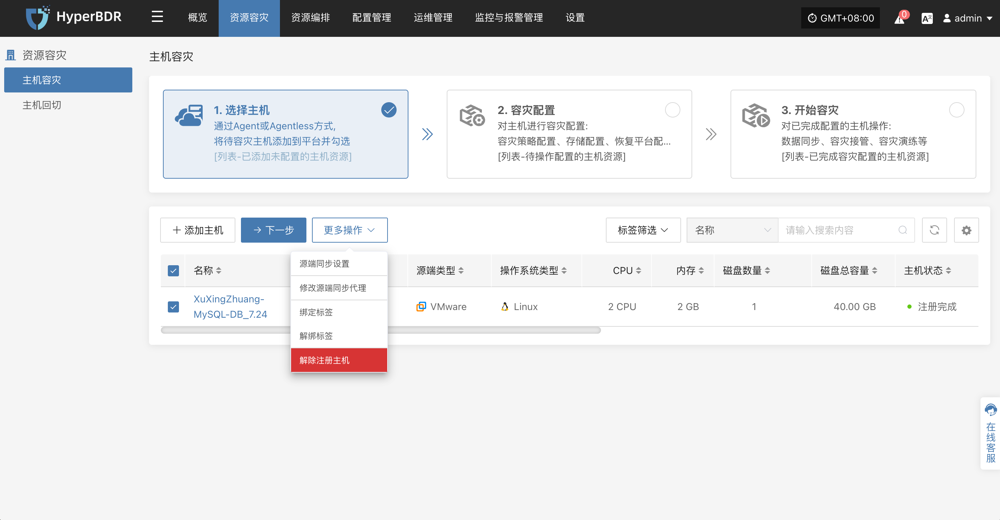

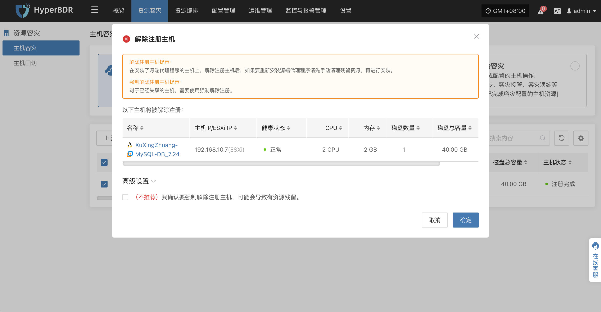

## **容灾配置**

登录控制台，点击顶部 **"资源容灾"** 导航栏，点击左侧 **"主机容灾"**，点击 **"容灾配置"** 菜单， 选择单台或多选主机，点击 **"容灾配置"** 按钮来进行容灾配置。

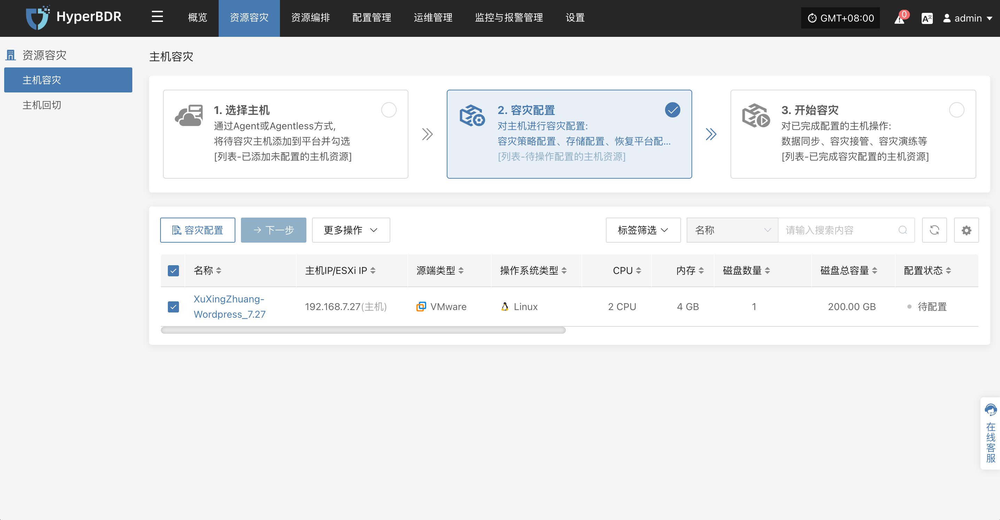

### **块存储**

存储类型选择"块存储"，并按照所选信息进行块存储步骤配置，完成容灾配置操作。

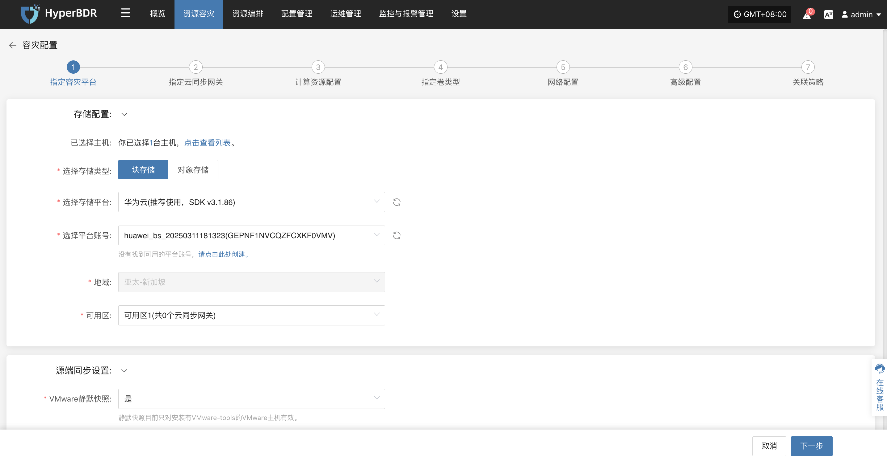

#### **指定容灾平台**

将备份主机指定使用"块存储"类型进行备份，并选择配置参数信息。

##### **存储配置**

| 参数     | 配置        | 说明                                 |
| ------ | --------- | ---------------------------------- |
| 选择存储类型 | 块存储       | 前提条件：需要提前配置块存储选择使用已经配置完成的块存储进行容灾备份 |
| 选择存储平台 | (支持的存储类型) | 根据实际情况填写对应云厂商鉴权信息，详细配置参考下列：支持的存储类型 |

##### **源端同步设置**

| 参数         | 配置 | 说明                                  |
| ---------- | -- | ----------------------------------- |
| VMware静默快照 |  是 否  | 静默快照目前只对安装有VMware-tools的VMware主机有效。 |

##### **支持的存储类型**

在进行配置前，请先完成块存储配置。如尚未添加，请点击下方按钮进入块存储配置页面。

[👉点击查看块存储配置](../configuration/storage-configuration.md#块存储)

完成块存储配置后可通过下拉列表选择对应块存储平台，存储平台选择配置完成后点&#x51FB;**“下一步”**，开始**指定云同步网关**。

#### **指定云同步网关**

从当前容灾恢复平台中勾选需进行容灾备份的虚拟机，指定对应的容灾主机磁盘，并完成对应云平台的同步网关配置。

> 注意：该云同步网关将在添加容灾恢复平台配置时自动创建，无需手动配置，详细可参考：(存储配置--块存储配置--查找自身对应云厂商配置方式（暂无）)

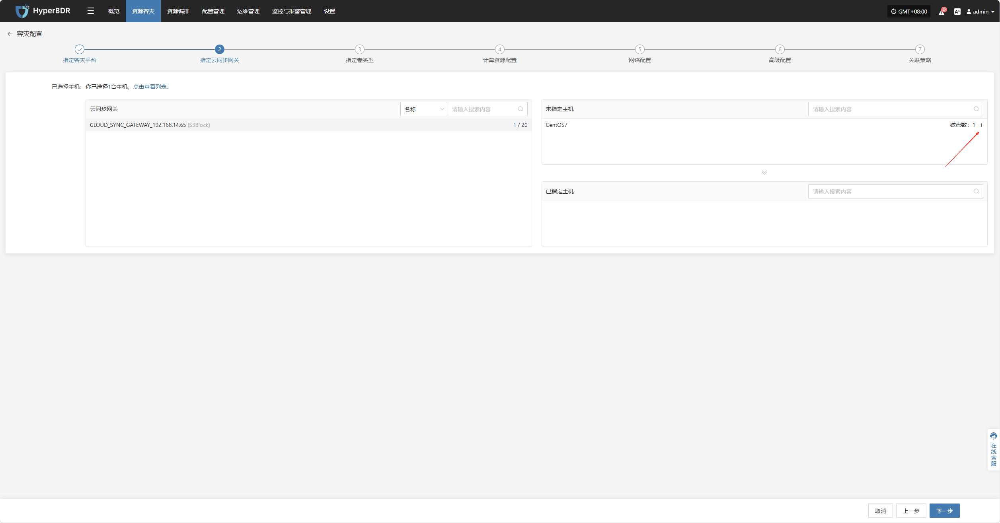

点击对应容灾主机后&#x7684;**“+”**&#x5373;可完成指定容灾主机

云同步网关指定完成后点&#x51FB;**“下一步”**，开始**指定卷类型。**

#### **指定卷类型**

用户需为所选虚拟机的各个磁盘指定恢复目标云平台上的磁盘类型（卷类型），确保容灾恢复过程中目标端资源的正确映射。

设置选择需要容灾备份的虚拟机磁盘类型。

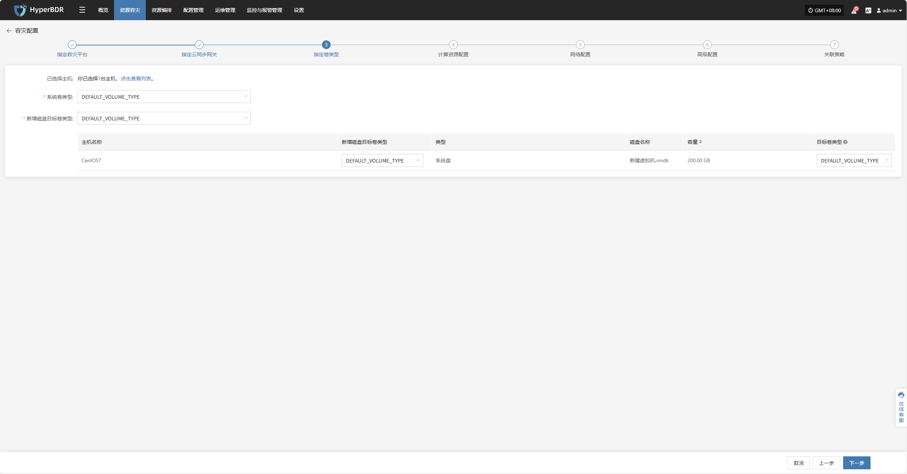

您可根据下拉列表选择不同的系统卷类型，具体以实际选择云厂商为准：

| 项目                        | 说明                  |
| ------------------------- | ------------------- |
| **\_DEFAULT\_**           | 系统自动选择的默认设置，适用于各种场景 |
| **DEFAULT\_VOLUME\_TYPE** | 系统在存储设备中默认使用的存储类型   |

**卷类型**指定完成后点&#x51FB;**“下一步”**，开始**计算资源配置.**

#### **计算资源配置**

您需为容灾恢复后的主机配置计算资源参数，包括 CPU、操作系统类型等信息，以确保恢复虚拟机能够在目标环境中正常运行。

选择需要容灾备份的虚拟机，可以翻页进行手动进行批量勾选，配置CPU、操作系统类型等信息，也可通过页面按钮进行批量设置，选择合适的目标启动方式后，完成配置。

> 注意：源端主机采用UEFI启动方式时，可以选择BIOS或UEFI方式启动系统盘容量大于2T无法使用BIOS方式启动。

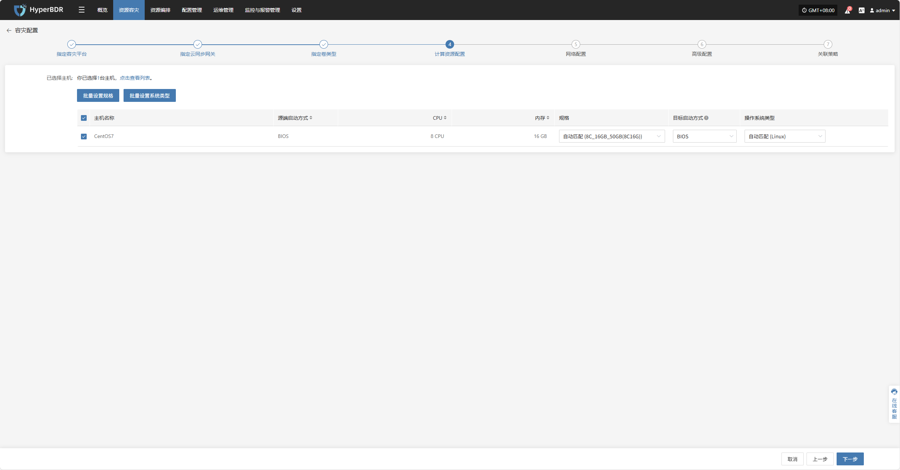

当预设模板中存在与资源类型一致的配置时，系统将自动匹配，否则需用户手动选择相应配置。

##### **批量设置规格**

通过勾选所需主机，点击页面上&#x7684;**“批量设置规格”**&#x6309;钮，即可开始批量配置主机规格。

> 注意：您当前选择的主机将进行统一设置，如有疑异请重新选择。

在弹出的对话框中，根据预设的配置信息进行选择和确认。

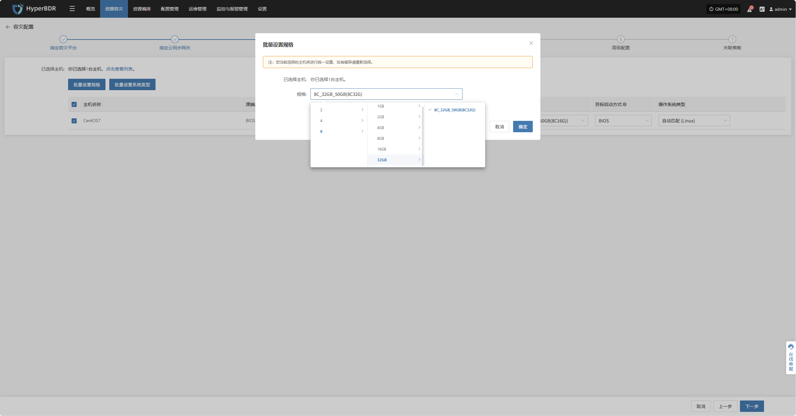

##### **批量设置系统类型**

通过勾选所需主机，点击页面上&#x7684;**“批量设置系统类型”**&#x6309;钮，即可开始批量配置主机系统类型。

> 注意：您当前选择的主机将进行统一设置，如有疑异请重新选择。

在弹出的对话框中，选择您的主机操作系统类型。

**计算资源配置**完成后点&#x51FB;**“下一步”**，开始**网络配置.**

#### **网络配置**

您需要为容灾恢复后的主机配置目标网络环境，包括内网 IP、公网 IP、安全组、MAC 地址等关键参数，以保障主机在目标平台的正常通信与访问。

系统兼容 IPv4 与 IPv6 网络环境，请根据容灾主机部署需求选择对应的网络与子网类型。

选择完毕后，可根据实际情况需求，配置内网 IP、公网 IP、安全组、MAC 地址等相关参数

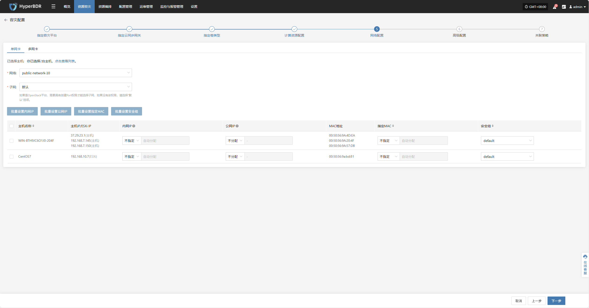

##### **IP设置规则**

| 参数     | 配置选项                                     | 说明                                                                                                                                               |
| ------ | ---------------------------------------- | ------------------------------------------------------------------------------------------------------------------------------------------------ |
| 内网 IP  | 原有 IP / 指定 IP / 不分配                      | 原有 IP：系统自动识别网卡并通过 DHCP 服务分配源主机 IP。指定 IP：需手动填写 IP（网段与目标子网一致，不可修改），系统使用 DHCP 服务分配指定IP。不分配：系统根据目标网络使用 DHCP 自动随机分配IP。**注意：若 DHCP 不可用，系统将无法自动配置 IP。** |
| 公网 IP  |  不分配 / 分配 IP / 申请I&#x50;**（具体以实际云厂商为准）** | 不分配：不分配弹性公网IP的主机不能与互联网互通，仅可作为私有网络中部署业务或者集群所需主机进行使用。&#xA;分配IP：为主机分配已有弹性公网IP。&#xA;申请IP：自动为每台主机分配独享带宽的弹性公网IP。                                       |
| 安全组    | (根据目标网络的配置)                              | 根据目标网络的配置，安全组有多种可选，具体以实际情况为准。                                                                                                                    |
| MAC | 原有 MAC / 指定 MAC / 不分配                    | 注意：当使用云服务时不支持修改                                                                                                                                  |

##### **单网卡**

| 参数 | 配置         | 说明                           |
| -- | ---------- | ---------------------------- |
| 网络 | 容灾目标网络名称   | 指定容灾主机所连接的目标网络，用于数据恢复时的网络通信。 |
| 子网 | 容灾目标关联子网名称 | 指定目标网络中的子网，容灾主机将通过该子网进行连接。   |

**批量设置内网IP**

通过勾选所需主机，点击页面上&#x7684;**“批量设置内网IP”**&#x6309;钮，即可开始批量设置内网IP。

在弹出的对话框中，选择您的内网IP分配类型

**批量设置公网IP**

通过勾选所需主机，点击页面上&#x7684;**“批量设置公网IP”**&#x6309;钮，即可开始批量设置内网IP。

在弹出的对话框中，选择您的公网IP分配类型

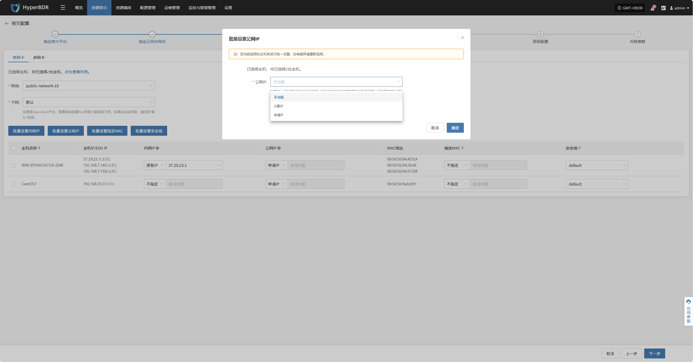

**批量设置指定MAC**

通过勾选所需主机，点击页面上&#x7684;**“批量设置指定MAC”**&#x6309;钮，即可开始批量设置内网IP。

在弹出的对话框中，选择您的MAC地址分配类型

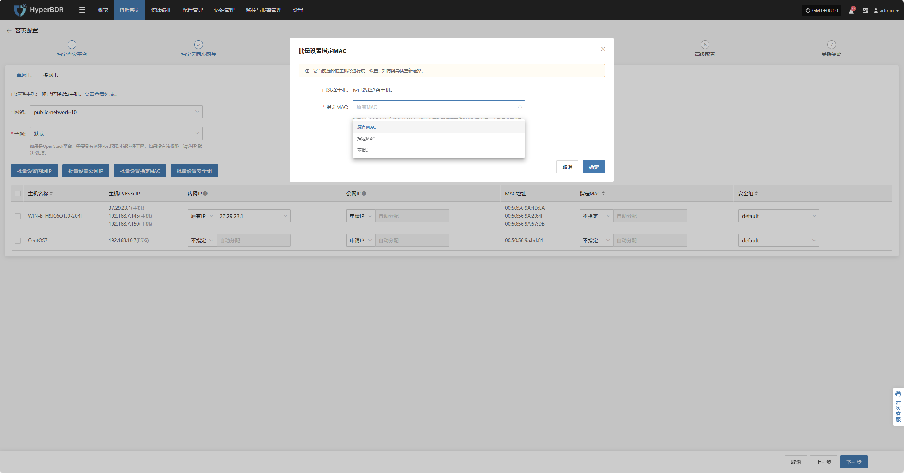

**批量设置安全组**

通过勾选所需主机，点击页面上&#x7684;**“批量设置安全组”**&#x6309;钮，即可开始批量设置内网IP。

在弹出的对话框中，选择您的安全组

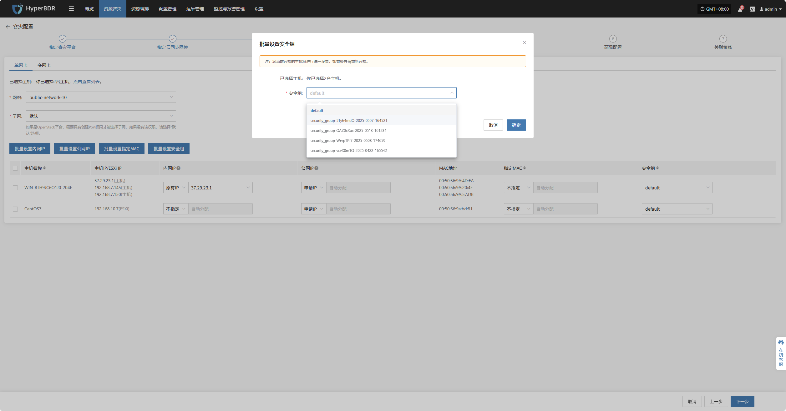

##### **多网卡**

当主机具有多块网卡且需进行对应配置时，可使用多网卡模式进行绑定。

> 注意：由于云平台的限制，目标网卡的数量最多为 5个。第一块默认为主网卡，且主网卡是不可删除的。

**添加网卡**

选择主机后依次点击页面“添加网卡”按钮，使其新增网卡与源网卡保持对应

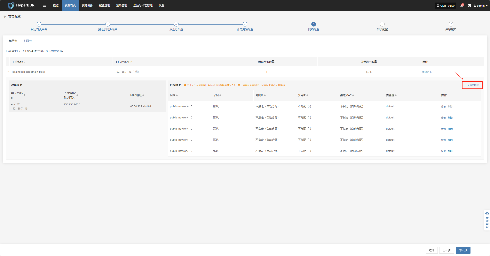

**修改**

选择对应网卡后，可根据实际情况针对单个网卡，分别设置网络，子网，内网IP，公网IP，指定MAC地址，安全组等相关内容

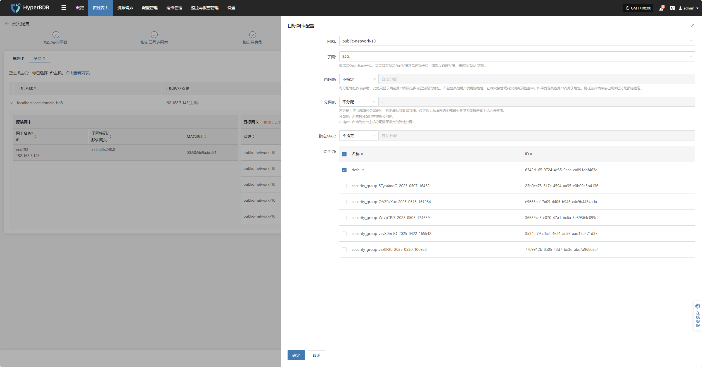

**网络配置**完成后点&#x51FB;**“下一步”**，开始**高级配置。**

#### **高级配置**

支持用户自定义脚本执行和驱动器适配设置，满足复杂环境下的个性化需求和硬件兼容性调优（脚本部分可留空）。

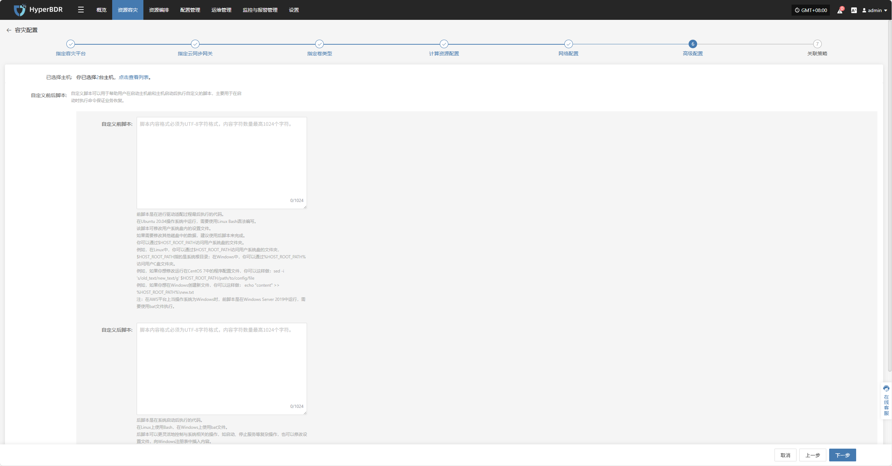

##### **自定义前后脚本**

自定义脚本可以用于帮助用户在启动主机前和主机启动后执行自定义的脚本，主要用于在启动时执行命令保证业务恢复。

**自定义前脚本**

脚本配置说明：

> 前脚本是在进行驱动适配过程最后执行的代码。
> 在Ubuntu 20.04操作系统中运行，需要使用Linux Bash语法编写。
> 该脚本可修改用户系统盘内的设置文件。
> 如果需要修改其他磁盘中的数据，建议使用后脚本来完成。
> 你可以通过$HOST\_ROOT\_PATH访问用户系统盘的文件夹。
> 例如，在Linux中，你可以通过$HOST\_ROOT\_PATH访问用户系统盘的文件夹，$HOST\_ROOT\_PATH指的是系统根目录；在Windows中，你可以通过%HOST\_ROOT\_PATH%访问用户C盘文件夹。
> 例如，如果你想修改运行在CentOS 7中的程序配置文件，你可以这样做：sed -i 's/old\_text/new\_text/g' $HOST\_ROOT\_PATH/path/to/config/file
> 例如，如果你想在Windows创建新文件，你可以这样做： echo "content" )) %HOST\_ROOT\_PATH%\new.txt
> 注：在AWS平台上当操作系统为Windows时，前脚本是在Windows Server 2019中运行，需要使用bat文件执行。

**自定义后脚本**

脚本配置说明：

> 后脚本是在系统启动后执行的代码。
> 在Linux上使用Bash，在Windows上使用bat文件。
> 后脚本可以更灵活地控制与系统相关的操作，如启动、停止服务等复杂操作，也可以修改设置文件，向Windows注册表中插入内容。

**驱动适配设置**

| 参数     | 配置项      | 说明                                                       |
| ------ | -------- | -------------------------------------------------------- |
| 驱动程序注入 | 是否启用驱动注入 | 仅适用于在相同虚拟化平台上启动主机时，跳过驱动适配。（不推荐）跳过驱动适配可能导致主机无法正常启动，请慎重使用。 |
| 磁盘驱动   |          | 当启动主机磁盘超过20个时，必须选择virtio-scsi类型。                         |

**高级配置完成后点击“下一步”后会提示`开始配置策略前，已经配置好的主机将自动进入”开始容灾“中。`，开始关联策略。**

#### **关联策略**

> 注意：此项为非必填配置，未选择不会影响本次容灾操作的正常执行，后续也可通过xx进行完成策略关联

通过关联策略，可以灵活控制主机的备份、恢复及切换行为。

在使用关联策略前，需先创建相应的策略。若系统中尚无策略，则无法进行选择，策略创建可参考：(链接)

策略可针对单台主机进行配置，也支持通过页面批量关联功能对多台主机进行批量操作。

##### **批量关联策略**

通过勾选所需主机，点击页面上&#x7684;**“批量关联策略”**&#x6309;钮，即可开始批量设置内网IP。

在弹出的对话框中，选择您的策略进行关联

**关联策略**完成后点&#x51FB;**“确认”**，备份主机将切换到第三步骤进行进行后续&#x7684;**“开始容灾”**&#x64CD;作。

### **对象存储**

存储类型选择"对象存储"，并按照所选信息进行块存储步骤配置，完成容灾配置操作。

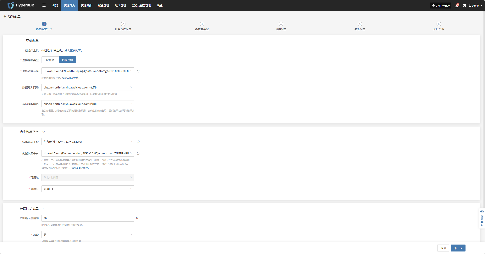

##### **支持的存储类型**

[点击查看对象存储配置](../configuration/storage-configuration.md#对象存储)

#### **指定容灾平台**

将备份主机指定使用"对象存储"类型进行备份，并选择配置参数信息。

##### **存储配置**

> 前提条件：需要提前配置对象存储，对象存储添加方式参考：(从表格中选择自己的云厂商)

| 参数     | 配置        | 说明                   |
| ------ | --------- | -------------------- |
| 选择存储类型 | 对象存储      | 选择使用已配置完成的对象存储进行容灾备份 |
| 选择对象存储 | 已添加的对象存储  | 需要先完成对象存储配置          |
| 数据写入网络 | 选择的对象存储网络 | 用于将备份数据写入对象存储的网络配置   |
| 数据读取网络 | 选择的对象存储网络 | 用于从对象存储中读取数据的网络配置    |

##### **容灾恢复平台**

> 前提条件：需要提前配置容灾恢复平台，对象存储添加方式参考：(从表格中选择自己的云厂商)

| 参数     | 配置        | 说明        |
| ------ | --------- | --------- |
| 选择恢复平台 | (支持的存储类型) | 已实际配置参数为准 |
| 配置恢复平台 | 已配置云厂商信息  | 已实际配置参数为准 |
| 可用域    | 已配置云厂商信息  | 不可更改      |
| 可用区    | 已配置云厂商信息  |           |

##### **源端同步设置**

| 参数         | 配置    | 说明                                             |
| ---------- | ----- | ---------------------------------------------- |
| CPU最大使用率   | 1-100 | 配置源端主机在备份时可以占用的系统CPU资源，建议不要设置的太低，太低后会影响到备份的效率。 |
| 加密         | 是 否      | 只针对对象存储模式进行设置。注意：开启选项后，会占用更多的CPU进行加密处理         |
| 压缩         | 是 否      | 只针对对象存储模式进行设置。注意：开启选项后，会占用更多的CPU进行压缩处理         |
| VMware静默快照 | 是 否      | 静默快照目前只对安装有VMware-tools的VMware主机有效。            |

存储平台选择配置完成后点&#x51FB;**“下一步”**，开始**计算资源配置**。

#### **计算资源配置**

您需为容灾恢复后的主机配置计算资源参数，包括 CPU、操作系统类型等信息，以确保恢复虚拟机能够在目标环境中正常运行。

选择需要容灾备份的虚拟机，可以翻页进行手动进行批量勾选，配置CPU、操作系统类型等信息，也可通过页面按钮进行批量设置，选择合适的目标启动方式后，完成配置。

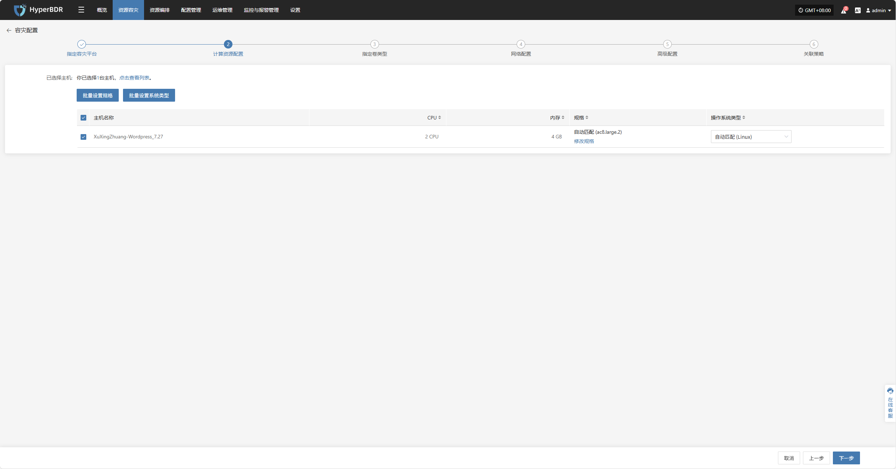

当预设模板中存在与资源类型一致的配置时，系统将自动匹配，否则需用户手动选择相应配置。

##### **批量设置规格**

通过勾选所需主机，点击页面上&#x7684;**“批量设置规格”**&#x6309;钮，即可开始批量配置主机规格。

> 注意：您当前选择的主机将进行统一设置，如有疑异请重新选择。

在弹出的对话框中，根据预设的配置信息进行选择和确认。

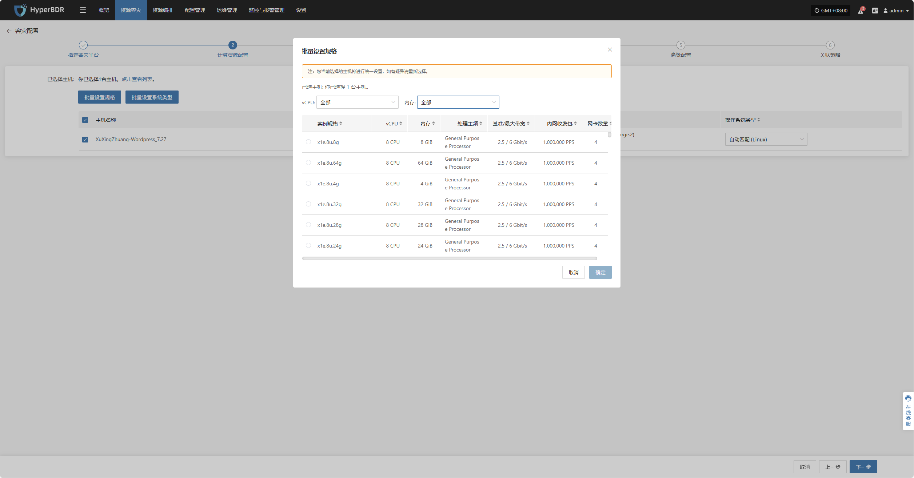

##### **批量设置系统类型**

通过勾选所需主机，点击页面上&#x7684;**“批量设置系统类型”**&#x6309;钮，即可开始批量配置主机系统类型。

> 注意：您当前选择的主机将进行统一设置，如有疑异请重新选择。

在弹出的对话框中，选择您的主机操作系统类型。

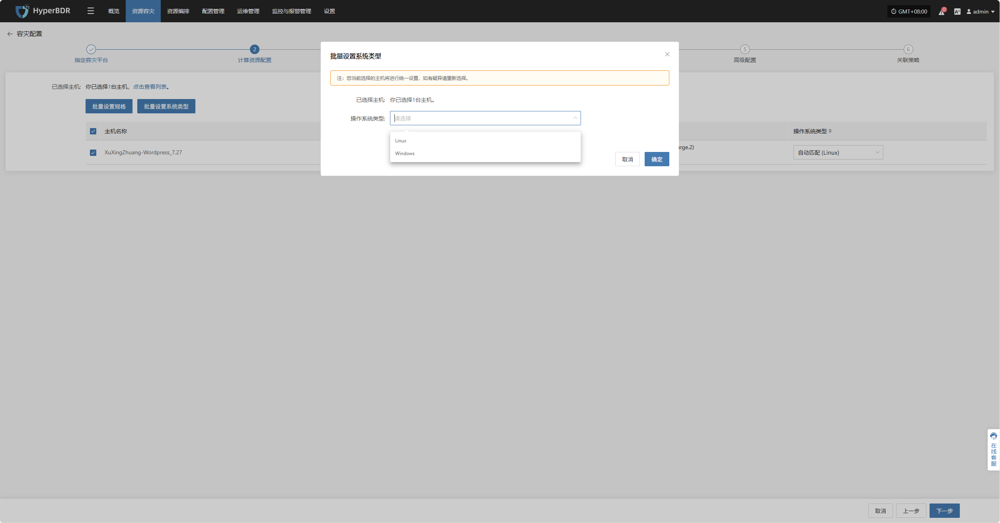

**计算资源配置**完成后点&#x51FB;**“下一步”**，开始**指定卷类型。**

#### **指定卷类型**

用户需为所选虚拟机的各个磁盘指定恢复目标云平台上的磁盘类型（卷类型），确保容灾恢复过程中目标端资源的正确映射。

设置选择需要容灾备份的虚拟机磁盘类型。

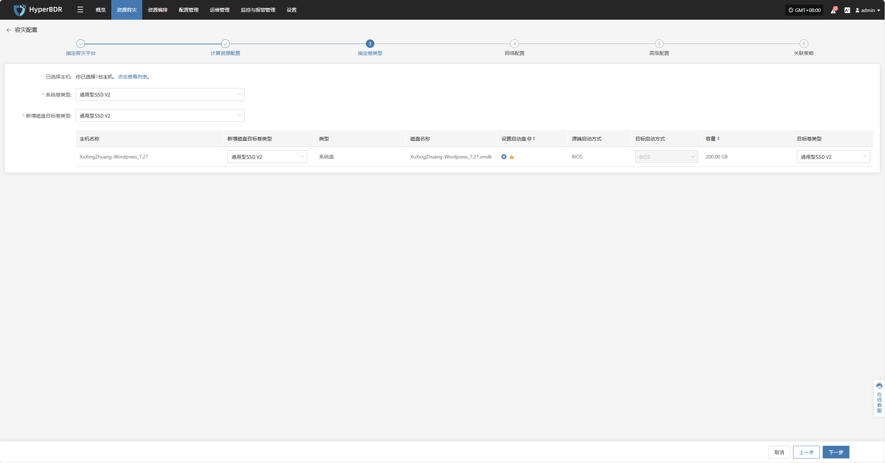

您可以通过下拉列表选择系统卷类型，具体选项请以实际云厂商支持为准。以下为示例配置，供参考：

| 参数        | 说明                                   |
| --------- | ------------------------------------ |
| 通用型SSD V2 | 适用于大多数通用场景，具备良好的性能与性价比，推荐作为默认选择。     |
| 极速型SSD    | 提供极高的随机读写性能，适用于对存储性能要求极高的核心应用系统。     |
| 通用型SSD    | 平衡的性能和成本，适合中小型数据库、应用服务器等业务场景。        |
| 高IO       | 提供较高的IOPS和吞吐能力，适用于中高负载的数据库或业务系统。     |
| 超高IO      | 提供超高IOPS和极低时延，适合金融交易系统、大型数据库等关键负载场景。 |

**卷类型**指定完成后点&#x51FB;**“下一步”**，开始**网络配置.**

#### **网络配置**

您需要为容灾恢复后的主机配置目标网络环境，包括内网 IP、公网 IP、安全组、MAC 地址等关键参数，以保障主机在目标平台的正常通信与访问。

系统兼容 IPv4 与 IPv6 网络环境，请根据容灾主机部署需求选择对应的网络与子网类型。

选择完毕后，可根据实际情况需求，配置内网 IP、公网 IP、安全组、MAC 地址等相关参数

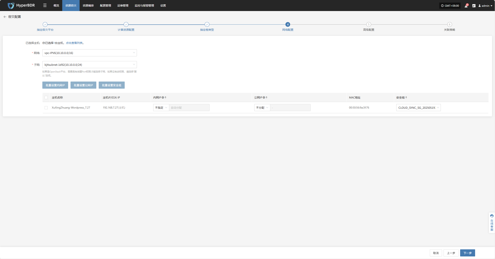

* 配置说明

| 参数 | 配置         | 说明                           |
| -- | ---------- | ---------------------------- |
| 网络 | 容灾目标网络名称   | 指定容灾主机所连接的目标网络，用于数据恢复时的网络通信。 |
| 子网 | 容灾目标关联子网名称 | 指定目标网络中的子网，容灾主机将通过该子网进行连接。   |

##### **IP设置规则**

| 参数    | 配置选项                 | 说明                                                                                                                                               |
| ----- | -------------------- | ------------------------------------------------------------------------------------------------------------------------------------------------ |
| 内网 IP | 原有 IP / 指定 IP / 不分配  | 原有 IP：系统自动识别网卡并通过 DHCP 服务分配源主机 IP。指定 IP：需手动填写 IP（网段与目标子网一致，不可修改），系统使用 DHCP 服务分配指定IP。不分配：系统根据目标网络使用 DHCP 自动随机分配IP。**注意：若 DHCP 不可用，系统将无法自动配置 IP。** |
| 公网 IP | 原有 IP / 指定 IP / 申请IP | 同上                                                                                                                                               |
| 安全组   | (根据目标网络的配置)          | 根据目标网络的配置，安全组有多种可选，具体以实际情况为准。                                                                                                                    |

**批量设置内网IP**

通过勾选所需主机，点击页面上&#x7684;**“批量设置内网IP”**&#x6309;钮，即可开始批量设置内网IP。

在弹出的对话框中，选择您的内网IP分配类型

**批量设置公网IP**

通过勾选所需主机，点击页面上&#x7684;**“批量设置公网IP”**&#x6309;钮，即可开始批量设置内网IP。

在弹出的对话框中，选择您的公网IP分配类型

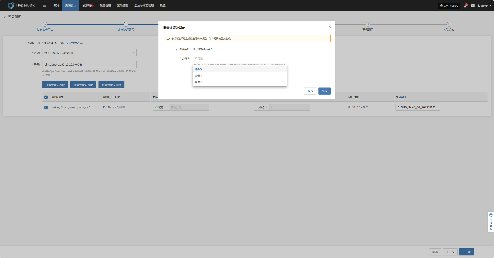

**批量设置安全组**

通过勾选所需主机，点击页面上&#x7684;**“批量设置安全组”**&#x6309;钮，即可开始批量设置内网IP。

在弹出的对话框中，选择您的安全组

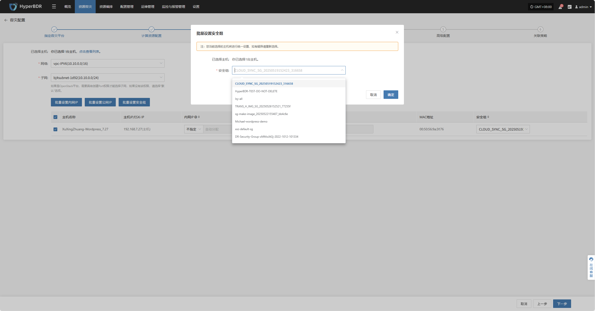

**网络配置**完成后点&#x51FB;**“下一步”**，开始**高级配置。**

#### **高级配置**

支持用户自定义脚本执行和驱动器适配设置，满足复杂环境下的个性化需求和硬件兼容性调优（脚本部分可留空）。

##### **自定义前后脚本**

自定义脚本可以用于帮助用户在启动主机前和主机启动后执行自定义的脚本，主要用于在启动时执行命令保证业务恢复。

**自定义前脚本**

脚本配置说明：

> 前脚本是在进行驱动适配过程最后执行的代码。
> 在Ubuntu 20.04操作系统中运行，需要使用Linux Bash语法编写。
> 该脚本可修改用户系统盘内的设置文件。
> 如果需要修改其他磁盘中的数据，建议使用后脚本来完成。
> 你可以通过$HOST\_ROOT\_PATH访问用户系统盘的文件夹。
> 例如，在Linux中，你可以通过$HOST\_ROOT\_PATH访问用户系统盘的文件夹，$HOST\_ROOT\_PATH指的是系统根目录；在Windows中，你可以通过%HOST\_ROOT\_PATH%访问用户C盘文件夹。
> 例如，如果你想修改运行在CentOS 7中的程序配置文件，你可以这样做：sed -i 's/old\_text/new\_text/g' $HOST\_ROOT\_PATH/path/to/config/file
> 例如，如果你想在Windows创建新文件，你可以这样做： echo "content" )) %HOST\_ROOT\_PATH%\new.txt
> 注：在AWS平台上当操作系统为Windows时，前脚本是在Windows Server 2019中运行，需要使用bat文件执行。

**自定义后脚本**

脚本配置说明：

> 后脚本是在系统启动后执行的代码。
> 在Linux上使用Bash，在Windows上使用bat文件。
> 后脚本可以更灵活地控制与系统相关的操作，如启动、停止服务等复杂操作，也可以修改设置文件，向Windows注册表中插入内容。

**驱动适配设置**

| 参数     | 配置项      | 说明                                                       |
| ------ | -------- | -------------------------------------------------------- |
| 驱动程序注入 | 是否启用驱动注入 | 仅适用于在相同虚拟化平台上启动主机时，跳过驱动适配。（不推荐）跳过驱动适配可能导致主机无法正常启动，请慎重使用。 |

**高级配置**完成后点&#x51FB;**“下一步”**&#x540E;会提&#x793A;**`开始配置策略前，已经配置好的主机将自动进入”开始容灾“中。`**，开始**关联策略。**

#### **关联策略**

> 注意：此项为非必填配置，未选择不会影响本次容灾操作的正常执行，后续也可通过xx进行完成策略关联

通过关联策略，可以灵活控制主机的备份、恢复及切换行为。

在使用关联策略前，需先创建相应的策略。若系统中尚无策略，则无法进行选择，策略创建可参考：(链接)

策略可针对单台主机进行配置，也支持通过页面批量关联功能对多台主机进行批量操作。

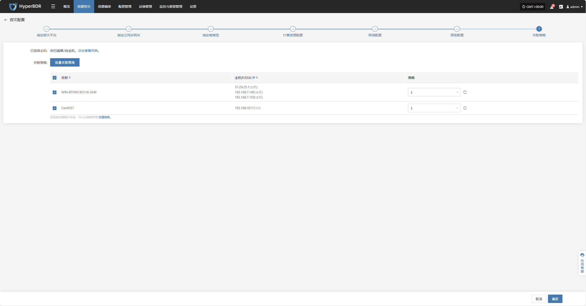

##### **批量关联策略**

通过勾选所需主机，点击页面上&#x7684;**“批量关联策略”**&#x6309;钮，即可开始批量关联策略。

在弹出的对话框中，选择您的策略进行关联

**关联策略**完成后点&#x51FB;**“确认”**，备份主机将切换到第三步骤进行进行后续&#x7684;**“开始容灾”**&#x64CD;作。

## **开始容灾**

登录控制台，点击顶部 **"资源容灾"** 导航栏，点击左侧 **"主机容灾"**，点击 **"开始容灾"** 菜单， 选择单台或多选主机，点击 **"立即同步"** 按钮来进行开始容灾。

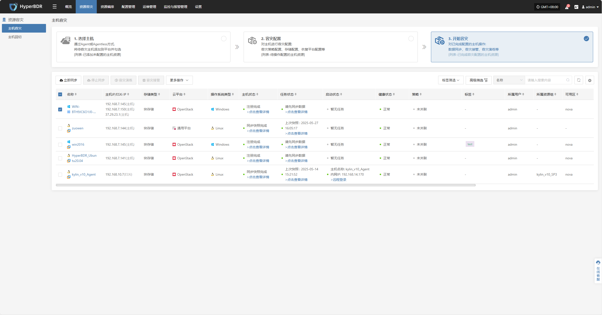

> 注意：必须要先同步数据才能完成后续操作

### **立即同步**

选中需要容灾的主机后，点击页&#x9762;**“立即同步”**，开始首次全量同步数据

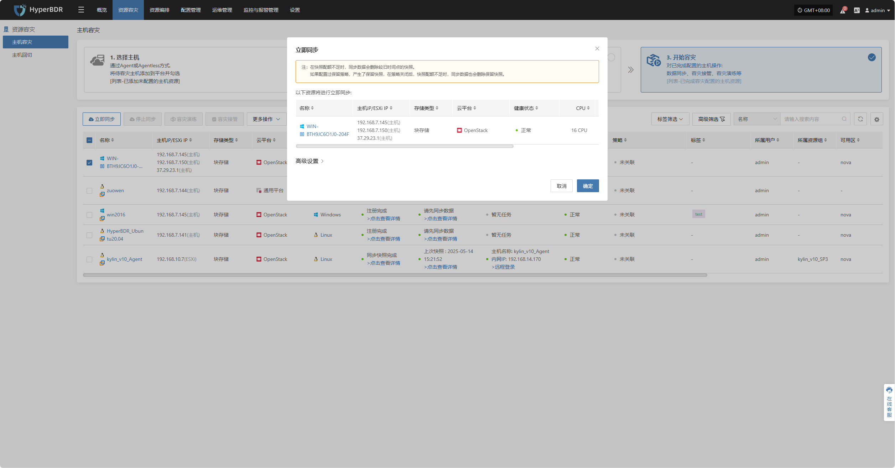

点&#x51FB;**“确认”**，开始同步

等待同步数据完成，可开始后续操作

#### **点击查看详情**

##### **主机状态**

在主机状态栏，点击“点击查看详情”按钮，查看主机的详细状态信息，包括运行情况、同步进度等。

##### **任务状态**

在任务状态栏，点击“点击查看详情”按钮，查看任务的详细状态信息，包括运行情况、同步进度等。

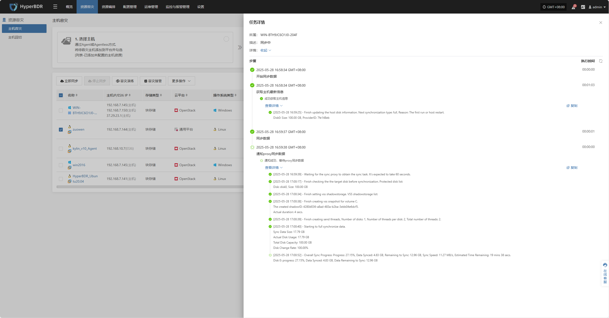

### **停止同步**

同步过程中，卷准备完毕后，可通过页面点击“停止同步”按钮，取消同步操作。

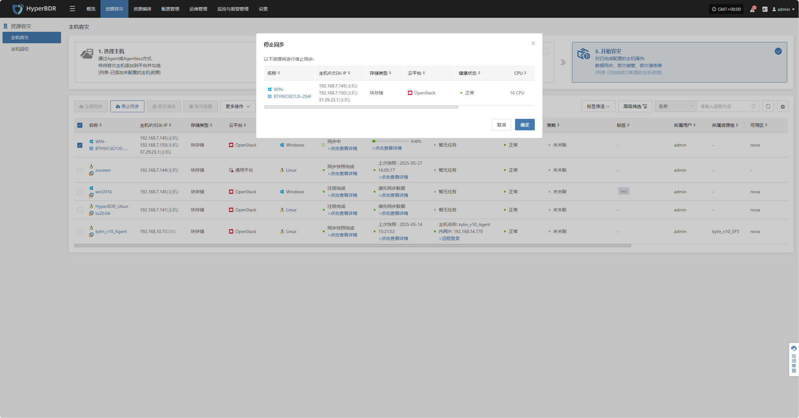

未处于同步状态或已同步完毕的主机不支持停止同步操作。

### **容灾演练**

选择对应的容灾主机，点击“容灾演练”，选择恢复时间点，一键恢复容灾主机到目标环境。

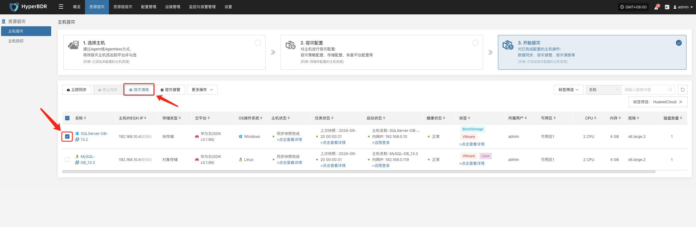

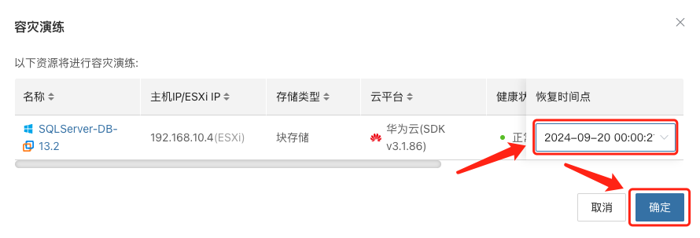

系统会根据预先配置的资源编排（计算、存储、网络等）自动化创建或启动目标端实例，等待启动完成，即可登录到目标平台进行验证配置及业务演练。

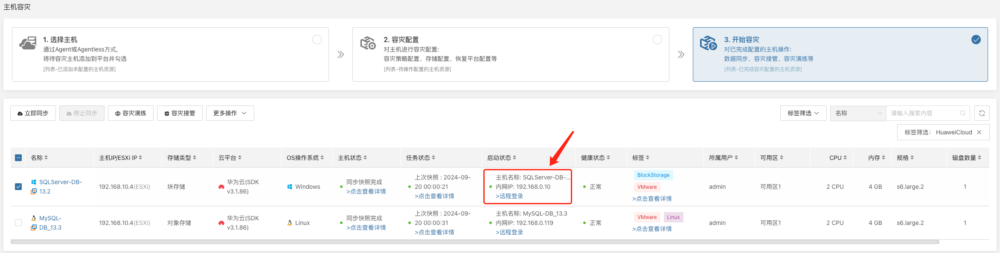

恢复完成后，检查应用服务、数据库、负载均衡等是否正常工作。

### **主机接管**

选择对应业务主机&#x7684;**“容灾接管”**&#x529F;能，按照需求选择恢复快照时间点，并点击确定

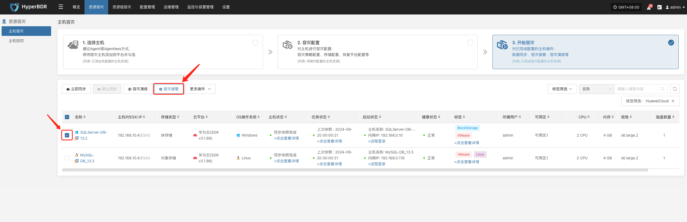

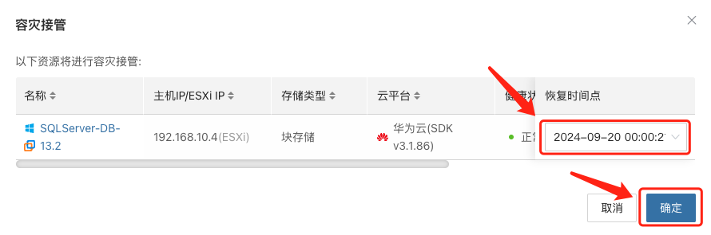

系统会根据预先配置的资源编排（计算、存储、网络等）自动化创建或启动目标端实例，等待启动完成，即可登录到目标平台进行验证配置及业务接管。

此时主机容灾流程完成，业务启动后，检查数据库版本、应用服务配置、依赖服务（如缓存、消息队列）是否正常。

### **更多操作**

点击“更多操作”，即可对已完成配置的主机进行修改。

#### **指定容灾平台**

> 注意：已完成数据同步主机不支持更改

点&#x51FB;**“指定容灾平台”**，可完成容灾平台修改，具体可参考：

块存储：[点击查看](#指定容灾平台)

对象存储：[点击查看](#指定容灾平台-1)

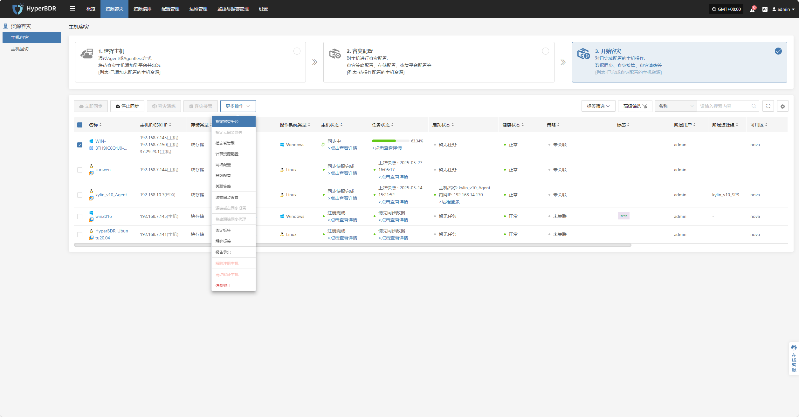

#### **指定云同步网关**

> 注意：已完成数据同步主机不支持更改

点&#x51FB;**“指定云同步网关”**，可完成容灾平台修改，具体可参考：

块存储：[点击查看](#指定云同步网关)

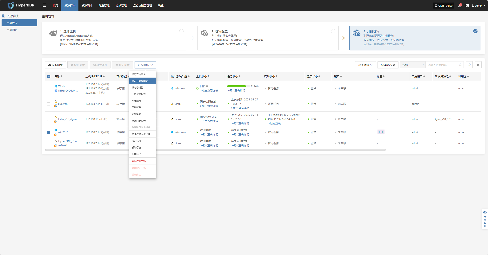

#### **指定卷类型**

> 注意：已完成数据同步主机不支持更改

点&#x51FB;**“指定卷类型”**，可完成容灾平台修改，具体可参考：

块存储：[点击查看](#指定卷类型)

对象存储：[点击查看](#指定卷类型-1)

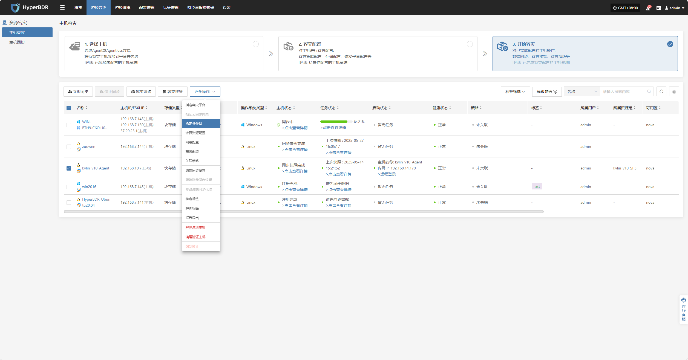

#### **计算资源配置**

> 注意：已完成数据同步主机不支持更改

点&#x51FB;**“计算资源配置”**，可完成容灾平台修改，具体可参考：

块存储：[点击查看](#计算资源配置)

对象存储：[点击查看](#计算资源配置-1)

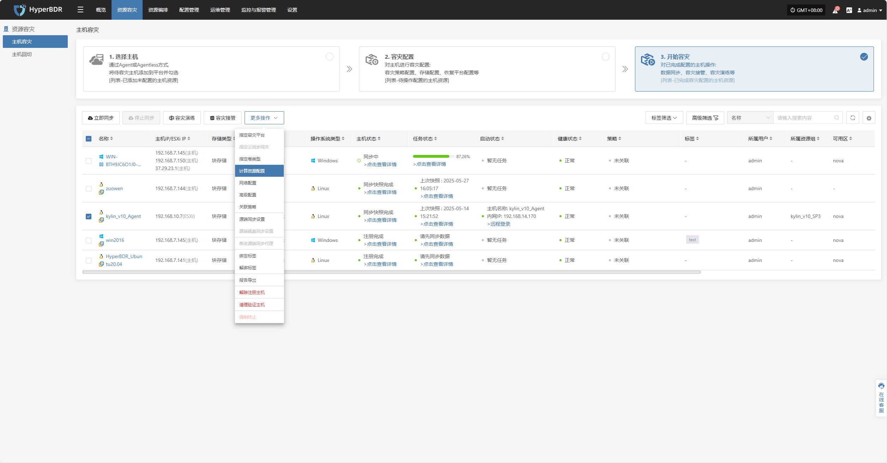

#### **网络配置**

> 注意：已完成数据同步主机不支持更改

点&#x51FB;**“网络配置”**，可完成容灾平台修改，具体可参考：

块存储：[点击查看](#网络配置)

对象存储：[点击查看](#网络配置-1)

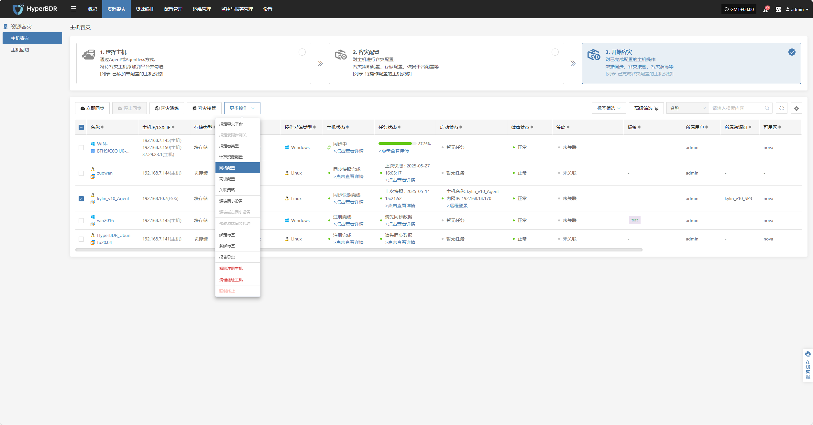

#### **高级配置**

点&#x51FB;**“高级配置”**，可完成容灾平台修改，具体可参考：

块存储：[点击查看](#高级配置)

对象存储：[点击查看](#高级配置-1)

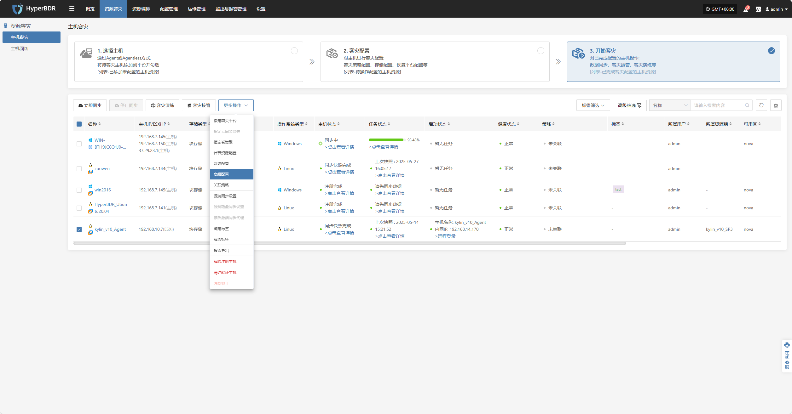

#### **关联策略**

点&#x51FB;**“关联策略”**，可完成容灾平台修改，具体可参考：

块存储：[点击查看](#关联策略)

对象存储：[点击查看](#关联策略-1)

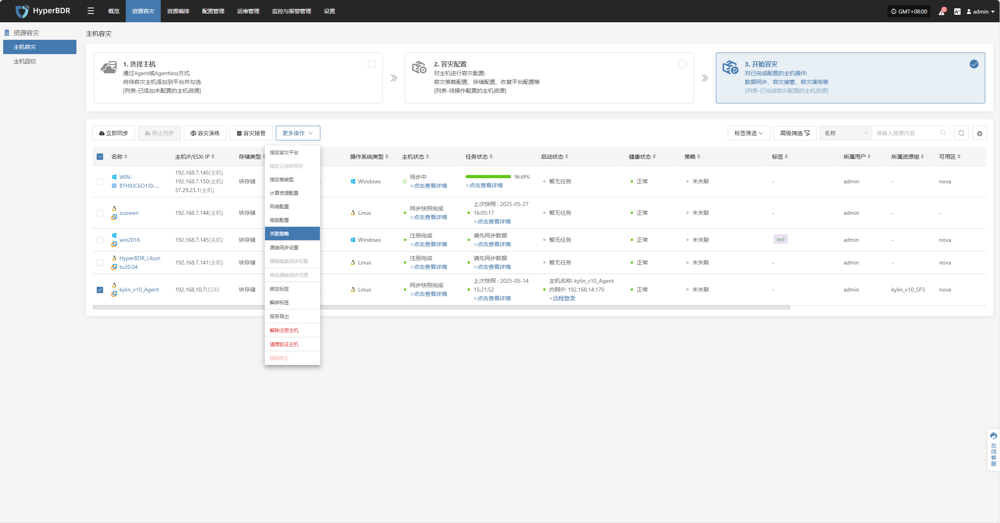

#### **源端同步设置**

点&#x51FB;**“源端同步设置”，**&#x53EF;完成备份主机的源端参数配置设定。

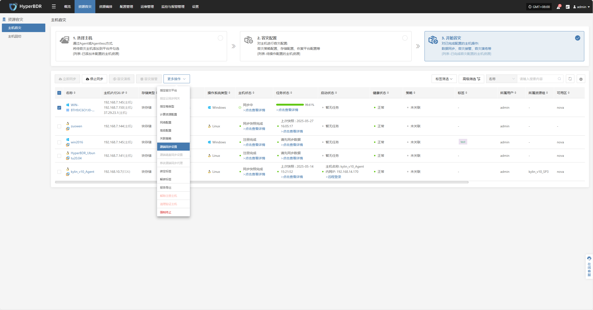

##### **通用设置**

| 参数       | 配置    | 说明                                             |
| -------- | ----- | ---------------------------------------------- |
| CPU最大使用率 | 1-100 | 配置源端主机在备份时可以占用的系统CPU资源，建议不要设置的太低，太低后会影响到备份的效率。 |
| 加密       | 是, 否  | 只针对对象存储模式进行设置。注意：开启选项后，会占用更多的CPU进行加密处理         |
| 压缩       | 是, 否  | 只针对对象存储模式进行设置。注意：开启选项后，会占用更多的CPU进行压缩处理         |

##### **源端无代理模式**

| 参数         | 配置      | 说明                                                                                                                                                                                                    |
| ---------- | ------- | ----------------------------------------------------------------------------------------------------------------------------------------------------------------------------------------------------- |
| VMware静默快照 | 是否      | 静默快照目前只对安装有VMware-tools的VMware主机有效。                                                                                                                                                                   |
| 读线程        | 自动适配自定义 | 该项是设置单个主机的读取线程数。   自动适配根据源端同步代理的资源配置和待同步主机的磁盘数量自动调整线程数，适配范围在 1 到 10 之间。如有特殊需要，请使用自定义选项（取值范围为1-100的整数），建议将线程数量限制在 30 以内。如果网络环境为万兆及以上，建议在增加源端同步代理的 CPU 和内存配置(例如:8核 16G 或以上)后，再将线程数调整为 50 或 100，以提升同步性能。 |
| 写线程        | 自动适配自定义 | 该项是设置单个主机的写入线程数。   自动适配根据源端同步代理的资源配置和待同步主机的磁盘数量自动调整线程数，适配范围在 1 到 10 之间。如有特殊需要，请使用自定义选项（取值范围为1-100的整数），建议将线程数量限制在 30 以内。如果网络环境为万兆及以上，建议在增加源端同步代理的 CPU 和内存配置(例如:8核 16G 或以上)后，再将线程数调整为 50 或 100，以提升同步性能。 |
| 多磁盘并发读写    | 是否      | 该项是指同步主机时是否并发同步所有磁盘。                                                                                                                                                                                  |

##### **同步重试设置**

| 参数   | 配置     | 说明                                                                    |
| ---- | ------ | --------------------------------------------------------------------- |
| 是否重试 | 是否     | 开启重试后当发生异常导致同步失败时（网络异常），系统会自动尝试重新连接并恢复同步操作。不开启重试，系统在同步失败后将不会自动尝试重新连接。 |
| 重试次数 | 1-100  | 设置最多尝试重试的次数。                                                          |
| 间隔时间 | 1-3600 | 每次重试之间的等待时间，单位为秒。                                                     |

#### **源端磁盘同步设置**

点&#x51FB;**“源端磁盘同步设置”**，可配置源端的磁盘同步策略。在存在多块磁盘的情况下，支持针对每块磁盘选择是否参与同步。

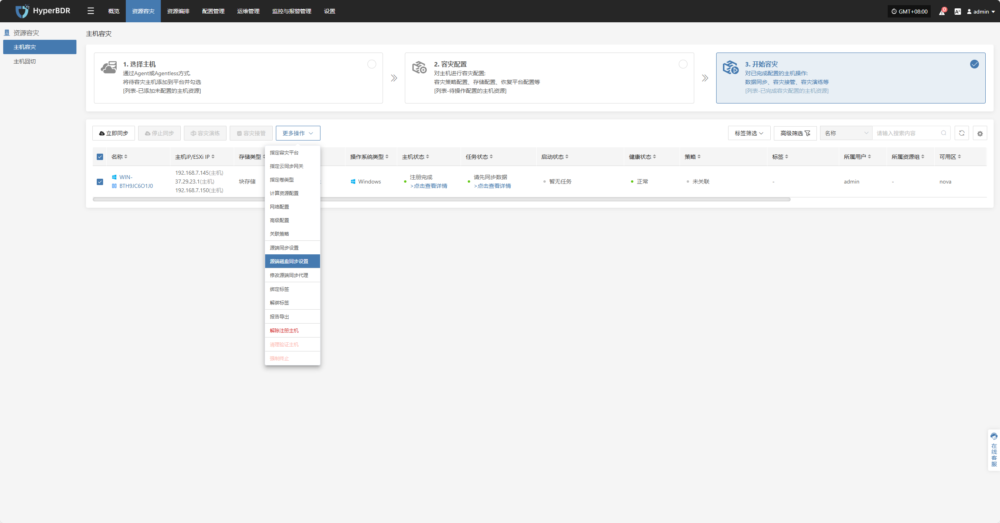

#### **修改源端同步代理**

> 注意：已完成数据同步主机不支持更改

点&#x51FB;**“修改源端同步代理”**，可完成源端同步代理修改。

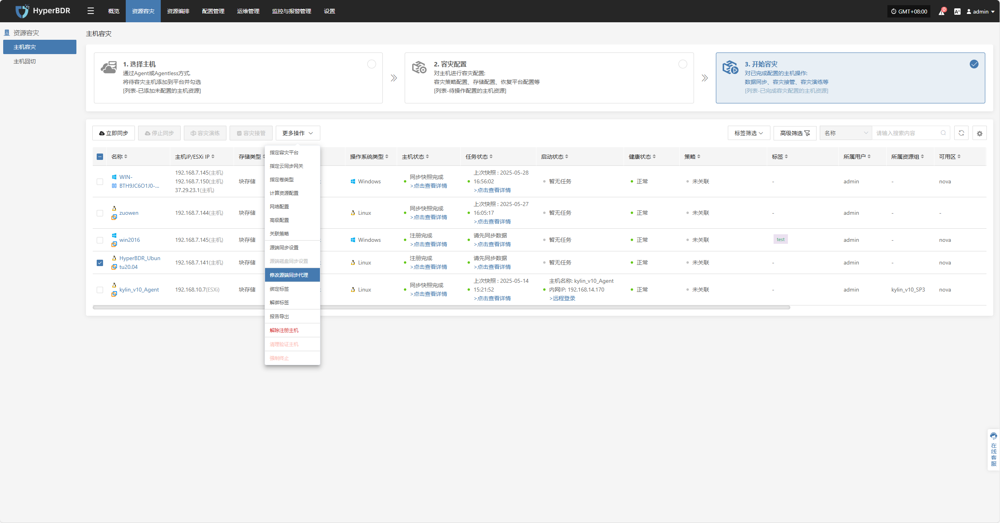

#### **绑定标签**

点&#x51FB;**“绑定标签”**，在弹出的侧栏里可针对当前选择的主机完成绑定标签操作。

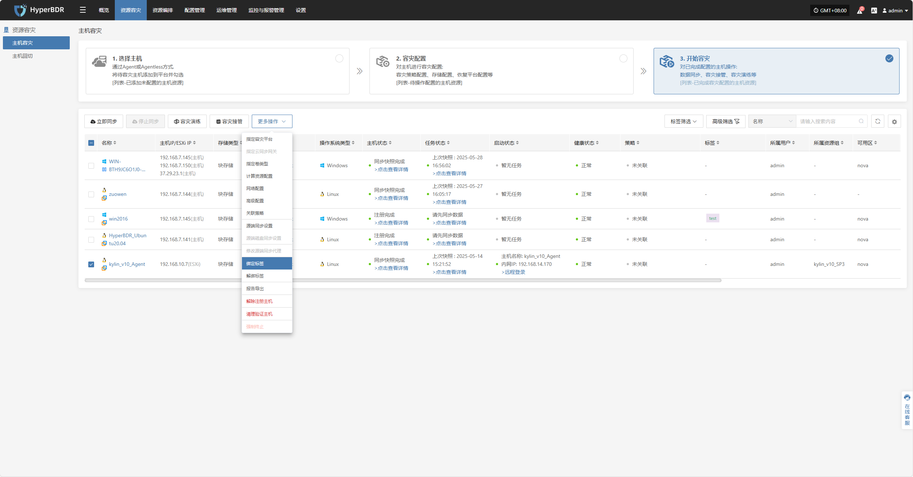

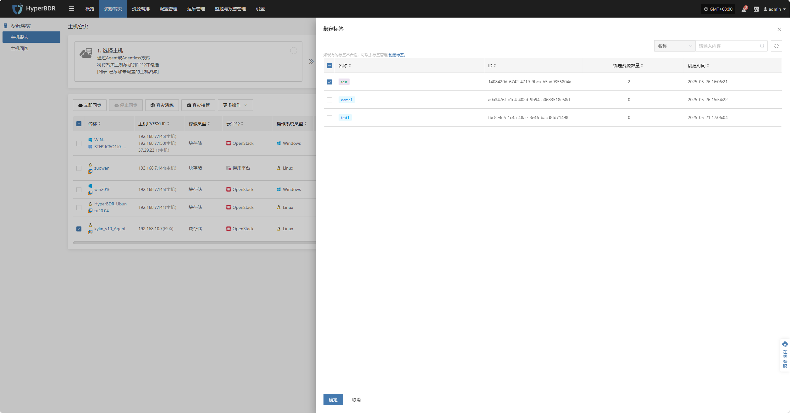

#### **解绑标签**

点&#x51FB;**“解绑标签”**，在弹出的侧栏里可完成解绑标签操作。

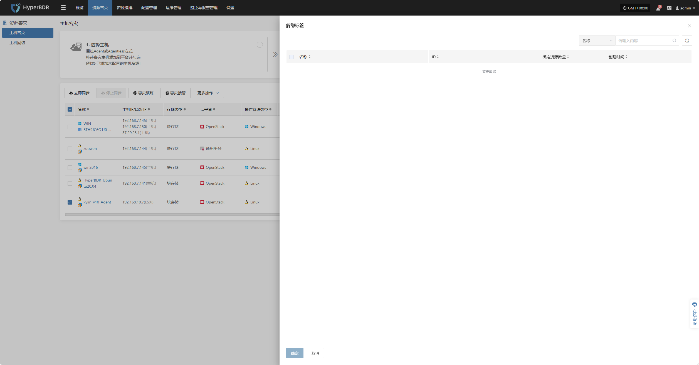

#### **报告导出**

点&#x51FB;**“报告导出”**，在弹出的对话框里选择需要导出的主机报告类型，可完成**报告导出**操作。具体可参考：(报告导出)

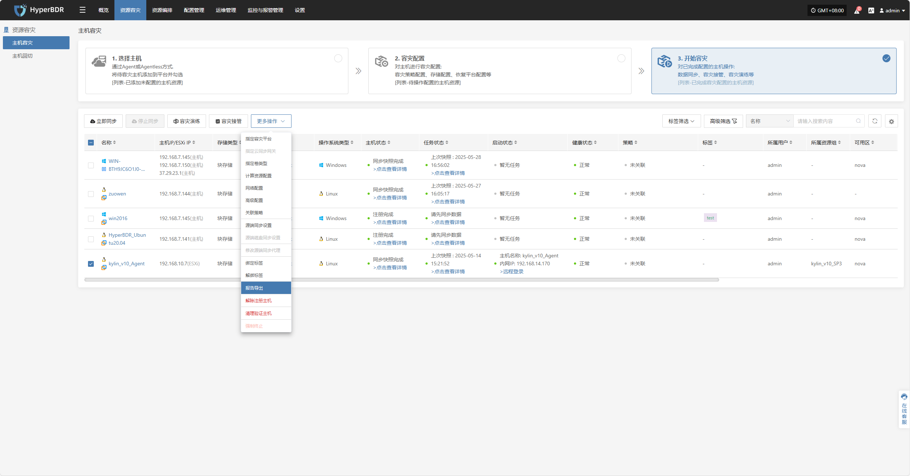

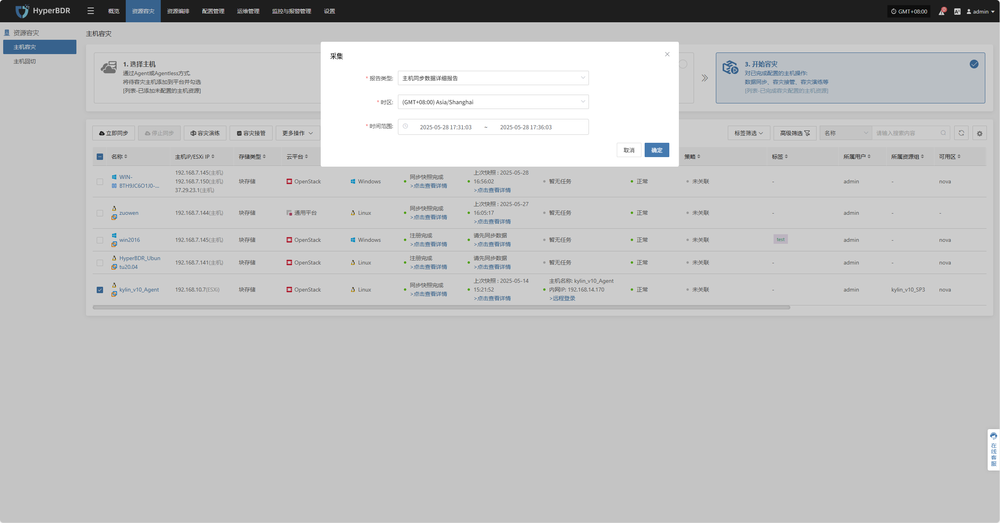

#### **解除注册主机**

> 注意：解除注册后将自动注销服务，需根据模式重新加载主机或安装服务。
>
> * 源端无代理模式：选择主机--重载主机
>
> * Agent模式：重装服务

点&#x51FB;**“解除注册主机”**&#x6309;钮，可取消当前主机的注册，在弹出的对话框内勾选注意事项后点击确认可解除注册。

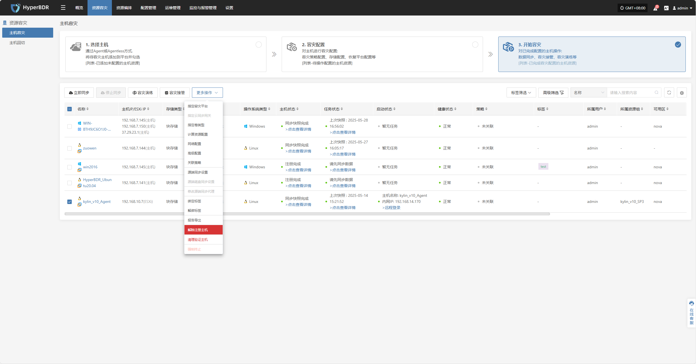

对于已失联的主机需要使用强制注册

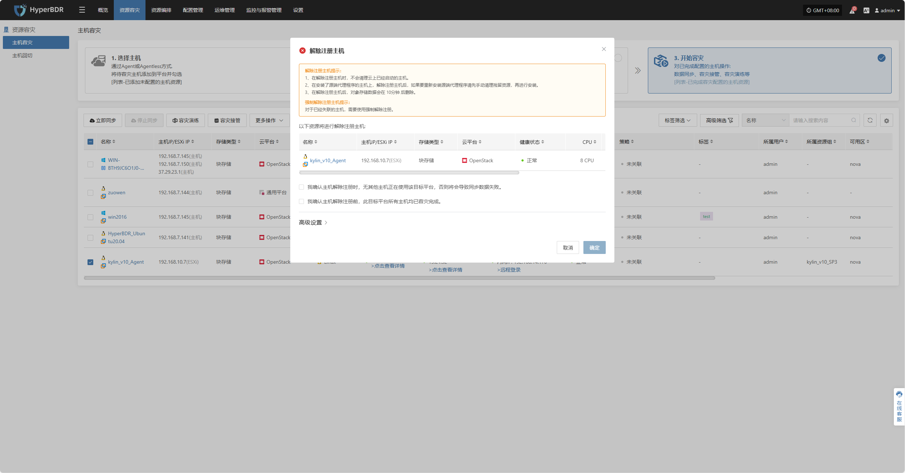

#### **清理验证主机**

点&#x51FB;**“清理验证主机”**&#x6309;钮，该操作只会清理云上已启动的主机，在弹出的对话框中输入“Yes”后点击确认即可清理云上验证主机。

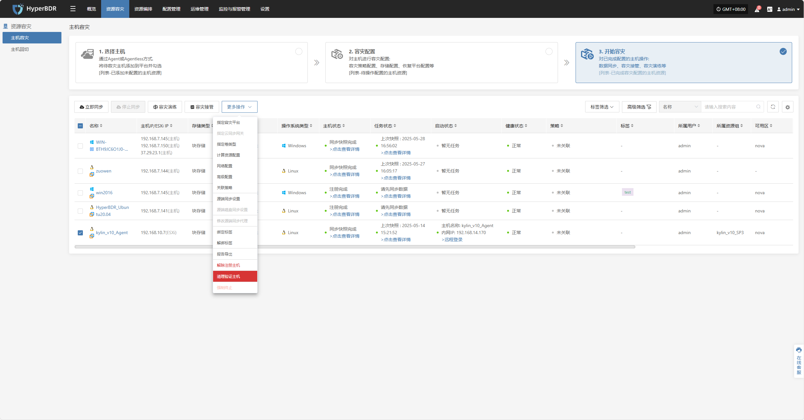

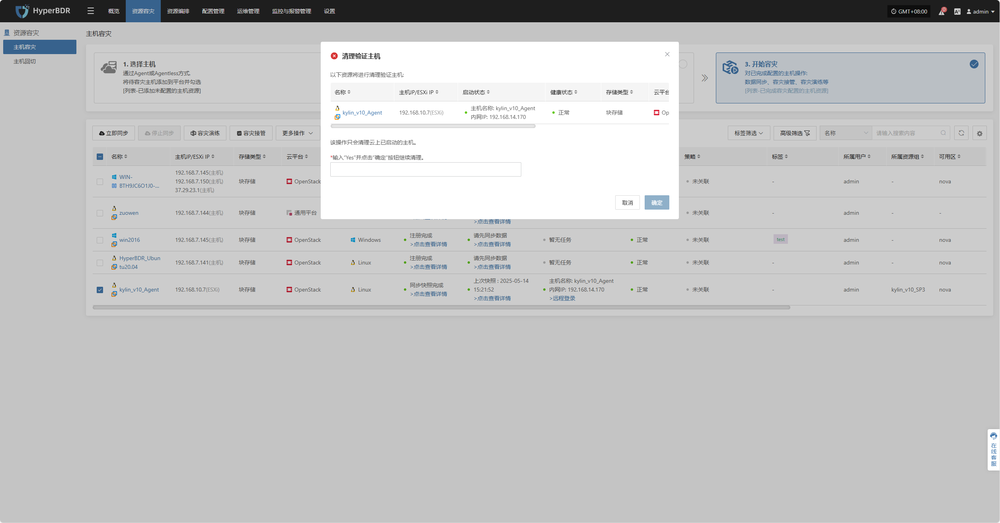

#### **强制终止**

> 注意：当同步或演练等操作长时间卡顿或遇到不可控异常时，可使用该功能强制终止任务。

点&#x51FB;**“强制终止”**&#x6309;钮，立即停止当前任务的执行。

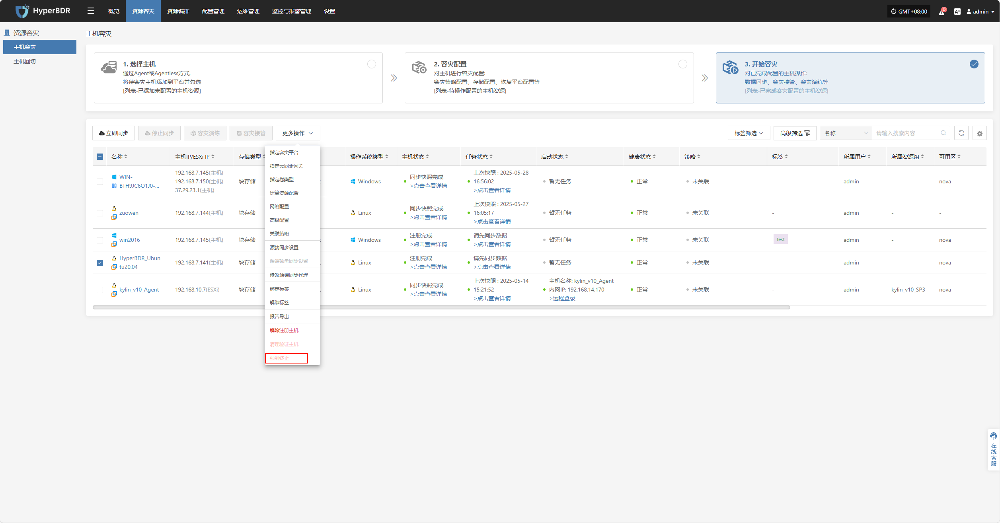

