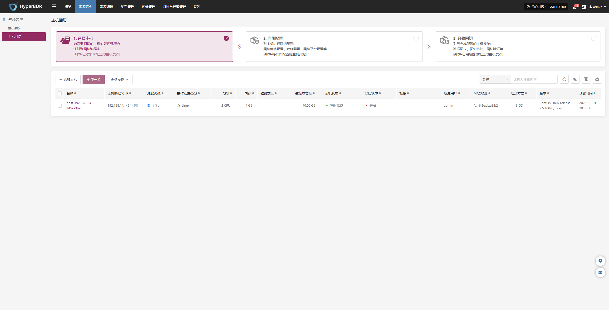

# 主机回切

主机回切主要是提供了在容灾演练/接管完成后，在源生产环境故障恢复后的业务回切的步骤操作引导，也分为三个步骤，其中包含选择主机、回切配置、开始回切三个主流程步骤，你可以通过三步骤引导来完成所有容灾回切的闭环操作。

点击顶部"资源容灾"导航栏，点击左侧"主机回切"导航栏，可以进行主机回切的主流程操作。

在进入具体回切配置阶段时，其整体配置逻辑与主机容灾流程保持一致，如需了解各配置项的详细含义及操作方法，可参考[**主机容灾**](host-dr.md)章节中的配置流程说明，按步骤完成相关设置后，即可继续执行主机回切操作。