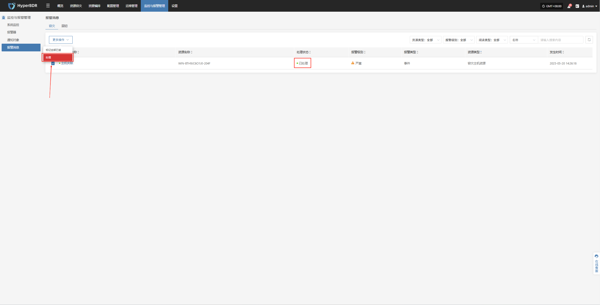
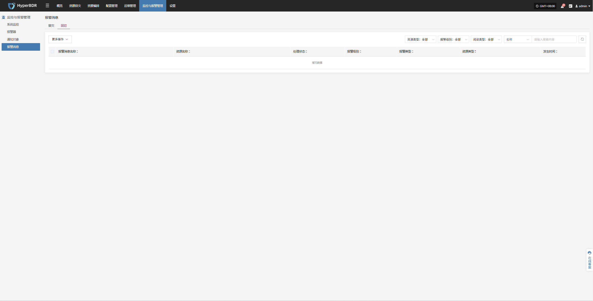

# 报警消息

系统在运行过程中，会根据报警器添加规则监控各类资源状态与关键事件。当检测到异常指标或触发预设告警条件时，平台将自动生成报警消息。

> 如果创建报警器时绑定相关通知人则会根据相应情况以邮件、短信或其他方式通知相关人员。

## 容灾

* 报警消息字段说明

系统在检测到资源异常或事件触发后，会生成报警消息，具体字段说明如下：

| 字段名称       | 描述                                                                                                                                      |
|:----------------:|-------------------------------------------------------------------------------------------------------------------------------------------|
| **报警消息名称** | 报警器触发时的事件类型，用于快速识别问题根因。                                                                                          |
| **资源名称**     | 触发报警的具体资源名称，例如主机名、服务名等。                                                                                          |
| **处理状态**     | 当前报警的处理进度或状态，如“未处理”、“已处理”等。                                                                                      |
| **报警级别**     | 报警事件的严重程度，常见等级包括“提示”、“严重”、“紧急”等。                                                                             |
| **报警类型**     | 报警的具体类别，如“事件报警”、“资源报警”等。                                                                                            |
| **资源类型**     | 涉及的资源范围，包括： · 对象存储 · 容灾策略用户资源 · 容灾主机资源 · License 资源 · 生产平台资源 · 容灾平台资源 · 监控报警 · 资源组 |
| **发生时间**     | 系统首次检测到该报警事件的时间点，用于问题溯源与响应时效分析。                                                                           |

* 更多操作

在报警消息页面，用户可对报警事件进行操作处理，包括标记为“已读”或更新其处理状态，以便于后续追踪与管理。

处理后对应状态信息会进行改变：

## 回切

* 报警消息字段说明

系统在检测到资源异常或事件触发后，会生成报警消息，具体字段说明如下：

| 字段名称       | 描述                                                                                                                                      |
|:----------------:|-------------------------------------------------------------------------------------------------------------------------------------------|
| **报警消息名称** | 报警器触发时的事件类型，用于快速识别问题根因。                                                                                          |
| **资源名称**     | 触发报警的具体资源名称，例如主机名、服务名等。                                                                                          |
| **处理状态**     | 当前报警的处理进度或状态，如“未处理”、“已处理”等。                                                                                      |
| **报警级别**     | 报警事件的严重程度，常见等级包括“提示”、“严重”、“紧急”等。                                                                             |
| **报警类型**     | 报警的具体类别，如“事件报警”、“资源报警”等。                                                                                            |
| **资源类型**     | 涉及的资源范围，包括： · 对象存储 · 容灾策略用户资源 · 容灾主机资源 · License 资源 · 生产平台资源 · 容灾平台资源 · 监控报警 · 资源组 |
| **发生时间**     | 系统首次检测到该报警事件的时间点，用于问题溯源与响应时效分析。                                                                           |

* 更多操作

在报警消息页面，用户可对报警事件进行操作处理，包括标记为“已读”或更新其处理状态，以便于后续追踪与管理。

处理后对应状态信息会进行改变：

