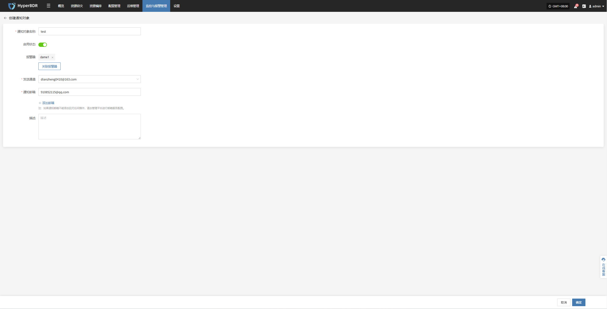
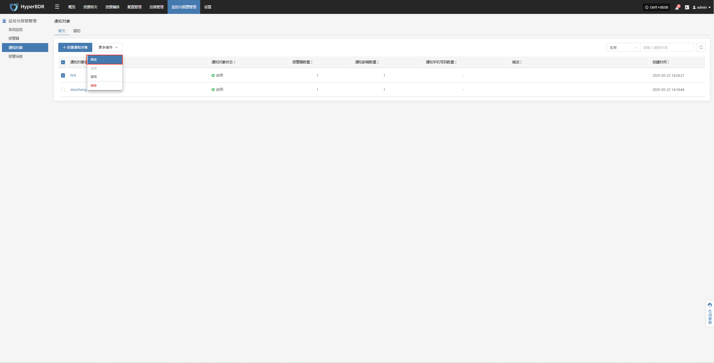
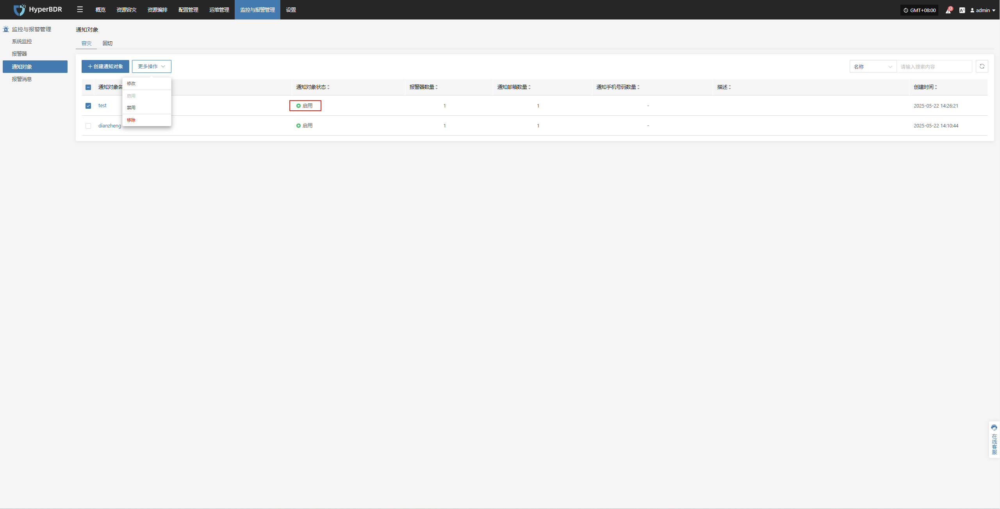
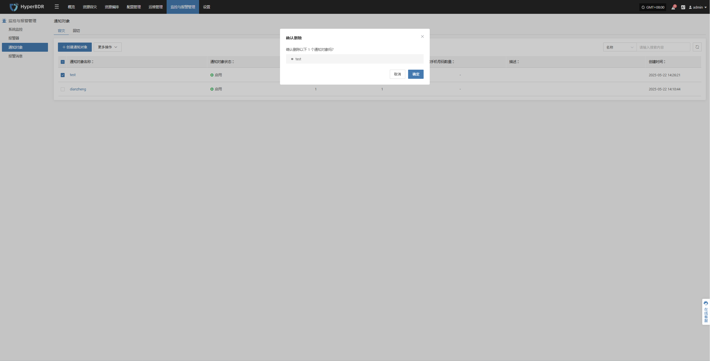
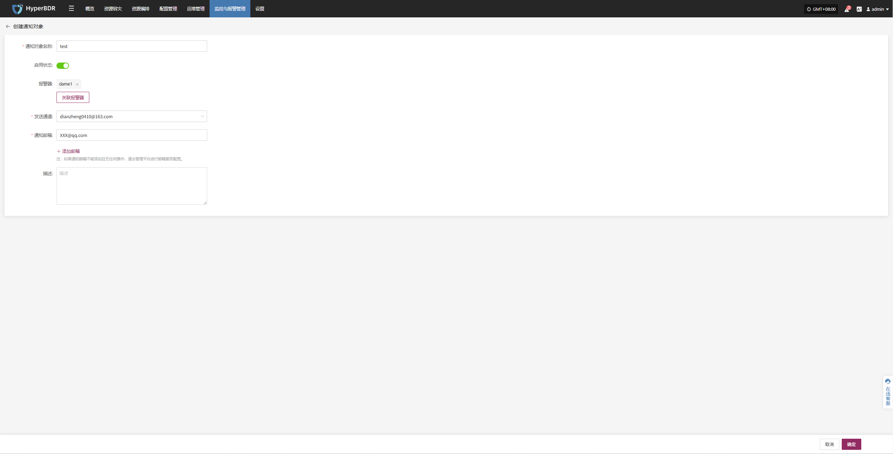
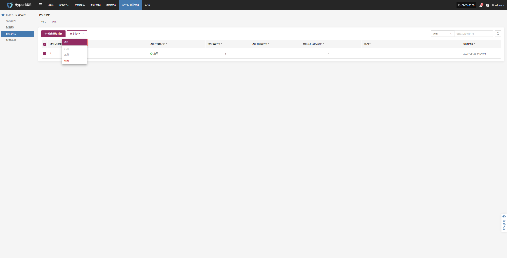
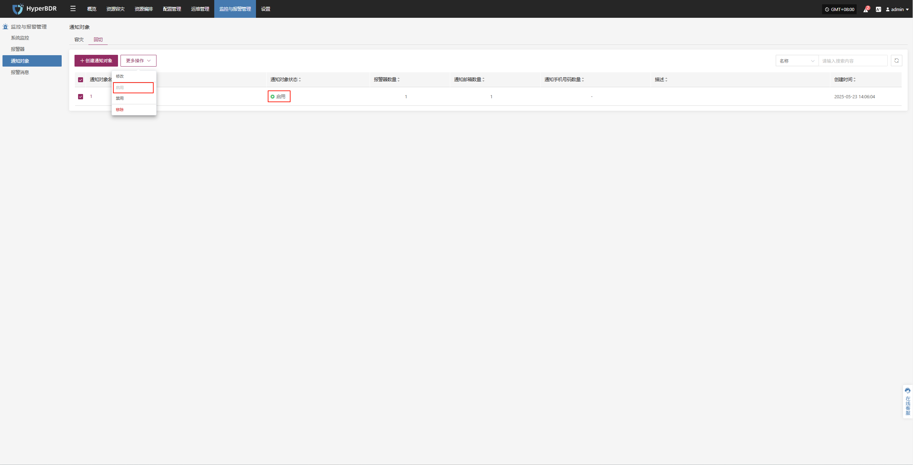
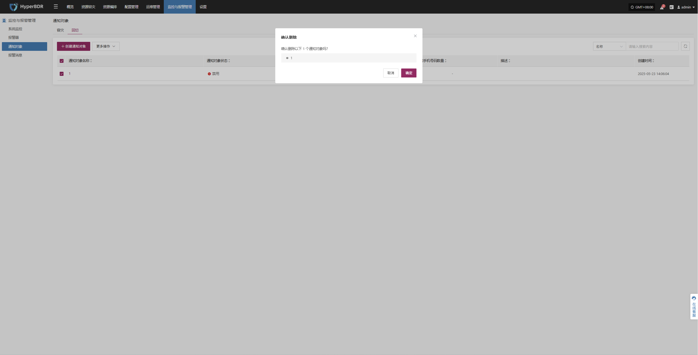

# 通知对象
报警事件发生时，系统将接收告警信息并进行响应的人员或群组。通知对象可以通过邮件、短信、电话或其他方式接收通知，确保相关人员及时了解并处理异常情况。

> 通知对象中尚未配置邮箱和短信接收服务时，无法创建通知用户，请到【运维管理平台】->【通知配置】中配置

## **容灾**

### **创建通知对象**

进入【监控与报警管理】模块，选择【通知对象】下的【容灾】，然后点击【创建通知对象】。

根据提示填写相关信息，完成通知对象的配置，确保报警事件发生时，相关人员能够及时收到通知。

| **字段名称**   | **字段信息**              | **说明**                       |
|:--------------:|:-------------------------:|:------------------------------:|
| 通知对象名称   | test                      | 通知对象的名称                 |
| 启用状态       | 已启用                    | 当前通知对象是否启用           |
| 报警器         | dame1                     | 点击关联报警器，绑定已创建的报警器名称               |
| 发送通道       | dianzheng0410@163.com     | 通知发送的渠道，例如邮箱地址   |
| 通知邮箱       | XXX@qq.com                | 用于接收通知的邮箱（可添加多个） |
| 描述           |                           | 相关备注或说明                 |

### **更多操作**

选中相应的通知对象后，可执行包括修改、启用、停用及移除在内的管理操作。

#### **修改**

* 点击【修改】后，系统将跳转页面，用户可在该页面对已创建的报警器配置进行重新编辑与调整。

#### **启用**

* 已启用的通知对象无法进行修改操作。如需变更相关配置，请先将通知对象停用

#### **停用**

* 已停的通知对象无法进行修改操作。如需变更相关配置，请先将通知对象起用

#### **移除**

* 点击【移除】后，移除操作将触发二次确认，确认后，系统将删除该通知对象，并取消其与相关报警器的关联

## **回切**

### **创建通知对象**

进入【监控与报警管理】模块，选择【通知对象】下的【回切】，然后点击【创建通知对象】。

根据提示填写相关信息，完成通知对象的配置，确保报警事件发生时，相关人员能够及时收到通知。

| **字段名称** | **字段信息**              | **说明**              |
| -------- | --------------------- | ------------------- |
| 通知对象名称   | test                  | 通知对象的名称             |
| 启用状态     | 已启用                   | 当前通知对象是否启用          |
| 报警器      | dame1                 | 点击关联报警器，绑定已创建的报警器名称 |
| 发送通道     | dianzheng0410@163.com | 通知发送的渠道，例如邮箱地址      |
| 通知邮箱     | XXX@qq.com            | 用于接收通知的邮箱(可添加多个)    |
| 描述       |                       | 相关备注或说明             |

### **更多操作**

选中相应的通知对象后，可执行包括修改、启用、停用及移除在内的管理操作。

#### **修改**

* 点击【修改】后，系统将跳转页面，用户可在该页面对已创建的报警器配置进行重新编辑与调整。

  

#### **启用**

* 已启用的通知对象无法进行修改操作。如需变更相关配置，请先将通知对象停用

  
#### **停用**

* 已停用的通知对象无法修改。如需调整其配置，请先启用该通知对象。停用状态下将不进行任何消息推送。

  

#### **移除**

* 点击【移除】后，移除操作将触发二次确认，确认后，系统将删除该通知对象，并取消其与相关报警器的关联

  
