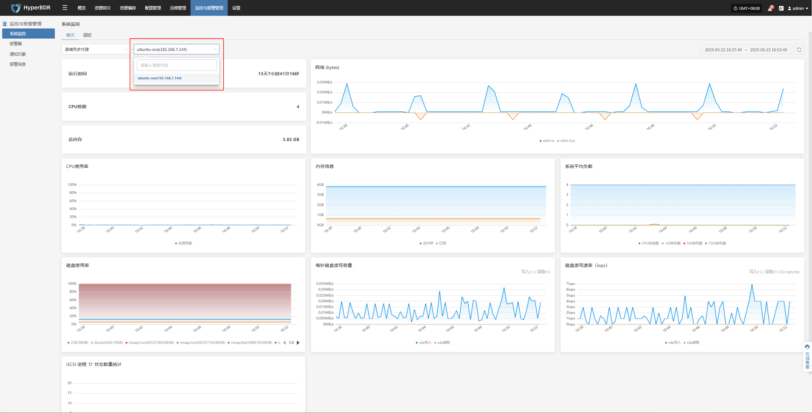

# 系统监控

提供对平台核心资源的运行状态可视化展示，支持实时采集 CPU、内存、磁盘、网络、负载等多项指标，帮助管理员全面掌握主机资源健康状况。用户可按资源类型与节点维度切换视图，实现分层级的统一监控。

## 系统监控功能说明

系统监控模块用于对平台内各类关键资源的运行状态进行实时可视化展示和性能分析。以“源端同步代理”为例，用户可选择具体主机，查看该节点的详细运行指标，以便及时发现资源瓶颈或潜在故障风险。

- 支持按资源类型与主机实例切换视图，便于针对性查看监控数据。

