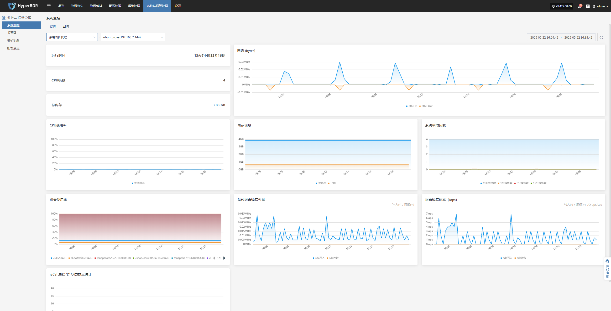
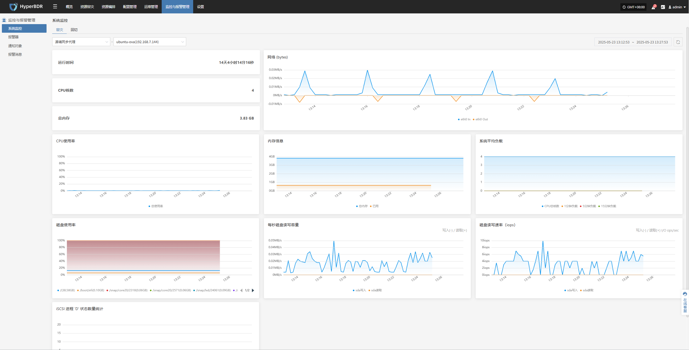
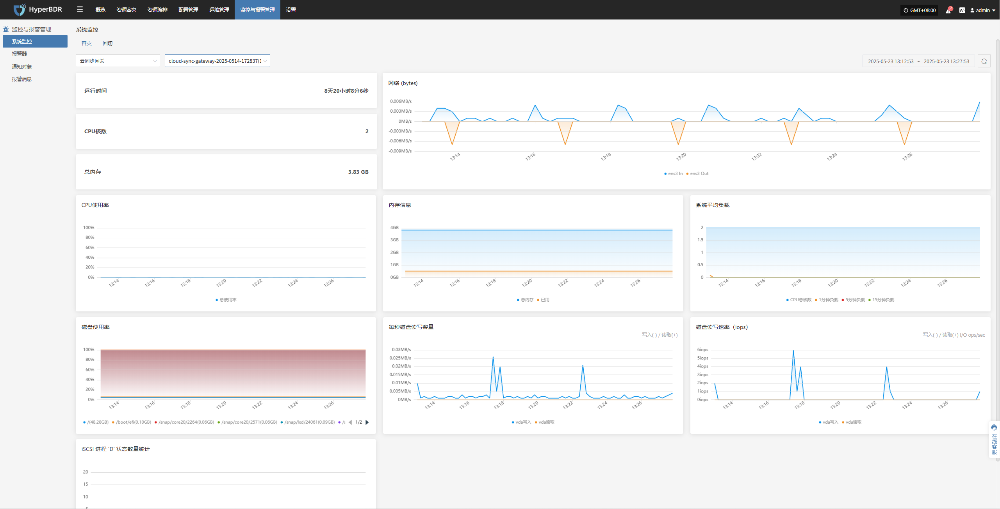
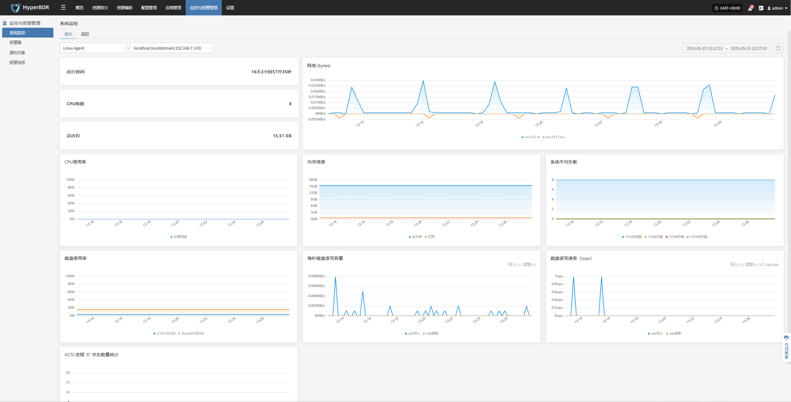
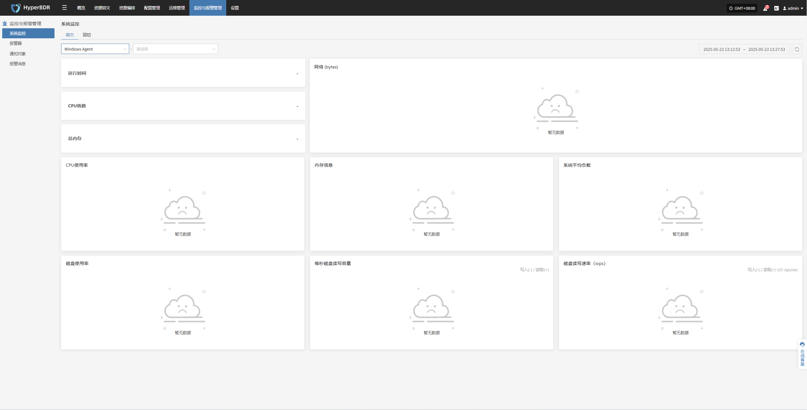
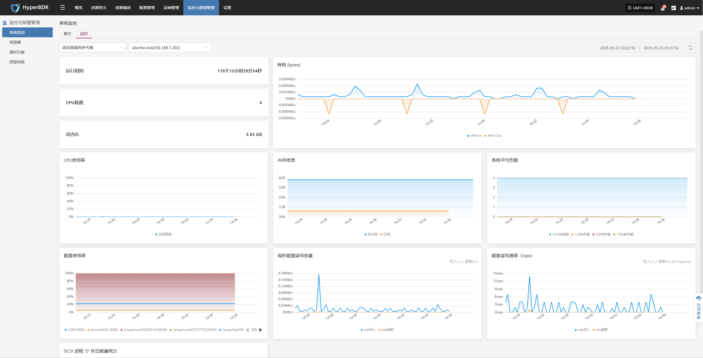
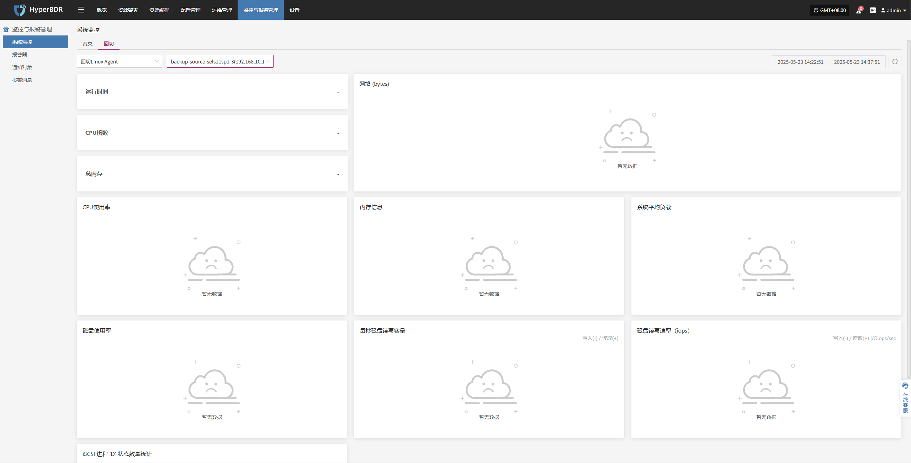
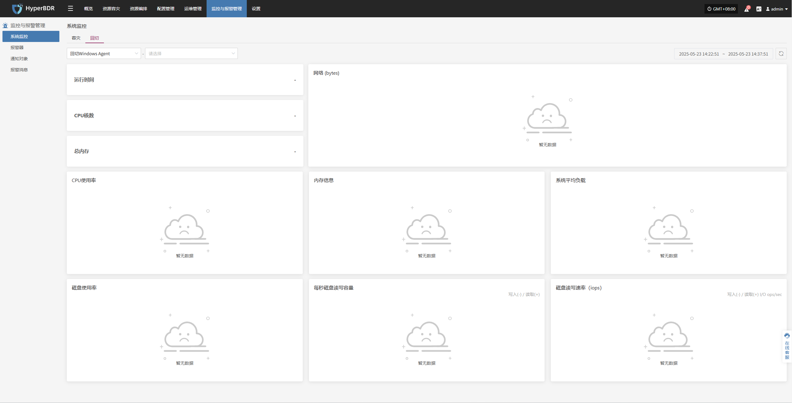

# **系统监控**

提供对平台核心资源的运行状态可视化展示，支持实时采集 CPU、内存、磁盘、网络、负载等多项指标，帮助管理员全面掌握主机资源健康状况。用户可按资源类型与节点维度切换视图，实现分层级的统一监控。

## **系统监控功能说明**

系统监控模块用于对平台内各类关键资源的运行状态进行实时可视化展示和性能分析。以“源端同步代理”为例，用户可选择具体主机，查看该节点的详细运行指标，以便及时发现资源瓶颈或潜在故障风险。

#### **基本信息**

* **运行时间**：显示同步代理自启动以来的持续运行时长。

* **CPU 核数**：显示当前代理主机的物理 CPU 核心数量。

* **总内存**：展示当前代理主机的物理内存总容量。

#### **资源使用情况**

系统通过图表方式动态展示各类资源的使用状态，便于用户实时掌握运行负载与性能变化。

| **监控项**            | **描述**                           |
| ------------------ | -------------------------------- |
| **CPU 使用率**        | 以折线图展示单位时间内 CPU 占用率的变化情况         |
| **内存信息**           | 展示内存总量、已使用及剩余情况                  |
| **系统平均负载**         | 分别展示过去 1 分钟、5 分钟、15 分钟的系统平均负载    |
| **网络流量（bytes）**    | 以图形方式展示 eth0 网卡的入站（In）与出站（Out）流量 |
| **磁盘使用率**          | 展示各挂载磁盘路径的空间占用百分比                |
| **每秒磁盘读容量**        | 实时展示磁盘的读写吞吐量                     |
| **磁盘写入速率（IOPS）**   | 以 IOPS 为单位展示磁盘写入频率               |
| **iSCSI 进程状态数量统计** | 展示当前 iSCSI 进程状态的数量变化             |

> 支持按资源类型与主机实例切换视图，便于针对性查看监控数据

## **容灾**

### **源端同步代理**

用户可通过顶部导航栏进入“监控与管理”模块，并切换至**容灾**“源端同步代理”页面，以查看选定代理的系统资源使用情况。该视图展示了以下关键监控信息：

### **云同步网关**

用户可通过顶部导航栏进入“监控与管理”模块，并切换至**容灾**“云同步网关”页面，以查看选定代理的系统资源使用情况。该视图展示了以下关键监控信息：

### **Linux Agent**

用户可通过顶部导航栏进入“监控与管理”模块，并切换至**容灾**“Linux Agent”页面，以查看选定代理的系统资源使用情况。该视图展示了以下关键监控信息：

### **Windows Agent**

用户可通过顶部导航栏进入“监控与管理”模块，并切换至**容灾**“Windows Agent”页面，以查看选定代理的系统资源使用情况。该视图展示了以下关键监控信息：

## **回切**

### **回切源端同步代理**

用户可通过顶部导航栏进入“监控与管理”模块，并切换至**回切**“回切源端同步代理”页面，以查看选定代理的系统资源使用情况。该视图展示了以下关键监控信息：

### **回切云同步网关**

用户可通过顶部导航栏进入“监控与管理”模块，并切换至**回切**“回切云同步网关”页面，以查看选定代理的系统资源使用情况。该视图展示了以下关键监控信息：

### **回切Linux Agent**

用户可通过顶部导航栏进入“监控与管理”模块，并切换至**回切**“回切Linux Agent”页面，以查看选定代理的系统资源使用情况。该视图展示了以下关键监控信息：

### **回切Windows Agent**

用户可通过顶部导航栏进入“监控与管理”模块，并切换至**回切**“回切Windows Agent”页面，以查看选定代理的系统资源使用情况。该视图展示了以下关键监控信息：

