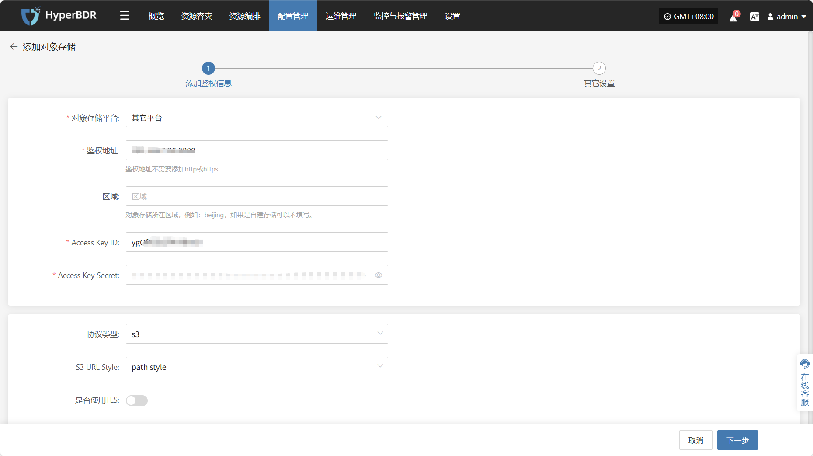
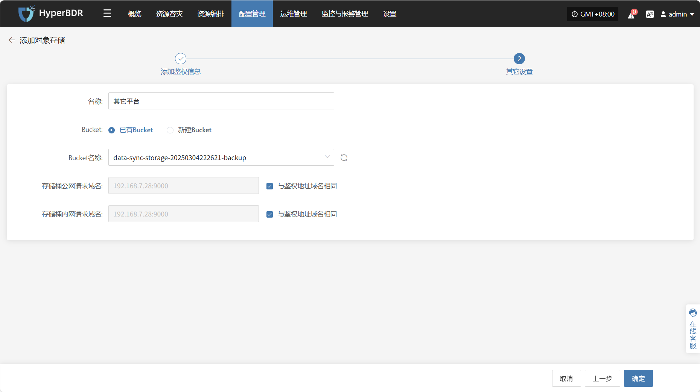

# **其他平台**

## **添加其他平台**

通过顶部导航栏依次选择 **“配置管理” → “存储配置” → “对象存储”** 进入对象存储页面，点击右上角 **“添加”** 按钮，可进行对象存储的新增配置操作。

## 添加鉴权信息

在对象存储配置页面中，平台类型选择 **“其他平台”** ，根据接入对象存储的实际情况，填写以下鉴权信息字段：

| 配置项               | 示例值                               | 说明                                    |
| ----------------- | --------------------------------- | ------------------------------------- |
| 对象存储平台            | 其他平台                              | 选择“其他平台”以手动填写自建或第三方对象存储的鉴权信息          |
| 鉴权地址              | 192.168.7.28:9000                 | 鉴权服务地址，无需添加 `http://` 或 `https://` 前缀 |
| 区域                | beijing（可选）                       | 对象存储所在地域，例如 `beijing`，自建存储可留空         |
| Access Key ID     | ygOfXlSs2F4rYBmO                  | 用于访问对象存储的访问密钥 ID                      |
| Access Key Secret | ••••••••••••••••••••••••••        | 对应的访问密钥 Secret，填写时默认隐藏，仅用于鉴权          |
| 协议类型              | s3 / eos                          | 指定对象存储协议类型，目前支持 `s3` 和 `eos`两种类型      |
| S3 URL Style      | path style / virtual hosted style | 当前选择 S3 接入风格                          |
| 是否使用 TLS          | 是 / 否                             | 是否启用加密传输（即 HTTPS），根据平台实际配置需求选择        |

## **其他设置**

在填写完鉴权信息后，点&#x51FB;**“下一步”**&#x7EE7;续配置存储桶相关参数，完成对象存储接入。

| **配置项**   | **示例值**             | **说明**                                                                               |
| --------- | ------------------- | ------------------------------------------------------------------------------------ |
| 名称        | 其他平台                | 所选对象存储平台名称，默认为第一步选择的平台名称                                                             |
| Bucket    | 已有Bucket / 新建Bucket | 选择 Bucket 的创建方式，支持选择已有 Bucket 或新建一个新的 Bucket                                         |
| Bucket名称  | 以实际情况为准             | 若选择已有 Bucket，可通过下拉列表选择；若选择新建 Bucket，则手动填写名称。注意：自定义字符不超过10个字符，只允许数字和小写字母，如果不填写，则自动生成。 |
| 存储桶公网请求域名 | 192.168.7.28:9000   | 用于公网访问 Bucket 的地址，可自定义或勾选`“与鉴权地址域名相同”`                                               |
| 存储桶内网请求域名 | 192.168.7.28:9000   | 用于内网访问 Bucket 的地址，可自定义或勾选`“与鉴权地址域名相同”`                                               |

