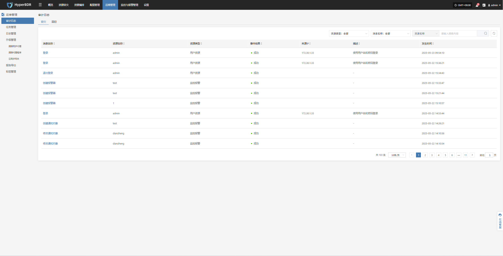
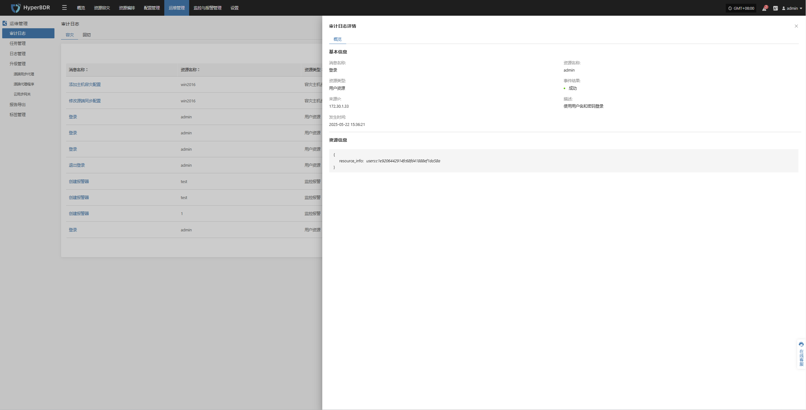

# 审计日志

在 HyperBDR 系统中，用户可通过导航栏进入“运行管理 > 审计日志”模块，查看平台中**容灾**和**回切**各类操作行为的详细记录。该页面有助于运维人员进行操作追踪、行为审计与问题排查。

## 页面功能

用户可通过顶部筛选条件进行快速查询，支持按以下字段过滤日志数据：

* **资源类型**：选择与操作相关的资源类型（如虚拟机、用户资源等）

* **消息名称**：可按关键字筛选特定操作事件

* **资源名称**：输入关键字精确查找对应资源

### 审计日志说明

| **字段名称**  | **信息**              | **说明**                        |
| --------- | ------------------- | ----------------------------- |
| **消息名称**  | 登录                  | 审计事件的类型，表示用户执行了登录操作。          |
| **资源名称**  | admin               | 触发审计事件的用户或资源名称。               |
| **资源类型**  | 用户资源                | 审计事件所涉及的资源分类，此处为与用户操作相关的资源。   |
| **事件结果**  | 成功                  | 操作的执行结果，通常为“成功”或“失败”。         |
| **来源 IP** | 172.30.1.33         | 发起该操作的客户端 IP 地址。              |
| **描述**    | 使用用户名和密码登录          | 对此次操作的简要说明，帮助用户理解操作意图与方式。     |
| **发生时间**  | 2025-05-23 09:54:10 | 系统记录该事件的具体时间，用于追踪行为或进行安全审计分析。 |

> 点击对应消息名称可查看详细信息

### 资源类型说明

| 资源类型       | 说明                          |
| ---------- | --------------------------- |
| 用户资源       | 与用户账户及行为相关的资源，例如登录记录、权限变更等。 |
| 容灾主机资源     | 参与容灾保护的主机资源，含配置、状态等信息。      |
| License 资源 | 系统运行所需授权许可的管理与状态信息。         |
| 生产平台资源     | 实际业务运行平台中的代理、主机、服务等资源。      |
| 容灾平台资源     | 容灾备份环境中的平台与组件资源。            |
| 监控报警       | 与资源监控及报警配置相关的对象与事件。         |
| 资源组        | 将多个资源按业务或功能逻辑划分的组合单元。       |
| 对象存储       | 提供备份、归档等服务的对象存储资源。          |
| 容灾策略       | 定义资源容灾行为的策略对象，如同步、切换规则等。    |

### 其他说明

* 页面支持分页浏览，默认每页显示 10 条记录。

* 可通过右上角的搜索框进一步精确检索关键操作记录。

* 审计日志不可手动编辑，仅用于系统行为留痕。
