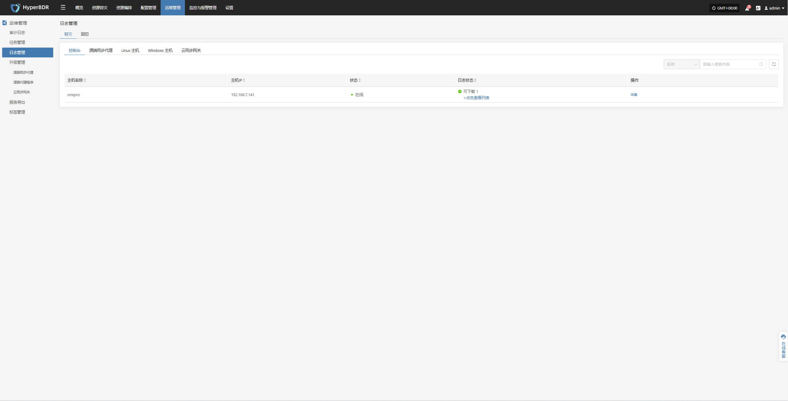
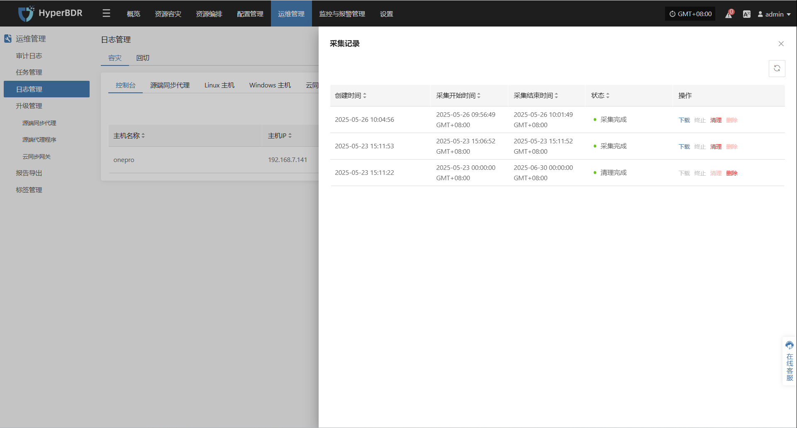
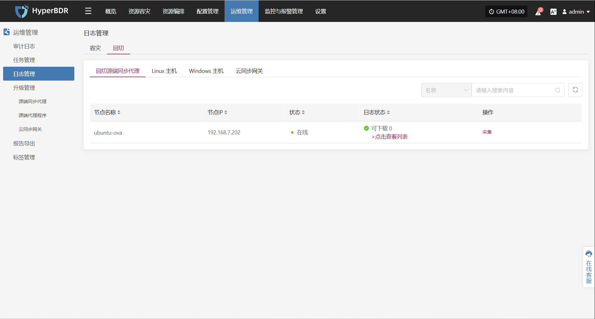
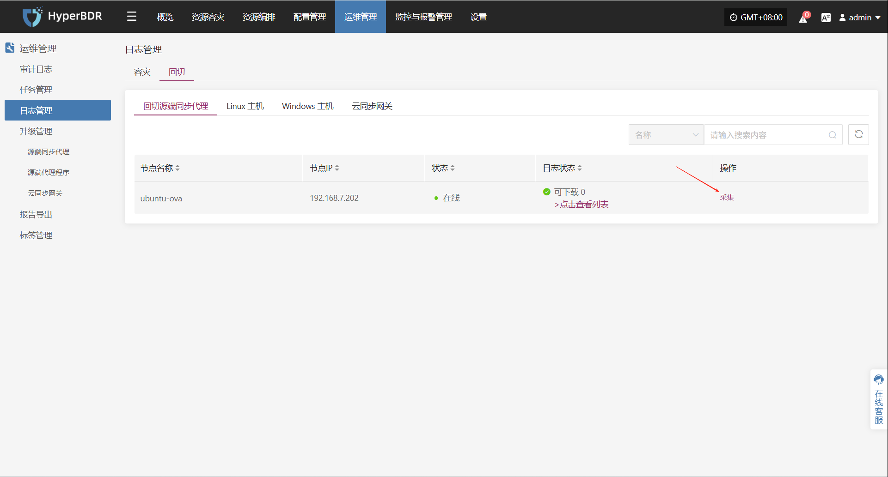
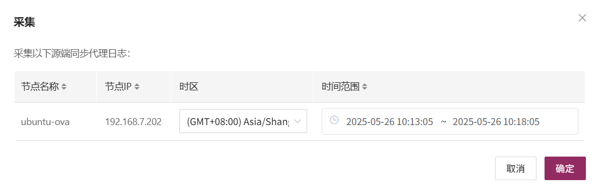
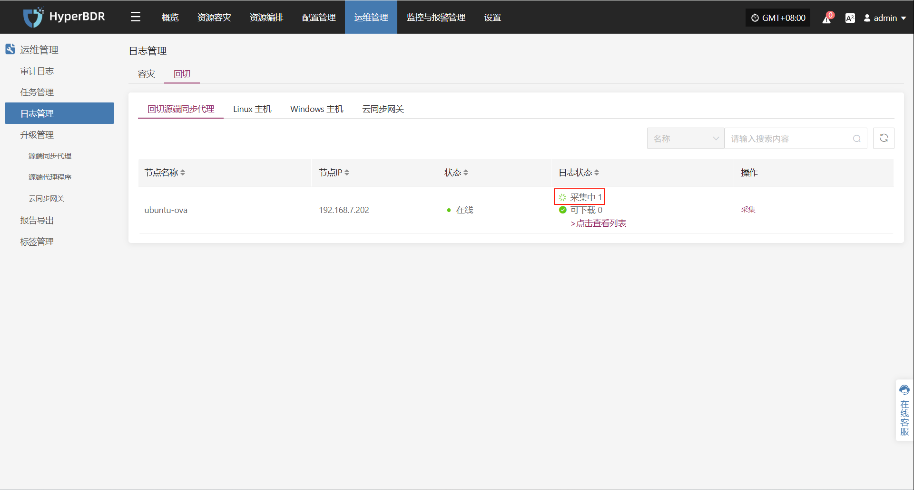
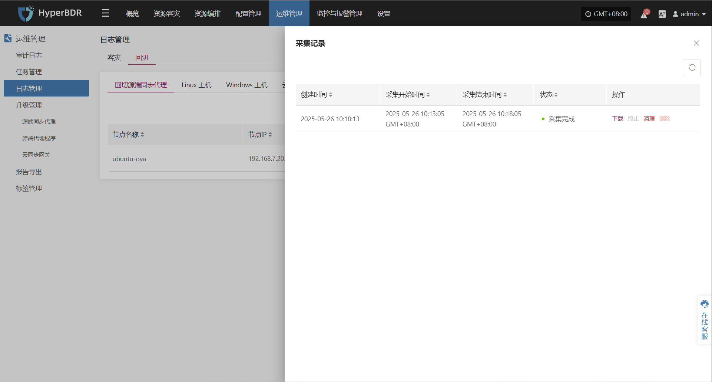

# **日志管理**

在 HyperBDR 系统中，用户可通过导航栏进入“运维管理 > 日志管理”模块，用户可通过该模块快速收集关键组件的运行日志，以便进行问题排查。

## **容灾**

### **支持资源类型**

| 资源类型       | 说明                       |
| ---------- | ------------------------ |
| 控制台        | 管理节点日志采集，包括平台运行核心服务日志    |
| 源端同步代理     | 通过OVA模板部署的无代理模式主机        |
| Linux 主机   | 安装了Agent的 Linux 系统主机日志   |
| Windows 主机 | 安装了Agent的 Windows 系统主机日志 |
| 云同步网关      | 开始容灾时在目标端自动创建的网关主机       |

### **页面字段类型说明**

| 字段名称 | 示例            | 说明                             |
| ---- | ------------- | ------------------------------ |
| 主机名称 | onepro        | 主机的名称，用于标识具体设备                 |
| 主机IP | 192.168.7.141 | 主机的IP地址，用于标识具体设备IP             |
| 状态   | 在线            | 主机当前的运行状态，如在线或离线（离线状态主机无法收集日志） |
| 日志状态 | 可下载           | 主机日志的状态（点击查看列表可查看详细信息）         |
| 操作   | 采集            | 收集日志                           |

### **收集示例：控制台**

用户可&#x5728;**"日志管理>容灾> 控制台"**&#x9875;面，根据实际需求，帮助用户收集与下载所需日志文件，便于问题排查与系统监控。

#### **日志采集**

选择需要收集的目标主机，点击对应行的“**采集”**&#x64CD;作按钮

#### **选择时间段**

在弹出的对话框中设定需要收集的日志时间范围，确认后系统将自动开始日志收集

#### **开始采集**

选择时间段确认后，系统将自动开始日志收集，日志状态转换为采集中

#### **日志下载**

日志采集完成后，状态更新&#x4E3A;**“可下载”**，用户可点击“点击查看列表”查看日志文件，并选择下载

## **回切**

### **支持资源类型**

| 资源类型       | 说明                       |
| ---------- | ------------------------ |
| 回切源端同步代理   | 通过OVA模板部署的无代理模式主机        |
| Linux 主机   | 安装了Agent的 Linux 系统主机日志   |
| Windows 主机 | 安装了Agent的 Windows 系统主机日志 |
| 云同步网关      | 开始回切时在目标端自动创建的网关主机       |

### **页面字段类型说明**

| 字段名称 | 示例            | 说明                     |
| ---- | ------------- | ---------------------- |
| 主机名称 | ubuntu-ova    | 主机的名称，用于标识具体设备         |
| 主机IP | 192.168.7.202 | 主机的IP地址，用于标识具体设备IP     |
| 状态   | 在线            | （离线状态主机无法收集日志）         |
| 日志状态 | 可下载           | 主机日志的状态（点击查看列表可查看详细信息） |
| 操作   | 采集            | 收集日志                   |

### **收集示例：回切源端同步代理**

用户可&#x5728;**"日志管理>回切> 回切源端同步代理"**&#x9875;面，根据实际需求，帮助用户收集与下载所需日志文件，便于问题排查与系统监控。

#### **日志采集**

选择需要收集的目标主机，点击对应行的“**采集”**&#x64CD;作按钮

#### **选择时间段**

在弹出的对话框中设定需要收集的日志时间范围，确认后系统将自动开始日志收集

#### **开始采集**

选择时间段确认后，系统将自动开始日志收集，日志状态转换为采集中

#### **日志下载**

日志采集完成后，状态更新&#x4E3A;**“可下载”**，用户可点击“点击查看列表”查看日志文件，并选择下载

