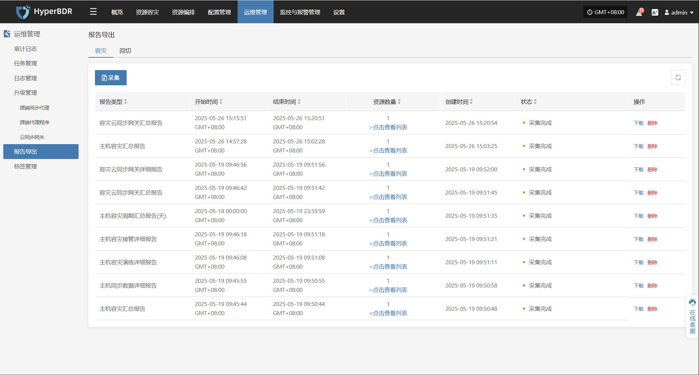
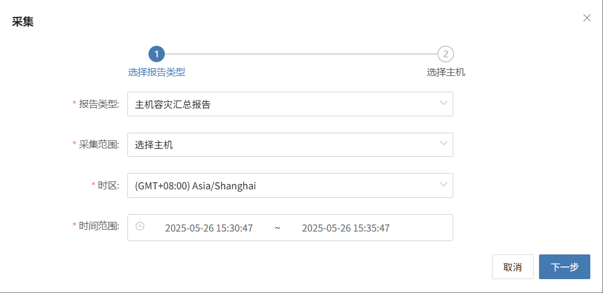
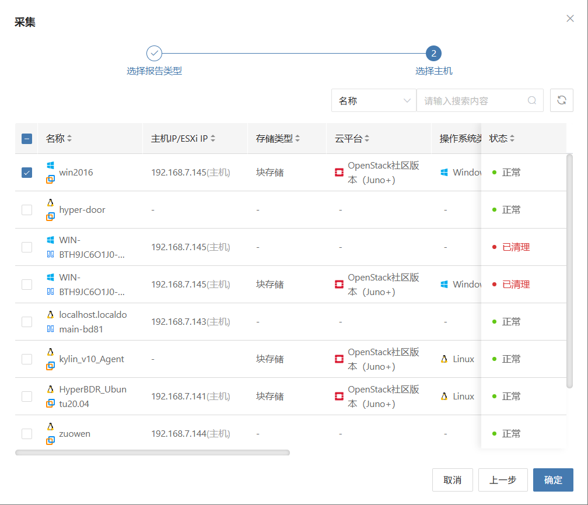
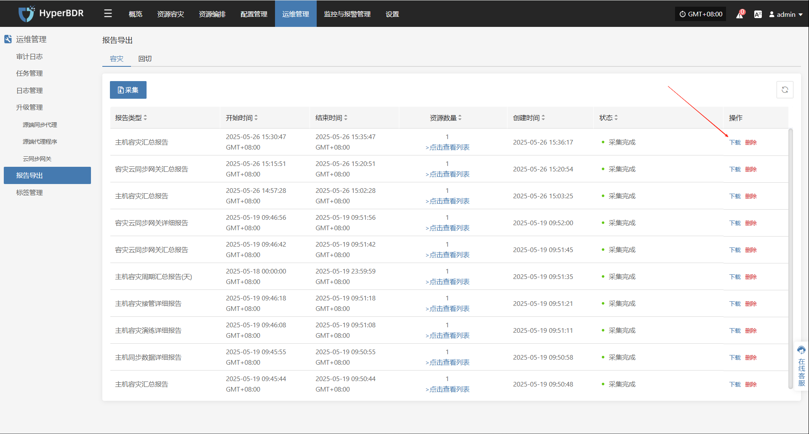

# **报告导出**

目前，用户可通过HyperBDR 控制台导出**容灾**与**回切**过程中的各类系统运行与管理报告。该功能有助于用户对平台运行状态进行**定期分析、归档留存**，满足运维审计、问题追踪与管理评估等多种使用场景。

## **支持的报告类型与说明**

| **报告类型**      | **报告说明**                                          |
| ------------- | ------------------------------------------------- |
| 主机容灾汇总报告      | 统计当前租户下已注册和已解除注册的所有主机的基本信息，包括同步次数、演练次数、接管次数、系统类型等 |
| 主机同步数据详细报告    | 统计当前租户下已注册和已解除注册的所有主机的同步任务详情                      |
| 主机容灾演练详细报告    | 统计当前租户下已注册和已解除注册的所有主机的演练任务详情                      |
| 主机容灾接管详细报告    | 统计当前租户下已注册和已解除注册的所有主机的接管任务详情                      |
| 主机容灾周期汇总报告(天) | 统计当前租户下已注册和已解除注册的                                 |
| 容灾云同步网关汇总报告   | 统计当前租户下所有云同步网关的基本信息                               |
| 容灾云同步网关详细报告   | 统计当前租户下所有云同步网关的详细信息，精确到每块磁盘                       |

## **导出报告说明**

### **主机容灾汇总报告**

| **字段名**                        | **含义说明**                                 |
| ------------------------------ | ---------------------------------------- |
| **Host Name**                  | 主机名称，标识该容灾主机的名称。                         |
| **Host IP**                    | 主机的 IP 地址，用于网络识别与通信。                     |
| **Step**                       | 容灾注册流程当前所处的步骤编号。                         |
| **Status**                     | 当前任务或操作的状态，如已注册。                         |
| **Host Status**                | 主机状态，表示主机是否已成功注册到系统中。                    |
| **Storage Type**               | 存储类型，如块存储（Block Storage）或对象存储等。          |
| **Cloud Type**                 | 所属云平台类型与版本，如 OpenStack Community（Juno+）。 |
| **OS Type**                    | 操作系统类型，如 Windows 或 Linux。                |
| **Sync Count (Succeeded)**     | 成功完成的数据同步任务次数。                           |
| **Sync Count (Failed)**        | 失败的数据同步任务次数。                             |
| **Drill Count (Succeeded)**    | 成功完成的容灾演练次数。                             |
| **Drill Count (Failed)**       | 失败的容灾演练次数。                               |
| **Takeover Count (Succeeded)** | 成功完成的容灾接管任务次数。                           |
| **Takeover Count (Failed)**    | 失败的容灾接管任务次数。                             |
| **Sync Size (GB)**             | 累计同步数据的总量，单位为 GB。                        |
| **Region**                     | 云平台中的区域标识。                               |
| **Zone**                       | 所属的可用区标识（若有）。                            |
| **Flavors**                    | 主机的计算规格（vCPU/内存/磁盘），如 8核 16GB 内存 50GB磁盘。 |
| **Disk Count**                 | 主机上磁盘的数量。                                |
| **Capacity (GB)**              | 主机磁盘的总容量（单位：GB）。                         |
| **Subnet**                     | 主机所属的子网名称。                               |
| **Network**                    | 主机所连接的网络名称。                              |
| **Security Group**             | 应用于该主机的安全组策略名称。                          |
| **Fixed IP**                   | 主机的固定内网 IP 地址（未分配）。                      |
| **Public IP**                  | 主机的公网 IP 地址（未分配）。                        |

### **容灾云同步网关详细报告**

| **字段名**                        | **含义说明**                     |
| ------------------------------ | ---------------------------- |
| **Created Time**               | 云同步网关资源的创建时间。                |
| **Cloud Sync Gateway Name**    | 云同步网关的名称，用于标识该同步组件。          |
| **Cloud Account Name**         | 云账户名称，表明该网关绑定的是哪个云平台账户。      |
| **Block Storage Platform**     | 云平台类型，如 OpenStack、VMware 等。  |
| **User Name**                  | 创建该网关资源的租户或用户名称。             |
| **Status**                     | 当前云同步网关的工作状态（如“已启用”、“已停用”等）。 |
| **Health Status**              | 网关运行状态是否健康，如“正常”、“异常”等。      |
| **Data Transfer Protocol**     | 用于传输数据的协议，如 TCP、iSCSI 等。     |
| **Region**                     | 所在的云平台区域（Region）。            |
| **Zone**                       | 所在的云平台可用区（Zone）。             |
| **Image**                      | 云网关所用的镜像名称。                  |
| **Flavor**                     | 云网关所用的资源配置模板（如 CPU/内存/磁盘规格）。 |
| **System Disk Type**           | 系统盘类型，如 SSD、SATA 等。          |
| **System Disk Size**           | 系统盘容量，单位为 GB。                |
| **Backup Volume**              | 当前已挂载或使用的备份卷名称。              |
| **Max Backup Volume**          | 云同步网关支持的最大备份卷数量或容量。          |
| **Volume Name**                | 当前正在使用的卷名称。                  |
| **Pool Uuid**                  | 卷所挂载存储池的唯一标识。                |
| **Pool Name**                  | 卷所挂载存储池的名称。                  |
| **Total Volume Capacity (GB)** | 当前卷的总容量，单位为 GB。              |
| **Usage Status**               | 资源使用状态，例如“使用中”或“空闲”。         |
| **Allocation Status**          | 分配状态，指该网关是否已被主机关联。           |
| **Allocation Host**            | 若已分配，表示网关当前挂载或绑定的主机名称。       |

### **容灾云同步网关汇总报告**

| 字段名称                           | 说明                                  |
| ------------------------------ | ----------------------------------- |
| **Created Time**               | 记录创建的时间，格式为“年/月/日 时:分:秒”            |
| **Cloud Sync Gateway Name**    | 云同步网关名称，通常为网关的IP地址或唯一标识             |
| **Cloud Account Name**         | 云账户名称，用于标识具体的云服务账号                  |
| **Block Storage Platform**     | 使用的块存储平台类型，如OpenStack、AWS等          |
| **User Name**                  | 操作该同步网关的用户名                         |
| **Status**                     | 当前状态，如“Creation Success”表示创建成功      |
| **Health Status**              | 健康状态，如“Online”表示网关在线                |
| **Data Transfer Protocol**     | 数据传输协议，如“S3Block”表示基于S3协议的块存储传输     |
| **Region**                     | 云平台的区域名称，用于标识地理或逻辑区域                |
| **Zone**                       | 云平台的可用区，具体的分区信息，如果无则为“-”            |
| **Image**                      | 使用的镜像名称及唯一标识，通常是操作系统镜像              |
| **Flavor**                     | 虚拟机规格，如CPU、内存和磁盘大小的组合               |
| **System Disk Type**           | 系统盘类型，如默认卷类型“DEFAULT\_VOLUME\_TYPE” |
| **System Disk Size**           | 系统盘大小，单位为GB                         |
| **Backup Volume**              | 当前备份卷数量                             |
| **Max Backup Volume**          | 最大允许的备份卷数量                          |
| **Total Volume Capacity (GB)** | 所有卷的总容量，单位为GB                       |
| **Hosts Count**                | 关联的主机数量                             |

### **主机容灾周期汇总报告(天)**

| 字段名称                      | 说明                                 |
| ------------------------- | ---------------------------------- |
| Serial Number             | 序号，记录条目的唯一编号                       |
| Period                    | 时间周期，表示统计的起止时间段                    |
| Host Name                 | 主机名称                               |
| Host IP                   | 主机IP地址                             |
| Step                      | 当前步骤或阶段编号                          |
| Status                    | 状态，如“Registered”表示已注册              |
| Host Status               | 主机状态，如“Registered”表示主机已注册          |
| Storage Type              | 存储类型，如“Block Storage”表示块存储         |
| Cloud Type                | 云平台类型，如“OpenStackCommunity(Juno+)” |
| OS Type                   | 操作系统类型，如Windows、Linux等             |
| Sync Count(Succeeded)     | 同步成功次数                             |
| Sync Count(Failed)        | 同步失败次数                             |
| Drill Count(Succeeded)    | 演练成功次数                             |
| Drill Count(Failed)       | 演练失败次数                             |
| Takeover Count(Succeeded) | 接管成功次数                             |
| Takeover Count(Failed)    | 接管失败次数                             |
| Sync Size(GB)             | 同步数据大小，单位为GB                       |
| Region                    | 云平台区域名称                            |
| Zone                      | 可用区，如无则为“-”                        |
| Flavors                   | 虚拟机规格，如CPU核数、内存和磁盘组合               |
| Disk Count                | 磁盘数量                               |
| Capacity(GB)              | 存储容量，单位为GB                         |
| Subnet                    | 子网名称                               |
| Network                   | 网络名称                               |
| Security Group            | 安全组名称                              |
| Fixed IP                  | 固定IP地址，如果无则为“-”                    |
| Public IP                 | 公网IP地址，如果无则为“-”                    |

### **主机容灾接管详细报告**

| 字段名称           | 说明                               |
| -------------- | -------------------------------- |
| Host Name      | 主机名称                             |
| Host IP        | 主机IP地址                           |
| Status         | 当前状态，例如任务是否完成、异常等                |
| Task Status    | 任务状态，具体反映接管任务的进展情况               |
| Start Time     | 任务开始时间                           |
| End Time       | 任务结束时间                           |
| Execution Time | 任务执行耗时                           |
| Storage Type   | 存储类型，如块存储（Block Storage）         |
| Cloud Type     | 云平台类型，如OpenStackCommunity(Juno+) |
| Region         | 云平台区域名称                          |
| Zone           | 可用区名称，如无则用“-”表示                  |
| Flavors        | 虚拟机规格描述，如CPU、内存和磁盘组合             |
| Disk Count     | 磁盘数量                             |
| Capacity(GB)   | 存储容量，单位为GB                       |
| Network        | 网络名称                             |
| Subnet         | 子网名称                             |
| Security Group | 安全组名称                            |
| Fixed IP       | 固定IP地址，如无则用“-”表示                 |
| Public IP      | 公网IP地址，如无则用“-”表示                 |
| Task Details   | 任务详情，描述任务执行的具体信息和结果              |

### **主机容灾演练详细报告**

| 字段名称           | 说明                               |
| -------------- | -------------------------------- |
| Host Name      | 主机名称                             |
| Host IP        | 主机IP地址                           |
| Status         | 当前状态，例如任务是否完成、异常等                |
| Task Status    | 任务状态，具体反映演练任务的进展情况               |
| Start Time     | 任务开始时间                           |
| End Time       | 任务结束时间                           |
| Execution Time | 任务执行耗时                           |
| Storage Type   | 存储类型，如块存储（Block Storage）         |
| Cloud Type     | 云平台类型，如OpenStackCommunity(Juno+) |
| Region         | 云平台区域名称                          |
| Zone           | 可用区名称，如无则用“-”表示                  |
| Flavors        | 虚拟机规格描述，如CPU、内存和磁盘组合             |
| Disk Count     | 磁盘数量                             |
| Capacity(GB)   | 存储容量，单位为GB                       |
| Network        | 网络名称                             |
| Subnet         | 子网名称                             |
| Security Group | 安全组名称                            |
| Fixed IP       | 固定IP地址，如无则用“-”表示                 |
| Public IP      | 公网IP地址，如无则用“-”表示                 |
| Task Details   | 任务详情，描述任务执行的具体信息和结果              |

### **主机同步数据详细报告**

| 字段名称                      | 说明                  |
| ------------------------- | ------------------- |
| Host Name                 | 主机名称                |
| Host IP                   | 主机IP地址              |
| Status                    | 当前状态，例如任务是否完成、异常等   |
| Task Status               | 任务状态，具体反映同步任务的进展情况  |
| Start Time                | 任务开始时间              |
| End Time                  | 任务结束时间              |
| Execution Time            | 任务执行耗时              |
| Capacity Size(GB)         | 同步容量大小，单位为GB        |
| Sync Mode                 | 同步模式，如全量同步、增量同步等    |
| Average Sync Rate(Mbps/s) | 平均同步速率，单位为兆比特每秒     |
| Synced Size(GB)           | 已同步的数据大小，单位为GB      |
| Task Details              | 任务详情，描述任务执行的具体信息和结果 |

## **报告导出示例**

> 注意：如果需要下载不同租户的主机信息报表，需要不同租户所属的用户登录控制台进行操作。

### **收集报表**

* 点击【运维管理】>【报告导出】，进入报表页面。

* 点击采集后，根据需要选择报表类型、范围、时区、时间范围、主机等信息后，提交收集

### **下载报告**

选择需要下载的报表行，点击【下载】，即可下载对应报告

