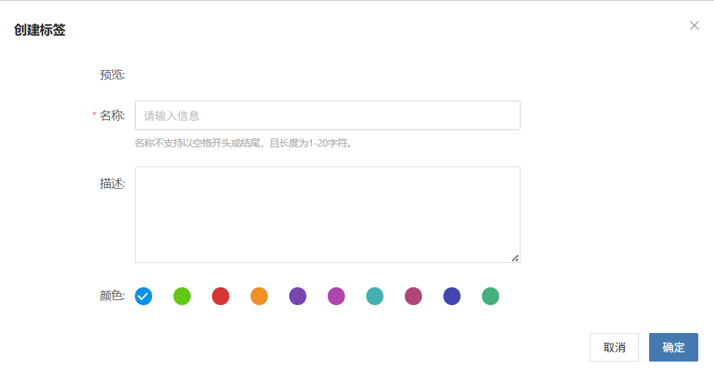
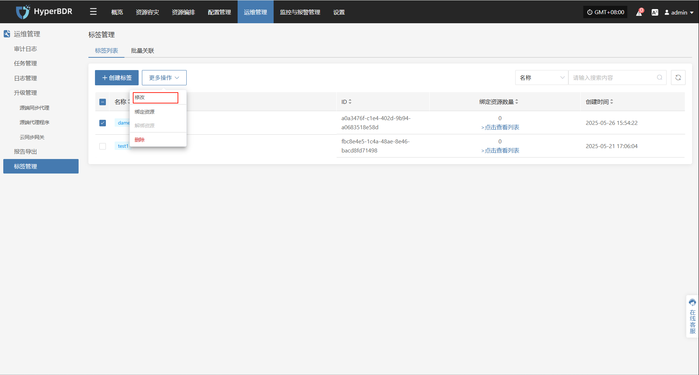
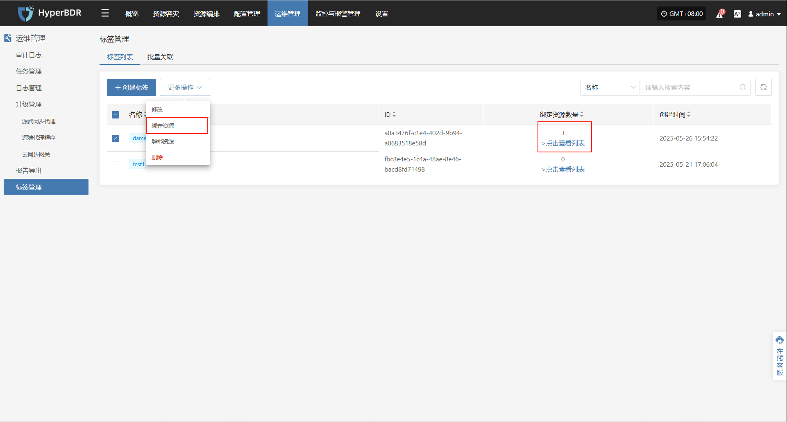
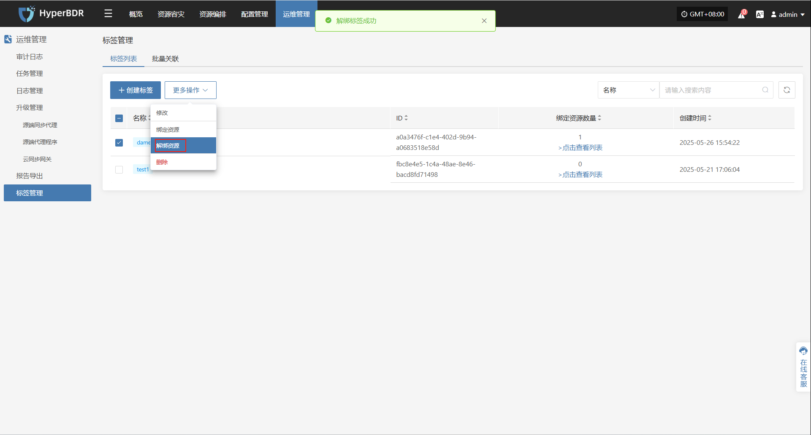
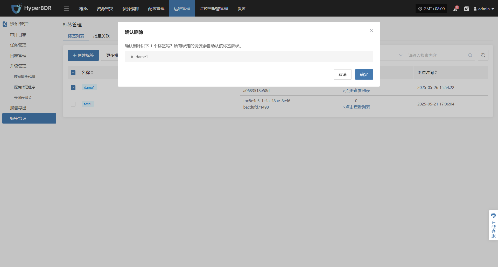
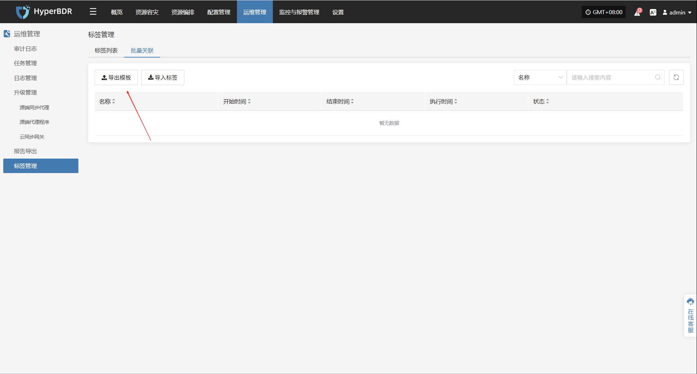
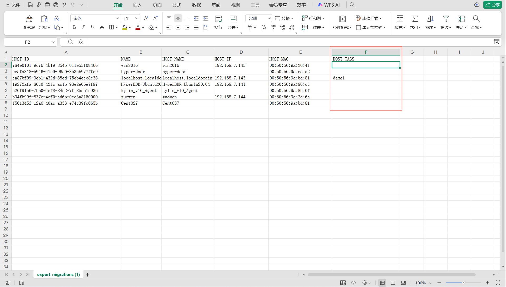
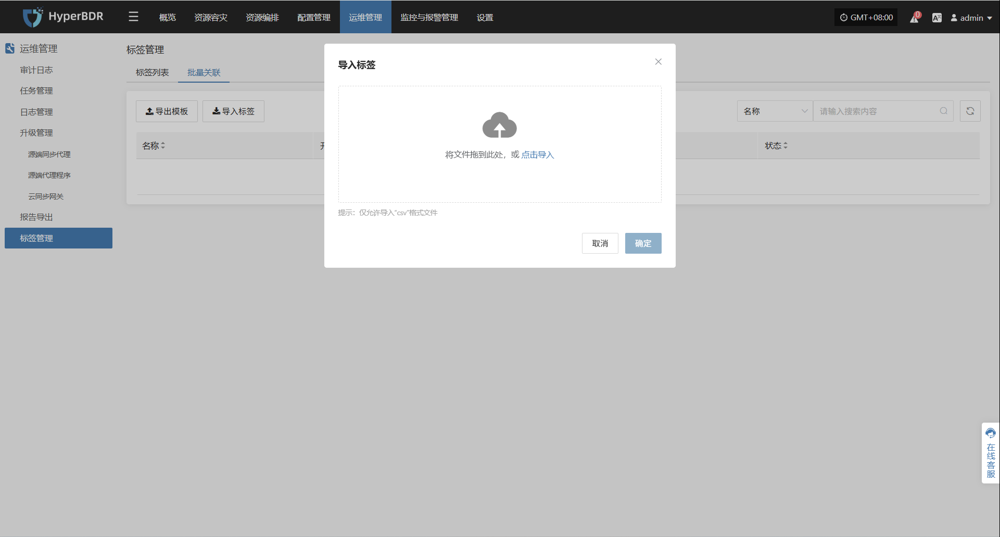
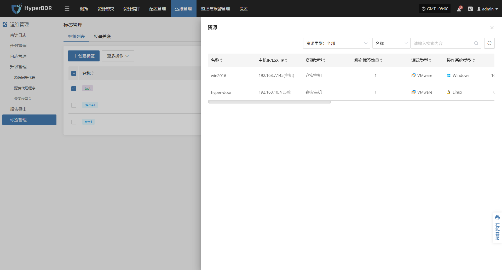

# **标签管理**

标签管理模块用于对系统中的资源或对象进行分类和标识，方便用户对资源进行快速检索、归类和管理，提高管理效率。

## **标签列表**

通过顶部菜单【运维管理】 > 【标签管理】> 【标签列表】进入标签管理页面。

### **创建标签**

点击创建标签开始创建标签，根据弹出框内容添加标签名称、描述、标签颜色

### **更多操作**

#### **修改**

选中已创建标签后，点击【更多操作】>【修改】，可以修改对应名称、描述、标签颜色

#### **绑定资源**

选中已创建标签后，点击【更多操作】>【绑定资源】，绑定对应主机资源

通过点击【点击查看列表】，查看已绑定的主机资源

#### **解绑资源**

选中已创建标签后，点击【更多操作】>【解绑资源】，解绑对应主机资源

#### **删除**

选中已创建标签后，点击【更多操作】>【删除】，删除对应标签，且所有绑定的资源会自动从该标签解绑

## **批量管理**

通过顶部菜单【运维管理】 > 【标签管理】> 【批量关联】进入批量关联页面。

### **导出模板**

点击页面导出模板后，开始下载模板为xml格式

##### **导出模板说明**

| 字段名称      | 说明                      |
| --------- | ----------------------- |
| HOST ID   | 主机唯一标识符，通常为UUID格式       |
| NAME      | 主机名称，用户自定义或系统分配的名称      |
| HOST NAME | 主机的网络主机名（Hostname）      |
| HOST IP   | 主机的IP地址                 |
| HOST MAC  | 主机的MAC地址，唯一标识网络接口       |
| HOST TAGS | 主机标签，用于分类、分组或标识主机的自定义信息 |

##### **填写模板**

在导出的模板中将HOST TAGS字段填写标签名称后保存

### **导入标签**

点击页面导入标签后，根据提示框进行拖入或上传文件开始导入模板

完成导入后，会自动创建标签并将资源加入对应标签

