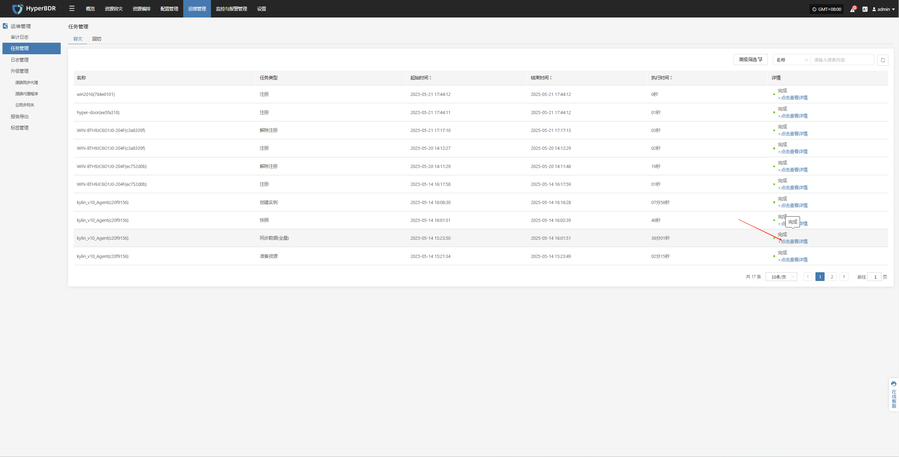
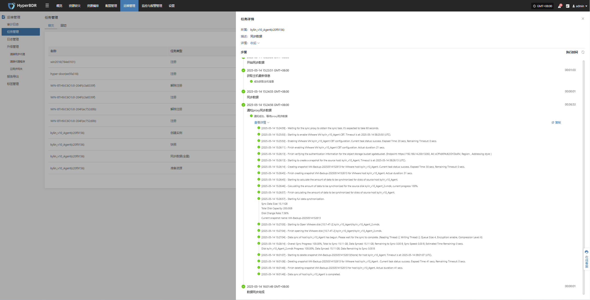

# 任务管理

在 HyperBDR 系统中，用户可通过导航栏进入“运行管理 > 任务管理”模块，查看平台中**容灾**和**回切**所有操作任务的执行情况，涵盖注册、快照、复制等关键任务类型。系统支持任务状态的实时查询、筛选与详情查看，帮助用户全面掌握任务执行进度与结果。

## 页面功能

用户可通过顶部筛选条件进行快速查询，支持按以下字段过滤日志数据：

* **高级筛选：**

  * **任务类型**：选择与操作相关的资源类型（如虚拟机、用户资源等）

  * **任务状态**：可按关键字筛选特定操作事件

  * **任务名称**：输入关键字精确查找对应资源

  * **结束时间**：升序降序排序

### 任务管理说明

| 字段名称 | 描述                       |
| ---- | ------------------------ |
| 名称   | 显示执行任务所关联的主机或资源名称。       |
| 任务类型 | 展示任务的类型，如注册、快照、同步、创建副本等。 |
| 起始时间 | 任务的实际启动时间。               |
| 结束时间 | 任务完成或中断的时间。              |
| 执行时间 | 任务持续执行的时间。               |
| 详情   | 展示任务最终执行结果状态，支持点击查看任务详情。 |

> 注：点击“任务状态”字段中的状态信息链接，可跳转至任务详情页，查看完整日志与错误信息。

### 其他说明

* 页面支持分页功能，默认每页显示 10 条记录。用户可通过页面底部的筛选栏调整每页显示的记录数量或跳转至特定页码，以便快速定位所需信息。

* 任务日志用于记录系统在执行各类操作任务过程中的行为与结果，保留完整的操作历史，便于用户追踪与问题排查。

