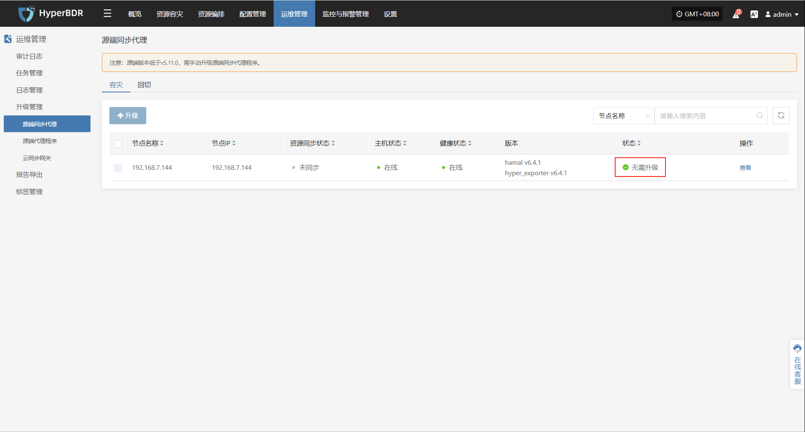
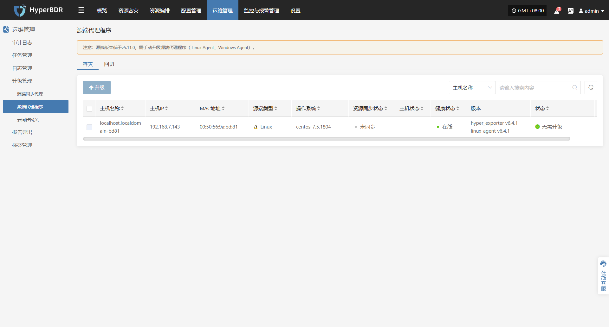
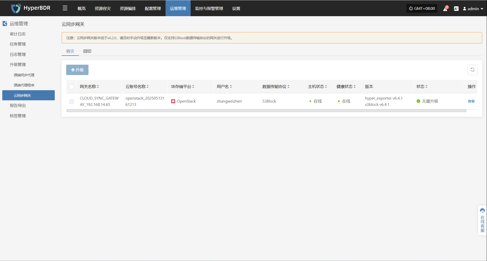
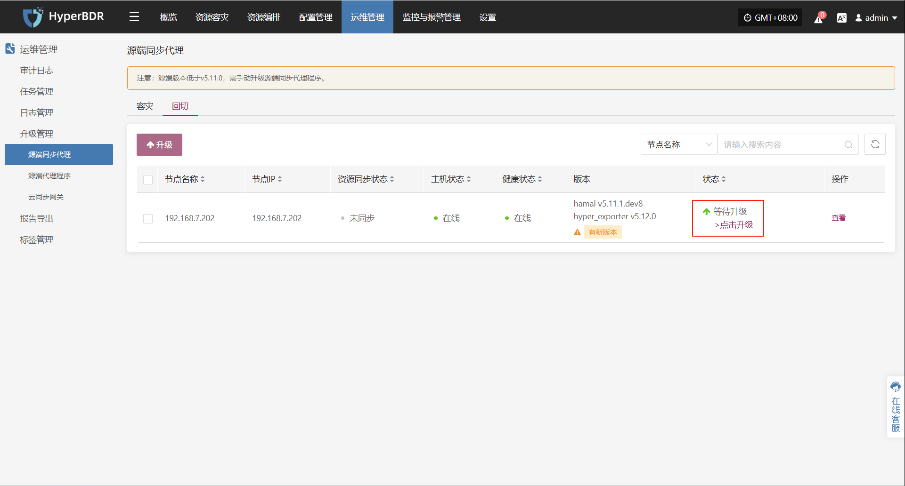
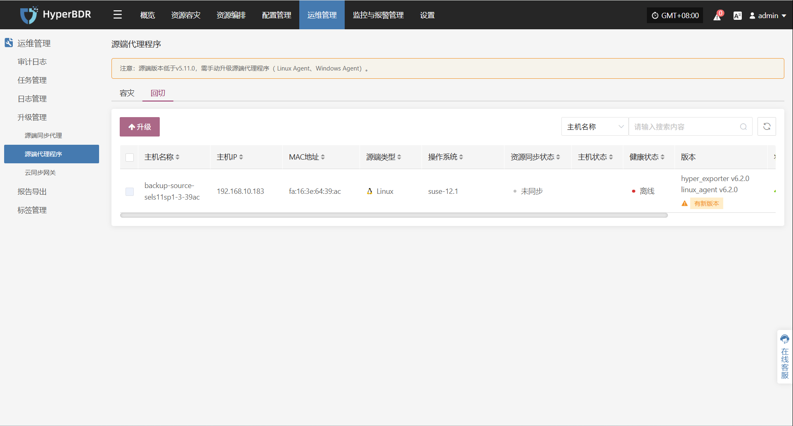
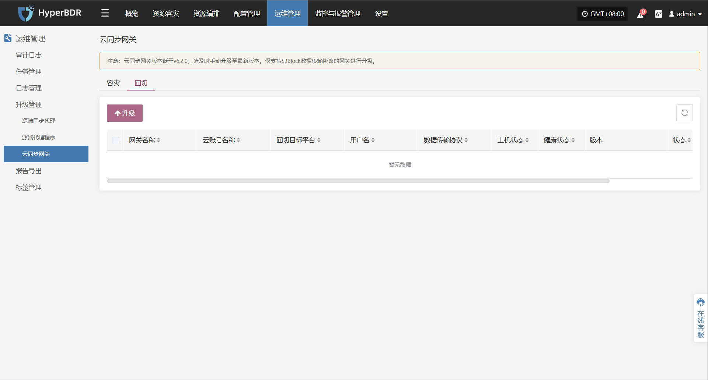

# **升级管理**

**升级管理**用于统一管理系统组件和代理程序的版本更新，确保各模块保持在受支持、稳定的版本状态。用户可通过平台界面查看当前版本信息，并按需执行在线升级操作。

## **升级准备**

在升级各功能组件（如同步代理、云同步网关等）之前，必须先完成控制台的版本升级。控制台作为系统管理核心，其版本需与其他组件保持兼容，以避免因版本不一致引发功能异常或升级失败。

### **获取安装包**

#### **在线方式：**

登录控制台安装的主机，使用本方式获取安装包。

```bash
# 获取最新的 HyperBDR 软件包 URL。
HYPERBDR_PACKAGE=$(curl -s -k https://install.oneprocloud.com/get_hyperbdr_latest/latest)
echo "HYPERBDR_PACKAGE: ${HYPERBDR_PACKAGE}"

# 获取相应的 MD5 文件 URL。
HYPERBDR_PACKAGE_MD5="${HYPERBDR_PACKAGE}.md5"
echo "HYPERBDR_PACKAGE_MD5: ${HYPERBDR_PACKAGE_MD5}"

# 使用字符串操作提取包名称。
HYPERBDR_PACKAGE_NAME="${HYPERBDR_PACKAGE##*/}"
echo "HYPERBDR_PACKAGE_NAME: ${HYPERBDR_PACKAGE_NAME}"

# 提取 MD5 文件名
HYPERBDR_PACKAGE_MD5_NAME="${HYPERBDR_PACKAGE_NAME}.md5"
echo "HYPERBDR_PACKAGE_MD5_NAME: ${HYPERBDR_PACKAGE_MD5_NAME}"

# 开始下载
curl -k -O "$HYPERBDR_PACKAGE"
curl -k -O "$HYPERBDR_PACKAGE_MD5"
```

#### **离线方式：**

> 如果已经通过在线方式获取安装包，请直接跳过该步骤。

如果安装主机无法直接访问互联网，您可以使用其他设备的浏览器访问以下地址获取安装包链接：

下载完成后使用Xftp等类似工具将安装包上传至控制台主机

```plain&#x20;text
https://install.oneprocloud.com/get_hyperbdr_latest
```

### **解压至指定目录**

使用下列命令将其解压至指定目录：

```plain&#x20;text
tar zxvf <更新包>.tar.gz -C /更新包解压后路径
```

### **执行升级**

执行升级命令，系统将自动加载更新内容至运行目录 `/opt/installer/production/venvs`：

```plain&#x20;text
/opt/installer/production/scripts/hmctl upgrade /<更新包解压路径>/installer/venvs
```

## **容灾**

### **源端同步代理(Sync Proxy)**

#### **升级执行**

在完成前置步骤（升级准备）后，系统将在该页面对应位置自动显示可升级的代理组件及相关提示，用户可按提示完成升级流程。

**运维管理 > 升级管理 > 容灾 > 源端同步代理**



### **源端代理程序(Agent)**

#### **升级执行**

在完成前置步骤（升级准备）后，系统将在该页面对应位置自动显示可升级的代理组件及相关提示，用户可按提示完成升级流程。

**运维管理 > 升级管理 > 容灾 > 源端代理程序**



### **云同步网关(Cloud Sync Gateway)**

#### **升级执行**

在完成前置步骤（升级准备）后，系统将在该页面对应位置自动显示可升级的代理组件及相关提示，用户可按提示完成升级流程。

**运维管理 > 升级管理 > 容灾 > 云同步网关**




## **回切**

### **源端同步代理(Sync Proxy)**

#### **升级执行**

在完成前置步骤（升级准备）后，系统将在该页面对应位置自动显示可升级的代理组件及相关提示，用户可按提示完成升级流程。

**运维管理 > 升级管理 > 回切 > 源端同步代理**



### **源端代理程序(Agent)**

#### **升级执行**

在完成前置步骤（升级准备）后，系统将在该页面对应位置自动显示可升级的代理组件及相关提示，用户可按提示完成升级流程。

**运维管理 > 升级管理 > 回切 > 源端代理程序**



### **云同步网关(Cloud Sync Gateway)**

#### **升级执行**

在完成前置步骤（升级准备）后，系统将在该页面对应位置自动显示可升级的代理组件及相关提示，用户可按提示完成升级流程。

**运维管理 > 升级管理 > 回切 > 云同步网关**



