# **资源组容灾**

“资源组容灾”功能支持以资源组为单位进行统一的容灾配置和调度，适用于需对多个相关资源（如主机、网络、存储）统一进行保护和恢复的场景。
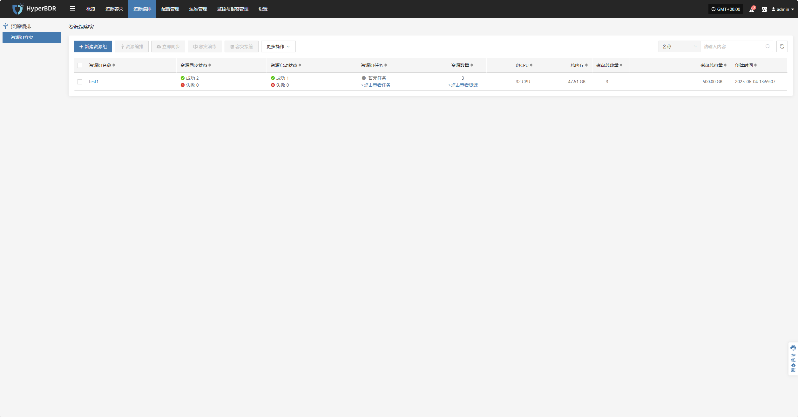

## **新建资源组**

点击“新建资源组”，可对已完成资源配置的主机进行统一编组，以便后续进行集中调度与容灾管理。

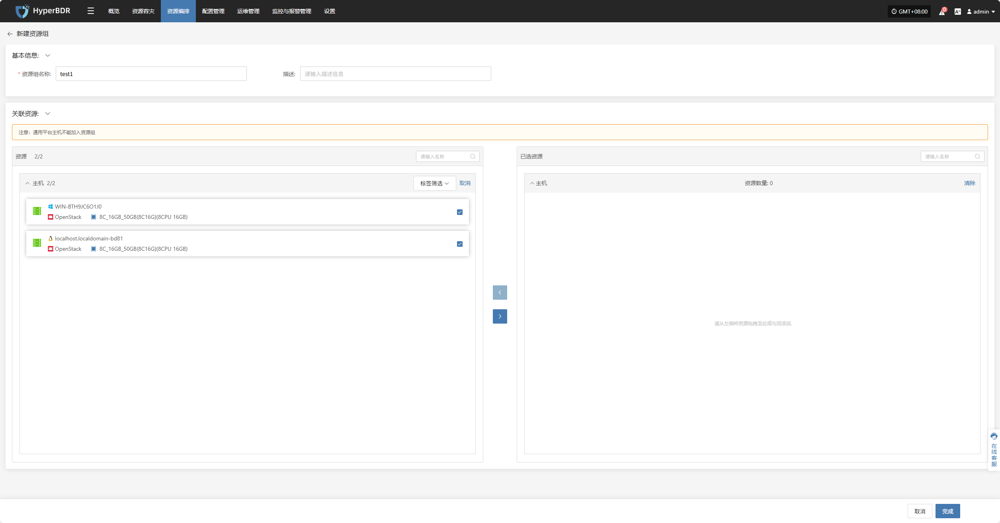

根据实际需求设置资源组名称，填写备注，选择对应的主机资源，完成配置后点击“完成”以创建资源组。

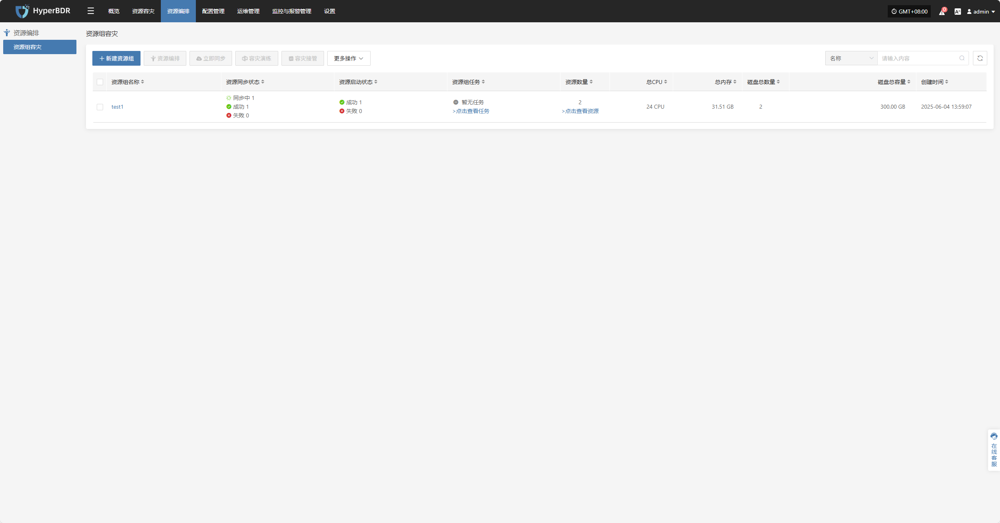

## **资源编排**

资源编排可以预先定义主机、网络和存储等资源的启动顺序及依赖关系，确保在灾难发生时，系统能够按正确流程迅速且有序地恢复运行。

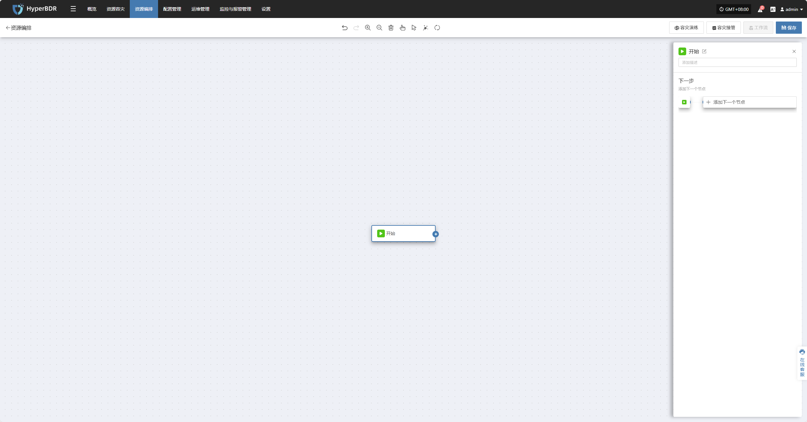

通过点击“开始”按钮，进入添加节点流程，完成节点的配置与添加。

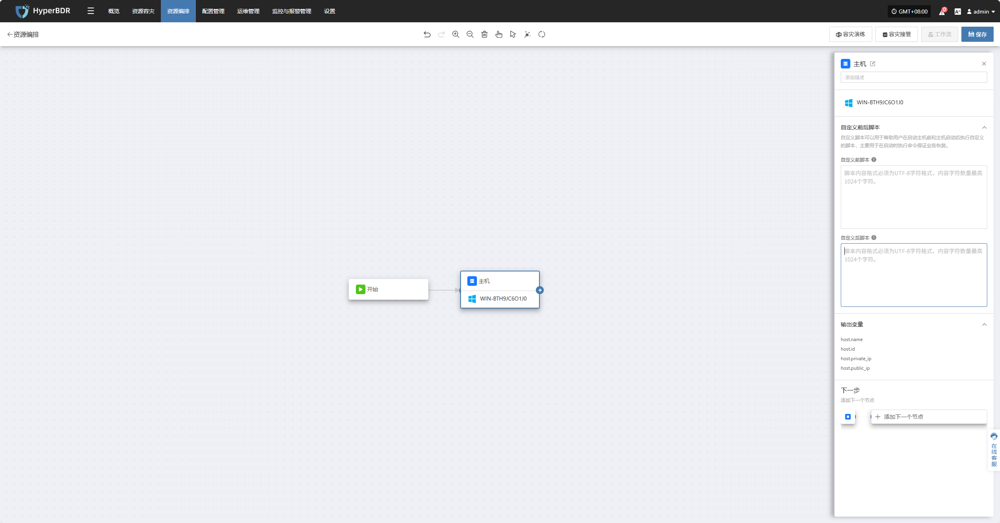

点击“添加主机节点”后，右侧栏将显示对应设置选项，用户可在此添加启动前脚本、启动后脚本及其他相关配置后以此添加下一节点或并行节点。

## **立即同步**

选中需要容灾的资源组后，点击页&#x9762;**“立即同步”**，开始根据实际业务需求进行同步数据

> 注意：默认情况下，首次同步是全量同步，随后的同步则为增量同步。如果需要在已开始增量同步后重新进行全量同步以确保数据完整性，可以选择强制进行全量同步。

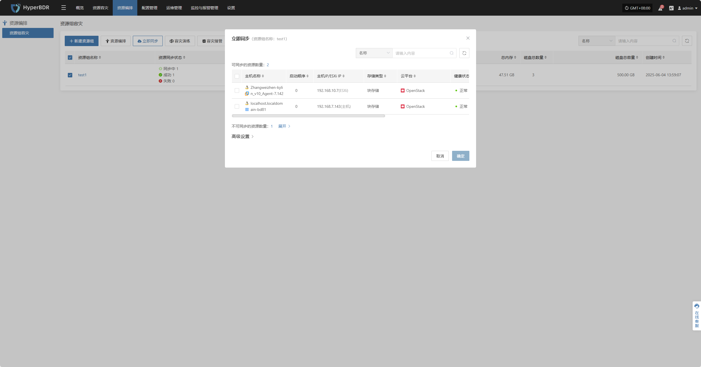

### **高级设置**

可在“高级设置”中启用**强制全量同步**选项，以确保所有数据均重新进行完整同步。

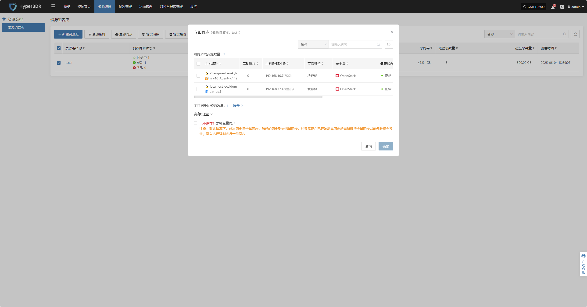

## **容灾演练**

选择对应的资源组，点击“容灾演练”，选择主机并选择恢复时间点，一键恢复容灾主机到目标环境。

> 注意：仅完成同步的主机才能参与容灾演练，未同步数据的主机将被排除在演练任务之外。状态为不可启动。

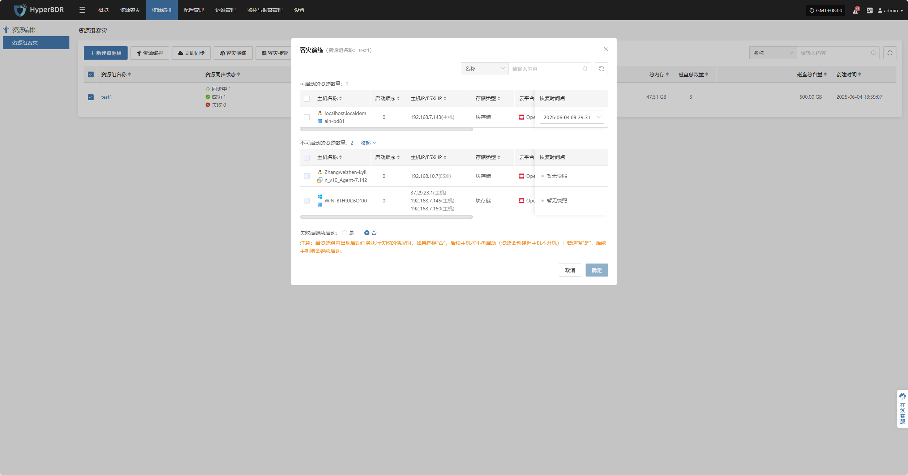

系统会根据预先配置的资源编排（计算、存储、网络等）自动化创建或启动目标端实例，等待启动完成，即可登录到目标平台进行验证配置及业务演练。

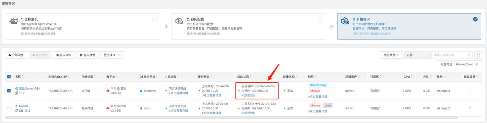

恢复完成后，检查应用服务、数据库、负载均衡等是否正常工作。

## **容灾接管**

选择对应资源组，点&#x51FB;**“容灾接管”**&#x529F;能，按照需求选择恢复快照时间点，并点击确定

> 注意：仅完成同步的主机才能参与容灾接管，未同步数据的主机将被排除在接管任务之外。状态为不可启动。

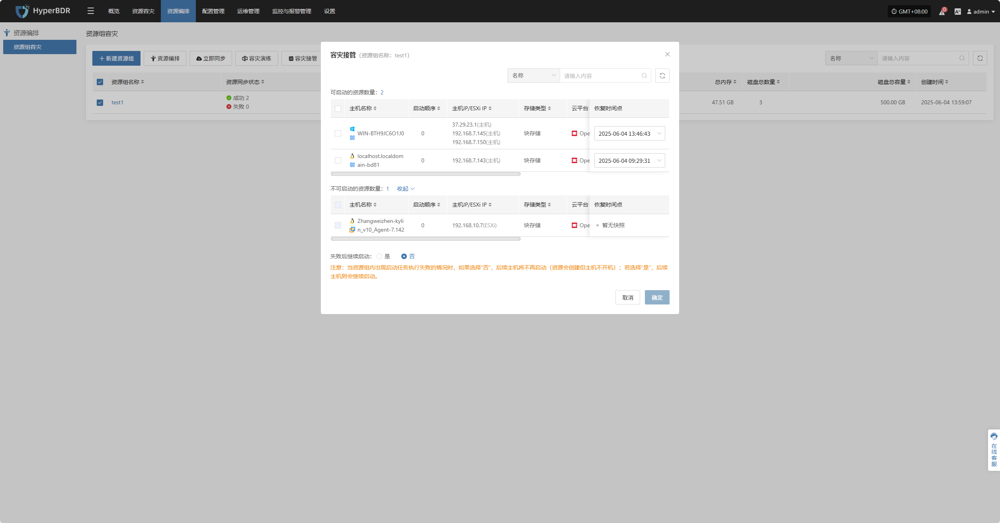

系统会根据预先配置的资源编排（计算、存储、网络等）自动化创建或启动目标端实例，等待启动完成，即可登录到目标平台进行验证配置及业务接管。

此时主机容灾流程完成，业务启动后，检查数据库版本、应用服务配置、依赖服务（如缓存、消息队列）是否正常。

## **更多操作**

### **基本信息**

点击“基本信息”，可查看资源组的名称、备注等信息。

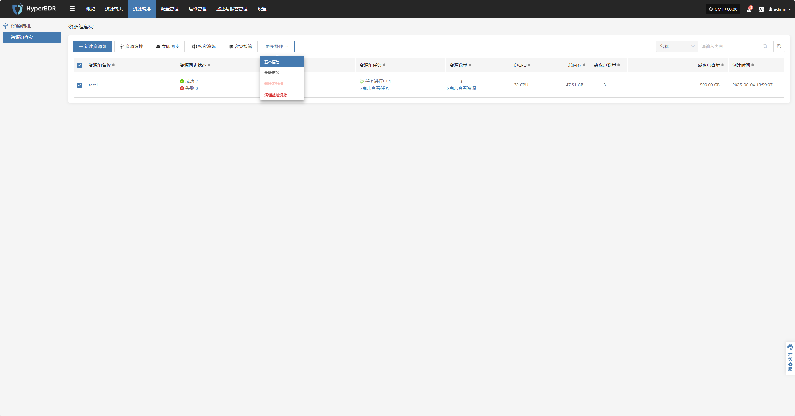

### **关联资源**

点击“关联资源”，可管理该资源组内的主机资源，支持新增或移除主机。

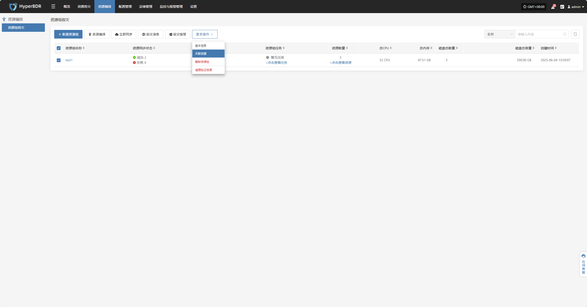

点击资源数量内对应主机资源右侧“x号”可对该资源组主机进行移除操作

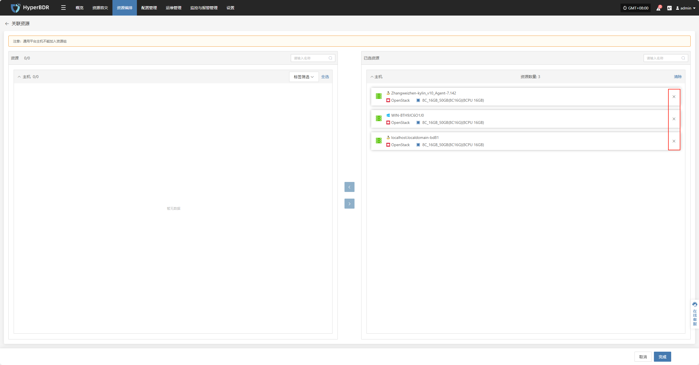

选择需要添加的主机后，点击确认即可将其加入资源组。

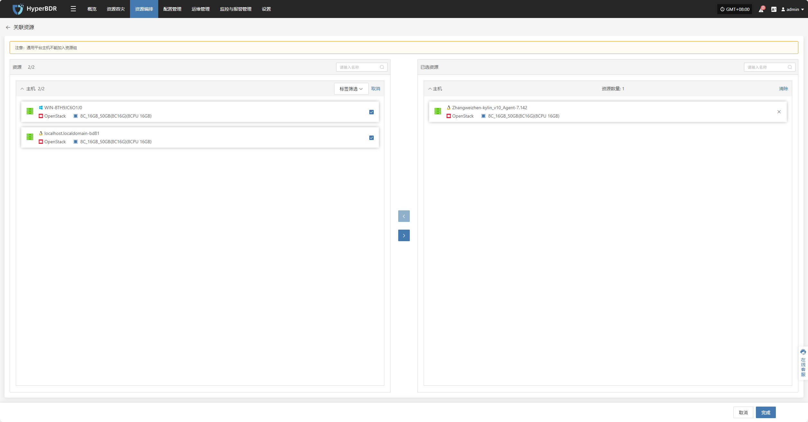

### **删除资源组**

> 注意：该操作仅删除资源组，资源组中的资源将会保留。

### **清理验证资源**

> 注意：该操作只会清理云上已启动的资源。

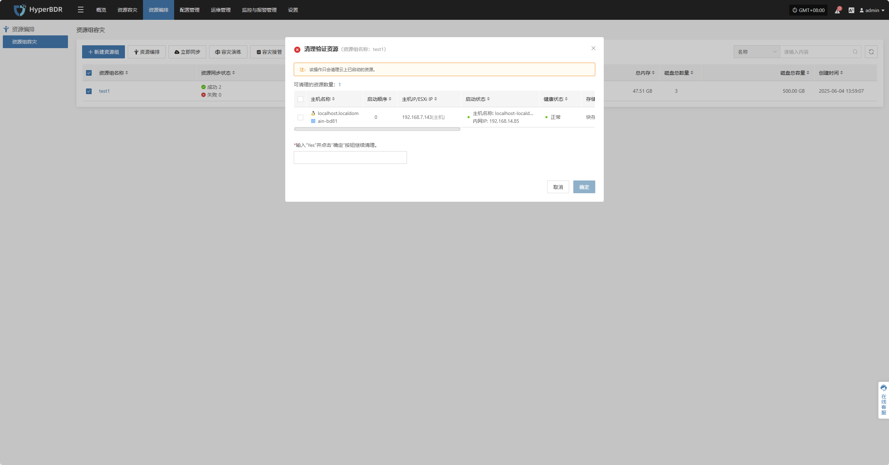

