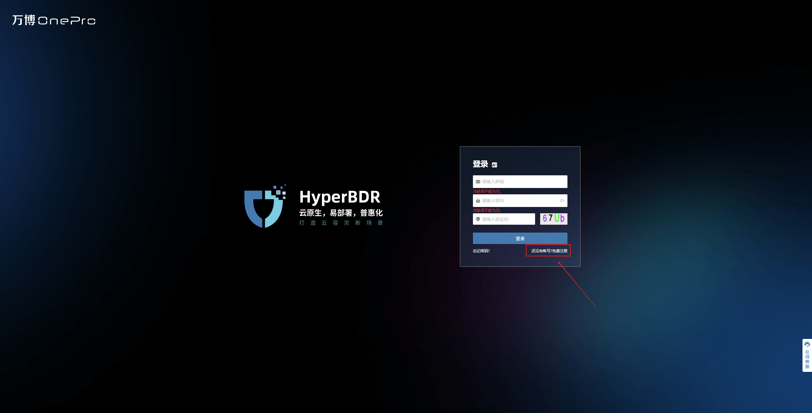
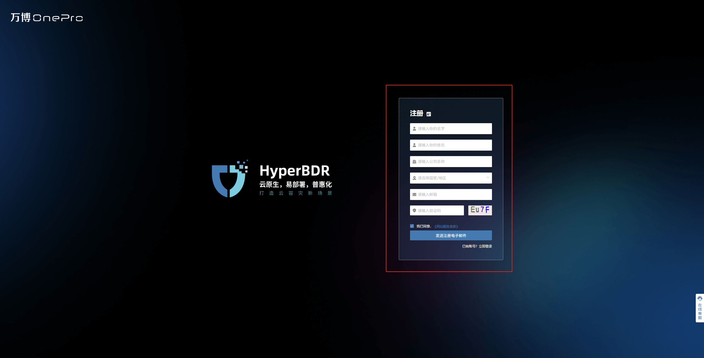
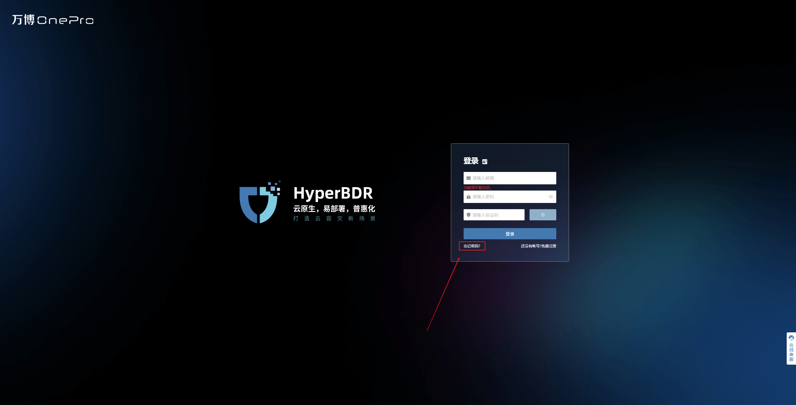

# **注册**

注册功能用于为新用户创建平台账户，以便后续登录、使用和接收系统通知。用户在注册过程中需填写必要的身份信息和联系方式，平台将通过设置的验证方式完成用户身份校验，保障账户安全。

## **开始注册**

### **访问注册入口**

打开登录页面，点&#x51FB;**“还没有帐号?免费注册”**&#x6309;钮进入账户注册界面。

### **填写注册信息**

输入所需信息，包括：名称、姓氏、公司名称、国家/地区、邮箱等鉴权信息

> 邮箱地址必须为真实可用邮箱，以接收系统验证码与通知

### **提交注册申请**

鉴权信息填写完毕后，点&#x51FB;**“发送注册电子邮件”，**&#x7CFB;统将发送邮箱验证

### **激活确认**

请前往注册邮箱查收验证邮件，点击邮件中&#x7684;**“注册激活”**&#x5B8C;成验证，即可激活账户且系统将跳转&#x81F3;**“设置密码”**&#x9875;面。

### **设置密码**

注册激活后用户需输入并确认新密码以完成账户激活并完成注册流程。

> 密码应符合平台密码复杂度要求，建议包含大小写字母、数字及特殊字符，为保障账户安全，请妥善保管密码

输入密码后，现在即可使用该密码登录并安全访问平台，请前往登录页面进行登录。

## **忘记密码**

### **访问找回入口**

打开登录页面，点&#x51FB;**“忘记密码”**&#x6309;钮进入密码找回界面。

### **填写找回信息**

输入注册邮箱地址后，系统将发送密码重置邮件以开始重置流程。

### **提交重置申请**

鉴权信息填写完毕后，点&#x51FB;**“发送重置密码电子邮件”，**&#x7CFB;统将发送邮箱验证

### **重置确认**

请前往注册邮箱查收验证邮件，点击邮件中&#x7684;**“重置密码”**&#x5B8C;成验证，系统将跳转&#x81F3;**“设置密码”**&#x9875;面。

### **设置密码**

输入密码后，即可使用该密码登录并安全访问平台，请前往登录页面进行登录。

> 密码应符合平台密码复杂度要求，建议包含大小写字母、数字及特殊字符，为保障账户安全，请妥善保管密码

