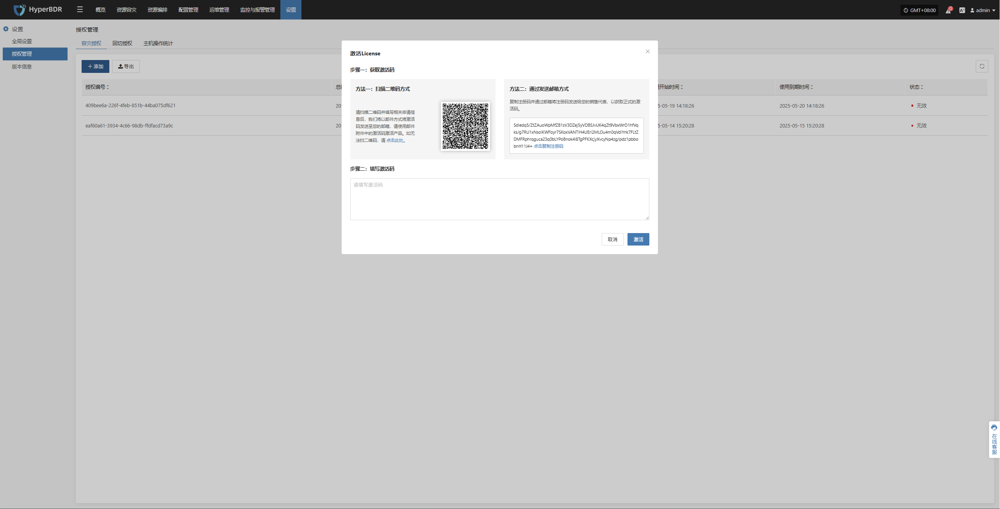
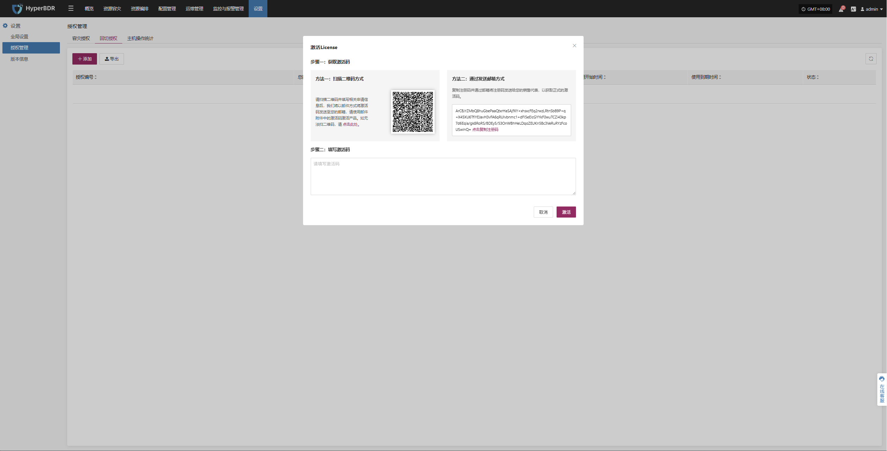

# **授权管理**
## **容灾授权**

容灾授权用于控制平台中各类资源在容灾功能中的使用权限，确保用户在执行灾难恢复、主机接管、数据恢复等操作时具备相应的授权许可。

### **添加授权**

进入 **设置 > 授权管理 > 容灾授权** 页面，点击 **“添加”** 按钮，根据系统提示填写必要信息，并获取有效的授权码以完成授权配置。

## **回切授权**

回切授权用于在执行故障接管（Failover）后，将业务从目标站点平滑迁回源站点（回切）时的授权管理。系统需具备有效的回切授权码，以确保数据回迁及业务恢复过程中的合法性与完整性。

### **添加授权**

在 **设置 > 授权管理 > 容灾授权** 页面，点击 **“回切授权”**，根据提示输入并激活授权码，即可启用回切功能。

## **主机操作统计**

该页面展示当前平台内所有已接入主机的基本信息与操作状态，帮助运维人员掌握主机的生命周期、授权使用情况及关键操作历史。

### **导出操作记录**

在 **设置 > 授权管理 > 主机操作统计** 页面，点击 **“导出”**，即可导出主机的基本信息与操作状态。

