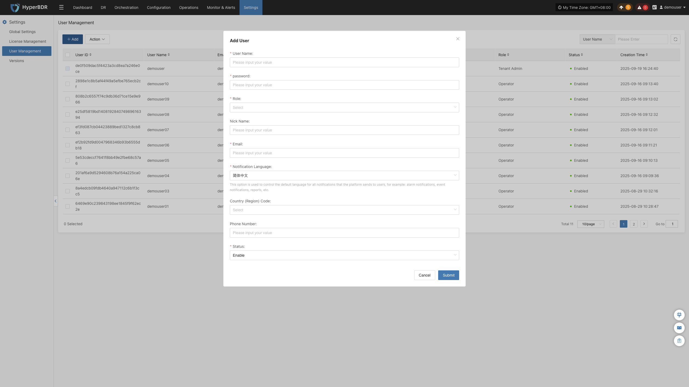
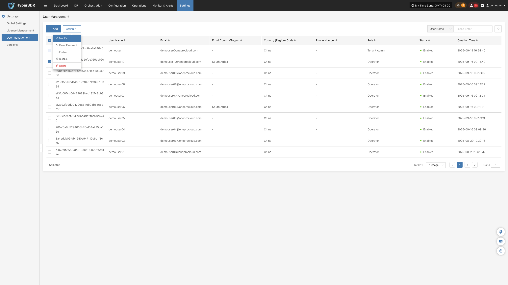
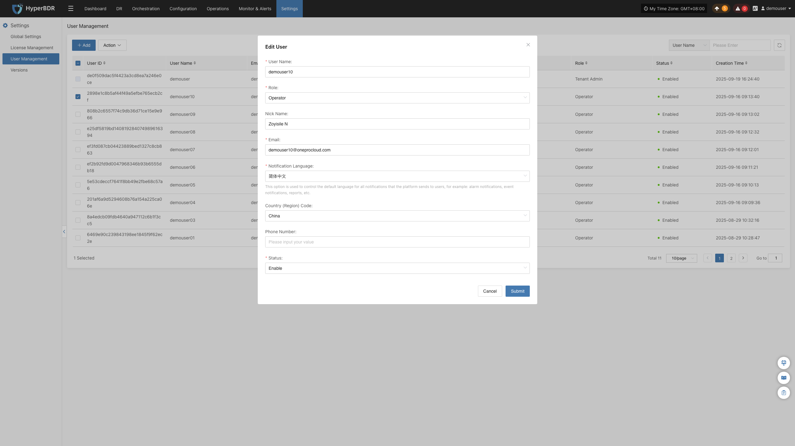
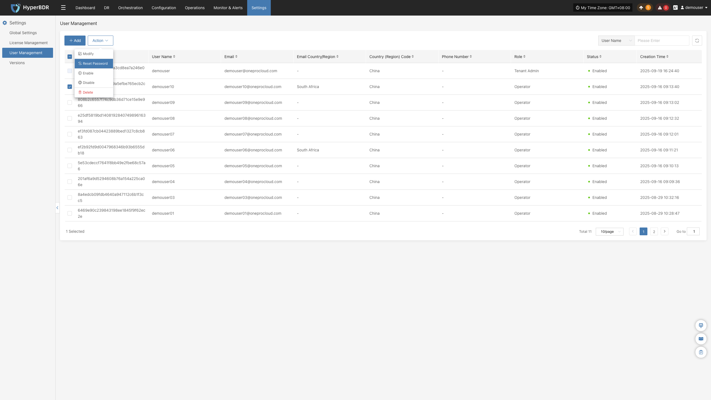
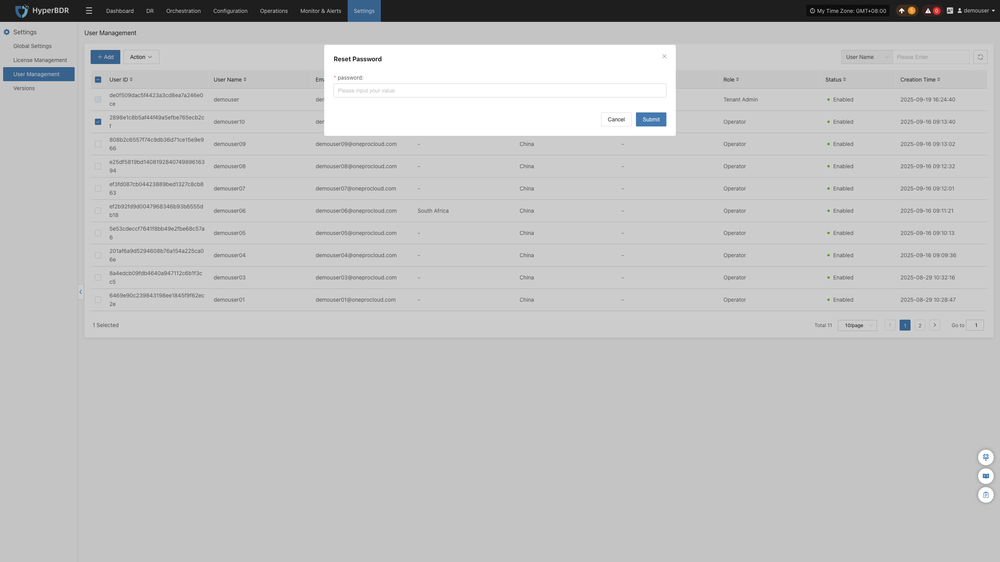
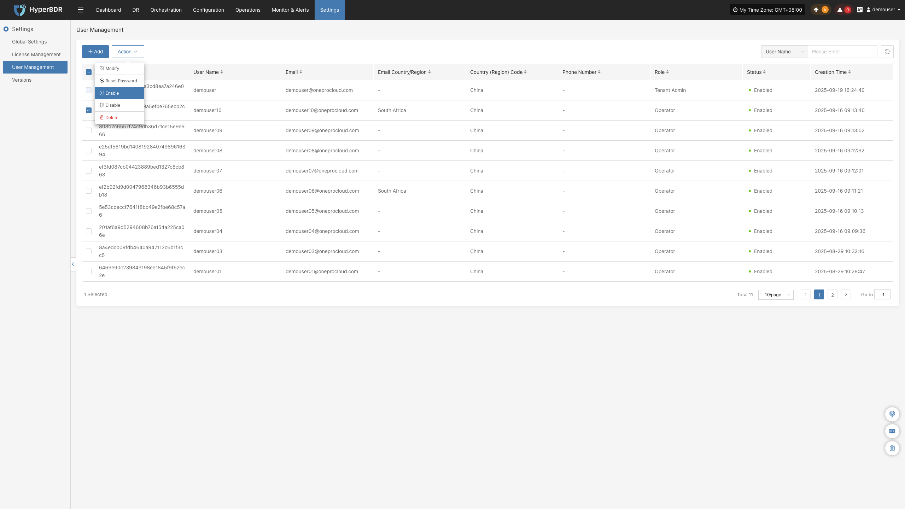
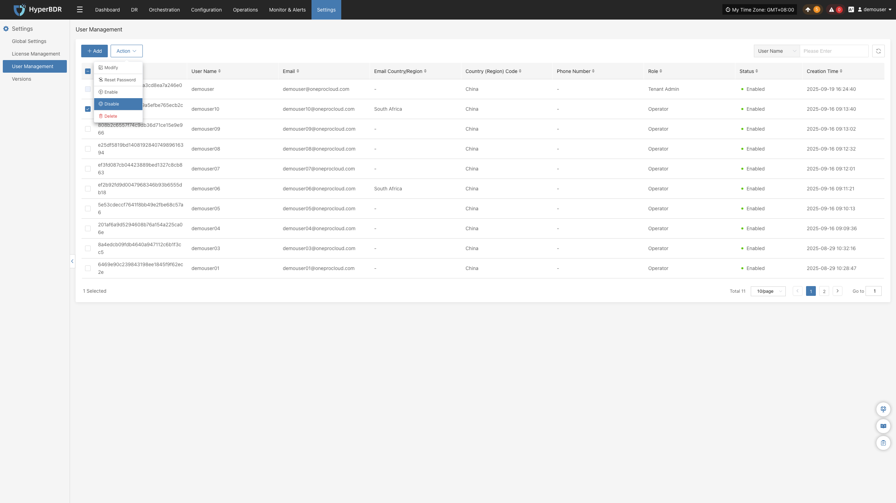
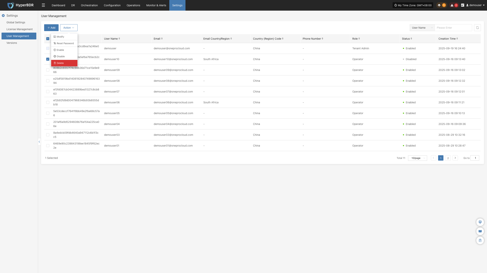
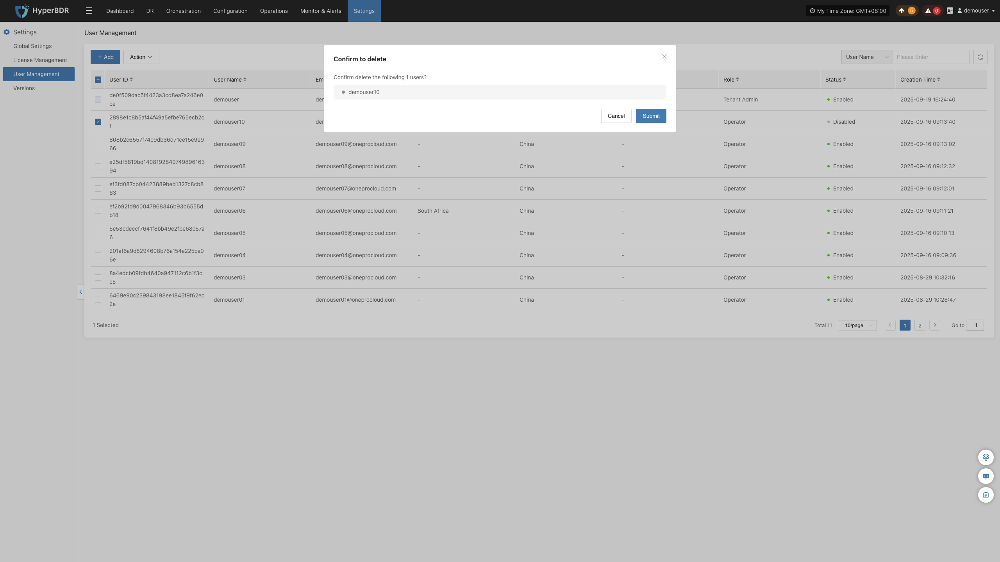

# 用户管理

用于租户账号全生命周期管控的核心模块，支持新增系统账号、分配角色权限、查看账号信息、批量管理用户、检索筛选账号等能力，实现多操作人员分级分权管理，保障备份平台操作安全。

- **用户列表字段说明**

列表中每条用户记录包含以下字段，含义如下：

| **字段名称**           | **说明**                                                     |
| ---------------------- | ------------------------------------------------------------ |
| 用户 ID                | 系统自动生成唯一标识，不可修改，用于后台区分账号             |
| 用户名                 | 登录系统的账号名称，登录必填凭证                             |
| 邮箱                   | 用户绑定联系邮箱，用于密码找回、告警邮件推送                 |
| 邮箱国家 / 地区        | 邮箱归属区域标识，如南非，无特殊地区则显示 “\-”              |
| 用户手机国家 \(区\) 码 | 手机号归属国家代码，默认中国                                 |
| 用户手机号             | 绑定联系手机，用于账号安全验证                               |
| 角色                   | 账号权限等级，分为三类： 租户管理员：全平台最高权限； 配置用户：仅备份业务操作权限； 只读用户：仅查看全平台数据，无任何编辑操作权限 |
| 状态                   | 账号登录状态，绿色圆点 = 已启用（可正常登录）；禁用后账号无法登录 |
| 创建时间               | 账号创建精确时间戳                                           |

## **添加**

登录系统后导航至 **【设置】\-【用户管理】** 页面，点击页面顶部「\+ 添加」按钮，在新增用户表单内完整填写用户名、邮箱、地区、手机号、角色等必要信息，核对内容无误后提交保存，完成用户账号添加。

## 更多操作

选中相应的用户后，可执行包括修改、重置密码、启用、停用及删除在内的管理操作。

### 修改

选中对应用户行后点击【修改】按钮，系统将弹出用户编辑弹窗，管理员可在弹窗内对该已创建账号的邮箱、手机号、角色、账号状态等信息重新编辑与调整，保存后生效。

### 重置密码

选中目标用户并点击【重置密码】按钮，系统弹出密码修改窗口，输入新密码并确认后，原密码立即失效，需将新密码告知对应使用人员。

### 启用

选中目标用户，点击【启用】按钮，解除账号冻结限制，用户可正常登录系统，列表状态同步更新为绿色已启用标识。

### 禁用

选中目标用户，点击【禁用】按钮，冻结该账号登录权限，用户将无法登录系统，列表状态同步更新为已禁用标识。

### 删除

选中目标用户，点击【删除】按钮，该用户账号将被永久清除，账号相关登录信息、权限配置全部失效，删除操作不可恢复，执行前请确认该账号无未完成业务任务、无绑定关联资源。

