# Configure the VPN connection between Huawei Cloud and IDC

[[toc]]

## 1. Create for VPN connection of VPC network and subnets

::: tip
The VPC network on the cloud side is required not to overlap with the networks that need to be interconnected on the IDC side, including subnet networks.
:::

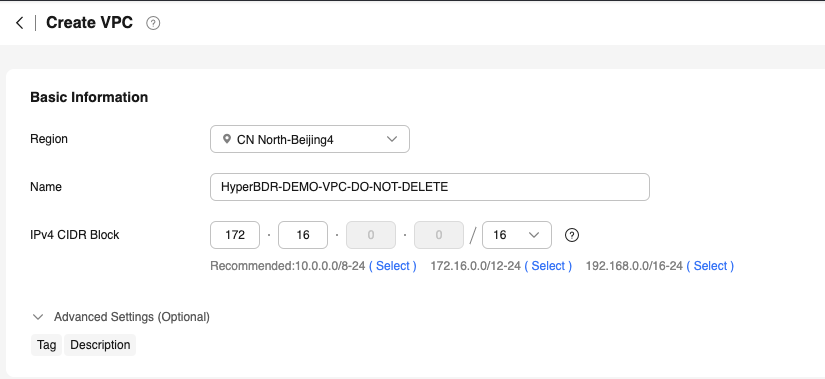

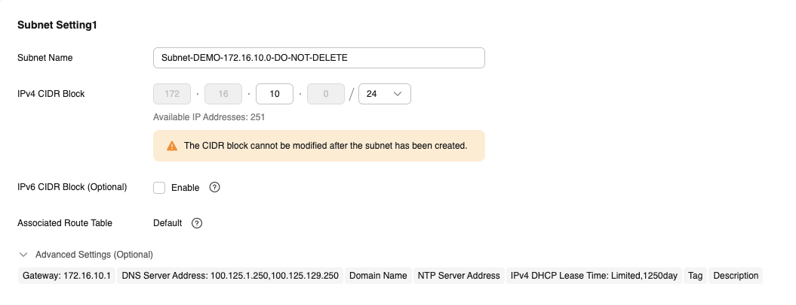

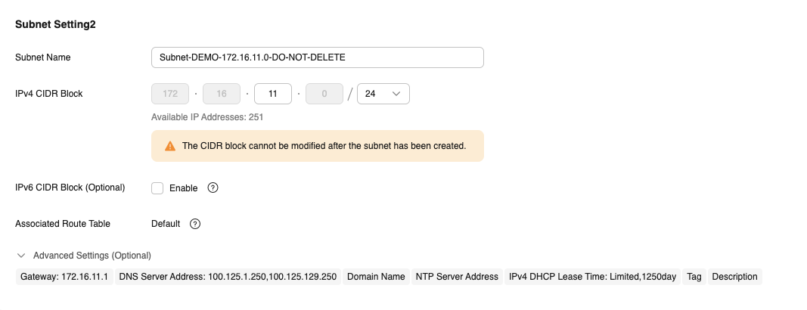

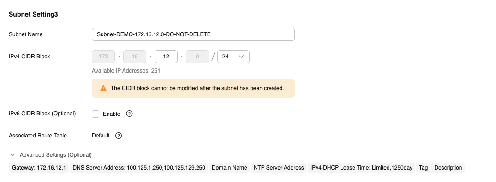

## 2. Create VPN Gateways

A VPN gateway is a virtual gateway of a VPN on Huawei Cloud. It establishes secure private connections with a customer gateway in your on-premises network or data center.

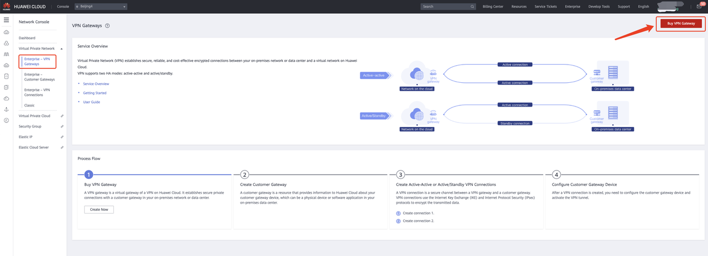

If you want to communicate with all subnets, the Local Subnet here needs to check all subnets.

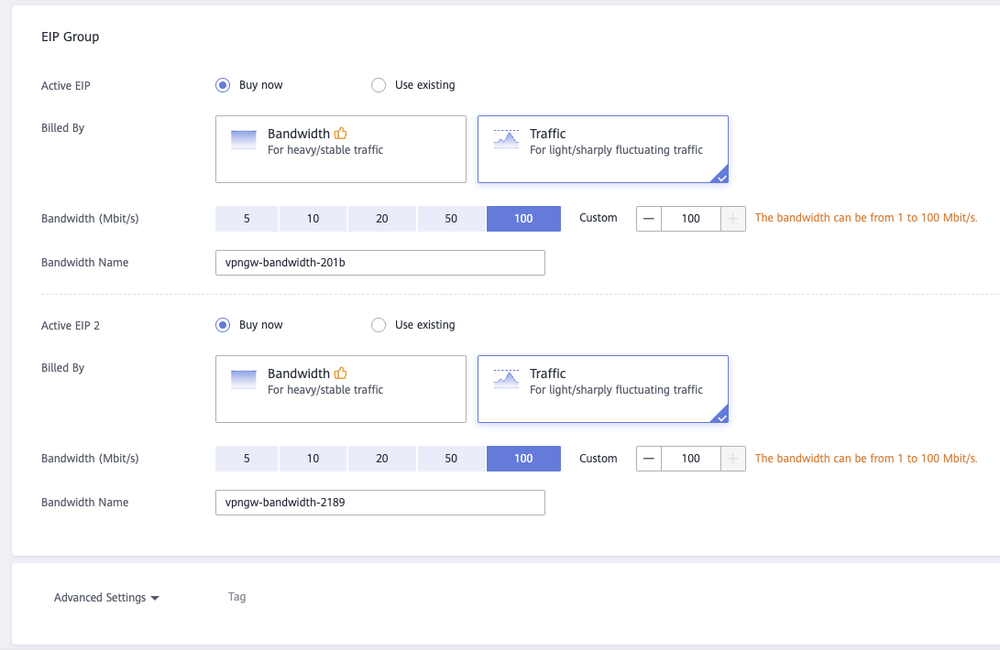

Wait for the VPN Gateway to be created and you can proceed to the next step.

## 3. Create Customer Gateway

A customer gateway is a resource that provides information to Huawei Cloud about your customer gateway device, which can be a physical device or software application in your on-premises data center.

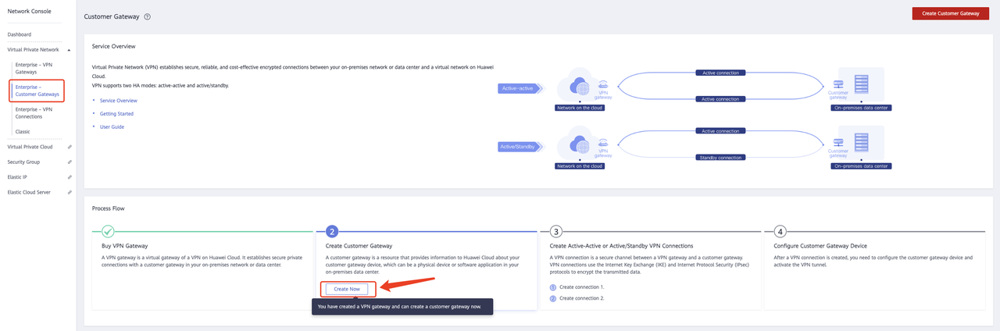

| Parameter  | Description                                   | Example Value           |
| ---------- | --------------------------------------------- | ----------------------- |
| Name       | Name a customer gateway.                      | cgw-001                 |
| Identifier | Enter the IP address of the customer gateway. | IP Address，22.xx.xx.22 |

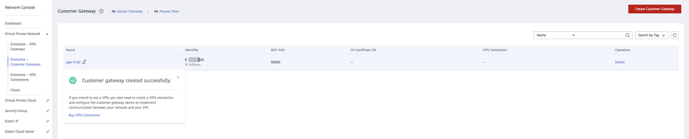

## 4. Create Active-Active or Active/Standby VPN Connections

A VPN connection is a secure channel between a VPN gateway and a customer gateway. VPN connections use the Internet Key Exchange (IKE) and Internet Protocol Security (IPsec) protocols to encrypt the transmitted data.

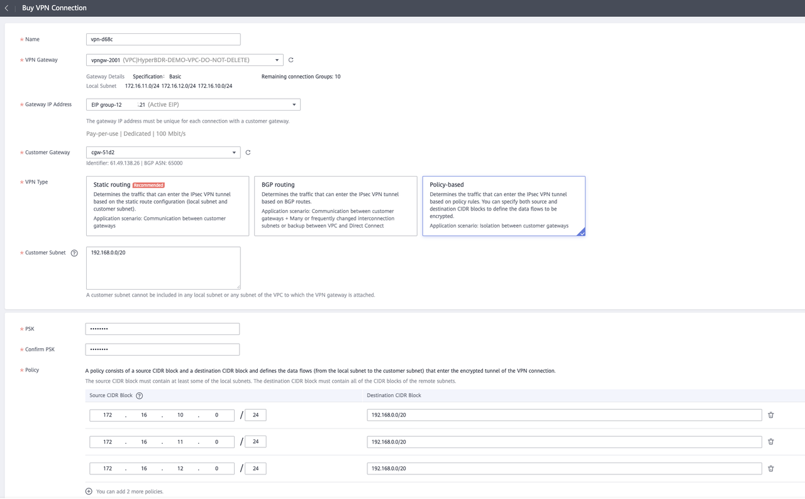

Policy here, if you want to put the entire VPC on the cloud can communicate, then you can fill in a VPC network 172.16.0.0/16 here, in addition to this place 172.16.0.0/16 configuration, then in the H3C test configuration also need to fill in this network.

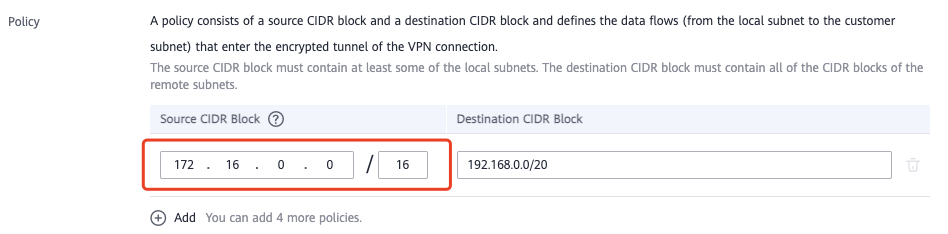

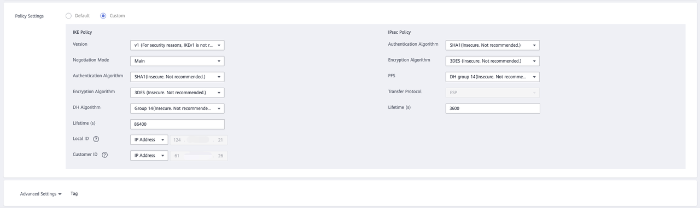

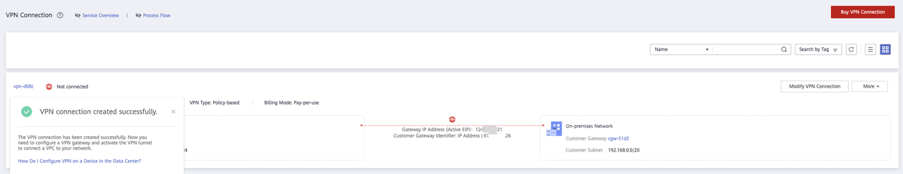

## 5. Configure Customer Gateway Device(H3C)

After a VPN connection is created, you need to configure the customer gateway device and activate the VPN tunnel.

### 5.1 Add virtual interfaces

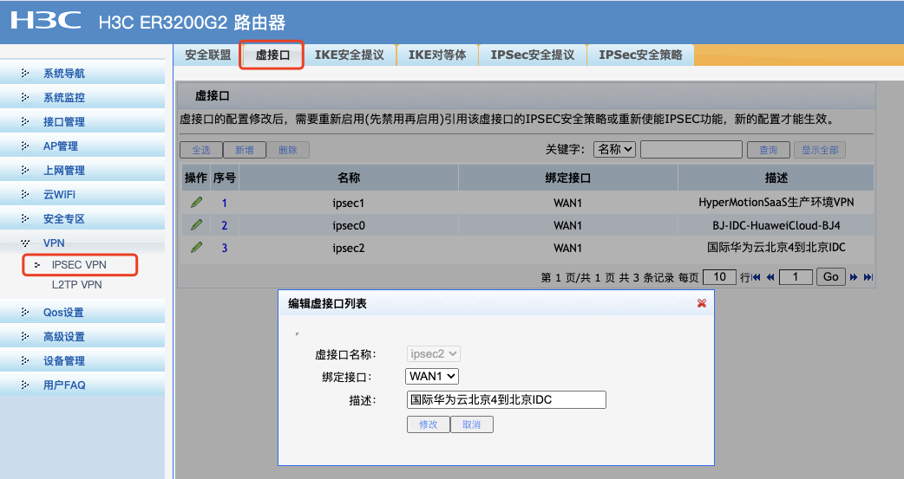

The IKE security proposal needs to be ensured to be consistent with the IKE protocol configuration on the Huawei Cloud side.

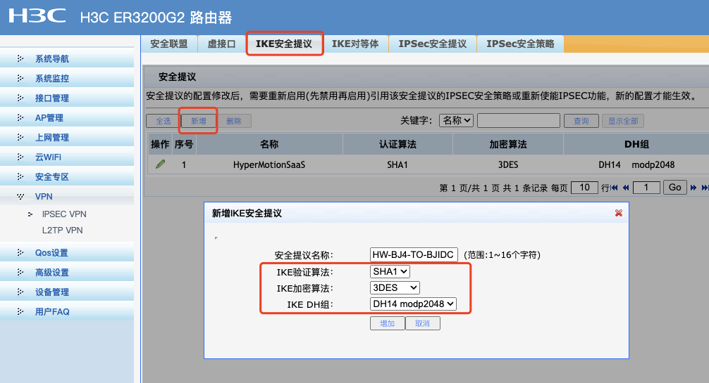

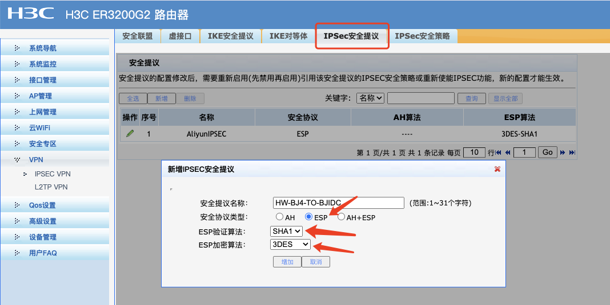

If you want to communicate with all the VPC networks on the cloud, you need to fill in the IP/mask of the subnet of the other end as 172.16.0.0/255.255.0.0. It must be consistent with the Policy configured on the Huawei cloud side, otherwise the connection cannot be established.

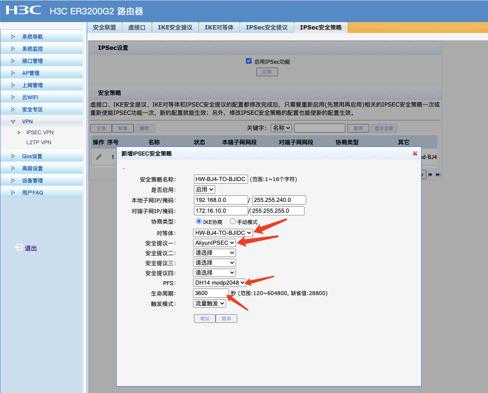

After the configuration is completed, if the data traffic situation of the connected VPN tunnel appears in the security alliance of the H3C platform, it indicates that the connection is normal.

Add the static route for accessing the cloud network. If this step is not added, even if the VPN connection is normal, the two sides cannot communicate with each other. No other configuration is required on the cloud side, and the route is added by default.

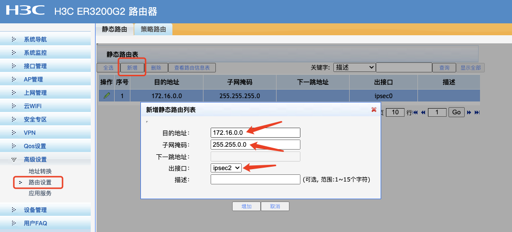

## 6. Detect the status of VPN connection

Back to the Huawei Cloud side. After the configuration is completed, the status also becomes normal.

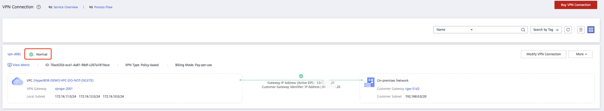

## 7. Verify the network communication situation

It is necessary to create an ECS virtual machine on the Huawei Cloud side. Select the VPC of this virtual machine as HyperBDR-DEMO-DO-NOT-DELETE, and select the subnet as the subnet connected to the cloud.
Then conduct a network access test through the machines at both ends.
