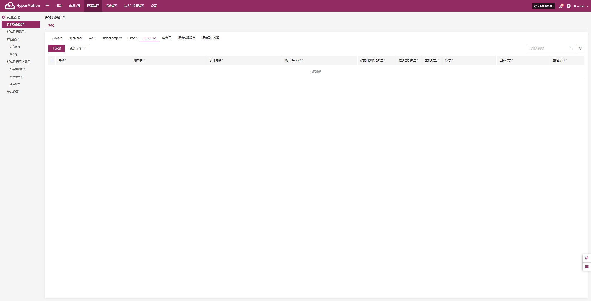
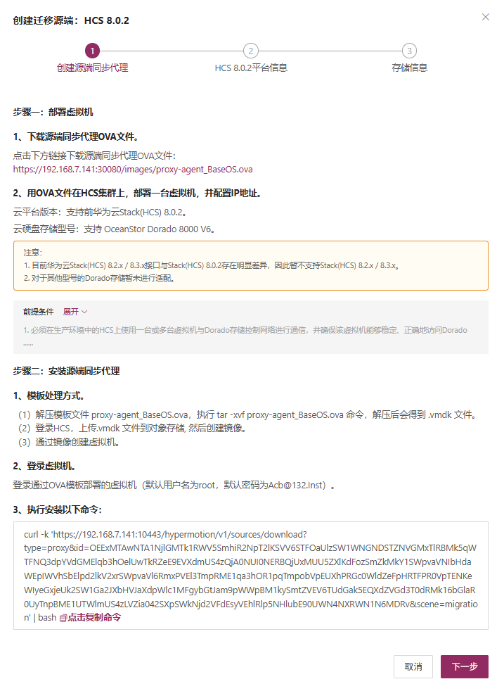
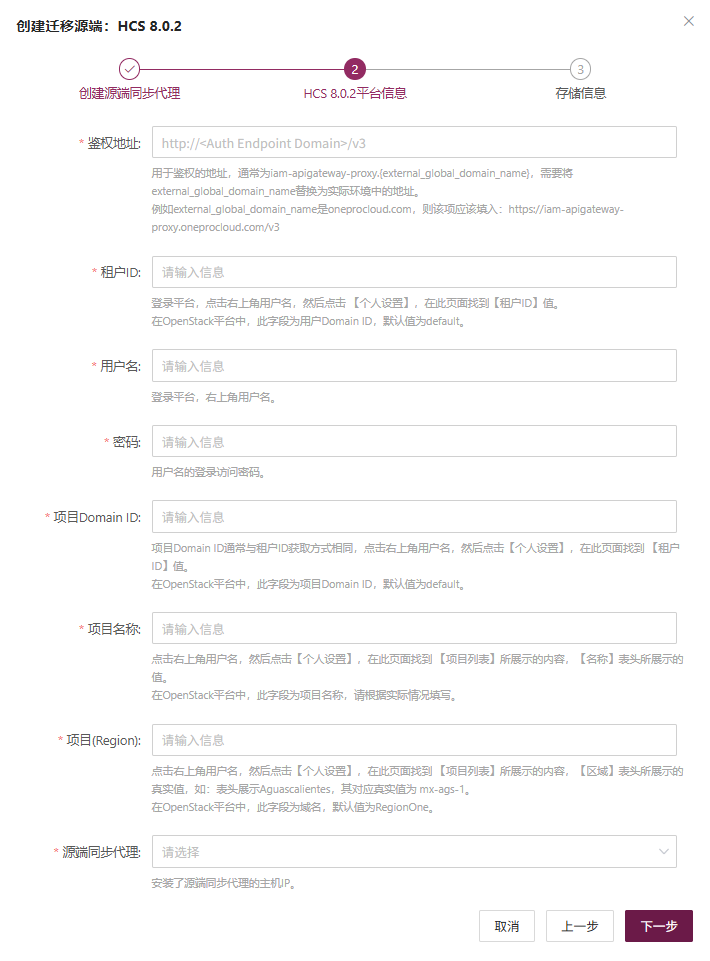
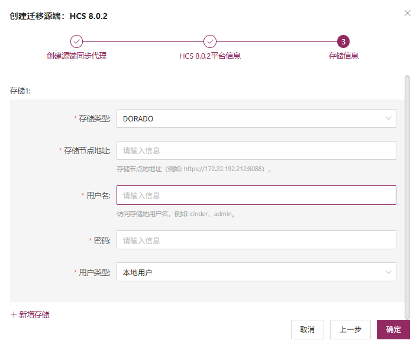
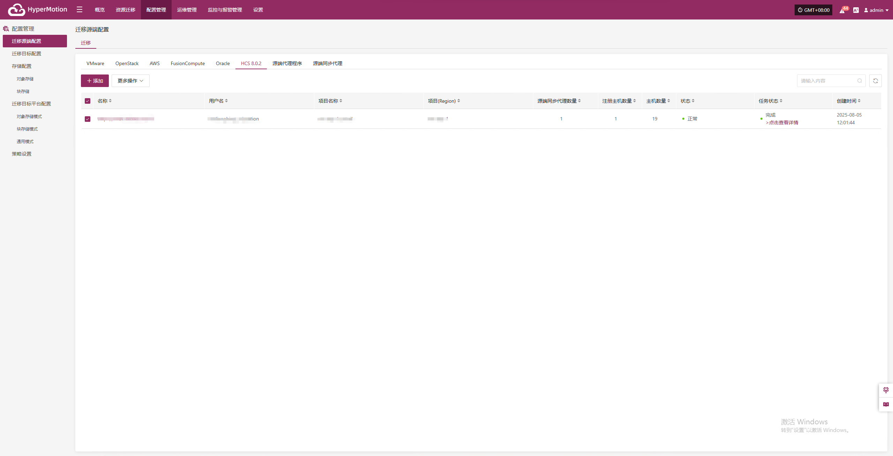

# **迁移源端配置**

目前源端生产平台支持Agent、Agentless两种模式，Agent相对于比较通用，在源端操作系统内部安装Agent代理程序进行数据的备份。Agentless顾名思义就是不需要在操作系统内部安装代理程序即可完成数据的备份，那么就要求备份的源端虚拟化、私有云及云平台可以提供对外的原生API接口进行主机的磁盘数据的读取，迁移产品需要进行开发适配才能支持。

* Agent和Agentless所支持的场景

  * Agent模式适用于各种源端的操作系统场景，包含物理机、虚拟机、云主机等

  * Agentless模式支持：VMware、OpenStack + Ceph、AWS EC2、FusionCompute及Oracle Cloud

* 源端操作系统支持矩阵Matrix

  * 源端Agentless操作系统支持列表：         
        <https://oneprocloud.feishu.cn/sheets/VRqksSPEPhRTPStp3kVcItXNnyh?sheet=0MJNYC>

  * 源端Agent操作系统支持列表：         
        <https://oneprocloud.feishu.cn/sheets/VRqksSPEPhRTPStp3kVcItXNnyh?sheet=Y9fpqO>

## **VMware**

生产平台VMware平台页面主要对VMware平台进行添加、删除、更新等相关管理操作。

### **添加VMware平台**

点击左侧导航栏"迁移源端配置"，选择VMware，点击 “添加” 按钮，在弹出的框中按照步骤引导来添加。


#### **部署同步代理**

按照引导步骤进行如下操作：

* 第一步：下载源端同步代理OVA文件。

  * 点击页面的下载链接即可

  * 互联网OVA下载链接：<https://HyperBDR-system-image-do-not-delete.obs.ap-southeast-3.myhuaweicloud.com/proxy-agent_BaseOS.ova>

* 第二步：用OVA文件，导入到VMware集群，部署一台或多台源端同步代理虚拟机，并配置IP地址。

* 第三步：安装源端同步代理，登录新创建的同步代理虚拟机，默认用户名密码（root/Acb@132.Inst）

* 第四步：复制并执行安装同步代理指令。

* 网络策略要求：

| **源端**     | **目标**           | **访问端口** | **说明**    |
| ---------- | ---------------- | -------- | --------- |
| Sync Proxy | HyperMotion Console | 10443    | 认证通信端口    |
| Sync Proxy | HyperMotion Console | 30080    | 安装包下载访问端口 |

* Sync Proxy的资源规格：

Sync Proxy可以进行横向扩展多个主机，来提高备份的并发性能力，及网络带宽利用率，默认一个Sync Proxy节点可以允许最大挂载支持磁盘数量为50，如果超过此数量及配置，你可以考虑横向扩展Sync Proxy的数量。

以下规格为单台Sync Proxy节点的规格配置需求（支持最大50个磁盘挂载同步）。

Sync Proxy扩展可以在多台Sync Proxy节点重复执行此操作步骤来进行，执行安装后会自动注册到平台侧，你可以根据需求进行源端同步代理（Sync Proxy）的管理及和源端无代理生产平台的绑定。

参考步骤：源端同步代理

| **参数**      | **规格**       |
| ----------- | ------------ |
| OS Version  | Ubuntu 20.04 |
| CPU         | 4C           |
| Memory      | 8GB          |
| System Disk | 50GB         |


#### **创建VMware迁移源端**

1. 认证信息获取

| **参数**         | **示例**                             | **说明**                                                                                                                                                                                                                     |
|:----------------:|:------------------------------------:|:----------------------------------------------------------------------------------------------------------------------------------------------------------------------------------------------------------------------------:|
| **鉴权地址**     | https://\<vCenter/ESXi Host>:443     | 添加 vCenter/ESXi 链接地址时，如果源端使用了域名进行管理，则需提前获取域名与 IP 地址的对应关系，并将记录添加到平台以支持解析。参考添加方式：<br>[点击查看文档](https://hypermotion.yuque.com/fe338c/qzb4z6/hbgii4h7vi73hh3k#WghOa) |
| **用户名**       | 连接 vCenter/ESXi 主机的用户名       | 用于连接 vCenter 或 ESXi 的用户名。                                                                                                                                                                                         |
| **密码**         | 连接 vCenter/ESXi 主机的密码         | 用于连接 vCenter 或 ESXi 的密码。                                                                                                                                                                                           |
| **源端同步代理** | 同步代理主机 IP                      | 安装完成后可在下拉菜单中选择，无需手动添加 IP。                                                                                                                                                                             |


* 网络策略要求

| **源端**     | **目标**         | **访问端口** | **说明**                                                                                                                                                     |
|:------------:|:----------------:|:------------:|:------------------------------------------------------------------------------------------------------------------------------------------------------------:|
| Sync Proxy   | vCenter/ESXi     |     443      | 认证通信端口                                                                                                                                                 |
| Sync Proxy   | ESXi Hosts       |     902      | 数据通信端口<br>该端口用于调用 VMware API 接口以获取备份数据。若备份虚拟机运行在多个 ESXi 主机上，需确保 Sync Proxy 可以访问每台对应 ESXi 主机的 902 端口。 |


* 权限要求

HyperMotion利用VMware的CBT技术实现增量数据同步。CBT (Change Block Tracking)是VMware中用于增量备份和复制的一种技术。它跟踪虚拟磁盘上发生更改的块，在备份和复制过程中只允许传输与这些更改相关的数据。

需要有VMware相关权限才可以进行接口的调用，关于权限及账号的创建请参考文档：
[点击查看](../../poc/vmware-pre-settings.md#vmware用户权限要求)

按照所需认证信息填写完成后，点击 确定 按钮进行添加。


#### **完成VMware添加**

VMware生产平台配置完成，等待平台状态为正常，且已经获取到集群主机数量，即可进行后续其他步骤操作。

注意：重复以上步骤可以添加多个VMware集群，你也可以单独添加某一个ESXi主机。


---

## **OpenStack**

生产平台OpenStack平台页面主要对OpenStack平台进行添加、删除、更新等相关管理操作。

### **添加OpenStack平台**

点击左侧导航栏"迁移源端配置"，选择OpenStack，点击 “添加” 按钮，在弹出的框中按照步骤引导来添加。


#### **部署同步代理**

按照引导步骤进行如下操作：

* 第一步：创建云主机

可以自行进行Ubuntu 20.04操作系统的虚拟机创建，如果为OpenStack平台或者其他KVM虚拟化平台，可以下载标准的Ubuntu 20.04 QCOW镜像导入进行使用。

> Ubuntu 20.04 QCOW2 image download link- Ubuntu 20.04 QCOW2镜像下载链接：
> [点击开始下载](https://downloads.oneprocloud.com/docs_images/ubuntu-20.04-server-cloud-init-amd64.qcow2)

注意：此Ubuntu20.04的镜像是没有默认登录密码的，镜像内部包含cloud-init服务，要求你导入的云平台必须可以支持通过cloud-init服务进行密码的注入，否则无法使用此镜像。

* 第二步：复制并执行安装同步代理指令。

1. 网络策略要求

| **源端**     | **目标**           | **访问端口** | **说明**    |
| ---------- | ---------------- | -------- | --------- |
| Sync Proxy | HyperMotion Console | 10443    | 认证通信端口    |
| Sync Proxy | HyperMotion Console | 30080    | 安装包下载访问端口 |

2. Sync Proxy的资源规格

| **参数**      | **规格**       |
| ----------- | ------------ |
| OS Version  | Ubuntu 20.04 |
| CPU         | 4C           |
| Memory      | 8GB          |
| System Disk | 50GB         |


#### **创建OpenStack生产平台**

1. OpenStack连接信息获取

参考文档：\<FAQ 获取OpenStack认证信息>

| **参数**          | **示例**                        | **说明**                                                                                                                                                                                                    |
| --------------- | ----------------------------- | --------------------------------------------------------------------------------------------------------------------------------------------------------------------------------------------------------- |
| **鉴权地址**        | http://192.168.10.201:5000/v3 | 这里的鉴权地址一般为OpenStack Keystone public Endpoint URL地址。&#xA;添加OpenStack链接地址时，如果源端使用了域名进行管理，那么需要提前获取域名及IP地址的对应关系，并将记录进行添加到平台，可以进行正常解析。 参考添加：https://hypermotion.yuque.com/fe338c/qzb4z6/hbgii4h7vi73hh3k#WghOa |
| **用户Domain ID** | default                       | 连接OpenStack平台的用户Domain ID                                                                                                                                                                                 |
| **用户名**         | 用户名                           | 连接OpenStack平台的用户名                                                                                                                                                                                         |
| **密码**          | 密码                            | 连接OpenStack平台的密码                                                                                                                                                                                          |
| **项目Domain ID** | default                       |                                                                                                                                                                                                           |
| **项目名称**        | admin                         | 连接OpenStack平台的项目名称，用户所在项目名称                                                                                                                                                                               |
| **域名**          | RegionOne                     | 连接OpenStack集群的Region Name                                                                                                                                                                                 |
| **源端同步代理**      | 同步代理主机IP                      | 安装完成后，可以下拉选择，无需进行手动添加IP                                                                                                                                                                                   |

* 网络策略要求

| 源端         | 目标        | 访问端口                           | 说明                 |
| ---------- | --------- | ------------------------------ | ------------------ |
| Sync Proxy | OpenStack | 5000、35357、9696、8774、8776、9292 | 与OpenStack服务认证通信端口 |


2. Ceph认证信息获取

| **参数**              | **示例**                                 | **说明**                                                                                                                                                         |
|:-----------------------:|:------------------------------------------:|:------------------------------------------------------------------------------------------------------------------------------------------------------------------:|
| **控制节点地址**      | 10.0.0.201,10.0.0.202,10.0.0.203          | Ceph 控制节点的地址（例如：10.0.0.201），需确认双方网络可互通。多个地址请使用英文逗号 `,` 分隔。                                                             |
| **使用 CephX 鉴权**   | 是                                       |+ 是 <br>+ 否                                                                                                                           |
| **用户名**            | cinder                                   | Ceph 用户名（例如：`cinder`、`admin`），用于访问指定存储池。                                                                                                     |
| **密钥环**            | AQBBY9hfBc0+AxAAz<br>yym+6l+MeTpMlgNTbye/A== | Ceph 密钥，可通过运行 `cat /etc/ceph/ceph.client.cinder.keyring` 在 Ceph 控制节点上查看。                                                                       |
| **存储池**            | volumes                                  | Ceph 节点的存储池名称。务必选择“被迁移主机数据所在”的存储池！<br>可通过命令 `ceph osd ls pools` 在 Ceph 管理节点上查看。                                       |
| **增量获取类型**      | rbd diff                                 | 增量数据获取方式：<br>+ `rbd diff`：速度较慢但数据精确<br>+ `rbd du`：速度较快但精度较低                                                                        |
| **集群**              | ceph                                     | Ceph 集群名称，默认为 `ceph`。可通过运行 `cat /usr/lib/systemd/system/ceph-mon@.service` 在 Ceph 控制节点查看。                                                 |
| **OpenStack 卷类型** | DEFAULT_VOLUME_TYPE, ssd, sata           | 可选的 OpenStack 卷类型列表。可通过命令 `openstack volume type list` 在 OpenStack 控制节点查看。                                                               |


如果有多个Ceph集群，你那么你可以重复添加多个

* 网络策略要求

|   源端   |           目标           | 访问端口 |                     说明                      |
|:--------:|:------------------------:|:--------:|:---------------------------------------------:|
| Sync Proxy | OpenStack Ceph Monitor Node |        6789         | 认证端口，调用 Ceph API 接口认证，并从其他 Ceph 存储节点获取备份数据 |


#### **完成OpenStack添加**

OpenStack生产平台配置完成，等待平台状态为正常，且已经获取到集群主机数量，即可进行后续其他步骤操作。

注意：重复以上步骤可以添加多个OpenStack集群。


---

## **AWS**

生产平台AWS平台页面主要对AWS平台进行添加、删除、更新等相关管理操作。

### **添加AWS平台**

点击左侧导航栏"迁移源端配置"，选择AWS，点击 “添加” 按钮，在弹出的框中按照步骤引导来添加。


#### **部署同步代理**

按照引导步骤进行如下操作：

* 第一步：创建云主机

可以在AWS平台，使用原生AWS EC2 Ubuntu 20.04操作系统镜像来创建一台新的云主机来部署同步代理。

* 第二步：复制并执行安装同步代理指令。

1. 网络策略要求

| **源端**     | **目标**           | **访问端口** | **说明**    |
| ---------- | ---------------- | -------- | --------- |
| Sync Proxy | HyperMotion Console | 10443    | 认证通信端口    |
| Sync Proxy | HyperMotion Console | 30080    | 安装包下载访问端口 |

2. Sync Proxy的资源规格

| **参数**      | **规格**       |
| ----------- | ------------ |
| OS Version  | Ubuntu 20.04 |
| CPU         | 4C           |
| Memory      | 8GB          |
| System Disk | 50GB         |


#### **创建AWS生产平台**

1. AWS连接信息获取

参考文档：\<FAQ 获取AWS认证信息>

| 参数                  | 示例                     | 说明                                                                                                                                                                   |
|:---------------------:|:------------------------:|:--------------------------------------------------------------------------------------------------------------------------------------------------------------------:|
| Access Key ID         | `AWS Access Key ID`      | 访问 AWS API 的密钥，具有该账户的完全权限。<br/>登录管理控制台 → 指向右上角用户名 → 点击“安全凭证” → 选择“用户”                                                     |
| Access Key Secret     | `AWS Access Secret Key`  | 与 Access Key ID 配对的密钥，具有该账户的完全权限。<br/>获取方式同上                                                                                                 |
| 区域                  | ap-southeast-1           | 待同步机器所在的区域。默认为自动获取，点击刷新按钮可选择。也可手动填写，手动填写时请参考 AWS 服务端点文档：<br/>[AWS 服务端点文档](https://docs.aws.amazon.com/general/latest/gr/rande.html) |
| 源端同步代理          | `192.168.7.26`           | 安装了同步代理的主机 IP                                                                                                                                               |
| 高级设置 + 名称       | `自定义名称`             | 自定义的生产平台名称。可以手动设置，也可以保持默认，系统会根据区域、平台、时间等信息自动生成命名规则。                                                              |


* 网络策略要求

| 源端       | 目标               | 访问端口 | 说明                                                         |
|:----------:|:------------------:|:--------:|:------------------------------------------------------------|
| Sync Proxy | AWS EC2<br/>AWS EBS |   443    | 与 AWS 服务认证通信端口。<br/>确保可以访问 AWS EC2 和 EBS 服务地址。<br/>+ 如果通过公网访问，需 EC2 绑定公网 IP，并开通公网访问策略。<br/>+ 如果通过内网访问，需确认 EC2 有内网 VPC Endpoint 服务，且能通过内部 DNS 解析访问 EC2 和 EBS 服务。 |

* 权限要求

调用AWS Direct API接口数据备份时，需要具备以下权限，关于权限及账号的创建请参考文档：

<https://docs.oneprocloud.com/userguide/poc/aws-pre-settings.html#aws-iam-preparation>


#### **完成AWS添加**

AWS生产平台配置完成，等待平台状态为正常，且已经获取到EC2主机数量，即可进行后续其他步骤操作。

注意：重复以上步骤可以添加多个AWS 区域。


---

## **FusionCompute**

生产平台FusionCompute平台页面主要对OpenStack平台进行添加、删除、更新等相关管理操作。

### **添加FusionCompute平台**

点击左侧导航栏"迁移源端配置"，选择FusionCompute，点击 “添加” 按钮，在弹出的框中按照步骤引导来添加。


#### **部署同步代理**

按照引导步骤进行如下操作：

* 第一步：下载源端同步代理OVA文件。

  * 点击页面的下载链接即可

  * 互联网OVA下载链接：[\[点击下载\]](https://HyperBDR-system-image-do-not-delete.obs.ap-southeast-3.myhuaweicloud.com/proxy-agent_BaseOS.ova)

* 第二步：用OVA文件在FusionCompute集群上，部署一台虚拟机，并配置IP地址。

> FusionCompute集群兼容的系统的版本：FusionCompute 8.6.0

* 使用条件说明

| **类别** | **内容**                                                                                                                                                                                                                                                                                                                                                                                                                                                   |
| ------ | -------------------------------------------------------------------------------------------------------------------------------------------------------------------------------------------------------------------------------------------------------------------------------------------------------------------------------------------------------------------------------------------------------------------------------------------------------- |
| 前提条件   | 1.安装并启动Tools：虚拟机需安装Tools并启动，这是创建CBT快照的必要条件。&#xA;<br>2.备份虚拟机快照数量限制：最多支持32个快照，超过此限制无法创建新快照。&#xA;<br>3.虚拟机状态要求：虚拟机必须处于“运行”、“休眠”或“停止”状态，才能创建快照。&#xA;<br>4.备份虚拟机时要求：备份过程中虚拟机关机会导致备份失败。                                                                                                                                                                                                                                                                                    |
| 限制条件   | 1.共享磁盘不支持快照：虚拟机不能使用共享磁盘，使用共享磁盘时无法创建快照。&#xA;<br>2.独立磁盘不支持备份：独立磁盘无法进行备份。&#xA;<br>3.CBT失效情形：虚拟机HA、恢复快照、卷扩容、计算节点故障重启等操作后，CBT会失效，需要执行全量备份。&#xA;<br>4.任务互斥性：创建备份快照与启动虚拟机、在线绑定磁盘、关闭虚拟机、磁盘扩容、存储迁移等操作必须互斥。&#xA;<br>5.快照不支持的场景：链接克隆虚拟机、模板虚拟机、不支持快照的存储迁移、磁盘扩容等情况下无法备份。&#xA;<br>6.存储空间要求：备份时需在目的卷所在存储上预留空间进行快照合并，最多支持同时备份8个卷。&#xA;<br>7.存储IO性能影响：备份和恢复期间会影响存储IO性能，建议在业务空闲时段进行备份恢复。&#xA;<br>8.不支持跨存储类型备份恢复：无法跨不同存储类型（如虚拟化存储与FusionStorage）进行备份恢复。&#xA;<br>9.单主机最大支持8个Socket链接：每个主机最多同时支持8个Socket备份连接。 |

* 第三步：安装源端同步代理，登录新创建的同步代理虚拟机，默认用户名密码（root/Acb@132.Inst）

* 第四步：复制并执行安装同步代理指令。

* 网络策略要求：

| **源端**     | **目标**           | **访问端口** | **说明**    |
| ---------- | ---------------- | -------- | --------- |
| Sync Proxy | HyperMotion Console | 10443    | 认证通信端口    |
| Sync Proxy | HyperMotion Console | 30080    | 安装包下载访问端口 |

* Sync Proxy的资源规格：

| **参数**      | **规格**       |
| ----------- | ------------ |
| OS Version  | Ubuntu 20.04 |
| CPU         | 4C           |
| Memory      | 8GB          |
| System Disk | 50GB         |


#### **创建FusionCompute生产平台**

1. 认证信息获取

| **参数**     | **示例**                             | **说明**                                                                   |
| ---------- | ---------------------------------- | ------------------------------------------------------------------------ |
| **鉴权地址**   | https://\<FusionCompute/Host>:7443 | 添加 FusionCompute 链接地址时，如果源端使用了域名进行管理，则需提前获取域名与 IP 地址的对应关系，并将记录添加到平台以支持解析。 |
| **用户名**    | 连接 FusionCompute 主机的用户名            | 用于连接 FusionCompute 的用户名。                                                 |
| **密码**     | 连接 FusionCompute 主机的密码             | 用于连接 FusionCompute 的密码。                                                  |
| **源端同步代理** | 同步代理主机 IP                          | 安装完成后可在下拉菜单中选择，无需手动添加 IP。                                                |

* 网络策略要求

| 源端         | 目标                 | 访问端口  | 说明                                                       |
| ---------- | ------------------ | ----- | -------------------------------------------------------- |
| Sync Proxy | FusionCompute 管理节点 | 7443  | 认证通信端口                                                   |
| Sync Proxy | 虚拟化平台各计算节点         | 21064 |  数据通信端口<br>用于备份数据读取。请确保 Sync Proxy 能访问所有目标主机的 21064 端口。 |

按照所需认证信息填写完成后，点击 确定 按钮进行添加。


#### **完成FusionCompute添加**

FusionCompute生产平台配置完成，等待平台状态为正常，且已经获取到集群主机数量，即可进行后续其他步骤操作。

注意：重复以上步骤可以添加多个FusionCompute集群，你也可以单独添加某一个FusionCompute主机。


---

## **Oracle**

生产平台Oracle平台页面主要对OpenStack平台进行添加、删除、更新等相关管理操作。

### **添加Oracle平台**

点击左侧导航栏"迁移源端配置"，选择Oracle，点击 “添加” 按钮，在弹出的框中按照步骤引导来添加。


#### **部署同步代理**

按照引导步骤进行如下操作：

* 第一步：创建云主机

可以在 FusionCompute 平台上，使用原生 Ubuntu 20.04 操作系统镜像创建一台新的虚拟机用于部署同步代理。

* 第二步：复制并执行安装同步代理指令

* 网络策略要求：

| **源端**     | **目标**           | **访问端口** | **说明**    |
| ---------- | ---------------- | -------- | --------- |
| Sync Proxy | HyperMotion Console | 10443    | 认证通信端口    |
| Sync Proxy | HyperMotion Console | 30080    | 安装包下载访问端口 |

* Sync Proxy的资源规格：

| **参数**      | **规格**       |
| ----------- | ------------ |
| OS Version  | Ubuntu 20.04 |
| CPU         | 4C           |
| Memory      | 8GB          |
| System Disk | 50GB         |


#### **创建Oracle生产平台**

1. 认证信息获取

| 参数      | 示例                                     | 说明                                                                                                     |
| ------- | -------------------------------------- | ------------------------------------------------------------------------------------------------------ |
| 租户 OCID | ocid1.tenancy.oc1..aaaaaaaaxxxx        | 登录管理控制台 → 指向右上角【概要信息】→ 点击【我的概要信息】→ 选择【API 密钥】→ 在 API 密钥中选择一个密钥【查看配置文件】→ 对应配置中的【tenancy】。               |
| 用户 OCID | ocid1.user.oc1..aaaaaaabbbbb           | 连接 Oracle 主机的用户名。登录管理控制台 → 指向右上角【概要信息】→ 点击【我的概要信息】→ 选择【API 密钥】→ 在 API 密钥中选择一个密钥【查看配置文件】→ 对应配置中的【user】。 |
| 密钥      | oci\_api\_key.pem                      | 连接 Oracle 主机的私钥文件路径。登录管理控制台 → 指向右上角【概要信息】→ 点击【我的概要信息】→ 选择【API 密钥】→ 【添加 API 密钥】时创建或上传的密钥。               |
| 密钥指纹    | 20:3b:97:13:55:1c:8c:xx:xx:xx:xx:xx:xx | 登录管理控制台 → 指向右上角【概要信息】→ 点击【我的概要信息】→ 选择【API 密钥】→ 在 API 密钥中选择一个密钥【查看配置文件】→ 对应配置中的【fingerprint】。           |
| 区域      | ap-singapore-1                         | 登录管理控制台 → 指向右上角【概要信息】→ 点击【我的概要信息】→ 选择【API 密钥】→ 在 API 密钥中选择一个密钥【查看配置文件】→ 对应配置中的【region】。                |
| 源端同步代理  | 192.168.1.100                          | 安装了源端同步代理的主机 IP 地址。                                                                                    |
| 高级设置    | 不填写名称时系统自动生成默认名称                       | 如果不填写名称，系统将自动为您生成一个默认的名称。                                                                              |

* 网络策略要求

| 源端         | 目标                 | 访问端口 | 说明                                                       |
| ---------- | ------------------ | ---- | -------------------------------------------------------- |
| Sync Proxy | FusionCompute 管理节点 | 443  | 认证通信端口                                                   |
| Sync Proxy | 虚拟化平台各计算节点         | 1522 |  数据通信端口<br>用于备份数据读取。请确保 Sync Proxy 能访问所有目标主机的 21064 端口。 |

按照所需认证信息填写完成后，点击 确定 按钮进行添加。


#### **完成Oracle添加**

Oracle生产平台配置完成，等待平台状态为正常，且已经获取到EC2主机数量，即可进行后续其他步骤操作。

注意：重复以上步骤可以添加多个Oracle 区域。


---

## **HCS 8.0.2**

生产平台HCS 8.0.2平台页面主要对HCS 8.0.2平台进行添加、删除、更新等相关管理操作。

### **添加HCS 8.0.2平台**

点击左侧导航栏"迁移源端平台配置"，选择HCS 8.0.2，点击 “添加” 按钮，在弹出的框中按照步骤引导来添加。



#### **部署同步代理**

按照引导步骤进行如下操作：

* 第一步：下载源端同步代理OVA文件。

  * 点击页面的下载链接即可

  * 互联网OVA下载链接：<https://hyperbdr-system-image-do-not-delete.obs.ap-southeast-3.myhuaweicloud.com/proxy-agent_BaseOS.ova>

* 第二步：用OVA文件在HCS集群上，部署一台虚拟机，并配置IP地址。

> 注意：
>
> 1\. 目前华为云Stack(HCS) 8.2.x / 8.3.x接口与Stack(HCS) 8.0.2存在明显差异，因此暂不支持Stack(HCS) 8.2.x / 8.3.x。
>
> 2\. 对于其他型号的Dorado存储暂未进行适配。

* 第三步：安装源端同步代理，登录新创建的同步代理虚拟机，默认用户名密码（root/Acb@132.Inst）

* 第四步：复制并执行安装同步代理指令。

* 网络策略要求

| **源端**     | **目标**           | **访问端口** | **说明**    |
| ---------- | ---------------- | -------- | --------- |
| Sync Proxy | HyperBDR Console | 10443    | 认证通信端口    |
| Sync Proxy | HyperBDR Console | 30080    | 安装包下载访问端口 |

* Sync Proxy的资源规格

| 参数          | 规格           |
| ----------- | ------------ |
| OS Version  | Ubuntu 20.04 |
| CPU         | 4C           |
| Memory      | 8GB          |
| System Disk | 50GB         |



#### **创建HCS 8.0.2迁移源端平台**

1. HCS 8.0.2连接信息获取

| **参数**      | **示例**                                          | **说明**                                                                                                                                                                                                                      |
| ----------- | ----------------------------------------------- | --------------------------------------------------------------------------------------------------------------------------------------------------------------------------------------------------------------------------- |
| 鉴权地址        | https://iam-apigateway-proxy.oneprocloud.com/v3 | 用于鉴权的地址，通常为iam-apigateway-proxy.{external\_global\_domain\_name}，需要将external\_global\_domain\_name替换为实际环境中的地址。&#xA;例如external\_global\_domain\_name是oneprocloud.com，则该项应该填入：https://iam-apigateway-proxy.oneprocloud.com/v3 |
| 租户ID        | HPUAAG0B2•••••••••••••••                        | 登录平台后，点击右上角用户名 → 【个人设置】，在该页面找到【租户ID】。                                                                                                                                                                                       |
| 用户名         | zhangweizhen                                    | 登录平台，右上角用户名。                                                                                                                                                                                                                |
| 密码          | ••••••••••••••                                  | 用户名的登录访问密码。                                                                                                                                                                                                                 |
| 项目Domain ID | HPUAAG0B2•••••••••••••••                                         | 项目Domain ID通常与租户ID获取方式相同，点击右上角用户名，然后点击【个人设置】，在此页面找到 【租户ID】值。                                                                                                                                                  |
| 项目名称        | test                                            | 点击右上角用户名，然后点击【个人设置】，在此页面找到 【项目列表】所展示的内容，【名称】表头所展示的值。                                                                                                                                                                        |
| 项目(Region)  | RegionOne                                       | 点击右上角用户名，然后点击【个人设置】，在此页面找到 【项目列表】所展示的内容，【区域】表头所展示的真实值，如：表头展示Aguascalientes，其对应真实值为 mx-ags-1。                                                                                                                                |
| 源端同步代理      | 192.168.7.144                                   | 通过下拉列表选择安装了同步代理的主机 IP                                                                                                                                                                                                       |



* 存储信息配置

> 可通过点击页面“+ 新增存储”，多选配置

| **参数** | **示例**                      | **说明**                                         |
| ------ | --------------------------- | ---------------------------------------------- |
| 存储类型   | DORADO                      | 通过下拉列表选择所对接的存储类型                               |
| 存储节点地址 | https://172.22.192.212:8088 | 存储设备的管理地址，通常使用 HTTPS 协议，端口号一般为 8088（或配置的管理端口）。 |
| 用户名    | zhangweizhen                | 登录存储设备所用账号                                     |
| 密码     | ••••••••••••••              | 与用户名匹配的密码                                      |
| 用户类型   | 本地用户                        | 指明为存储系统本地创建的账户，可选：本地用户、LDAP用户、RADIUS用户         |



* 网络策略要求

| **源端**     | **目标**    | **访问端口** | **说明**                                     |
| ---------- | --------- | -------- | ------------------------------------------ |
| Sync Proxy | HCS 8.0.2 | 443      | 用于访问 HCS 平台的 API 网关（APIG），进行身份认证、任务下发等管理操作 |
| Sync Proxy | HCS 8.0.2 | 8088     | 用于访问 Dorado 存储的管理接口，进行存储资源查询、快照等操作         |

* 权限要求

为调用 HCS 8.0.2 接口进行数据备份，需提供具备完整租户管理员权限的账号。

#### **完成HCS 8.0.2添加**

HCS 8.0.2生产平台配置完成，等待平台状态为正常，且已经获取到ECS主机数量，即可进行后续其他步骤操作。

注意：重复以上步骤可以添加多个HCS 8.0.2集群。




***

## **华为云**

生成平台华为云平台页面主要对华为公有云平台进行添加、删除、更新等相关管理操作。

::: warning
截至2025年10月31日，华为云仅在部分区域（目前仅深圳区域、伊斯坦布尔区域和安卡拉安卡拉区域）开放CBR标准快照数据导出接口和CBR标准快照数据桶委托接口，且需申请白名单方可使用。如需使用，请通过华为云工单系统申请使用权限。
:::

### **添加华为云平台**

点击左侧导航栏"迁移源端配置"，选择华为云，点击 “添加” 按钮，在弹出的框中按照步骤引导来添加。


#### **部署同步代理**

按照引导步骤进行如下操作：

* 第一步：创建云主机。

在华为云平台上创建一台云主机，其要求如下：  
（1）该云主机必须运行以下操作系统版本之一：Ubuntu 20.04。  
（2）该云主机应满足以下最低规格要求：CPU 4核、内存 8GB、系统盘 200GB。  
（3）该云主机应支持以下文件系统类型之一：XFS 或 EXT4，并确保磁盘分区类型不为 LVM。  
（4）该云主机必须能够正确访问 华为云 API 接口。  
（5）所有操作必须以 root 用户身份执行。  

* 第二步：安装源端同步代理。
复制并执行安装同步代理指令。

* 网络策略要求

| **源端**     | **目标**           | **访问端口** | **说明**    |
| ---------- | ---------------- | -------- | --------- |
| Sync Proxy | HyperBDR Console | 10443    | 认证通信端口    |
| Sync Proxy | HyperBDR Console | 30080    | 安装包下载访问端口 |


#### **创建华为云迁移源端平台**

1. 华为云鉴权信息获取

| **参数**      | **示例**                                          | **说明**                                                                                                                                                                                                                      |
| ----------- | ----------------------------------------------- | --------------------------------------------------------------------------------------------------------------------------------------------------------------------------------------------------------------------------- |
| Access Key ID        | H******************K | 访问华为云 API 的密钥，具有该账户完全的权限。登录管理控制台 → 指向右上角【用户名】→ 点击【我的凭证】→ 选择【访问密钥】 |
| Access Key Secret        | 4*************************A | 访问华为云 API 的密钥，具有该账户完全的权限。登录管理控制台 → 指向右上角【用户名】→ 点击【我的凭证】→ 选择【访问密钥】 |
| 项目        | tr-west-1 | 访问华为云 API 的密钥，具有该账户完全的权限。登录管理控制台 → 指向右上角【用户名】→ 点击【我的凭证】→ 【API凭证】→ 【项目】注意：请填写项目​（例如：cn-north-1），而非项目ID。 |
| 源端同步代理        | 192.168.2.75 | 安装了源端同步代理的主机IP。 |
| 名称        | 华为云 | 如果不填写名称，系统将自动为您生成一个默认的名称。 |


* 存储桶信息配置

::: tip
存储桶支持新建或者指定。
:::

| **参数**      | **示例**                                          | **说明**                                                                                                                                                                                                                      |
| ----------- | ----------------------------------------------- | --------------------------------------------------------------------------------------------------------------------------------------------------------------------------------------------------------------------------- |
| 存储桶名称        | sync-proxy-temp-data-bucket-mhm | 本存储桶用于临时缓存华为云主机磁盘数据，其计费标准与华为云对象存储服务（OBS）一致，缓存数据量为每次实际同步时华为云主机磁盘的数据量。 |


#### **完成华为云添加**

华为云生产平台配置完成，等待平台状态为正常，且已经获取到ECS主机数量，即可进行后续其他步骤操作。


---

## **源端代理程序**

1. 当源端(被迁移端)为物理机或者各种类型(如：KVM/Xen/Hyper-V等)单个虚拟机时，需要进行相关配置。

2. 该场景需要安装Agent方式迁移

3. 不同操作系统（Windows、Linux）安装不同Agent

Agent操作系统支持矩阵：<https://oneprocloud.feishu.cn/sheets/VRqksSPEPhRTPStp3kVcItXNnyh?sheet=Y9fpqO>

4. 前提准备

   * 存在待迁移的主机（x86物理机/KVM/Xen/Hyper-V等）

   * 已获取主机用户名/密码（备用）

   * 已完成迁移工具 \*\*HyperMotion \*\*的安装及登录

   * 已经开通了源主机连通到 \*\*HyperMotion \*\*及 \*\*云同步网关 \*\*的网络策略

   * 运行了安全软件的Windows主机，请提前将Windows Agent程序加入白名单或停掉安全软件的运行

5. 网络策略要求

| **源端**             | **目标**                  | **访问端口** | **说明**                                                                                           |
|:--------------------:|:-------------------------:|:------------:|:-------------------------------------------------------------------------------------------------|
| Windows/Linux Host   | HyperMotion Console          | 10443        | 认证通信端口                                                                                      |
| Windows/Linux Host   | HyperMotion Console          | 30080        | 安装包下载访问端口                                                                                |
| Windows/Linux Host   | Cloud Sync Gateway        | 13260         | 数据同步端口                                            |
| Windows/Linux Host   | Cloud Sync Gateway        | 443          | 数据同步端口（HTTPS协议）<br>+ 适用于块存储 HTTPS 协议                                           |
| Windows/Linux Host   | Object Storage Services   | 443          | 数据同步端口（对象存储HTTPS/HTTP协议）<br>+ 适用于对象存储模式<br>注意：在数据同步时，如果目标对象存储使用了域名，那么需要提前添加对象存储的域名解析或静态hosts解析 |

### **Linux Agent**

#### **安装Linux Agent**

点击顶部菜单栏 "配置管理", 点击左侧导航栏 "迁移源端配置"，点击 "源端代理程序"，点击复制命令来获取Linux Agent的安装命令。


登录源端Linux Host，在终端内粘贴执行命令运行即可。


等待命令执行完毕，最终输出安装成功，可以登录平台侧查看注册主机。


#### **卸载Linux Agent**

卸载Agent之前，需要确保Linux主机已经在HyperMotion平台完成解除注册。

* 登录源端Linux操作系统

* 执行卸载指令

```plaintext
bash /var/lib/egisplus-agent/uninstall_agent.sh
```

等待脚本执行完成，输出卸载成功，则表示源端Linux Agent卸载完成。


### **Windows Agent**

#### **安装Windows Agent**

点击顶部菜单栏 "配置管理", 点击左侧导航栏 "迁移源端配置"，点击 "源端代理程序"，根据源端操作系统版本进行点击"立即下载"按钮进行下载Windows Agent 安装包。


1. 登录源端Windows主机

2. 上传下载Windows Agent安装包

Windows Agent 安装程序包：**windows-agent.zip**

3. 解压缩Windows Agent安装

在管理员模式下解压windows-agent.zip文件

* 解压目录文件


4. 执行安装程序

使用管理员权限运行解压目录下的install.exe，类型为应用程序的软件

选择Install.exe程序，右击选择"以管理员身份运行(A)"


在弹出的安装程序框中，选择"Install >" 执行安装。


在弹出的提示信息中，在执行安装之前，确保系统中没有安全软件运行，如果有安全软件运行，可能阻止Windows Agent程序的安装运行，并且将Windows Agent程序识别为病毒或非法软件，将Windows Agent相关软件进行删除，导致安装失败。

如果运行了安装软件，请提前将Windows Agent程序加入安全软件白名单再次运行安装程序。

由于安全软件的多样化，具体添加白名单的方法请咨询相关安全厂商及客户侧安全负责人。

部分安全软件添加白名单步骤参考：<https://docs.oneprocloud.com/userguide/faq/faq.html#configuration-of-antivirus-software-on-windows-agent-source-host>


如果你已经完成以上的安全设置，请点击确定继续安装程序。


等待安装程序运行安装，提示已经安装程序，可以点击"是"来启动Windows Agent服务。


#### **启动Windows Agent**

在启动Windows Agent服务程序页面，先点击左下角"Precheck"进行服务启动前的预检查步骤。

预检查步骤主要是根据Windows Agent运行环境及主机系统内部的依赖等做提前的检查工作，确认预检查都通过后，再启动Windows Agent运行。


* Precheck条目说明

| 检查项   |            检查条目            | 说明                                                                       | 失败解决方案 |
|:--------:|:------------------------------:|:--------------------------------------------------------------------------:|:------------:|
| (1/9)    | Check whether there is permission to start Windows services and query the status of Windows services. | 检查是否有权限启动 Windows 服务并查询 Windows 服务的状态。                                   |              |
| (2/9)    | Check whether the display language under the system user can support English. | 检查系统用户下的显示语言是否支持英语。                                                      |              |
| (3/9)    | Check whether there is any security software blocking the creation and deletion of vss shadows using the vssadmin command. | 检查是否有安全软件使用 vssadmin 命令阻止 VSS 卷影的创建和删除。                                  |              |
| (4/9)    | Check whether there is any security software blocking the installation and startup of Windows Agent. | 检查是否有安全软件阻止 Windows Agent 的安装和启动。                                        |              |
| (5/9)    | Check whether the volume file system and volume free space meet the synchronization requirements. | 检查卷文件系统和卷可用空间是否满足同步要求。                                                   |              |
| (6/9)    | Check whether there are unsupported volume types. (RAID-5, Mirror, Stripe and Spanned volume types are not supported) | 检查是否存在不支持的卷类型。（不支持 RAID-5、镜像、条带和跨区卷类型。）                                  |              |
| (7/9)    | Check whether the patch KB4474419 has been installed. (this patch must be installed if the operating system is Windows 2008 or Windows 2008 R2) | 检查补丁 KB4474419 是否已安装。（如果操作系统是 Windows 2008 或 Windows 2008 R2，则必须安装此补丁）   |              |
| (8/9)    | Check whether there are VSS shadows created by third-party software on the current host.(It is recommended to delete the created VSS snapshots and stop other software from using VSS to create and delete VSS shadows) | 检查当前主机上是否存在由第三方软件创建的 VSS 卷影。（建议删除创建的 VSS 快照，并阻止其他软件使用 VSS 创建和删除 VSS 卷影。） |              |
| (9/9)    | Check whether there are Windows backup schedules. (the execution time of such a schedule may lead to synchronization failure. It is recommended to disable them) | 检查是否存在 Windows 备份计划。（此类计划的执行时间可能导致同步失败。建议禁用它们。）                          |              |


根据预检查的结果提示结果进行问题处理，检查全部通过，可点击"OK"


此时可以点击"Start Services" 按钮来启动Windows Agent服务。


根据警告信息提示，再次进行检查安全软件运行，必须信任Windows Agent程序，避免出现启动失败和同步数据失败的发生。

如果确认一切正常，可以点击"OK"，完成Windows Agent服务的启动。


此时如果没有其他提示信息，那么Windows Agent则启动一切正常


登录到HyperMotion的控制台进行查看注册状态及后续其他步骤操作。


#### **卸载Windows Agent**

由于卸载Windows Agent程序为标准Windows 系统卸载软件流程操作，这里仅演示其中一个操作系统版本为例，其他Windows版本卸载操作步骤参考即可完成。

点击左下角Windows图标，点击"控制面板"


在弹出的页面中，找到程序点击"卸载程序"


找到Windows\_Agent <版本号>，发布者为 OneProCloud，选中右击选择 "卸载/更改(U)"


在弹出的卸载框点击"是"进行确认卸载。


等待卸载程序执行完成，点击确定及完成Windows Agent程序的卸载。


---

## **源端同步代理**

### **技术原理说明**

主要用于源生产平台为 VMware、OpenStack + Ceph 或 AWS 的场景。该组件的核心功能是部署无代理同步程序，通过调用源生产平台的接口实现数据备份。源端同步代理（Sync Proxy）负责从源端平台获取数据，并通过本地网络将备份数据高效传输至目标灾备侧进行存储。

建议部署在源生产平台侧，通过内网近距离调用接口，避免跨长距离网络调用带来的安全性和可靠性问题。在备份过程中，Sync Proxy 可视为源端出网备份数据的代理节点。

* **对内**：Sync Proxy 仅需访问源端 VMware、OpenStack + Ceph 或 AWS 平台的管理网络和存储网络，用于调用接口获取数据。

* **对外**：Sync Proxy 仅需开通访问目标灾备平台的网络，避免直接暴露源生产平台的网络结构。

此架构设计兼具灵活性、安全性和可靠性，适用于多种生产平台场景。


源端同步代理（Sync Proxy）可以有多个节点，一个源端同步代理（Sync Proxy）可以绑定一个或多个源生产平台，多个源端同步代理（Sync Proxy）也可以绑定一个源生产平台。

多个源端同步代理（Sync Proxy）绑定一个源生产平台情况下，那么将意味着后续有多个源端同步代理节点来调用源端生产站点进行数据备份，后端会通过内部算法进行平衡源端同步代理节点的负载，保证业务备份时的并发性。

源端同步代理主要是针对源端生产无代理节点同步代理（Sync Proxy）的管理操作，包含源端同步代理的基本设置、绑定、解绑及删除等操作。

### **设置**

选择已经添加到平台的源端同步代理，点击"更多操作"按钮，选择"设置"，可以设置源端同步代理节点相关配置


* 设置配置参数说明

| **参数**         | **默认** | **说明**                                                                                                                                                       |
|:----------------:|:--------:|:------------------------------------------------------------------------------------------------------------------------------------------------------------|
| **HTTP通讯超时时间** |   600    | 此配置表示：当源端代理节点使用HTTP协议与源端生产平台和控制台通信，超过600s没有响应，程序会中断连接，标记为失败，<br>如果网络导致通信环境较差时需要适当调大该选项，来增加重试等待时间。                                                               |
| **最大挂盘数量**     |    50    | 此配置表示：用来配置源端代理节点，最大可以挂载多少块磁盘。<br>源端同步代理（Sync Proxy）默认情况下最大允许挂载50块云硬盘进行数据同步，超过此数量则需要横向扩展源端同步代理节点数量，<br>你可以选择适当扩展源端同步代理节点的CPU和内存大小，然后修改此配置参数，<br>但是我们建议最大不超过150。 |


### **绑定**

选择已经添加到平台的源端同步代理，点击"更多操作"按钮，选择"绑定"，选择一个已经添加的源端生产站点进行绑定，绑定成功后，那么这个源端同步代理将会作为一个节点来调用绑定的源端生产站点进行数据备份获取。


说明：

* 一个源端同步代理节点（Sync Proxy）可以绑定一个或多个源端生产站点。

* 多个源端同步代理节点（Sync Proxy）可以绑定一个源端生产站点。

多个源端同步代理节点（Sync Proxy）关联绑定到一个源端生产站点后，那么将意味着后续有多个源端同步代理节点来调用源端生产站点进行数据备份，后端会通过内部算法进行平衡源端同步代理节点的负载，保证业务备份时的并发性。

注意：

目前多个源端同步代理无法进行故障负载转移，只能提供横向扩展多并发的备份能力，如果其中一个源端同步代理节点出现故障，那么分配到当前节点的同步备份任务将会失败，无法自动转移到其他节点，你需要手动进行故障恢复才可以。

### **解绑**

选择已经添加到平台的源端同步代理，点击"更多操作"按钮，选择"解绑"，选择一个已经绑定的源端生产站点进行解绑，点击"确定"即可。


注意：

解绑前，需要确保当前源端同步代理节点没有绑定的同步备份主机任务，才可以支持解绑。解绑成功后，那么这个源端同步代理可以进行删除或者继续绑定其他源端生产站点并为其进行服务。

### **删除**

选择已经添加到平台的源端同步代理，点击"更多操作"按钮，选择"删除"，确保当前源端同步代理节点没有绑定任何源端生产站点。如果有绑定的源端生产站点，则删除按钮会不可点击状态，你需要先行进行"解绑"，解绑成功后再进行删除操作。


####
---