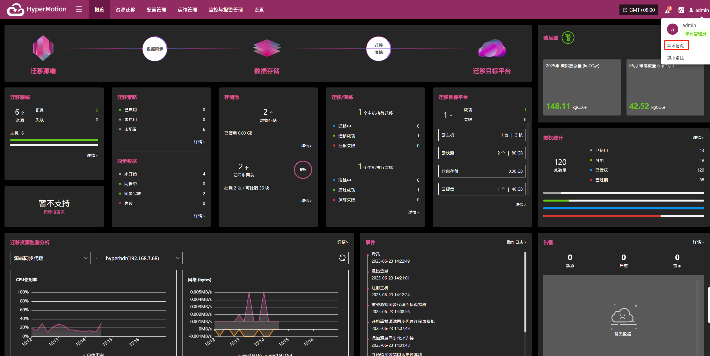
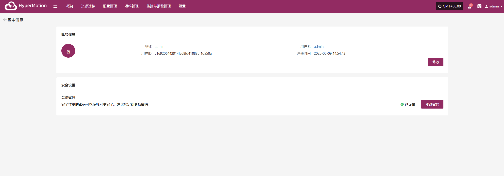
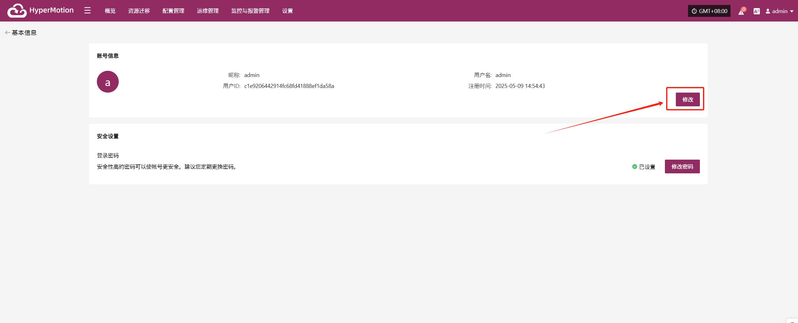
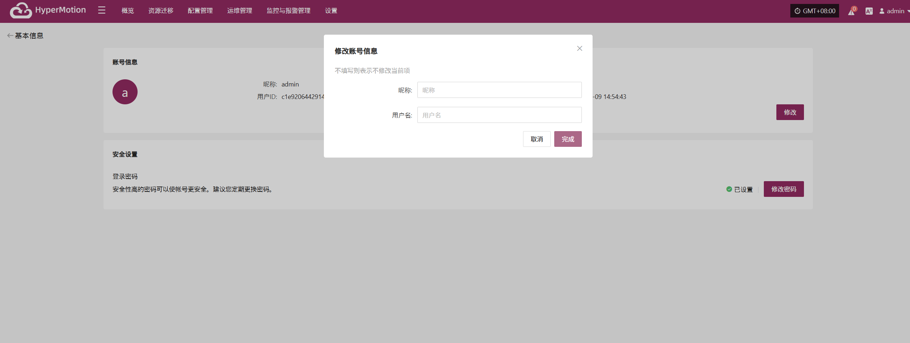
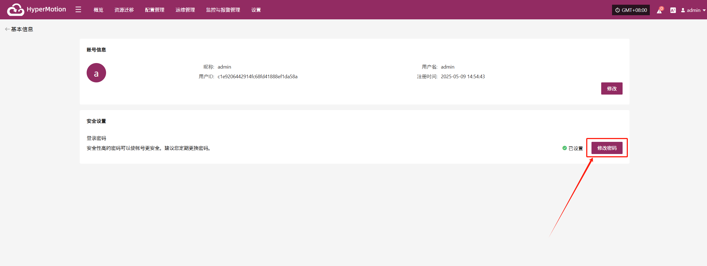
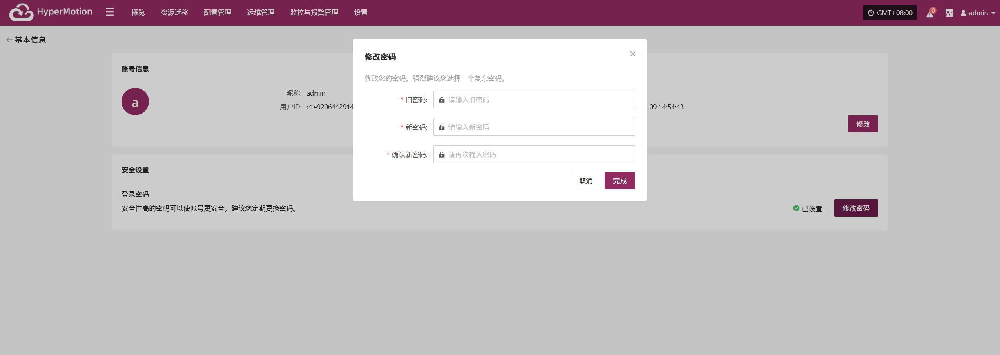

# 个人信息管理
本系统为您提供了全面的个人信息管理功能，帮助您方便地查看、更新和管理账号信息以及确保账户的安全。

## **基本信息**

登录系统后，点击右上角的用户名，在下拉菜单中选择“基本信息”以查看账户详情。

如下图所示为账号的基本信息页面展示：

账号基本信息包括以下内容：

* 昵称：admin

* 用户名：admin

* 用户ID：c1e9206442914-XXXXXXXXXXXXX

* 注册时间：2025-05-13 14:05:39

安全设置：

* 登录密码：已设置

> 说明：设置高强度密码可有效提升账号安全性，建议定期更新密码。

### **修改账号信息**

您的账号信息包括用户名和注册时间等基本资料。如果需要修改某些信息，可以根据系统要求进行相应操作。

进入“基本信息”页面后，点击“修改”按钮即可开始编辑用户名和昵称。

* **昵称**：仅作为界面显示使用，不影响登录功能。

* **用户名**：用于登录系统的唯一标识，修改后请使用新的用户名进行登录。

> 注意：修改用户名后，请务必牢记新的登录名，以免影响后续系统访问。运维管理平台的登录账号也将同步更新。

### **修改密码**

为了保护您的账号安全，我们建议您定期更换密码，尤其是使用安全性高的密码。

进入“基本信息”页面后，点击“修改密码”按钮即可开始进行密码修改操作。

> 注意：新密码长度8-20个字符，必须包含大小写字母和数字，支持特殊字符(除空格)。修改密码后，请务必牢记新的密码，以免影响后续系统访问。运维管理平台的登录密码也将同步更新。
#### **密码管理建议**

* 建议定期更换密码，特别是在怀疑账户安全受到威胁时及时更新。

* 避免在多个平台使用相同密码，建议设置复杂且独特的密码以提升账户安全。

