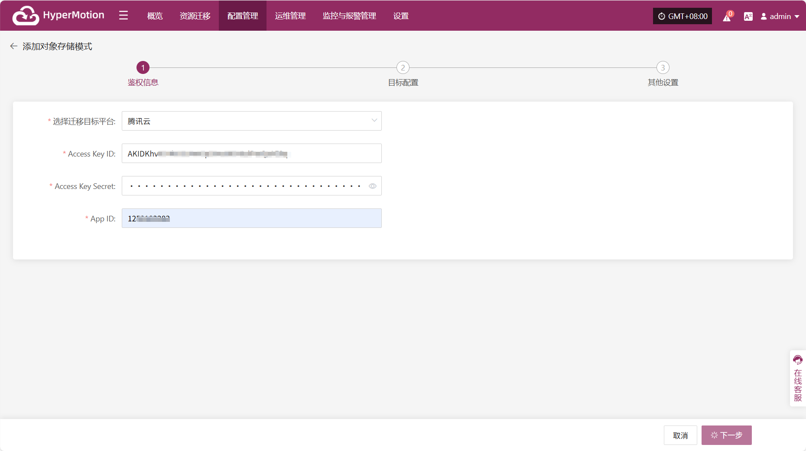
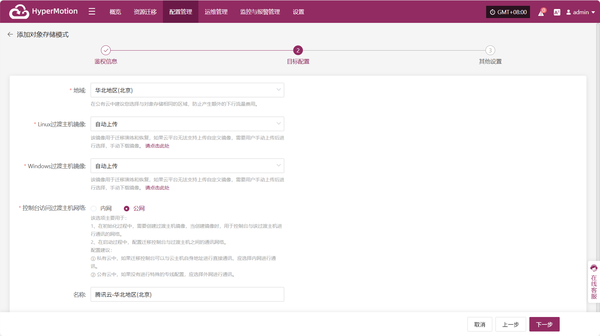

# **腾讯云**

## **添加对象存储**

通过顶部导航栏依次选择 **“配置管理” → “迁移目标平台配置” → “对象存储”** 进入对象存储页面，点击右上角 “添加” 按钮，可进行对象存储的新增配置操作。

### **鉴权信息**

选择迁移目标平台通过下拉列表选择“腾讯云”，根据接入对象存储的实际情况，填写以下平台鉴权信息：

* **鉴权信息说明**

| **配置项**           | **示例值**                          | **说明**                                                    |
| ----------------- | -------------------------------- | --------------------------------------------------------- |
| 选择迁移目标平台             | 腾讯云                              | 通过下拉列表找到并选择腾讯云                                            |
| Access Key ID     | HPUAAG0B2•••••••••••••••         | 访问腾讯云 API 的密钥，具有该账户完全的权限，登录管理控制台→右上角个人信息→【访问管理】→【API密钥管理】 |
| Access Key Secret | •••••••••••••••••••••••••••••••• | 访问腾讯云 API 的密钥，具有该账户完全的权限，登录管理控制台→右上角个人信息→【访问管理】→【API密钥管理】 |
| App ID            | 125••••••••                      | 腾讯云API请求的重要凭证，登录管理控制台一右上角个人信息一【账号信息】→【基本信息】→【APP ID】      |

鉴权信息填写完毕后，点&#x51FB;**"下一步"**&#x5F00;始进&#x884C;**"目标配置"**

### **目标配置**

* **目标配置说明**

| **配置项**                | **示例值**      | **说明**                                                                                                                                                                                     |
| ---------------------- | ------------ | ------------------------------------------------------------------------------------------------------------------------------------------------------------------------------------------ |
| 地域                     | 华北-北京四       | 通过下拉列表选择合适的地域，公有云中建议您选择与对象存储相同的区域，防止产生额外的下行流量费用                                                                                                                                            |
| Linux过渡主机镜像            | 自动上传         | 该镜像用于迁移演练和恢复，如果云平台无法支持上传自定义镜像，需要用户手动上传后进行选择，手动下载镜像。可在界面点击跳转下载页面                                                                                                                            |
| Windows过渡主机镜像          | 自动上传         | 该镜像用于迁移演练和恢复，如果云平台无法支持上传自定义镜像，需要用户手动上传后进行选择，手动下载镜像。可在界面点击跳转下载页面                                                                                                                            |
<<<<<<< HEAD
<<<<<<< HEAD
| 控制台访问过渡主机网络 | 内网 / 公网 | 该选项主要用于：&#xA;1、在初始化过程中，需要创建过渡主机镜像，当创建镜像时，用于控制台与该过渡主机进行通讯的网络。&#xA;2、在启动过程中，配置迁移控制台与过渡主机之间的通讯网络。&#xA;配置建议：&#xA;① 私有云中，如果迁移控制台可以与云主机自身地址进行直接通讯，应选择内网进行通讯。&#xA;② 公有云中，如果没有进行特殊的专线配置，应选择外网进行通讯。 |
| 名称                     | 腾讯云-华北地区(北京) | 如果不输入ID则会自动生成                                                                                                                                                                              |

目标配置完毕后，点击 **"下一步"** 开始进行 **"其他设置"**

<!-- @include: ./huawei.md#snippet -->