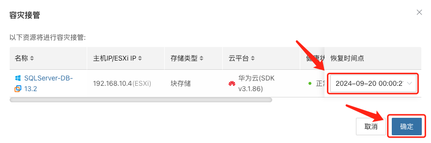

# 故障接管流程

## **启动接管**

* 在 HyperBDR 控制台选择对应业务主机的“容灾接管”功能，按照需求选择恢复快照时间点，并点击确定

系统会根据预先配置的资源编排（计算、存储、网络等）自动化创建或启动目标端实例，等待启动完成，即可登录到目标平台进行验证配置及业务接管。

## **数据校验**

* 业务启动后，检查数据库版本、应用服务配置、依赖服务（如缓存、消息队列）是否正常。

* 若需要，只在灾备环境中进行部分流量测试，确认业务功能可用后再全量切换。

## **DNS / 负载均衡切换**

* 修改 DNS 解析或负载均衡策略，将用户流量指向灾备环境。

* 监控流量变化，确保接管后业务访问正常。

## **确认切换完成**

* 记录接管完成时间，并在监控看板中持续观察系统指标。

* 与业务方沟通验证功能、性能是否达到预期。

## 导出业务接管报告

可以通过平台侧的“报告导出”功能，选择本次接管的主机，导出主机容灾接管详细报告。

将业务接管事件导出的报告进行留存并进一步分析，是否存在优化步骤及流程。
