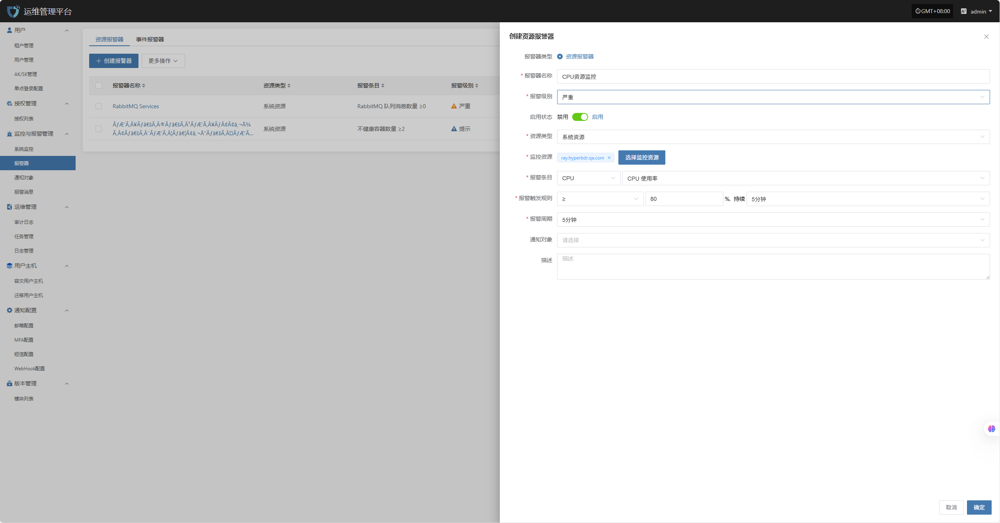
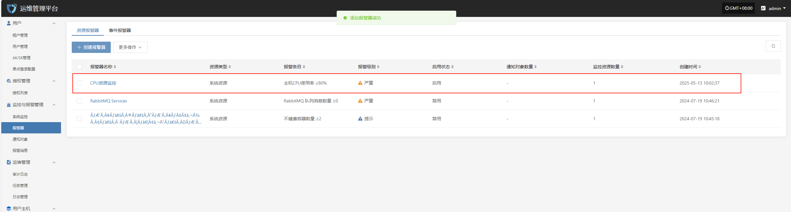
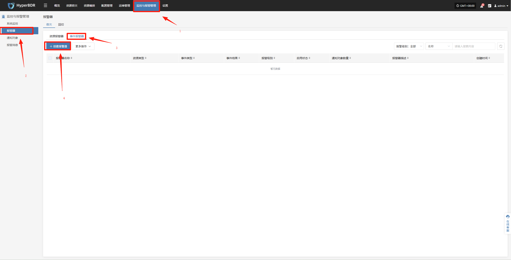
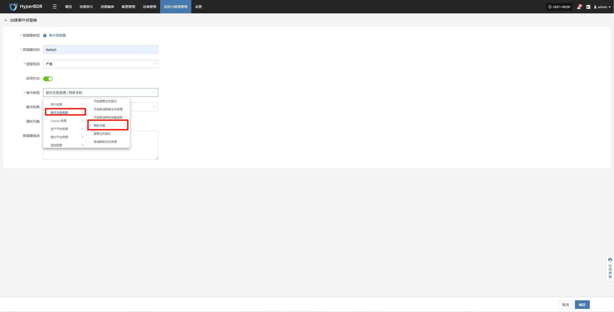
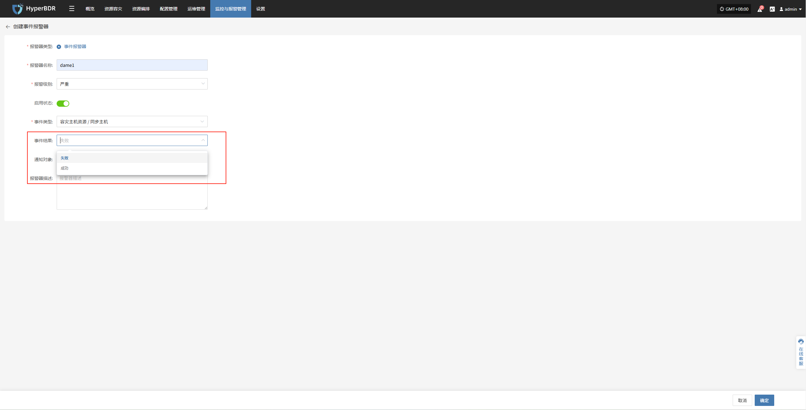

# 告警配置最佳实践

## 资源告警

为保障系统运行的稳定性与资源使用的可控性，已对 CPU、内存及磁盘等关键资源项设置了基础告警阈值。当资源使用率超过设定的预警值时，系统将自动触发告警通知，以便运维人员及时响应与处理，避免资源瓶颈对业务造成影响。

| 资源类型 | 告警指标               | 告警规则               | 告警级别 | 备注 |
|:--------:|:----------------------:|:----------------------:|:--------:|:----:|
| 主机     | CPU 使用率             | ≥ 80%，持续 5 分钟     | 严重     |      |
| 主机     | 内存使用百分比         | ≥ 80%，持续 5 分钟     | 严重     |      |
| 主机     | 根磁盘已使用容量百分比 | ≥ 80%，持续 5 分钟     | 严重     |      |
| 主机     | 不健康容器数量统计     | ≥ 1 个，持续 5 分钟    | 严重     |      |
| RabbitMQ | 队列消息数量           | ≥ 10 个，持续 5 分钟   | 严重     |      |

### 配置示例：CPU 资源-告警配置

* 登录至运维管理平台：IP:30443

  

  * 监控与报警管理--报警器--创建报警器

    

  * 根据实际情况填写对应级别名称，并根据上述表格明确监控范围

    

  * 完成创建

    

## 事件告警

为保障系统运行的安全性与可观测性，已对容灾主机的关键操作行为与异常状态设置了事件监控策略。系统将在检测到如主机失联、同步失败、启动异常等事件时，自动记录并触发告警通知，协助运维人员快速定位问题并及时处理，降低潜在风险对业务的影响。

| 监控资源 | 事件类型 | 事件结果 | 告警级别 | 备注 |
|:--------:|:--------:|:--------:|:--------:|:----:|
| 事件     | 主机失联 | 成功     | 严重     |      |
| 事件     | 同步主机 | 失败     | 严重     |      |
| 事件     | 启动主机 | 失败     | 严重     |      |

### 配置示例：同步数据失败-告警配置

* 登录至控制台：IP:10443

  

  * 监控与报警管理--报警器--事件报警器--创建报警器

    

  * 根据实际情况选择填写对应监控事件类型

    

  * 明确监控事件类型结果

    

  * 完成创建

    