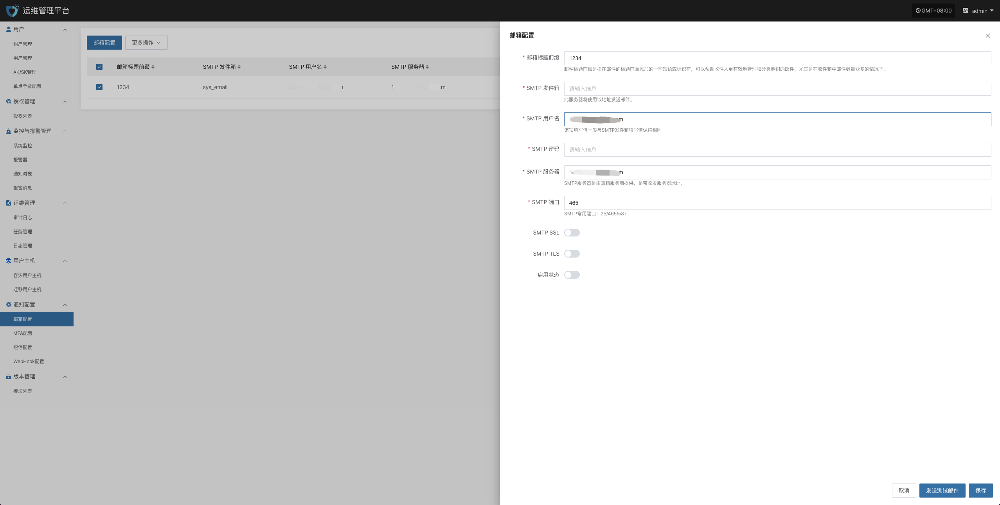
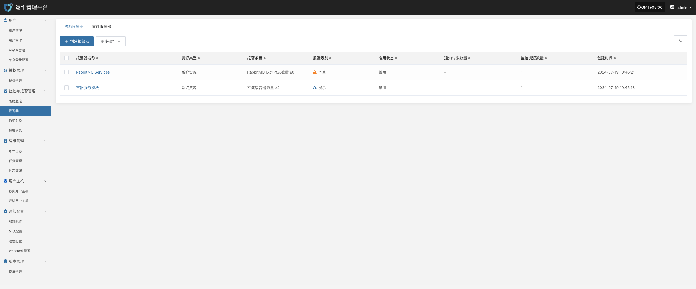

# 告警配置与响应

## **告警阈值设定**

* 针对 CPU、内存、网络、任务失败率等核心指标，设置合理的阈值并分级（警告、严重、紧急）。

* 对关键任务事件（如备份任务）可设置更严格的告警条件。

目前支持对资源和事件创建告警，

* 创建资源报警器

定义报警器名称、报警器级别、资源类型，包含CPU、内存、磁盘、进程进行资源告警配置，达到一定的阀值进行告警事件的发送。

* 创建事件告警

定义事件报警器名称、报警器级别、事件类型，包含容灾主机资源、生产平台资源、容灾平台资源等进行事件告警配置，触发事件之后进行告警事件的发送。

* 重要的告警指标

  * 事件类型：容灾主机资源 “主机失联”，事件结果为“成功”。

  * 事件类型：容灾主机资源 “同步主机”，事件结果为“失败”。

  * 事件类型：容灾主机资源 “启动主机”，事件结果为“失败”。

其他监控指标，可以按照需求进行配置。

## **多渠道通知**

* 配置邮件、短信、IM（如钉钉、微信企业号）等多种告警渠道，确保第一时间获知问题。

* 邮件告警通道

* 短信告警通道

* WebHook告警通道

## **告警响应流程**

* 运维人员收到告警后，应在规定 SLA 时间内进行排查和处理。

* 处理完毕后，更新工单系统或日志，记录故障原因、处理步骤与结果。