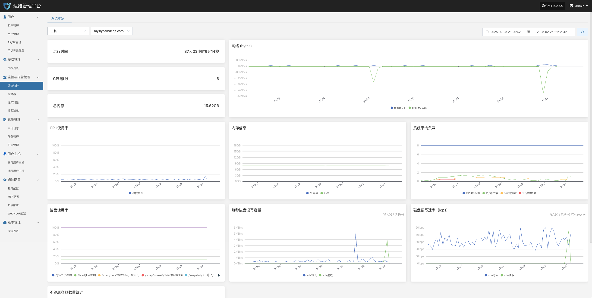

# 日常运维

## 日常检查

### **系统健康检查**

* **控制台状态**：登录 HyperBDR 运维管理平台，检查各个模块的运行状态、CPU/内存/存储等关键资源使用率是否正常。

* **备份任务列表**：查看所有备份任务执行情况，确认是否有失败或延迟过高的任务。

* **日志与告警**：通过日志管理模块日志平台检查是否存在异常告警、错误日志。

### **网络连通性**

* 确保源端（生产环境）与目标端（容灾环境或云平台）之间的网络连接稳定、带宽充足。

* 若使用 VPN、专线或 VPC Endpoint，需定期检查隧道状态是否正常。

### **云账户与授权**

* 定期验证云平台账户的有效性、密钥是否过期。

* 检查账户权限，避免过度授权或缺少关键权限导致备份/恢复失败。

## 资源监控与备份任务检查

### **资源监控**

* **存储空间**：查看对象存储、块存储、数据库存储的剩余容量。若空间不足，需及时扩容或清理历史快照。

* **网络吞吐量**：关注备份高峰期的带宽使用，必要时进行带宽升级或错峰备份策略。

### **备份任务检查**

* **备份策略**：每周或每月审查一次备份策略（全量/增量），根据业务变化及时调整备份频率与保留周期。

* **数据一致性校验**：定期对备份数据进行校验或抽样恢复测试，确认数据完整可用。

* **异常任务处理**：针对备份失败的任务，分析失败原因（网络、权限、存储空间等），及时修复并重新执行。

## 日志的导出

日志管理功能，可以在出现问题后，第一时间通过日志收集功能，收集服务组件的日志进一步分析定位问题。

* 控制台

* 源端同步代理

* Linux主机

* Windows主机

