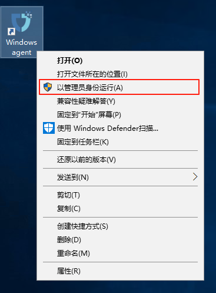
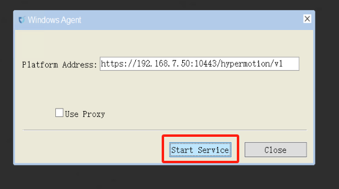

# **Windows Agent运维**

## **运行环境说明**

通过在源端服务器上部署 Agent 程序，实时捕获文件系统或块设备的变化，实现对数据的持续同步，适用于物理服务器、非虚拟化环境或需要更精细控制的场景。

Windows Agent 支持部署在以下版本的 Windows Server 操作系统上：2003 SP2/R2、2008、2008 R2、2012、2012 R2、2016、2019（均为 64 位）。

系统安装在 C:\Program Files (x86)\DiskSync-Agent 目录中（具体路径以实际选择安装路径为准），主要的文件及目录结构：


## **服务健康状态**

运维人员可以通过 Windows 任务管理器检查服务的运行状态，确认服务是否正常运行。

* 任务管理器服务开启方式：

  * 方法1：

    ```plain&#x20;text
    同时按下键盘上 <Ctrl + Alt + Del>
    ```

  * 方法2

    ```plain&#x20;text
    按下 Win + R 打开运行窗口。
    输入 taskmgr，然后按 回车。
    ```

    

## **服务启动/停止/重启**

* **启动服务：**

  * 右键点击桌面的Windows Agent快捷程序，以管理员权限运行。

  

  * 左键点击Start Service

  

  * 警告信息（忽略即可）

  

  

  * 服务启动正常

  

* **停止服务：**

  * 点击Stop Service即可停止服务

  

## **日志管理**

所有系统日志文件存储在`C:\Program Files (x86)\DiskSync-Agent\log`目录中（具体路径以安装选择路径为准\log）。运维人员可以通过查看，日志文件，监控系统运行状态，排查故障，或提供相关文件给到对应项目负责人，确保系统稳定性。


## **配置文件管理**

Windows Agent 的主要配置文件位于 `C:\Program Files (x86)\DiskSync-Agent\config` 目录下（具体路径以实际选择安装路径为准\config），文件名为 `Sysconfig.ini`。该文件包含了 Windows Agent 的各项配置信息，包括服务连接、数据库、同步任务、日志、S3 配置等。

以下是该配置文件的各个部分及其作用说明：

```c++

[SysParam]
HM_URL =https://192.168.7.141:10443/hypermotion/v1
SYNC_NODE_KEY =da8aae5b-facb-452f-8161-5c866f8fafaa

;log level
LOGFLAG=2
                                        
;Filename of successful host registration
REG_FILE=registered        

;Heartbeat interval (seconds)"
HEARTBEAT_INTERVAL=50

;Whether to modify the iscsi initiator name tag, 1: modify; 0: not modify.
MODIFY_INITIATOR=1

;Used for the blobsize in iSCSI mode under non-VSS mode 
COPYSIZE=3

;Proportion of cache files in partition capacity under non-VSS mode. 
SWAPESPACE_PERCENT=10

;Whether to adopt the vss mode: 1. vss mode; 0. normal mode.
VSS_MODEL=1

;The proportion of volume shadow storage on the disk in VSS mode.
VSS_MAX_SIZE_PERCENT=10

;Configuration of volume shadow storage for special volumes in VSS mode, which can be configured for multiple volumes: size (G)
;VSS_SPEC_MAX_C=c:10

;The minimum proportion of free space in the volume.
FREELIMIT_PERCENT=3

apply_scene=dr

; 0: Retry after an error occurs during the synchronization process, with the retry time referring to ERRRETRY_DURATION; 1: Return an error immediately upon a synchronization error. 
ERRORRETURN=0

;Maximum retry duration (in seconds) after a synchronization error. 
ERRRETRY_DURATION=600

;Maximum number of blobs for hook in non-VSS mode. 
HOOKBUFF_BLOCKCOUNT_MAX=256

;Minimum number of blobs for hook in non-VSS mode. 
HOOKBUFF_BLOCKCOUNT_MIN=64

; 1: Write the first sector to the target disk, 0: Do not write the first sector to the target disk. 
WRITE_FIRST_SECTOR=0

;Maximum number of write threads in object storage mode. 
THREAD_COUNT=4

;thread interval(millisecond)
THREAD_INTERVAL=25

;Whether to send the metafile (including the local metafile) to the object storage. 
WRITE_OSS_META=0

;The maximum CPU usage allowed for the process. The actual CPU usage of the process may fluctuate up and down, and online update is supported. 
CPU_USEAGE_SETTING=30

;Specify the disks that do not require synchronization. When there are multiple disks, separate the disk numbers with commas. For example: EXCLUDE_DISKS=1,2. The default is EXCLUDE_DISKS=NULL, which synchronizes all disks.
EXCLUDE_DISKS=NULL

;iscsi service parameters
MaxRequestHoldTime=120
SrbTimeoutDelta=120
LinkDownTime=15
InitialR2T=1
ImmediateData=0
FirstBurstLength=16384
MaxBurstLength=16384
MaxRecvDataSegmentLength=8192

ISCSI_SYNC_STATUS=0
ISCSI_PROTECT_STATUS=0
hyper_exporter_id=c85eb10e1a8f4dd58080d9cbe0d71bf4
LOCAL_LAN=1
use_proxy=0
VSS_CHECK_RESULT=1
```