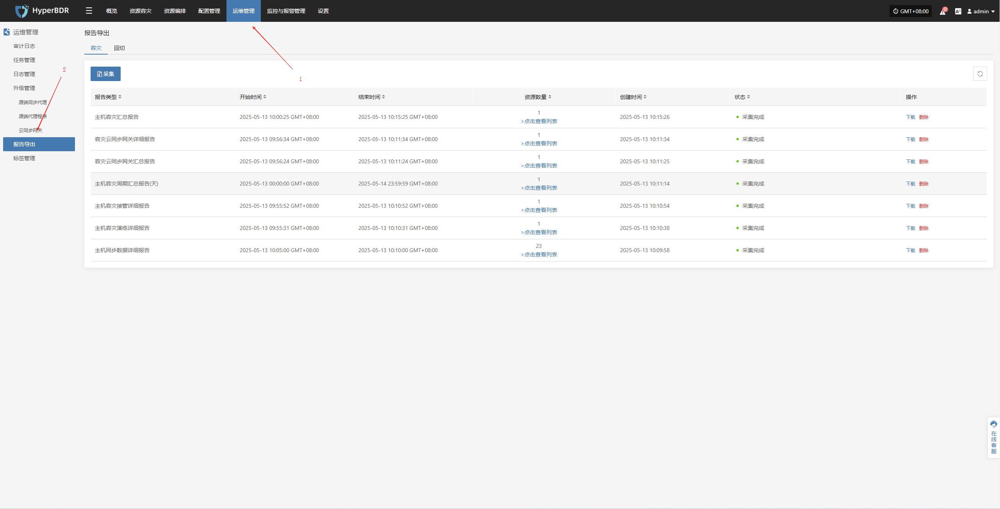
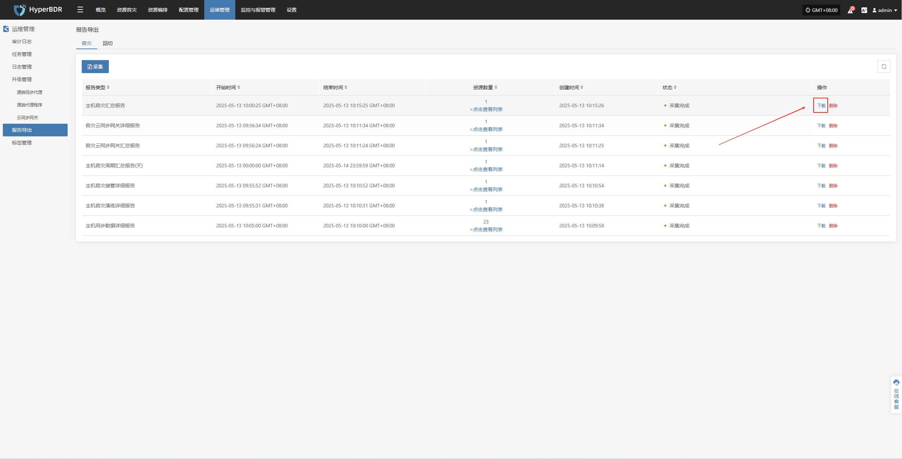

# 报告导出

## 报告导出操作示例

* 登录到 HyperBDR-HyperMotion 控制台

  > * 注意：如果需要下载不同租户的主机信息报表，需要不同租户所属的用户登录控制台进行操作。

  * 点击【操作】>【报表】，进入报表页面。

    

  * 收集报表

    

  * 根据需要选择报表类型、范围、时区、时间范围，确认信息后点击【提交】

    

  * 下载报告

    * 点击\[下载]报告

    

    *
