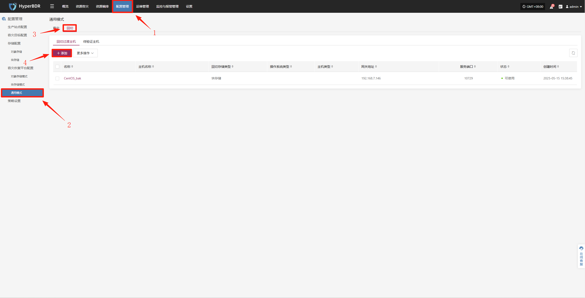
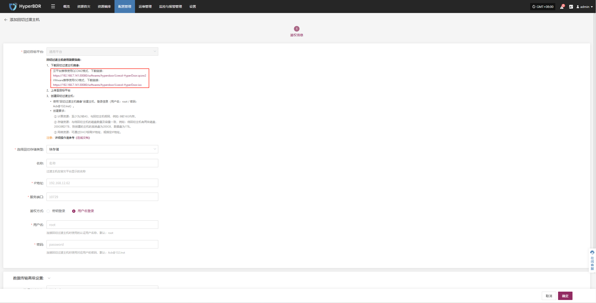

# 临时过渡主机镜像

## 升级准备

系统支持通过平台前端页面执行组件升级，过程平滑，配置无损，适用于日常版本维护与功能更新。

> 在组件升级过程中，同样需要完成上述升级包准备与部署步骤。

## 执行升级

用户可以通过浏览器访问平台登录页面，输入有效的用户名和密码进行身份验证，成功登录后即可在线升级。

因该过度主机特殊性，升级时需要重新配置

* 配置管理--容灾恢复平台配置--通用模式--回切--添加

  

* 根据实际情况下载最新临时过渡主机镜像，重新创建临时过渡主机

  

