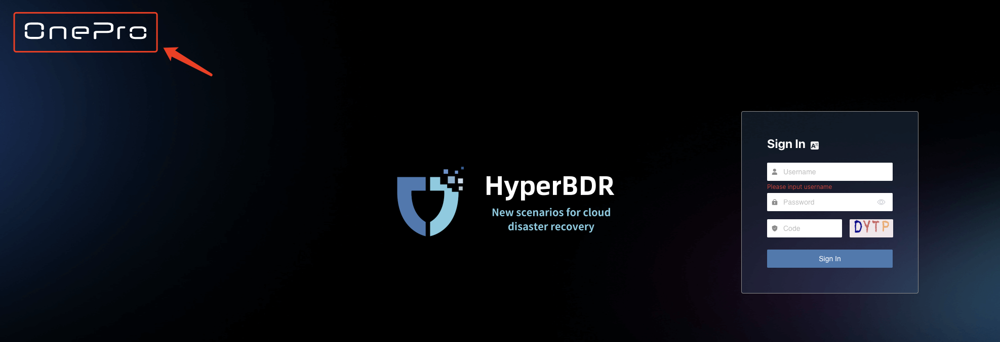
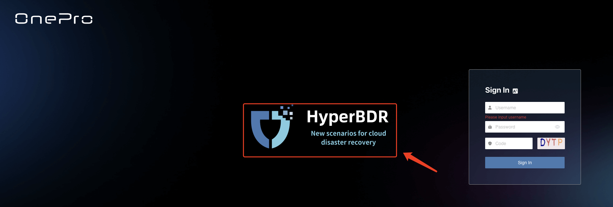
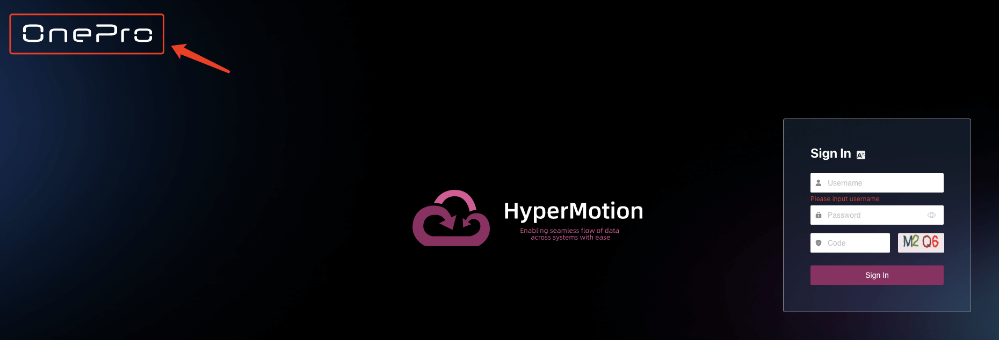
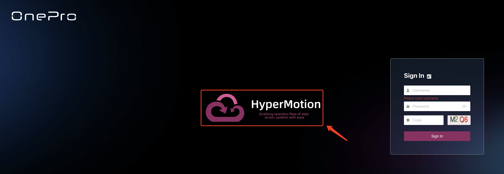
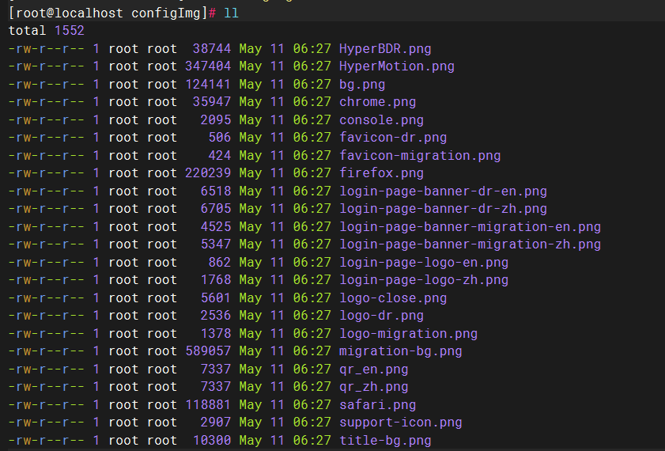
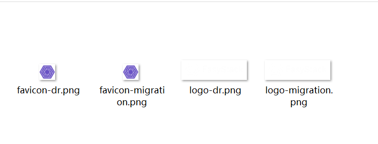

# OEM产品LOGO定制化

本文档主旨，是指导客户根据万博提供的标准安装包，自定义成含有自己LOGO的安装包。

## 上传标准安装包到“迁移/容灾“工具宿主机，并解压

创建一个目录OEM\_self

```plain&#x20;text
mkdir /root/OEM_self
cd /root/OEM_self
```

然后把安装包上传到/root/OEM\_self


解压安装包：

```plain&#x20;text
tar zxvf HyperBDR_release_v5.4.0_20240430-20240511-3091.tar.gz
```

得到installer目录。

## 隐藏登录页面的LOGO图标以及客服图标

### 容灾主页面配置

```plain&#x20;text
cd /root/OEM_self/installer/OEM/newmuse
vi /root/OEM_self/installer/OEM/newmuse/newmuse.json   #输入下列内容(只是示例)
```

```json
{
"title":"MyDR", --> 浏览器标签页文字
"openOnlineService":false, --> 去掉页面的客服
"loginPageLogo":false, --> 去掉登录主页面右上角的OnePro的LOGO
"loginPageBanner": false --> 去掉登录主页面中间的HyperBDR场景LOGO
}
```

* 浏览器标签页文字


* 登录主页面右上角的OnePro LOGO



* 登录主页面中间的HyperBDR场景LOGO



### 迁移主页面配置

```plain&#x20;text
vi /root/OEM_self/installer/OEM/newmuse-motion/newmuse.json  #输入下列内容(只是示例)
```

```json
{
"title":"MyMigration", --> 浏览器标签页文字
"openOnlineService":false, --> 去掉页面的客服
"loginPageLogo":false, --> 去掉登录主页面右上角的OnePro的LOGO
"loginPageBanner": false --> 去掉登录主页面中间的HyperBDR场景LOGO
}
```

* 浏览器标签页文字


* 登录主页面右上角的OnePro LOGO



* 登录主页面中间的HyperBDR场景LOGO



改好之后，安装完成的登录页面显示效果如下：

* 容灾主页面


* 迁移主页面


## 替换服务商自己的LOGO

```plain&#x20;text
cd /root/OEM_self/installer/OEM/newmuse/static/configImg
ll  #展示如下
```



把准备好的图片文件上传到这个目标，覆盖同名的文件即可（如下面4个文件）。

### 迁移Logo替换说明

* favicon-migration.png

浏览器标签页icon图标显示，**尺寸：32 × 32，类型：png**


* logo-migration.png

登录迁移平台之后，左上角显示LOGO，**尺寸：184 × 56，类型：png**


### 容灾Logo替换说明

* favicon-dr.png

浏览器标签页icon图标显示，**尺寸：32 × 32，类型：png**


* logo-dr.png

登录迁移平台之后，左上角显示LOGO，**尺寸：184 × 56，类型：png**



