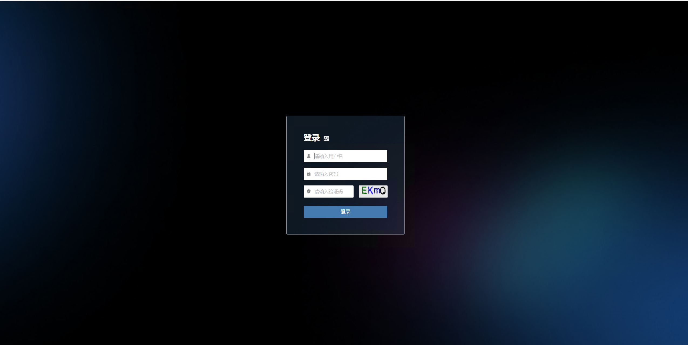
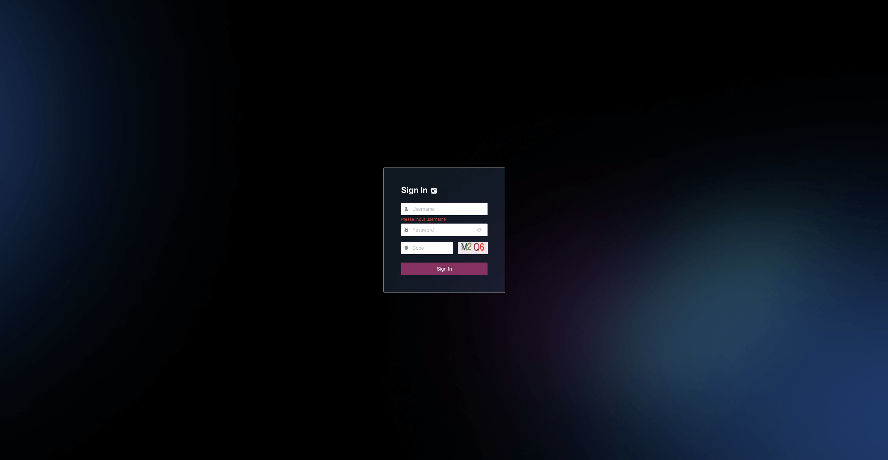

# OEM产品LOGO定制化

本文档主旨，是指导客户根据万博提供的标准安装包，自定义成含有自己LOGO的安装包。

## 上传标准安装包到“迁移/容灾“工具宿主机，并解压

创建一个目录OEM\_self

```plain&#x20;text
mkdir /root/OEM_self
cd /root/OEM_self
```

然后把安装包上传到/root/OEM\_self


解压安装包：

```plain&#x20;text
tar zxvf HyperBDR_release_v5.4.0_20240430-20240511-3091.tar.gz
```

得到installer目录。

## 隐藏登录页面的LOGO图标以及客服图标

### 容灾主页面配置

```plain&#x20;text
cd /root/OEM_self/installer/OEM/newmuse
vi /root/OEM_self/installer/OEM/newmuse/newmuse.json   #输入下列内容(只是示例)
```
```json
{
"oem": true,
"title": "MyDR",
"openOnlineService": false,
"loginPageLogo": false,
"loginPageBanner": false
}
```

```plain text
代码示意：
{
"oem": true,  --> 开启oem功能
"title": "MyDR", --> 浏览器标签页文字
"openOnlineService": false, --> 去掉页面的客服
"loginPageLogo": false, --> 去掉登录主页面右上角的OnePro的LOGO
"loginPageBanner": false --> 去掉登录主页面中间的HyperBDR场景LOGO
}
```

* 浏览器标签页文字


* 登录主页面右上角的OnePro LOGO


* 登录主页面中间的HyperBDR场景LOGO


### 迁移主页面配置

```plain&#x20;text
vi /root/OEM_self/installer/OEM/newmuse-motion/newmuse.json  #输入下列内容(只是示例)
```
```json
{
"oem": true,
"title": "MyMigration",
"openOnlineService": false,
"loginPageLogo": false,
"loginPageBanner": false
}
```

```plain test
代码示意：
{
"oem": true,  --> 开启oem功能
"title": "MyMigration", --> 浏览器标签页文字
"openOnlineService": false, --> 去掉页面的客服
"loginPageLogo": false, --> 去掉登录主页面右上角的OnePro的LOGO
"loginPageBanner": false --> 去掉登录主页面中间的HyperBDR场景LOGO
}
```

* 浏览器标签页文字


* 登录主页面右上角的OnePro LOGO


* 登录主页面中间的HyperBDR场景LOGO


改好之后，安装完成的登录页面显示效果如下：

* 容灾主页面



* 迁移主页面



## 替换服务商自己的LOGO

```plain&#x20;text
cd /root/OEM_self/installer/OEM/newmuse/static/configImg
ll  #展示如下
```


把准备好的图片文件上传到这个目标，覆盖同名的文件即可（如下面4个文件）。

### 迁移Logo替换说明

* favicon-migration.png

浏览器标签页icon图标显示，**尺寸：32 × 32，类型：png**


* logo-migration.png

登录迁移平台之后，左上角显示LOGO，**尺寸：184 × 56，类型：png**


### 容灾Logo替换说明

* favicon-dr.png

浏览器标签页icon图标显示，**尺寸：32 × 32，类型：png**


* logo-dr.png

登录迁移平台之后，左上角显示LOGO，**尺寸：184 × 56，类型：png**


### 工具安装

```plain&#x20;text
bash /root/OEM_self/installer/install.sh -i <服务IP>  # 如果不加“-i <服务IP>”，则会用默认的主机IP地址
```
等待安装完成。
安装完成之后，执行命令：
```plain&#x20;text
sed -i s/HyperBDR/<标签名称>/g /opt/installer/production/venvs/newmuse-venv/index.html
```
<标签名称>：公司产品名称

至此，安装完成，可以在浏览器中访问:

容灾工具：https://<服务IP>:10443 (默认用户名密码： admin/P@ssw0rd)

迁移工具：https://<服务IP>:10443 (默认用户名密码： admin/P@ssw0rd)