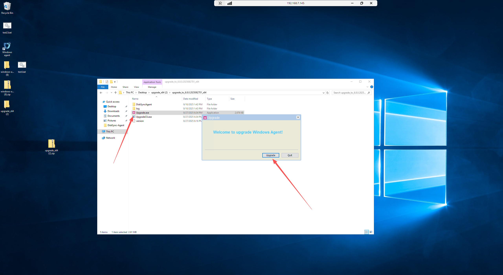
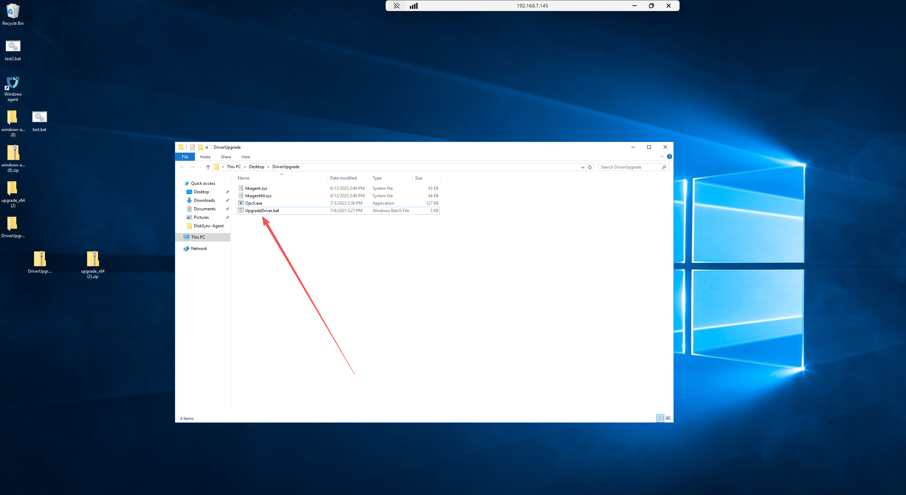
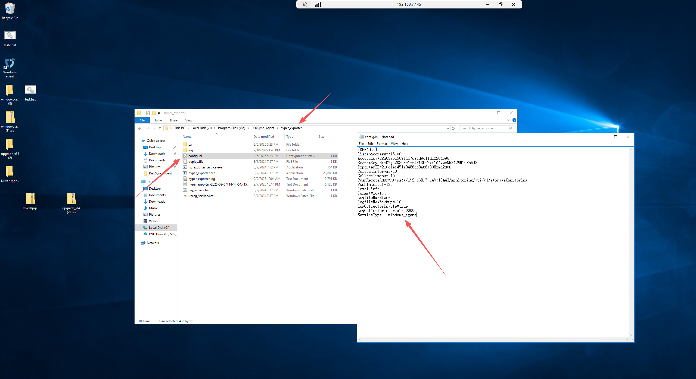

# HyperBDR 5.6.x - 5.11.x 版本升级操作指导
为了进一步提升传输链路的稳定性和可靠性，HyperBDR 在新版本中引入了一种全新的、基于用户态实现的传输协议。该协议相较于传统内核态机制，在弱网环境下表现出更优的稳定性，能够有效减少中断和传输失败的情况。因此，我们强烈建议用户尽快升级至最新版本以获得更好的使用体验。

但需注意，由于现有块存储模块与新协议存在兼容性问题，用户需同步升级 HyperBDR 控制端以及部署在主机上的 Agent（无须卸载），方可启用此全新传输协议。

本手册介绍了 **从 HyperBDR 5.x 升级到最新版本** 的两种方式：

* **原地升级方案**（配置保持，用户感知更友好）

* **完全卸载方案**（推荐，步骤简洁）

⚠️ 注意：两种方案均需在升级完成后 **重新执行全量数据同步**。

***

## 方案一、原地升级方案

### 清理资源配置

* 将开始容灾机器解除注册主机，将其解除回到第二步骤，等待后续更新完毕后重新完成容灾配置

### 更新HyperBDR

* ssh登录HyperBDR控制台主机

* 由于版本升级部分目录调整，在开始升级前需要进行如下操作

```bash
##创建venv目录
mkdir -p /opt/installer/production/venvs/atomy-s3block-venv
mkdir -p /opt/installer/production/venvs/SwiftS3Block-venv
mkdir -p /opt/installer/production/venvs/hyper_up-venv
##初始化版本号
echo "0.0.0" > /opt/installer/production/venvs/atomy-s3block-venv/version
echo "0.0.0" > /opt/installer/production/venvs/SwiftS3Block-venv/version
echo "0.0.0" > /opt/installer/production/venvs/hyper_up-venv/version
```

```bash
##重置版本号
rm -rf /opt/installer/production/config/supervisor-dashboard/VERSION/versions.json
```

```bash
##删除无效目录
rm -rf /opt/installer/production/venvs/scripts-venv/version_info/
```

* 参考官网升级手册进行安装升级：[点击查看](https://docs.oneprocloud.com/zh/userguide/dr/operations/upgrade.html#%E5%8D%87%E7%BA%A7%E5%87%86%E5%A4%87)

### 更新云同步网关

* 由于网关进行迭代升级低于6.2版本暂不支持进行版本迭代，更新至新版后，请重新扩展完成云同步网关构建

  * 删除所有iscsi网关和过渡主机镜像

  * 页面删除iscsi网关

  * 云平台删除Cloud\_SYNC相关名字的安全组

  * 扩展S3网关

### 更新同步代理(hamal)

* ssh登录同步代理主机

* 初始化版本号

  ```bash
  #创建hyper_exporter目录
  mkdir -p /opt/hyper_exporter/
  #初始化版本号
  echo "0.0.0" > "/opt/hyper_exporter/exporter_version"
  ```

* 下载最新升级脚本

  > 注意替换\<HyperBDR IP>为HyperBDR控制台主机地址

  ```bash
  curl -k -o /usr/local/hyper_exporter/update_sync_proxy.sh https://<HyperBDR IP>:30080/softwares/update_sync_proxy.sh
  ```

* 赋予执行权限

  ```bash
  chmod +x /usr/local/hyper_exporter/update_sync_proxy.sh
  ```

* 执行升级脚本

  ```bash
  #进入脚本路径
  cd /usr/local/hyper_exporter/
  #执行升级
  bash update_sync_proxy.sh -y
  ```

* 更新配置

  ```bash
  CONFIG_DIR="/opt/hyper_exporter"
  sed -i '/^ServiceType/d' "$CONFIG_DIR/config.ini"
  echo "ServiceType = hamal" >> "$CONFIG_DIR/config.ini"
  ```

* 重启监控模块

  ```bash
  systemctl restart hyper_exporter
  ```

### 更新Agent

* Linux Agent

  * ssh登录Agent源端主机

  * 初始化版本号

  ```bash
  #创建hyper_exporter目录
  mkdir -p /usr/local/hyper_exporter/
  #初始化版本号
  echo "0.0.0" > "/usr/local/hyper_exporter/exporter_version"
  ```

  * 下载最新升级脚本

  > 注意替换\<HyperBDR IP>为HyperBDR控制台主机地址

  ```bash
  curl -k -o /var/lib/egisplus-agent/upgrade_agent.sh https://<HyperBDR IP>:30080/softwares/upgrade_agent.sh
  ```

  * 赋予执行权限

  ```bash
  chmod +x /var/lib/egisplus-agent/upgrade_agent.sh
  ```

  * 执行升级脚本

  ```bash
  #进入脚本路径
  cd /var/lib/egisplus-agent/
  #执行升级
  bash upgrade_agent.sh
  ```

  * 更新配置

  ```bash
  CONFIG_DIR="/usr/local/hyper_exporter"
  sed -i '/^ServiceType/d' "$CONFIG_DIR/config.ini"
  echo "ServiceType = linux_agent" >> "$CONFIG_DIR/config.ini"
  ```

  * 重启监控模块
  > 对于较旧的操作系统（如 CentOS 6、RHEL 6、Ubuntu 14.04 及更早版本），可能仍使用 SysV init，需改用 service 命令执行等效操作。

  ```bash
   #systemd 系统（推荐）
   systemctl restart hyper-exporter-agent.service
   #旧系统（SysV init）
   service hyper-exporter-agent restart

  ```

* Windows Agent

  * 登录Windows源端主机

  * 下载最新升级包,根据自身服务器配置选择下载对应版本

    > 注意替换\<HyperBDR IP>为HyperBDR控制台主机地址

    * x86

      ```bash
      https://<HyperBDR IP>:30080/softwares/windows-agent-new/upgrade_x86.zip
      ```

    * x64

      ```bash
      https://<HyperBDR IP>:30080/softwares/windows-agent-new/upgrade_x64.zip
      ```

  * 解压下载的ZIP文件

  * 右击以管理员身份运行`Upgrade.exe`，按照提示完成升级

    

  * 下载最新驱动包

  > 当前阶段请先手动下载：[点击下载](https://hyperbdr-system-image-do-not-delete.obs.ap-southeast-3.myhuaweicloud.com/upgrade_packages/DriverUpgrade.zip)

  * 升级驱动程序

  ```bash
  #解压ZIP文件后，并进入解压目录
  #右击以管理员身份运行
  UpgradeDriver.bat
  ```

  

  * 更新配置

  ```bash
  #具体以实际安装目录为准
  C:\Program Files (x86)\DiskSync-Agent\hyper_exporter
  #编辑配置文件config.ini,在最后一行添加
  ServiceType = windows_agent
  ```

  

  * 重新启动Agent程序

### 验证升级

* 登录HyperBDR页面查看版本信息，参考官方FQA手册：[点击查看](https://qa.oneprocloud.com/questions/D1L6)

* 登录HyperBDR页面检查是否可以获取Agent、Agentless版本

  

### 全量同步数据

重新完成存储配置开始进行数据同步，详情可见HyperBDR产品使用手册

HyperBDR手册：[点击查看](https://docs.oneprocloud.com/userguide/dr/dr/host-dr.html#setup-dr)

HyperMotion手册：[点击查看](https://docs.oneprocloud.com/userguide/migration/migration/host-migration.html#setup-migration)

## 方案二、完全卸载方案

### 清理环境

* 登录HyperBDR控制台

  * 根据页面配置信息，清除相关资源配置

    * 主机资源（根据页面提示，分别解除注册主机）：

      * 配置管理-->生产站点配置--源端同步代理

        * 可参考官方文档：[点击查看](https://docs.oneprocloud.com/zh/userguide/dr/configuration/production-site.html#%E8%A7%A3%E7%BB%91)

      * 资源容灾-->主机容灾-->选择主机

        * 可参考官方文档：[点击查看](https://docs.oneprocloud.com/userguide/dr/dr/host-dr.html#deregister-host)

      * 资源容灾-->主机容灾-->容灾配置

        * 选中需要解除注册的主机 --> Action --> Deregister Host

      * 资源容灾-->主机容灾-->开始容灾

        * 可参考官方文档：[点击查看](https://docs.oneprocloud.com/userguide/dr/dr/host-dr.html#deregister-host-1)

    * 存储配置（根据页面提示，分别解绑块存储和对象存储配置）：

      * 配置管理-->存储配置-->对象存储

        * 可参考官方文档：[点击查看](https://docs.oneprocloud.com/userguide/dr/dr-site-configuration-obs/huawei.html#delete)

      * 配置管理-->存储配置-->块存储

        * 可参考官方文档：[点击查看](https://docs.oneprocloud.com/userguide/dr/dr-site-configuration-block/alibaba.html#delete)

* 登录Linux主机

  * 卸载原有Agent程序：[点击查看](https://docs.oneprocloud.com/userguide/dr/configuration/production-site.html#uninstall-linux-agent)

* 登录Windows主机

  * 卸载原有Agent程序：[点击查看](https://docs.oneprocloud.com/userguide/dr/configuration/production-site.html#uninstall-windows-agent)

### 更新HyperBDR

* 参考官网升级手册进行安装升级：[点击查看](https://docs.oneprocloud.com/userguide/dr/operations/upgrade.html)

### 重新安装云同步网关

* 完成块存储配置：[点击查看](https://docs.oneprocloud.com/userguide/dr/configuration/storage-configuration.html#block-storage)

### 重新安装同步代理

* 完成生产站点配置：[点击查看](https://docs.oneprocloud.com/userguide/dr/configuration/production-site.html)

### 重新安装Agent

* 安装Agent程序

  * Linux主机：[点击查看](https://docs.oneprocloud.com/userguide/dr/configuration/production-site.html#linux-agent)

  * Windows主机：[点击查看](https://docs.oneprocloud.com/userguide/dr/configuration/production-site.html#windows-agent)

### 重新安装验证

* 参考官方FQA手册：[点击查看](https://qa.oneprocloud.com/questions/D1L6)

### 全量同步数据

重新配置主机资源及存储配置开始进行数据同步，详情可见HyperBDR产品使用手册

HyperBDR手册：[点击查看](https://docs.oneprocloud.com/userguide/dr/)

HyperMotion手册：[点击查看](https://docs.oneprocloud.com/userguide/migration/)

