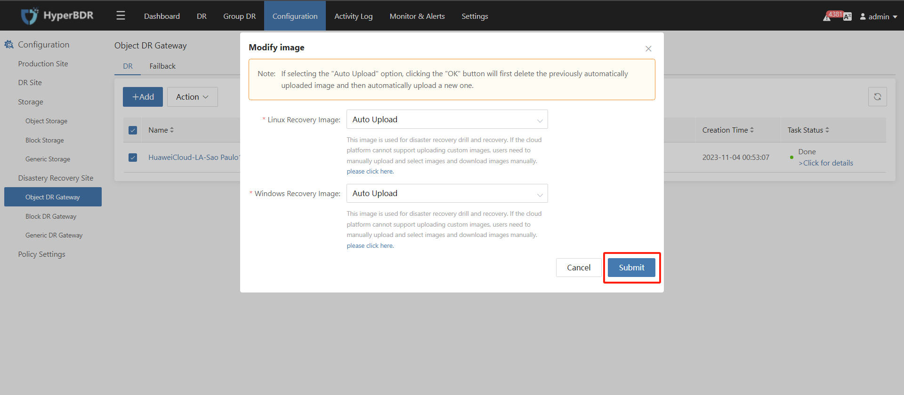

# HyperBDR 升级手册

[[toc]]

::: tip
注意：升级支持的最低 HyperBDR 版本为 4.4.0。低于 HyperBDR 4.4.0 的版本不支持升级到最新版本。
:::

## HyperBDR 服务器升级

[升级包下载链接](https://hyperbdr-system-image-do-not-delete.obs.ap-southeast-3.myhuaweicloud.com/upgrade_incremental_4.4.0_to_5.2.0.tar.gz)

### 获取并解压升级包

- 步骤 1：获取升级包 URL。

- 步骤 2：将升级包下载到 **HyperBDR 控制台**操作系统，并使用以下命令解压：

```shell
tar zxvf upgrade_incremental_4.4.0_to_4.9.0.tar.gz -C /tmp/
```

### 检查当前安装版本

```shell
cat /opt/installer/Version
HyperBDR_release_v4.9.0_20230928-20230927-1437.tar.gz
```

当前安装版本为 HyperBDR_release_v4.9.0_20230928

> 如果 HyperBDR 版本早于 4.6.0，请执行以下额外步骤：

```shell
[root@log images]# cd /tmp/upgrade/images
[root@log images]# ls
influxdb-1.7.6.tar.gz  mariadb-10.3.36.tar.gz  rabbitmq-3.8.16.tar.gz  redis-7.0.2-alpine.tar.gz

[root@log images]# docker load -i influxdb-1.7.6.tar.gz
[root@log images]# docker load -i mariadb-10.3.36.tar.gz
[root@log images]# docker load -i rabbitmq-3.8.16.tar.gz
[root@log images]# docker load -i redis-7.0.2-alpine.tar.gz
```

### 更新服务

- 步骤 1：替换更新命令：

```shell
cp /tmp/upgrade/scripts/common.sh /opt/installer/production/scripts/
cp /tmp/upgrade/scripts/hmctl /opt/installer/production/scripts/
```

- 步骤 2：执行更新命令

```shell
/opt/installer/production/scripts/hmctl upgrade /tmp/upgrade/venvs
```

### 更新配置文件

```shell
mv /opt/installer/production/config/newmuse/json/config.json.bak /opt/installer/production/config/newmuse/json/config.json
mv /opt/installer/production/config/newmuse/json/s3.json.bak /opt/installer/production/config/newmuse/json/s3.json
mv /opt/installer/production/config/newmuse/json/targetClouds.json.bak /opt/installer/production/config/newmuse/json/targetClouds.json
mv /opt/installer/production/config/newmuse-motion/json/config.json.bak /opt/installer/production/config/newmuse-motion/json/config.json
mv /opt/installer/production/config/newmuse-motion/json/s3.json.bak /opt/installer/production/config/newmuse-motion/json/s3.json
mv /opt/installer/production/config/newmuse-motion/json/targetClouds.json.bak /opt/installer/production/config/newmuse-motion/json/targetClouds.json
```

### 确认升级后的版本

升级完成后，执行以下命令查看当前 HyperBDR 版本：

```shell
[root@localhost installer]# cat /opt/installer/Version

HyperBDR_release_v5.2.0_20230928-20230927-1437.tar.gz
```

当前安装版本为 HyperBDR_release_v5.2.0_20230928

## 更新 **Linux Agent**、**Windows Agent** 和无代理 **同步代理**

### 限制条件

> 注意：请先升级 HyperBDR 服务器端。
> V4.10.1 之前的安装包无法直接使用更新脚本进行更新。
> 在同步主机或启动主机等任务执行期间禁止进行更新操作。

### 无代理同步代理

- 步骤 1：登录无代理同步代理服务器

```shell
ssh root@<无代理同步代理服务器IP>
```

- 步骤 2：获取最新更新脚本

```shell
curl -k -o /usr/local/hyper_exporter/upgrade_hamal.sh https://<HyperBDR IP>:30080/softwares/upgrade_hamal.sh
```

- 步骤 3：授予执行权限

```shell
chmod +x /root/upgrade.hamal.sh
```

- 步骤 4：执行更新命令

```shell
cd /usr/local/hyper_exporter/
bash /usr/local/hyper_exporter/upgrade_hamal.sh
```

### Linux Agent

- 步骤 1：登录 Linux Agent 主机

```shell
ssh root@<Agent 主机 IP>
```

- 步骤 2：获取最新更新脚本

```shell
curl -k -o /var/lib/egisplus-agent/upgrade_agent.sh https://<HyperBDR-IP>:30080/softwares/upgrade_agent.sh
```

- 步骤 3：执行更新脚本

```shell
bash /var/lib/egisplus-agent/upgrade_agent.sh
```

### Windows Agent

- 步骤 1：登录源 Windows Agent 服务器桌面

- 步骤 2：将更新文件下载到 Windows Agent 服务器

```shell
# X64 版本
https://<HyperBDR IP>:30080/softwares/windows-agent-new/upgrade_to_xxx_x64.zip

# X86 版本
https://<HyperBDR IP>:30080/softwares/windows-agent-new/upgrade_to_xxx_x86.zip
```


- 步骤 3：解压下载的文件


- 步骤 4：执行 Upgrade.exe


## 源对象 DR 网关升级

源对象 DR 网关需要重新上传镜像到云平台。


