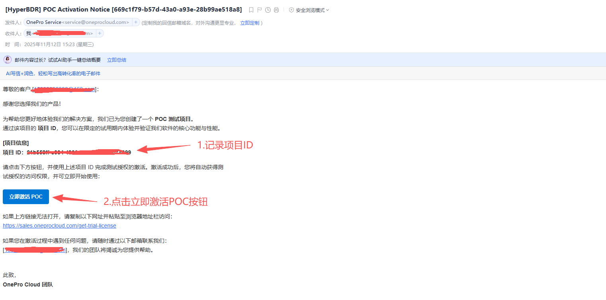
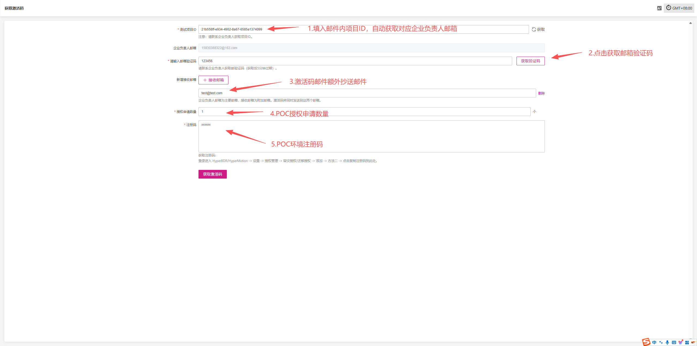
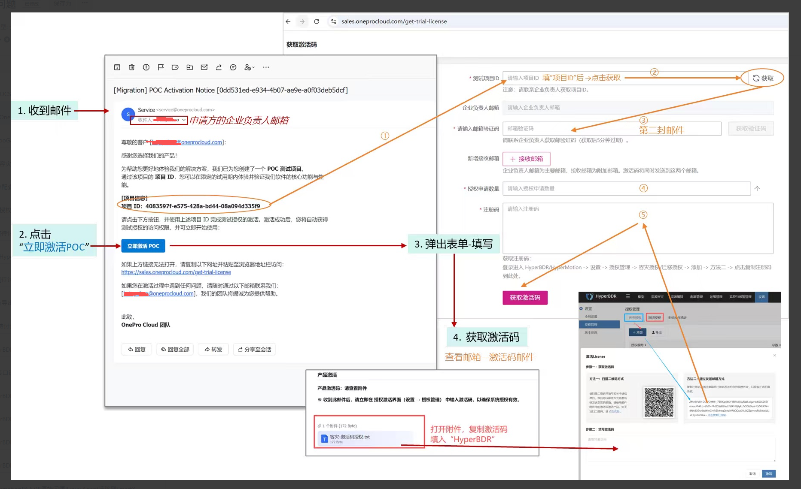

# POC授权申请指南

1. 打开 POC 授权通知邮件，记录邮件中的 **项目 ID**，并点击【立即激活 POC】按钮，跳转至授权激活页面。

   

2. 授权激活页面  
   1. 在「测试项目 ID」输入框中填入邮件内的项目 ID，系统将自动获取对应的企业负责人邮箱。

      ::: tip 💡 提示
      请务必核实邮箱地址是否正确，确认无误后再执行后续操作。
      :::

   2. 点击【获取邮箱注册码】，并联系企业负责人获取对应的注册码。
   3. 如需将激活码邮件发送至其他邮箱，可添加新的接收邮箱地址。
   4. 填写本次申请的 **POC 授权数量**。
   5. 填入 **POC 环境注册码**。

      ::: tip 💡 提示
      若需申请 **容灾** 或 **回切授权**，页面中将自动显示相应的回切注册码输入框。
      :::

   

3. 整体激活流程

   
