# Agent主机源端预设置

[[toc]]

## 配置待容灾主机时间同步服务

::: tip
确保主机时间与网络时间保持同步  
此操作示例仅供参考，实际情况请根据待容灾主机自身情况自行配置
:::

### Windows

::: tip
示例操作系统: Windows Server 2012 R2
:::

#### 使用Windows系统时间工具进行配置

点击桌面 Windows 图标 > 打开控制面板 > 选择“日期和时间”进行配置。


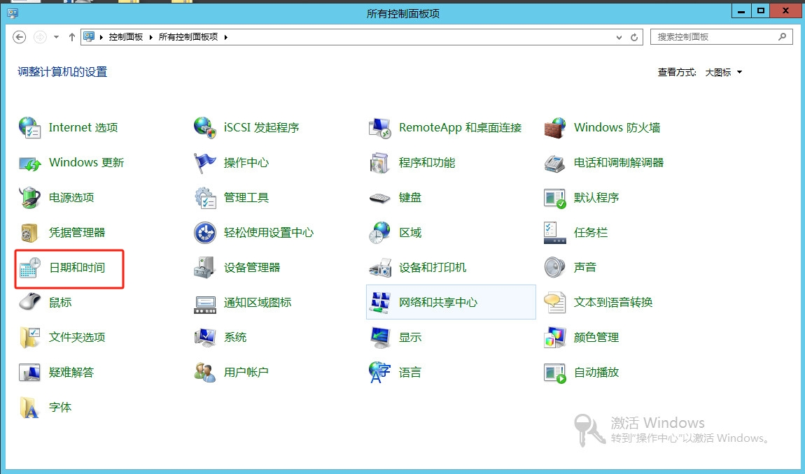

#### 设置时间自动同步到Internet

在“日期和时间”选项卡中，点击“Internet Time”， 点击“更改设置”。

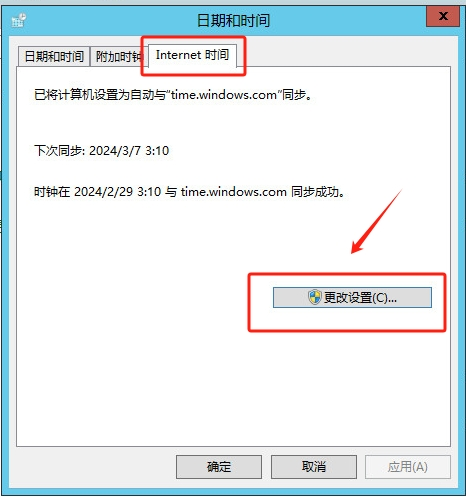

勾选“与 Internet 时间服务器同步”选项，在“服务器”下拉菜单中选择一个时间服务器（例如，time.windows.com）。

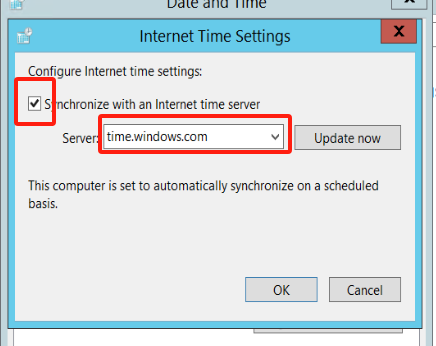

点击“立即更新”测试连接，并等待确认。点击“确定”保存更改。

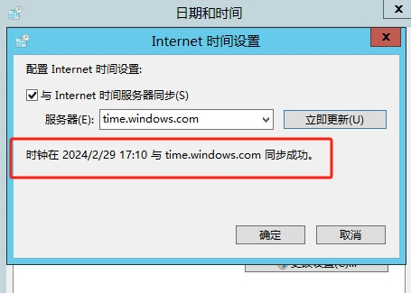

#### 设置自动同步到本地时间同步服务器

 
如果你的主机在内网环境，需要将地址配置为您本地的时间同步服务器地址。

::: tip

其中<ntp.server.ip.address>是您的ntp服务器ip地址

:::

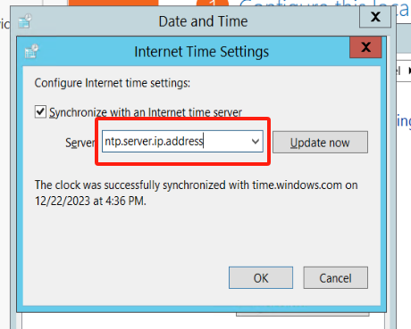


点击“立即更新”按钮，等待与Internet时间服务器同步。

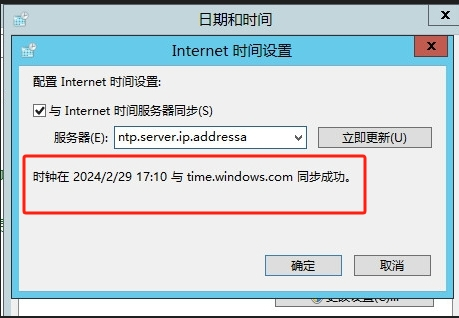

### Linux

::: tip
示例操作系统: CentOS Linux release 7.5
:::

#### 安装NTP  

```shell

 [root@node ~]# yum install -y ntp

```

#### 启动NTP服务

```shell

[root@node ~]# systemctl start  ntpd

[root@node ~]# systemctl enable  ntpd

Created symlink from /etc/systemd/system/multi-user.target.wants/ntpd.service to /usr/lib/systemd/system/ntpd.service.

```

#### 查看NTP服务状态

```shell

[root@node ~]# systemctl status ntpd

● ntpd.service - Network Time Service

   Loaded: loaded (/usr/lib/systemd/system/ntpd.service; enabled; vendor preset: disabled)

   Active: active (running) since Thu 2022-08-04 08:00:47 CST; 7h left

 Main PID: 20746 (ntpd)

    Tasks: 1

   Memory: 768.0K

   CGroup: /system.slice/ntpd.service

           └─20746 /usr/sbin/ntpd -u ntp:ntp -g


Aug 04 08:00:47 node ntpd[20746]: Listen normally on 6 lo ::1 UDP 123
Aug 04 08:00:47 node ntpd[20746]: Listen normally on 7 ens33 fe80::8a83:7297:7cb8:9934 UDP 123
Aug 04 08:00:47 node ntpd[20746]: Listening on routing socket on fd #24 for interface updates
Aug 04 08:00:47 node systemd[1]: Started Network Time Service.
Aug 04 08:00:47 node ntpd[20746]: 0.0.0.0 c016 06 restart
Aug 04 08:00:47 node ntpd[20746]: 0.0.0.0 c012 02 freq_set kernel 0.000 PPM
Aug 04 08:00:47 node ntpd[20746]: 0.0.0.0 c011 01 freq_not_set
Aug 04 08:00:56 node ntpd[20746]: 0.0.0.0 c61c 0c clock_step -28798.353463 s
Aug 04 00:00:57 node ntpd[20746]: 0.0.0.0 c614 04 freq_mode
Aug 04 00:00:58 node ntpd[20746]: 0.0.0.0 c618 08 no_sys_peer
```

#### 修改ntp.conf文件

::: tip
请确保将 time.example.com 替换为你想要使用的实际NTP服务器地址。这个命令在修改后会直接保存文件，所以在执行前确保您对配置的修改没有问题。
:::

```shell
# 将以server开头的行注释掉。
# 在文件的末尾添加新的NTP服务器地址。
[root@localhost ~]# sudo sed -i -e '/^server/ s/^server/#&/' -e '$ a server time.example.com iburst' /etc/ntp.conf

```

#### 重启NTP服务

```shell

[root@node ~]# systemctl restart ntpd

```

#### 检查同步状态

```shell

[root@node ~]# ntpq -p

     remote           refid      st t when poll reach   delay   offset  jitter

==============================================================================

 203.107.6.88    100.107.25.114   2 u    2   64    1   30.975  149.499   0.393

```

## 验证源主机时间是否与UTC同步 

::: tip
出于安全目的，OBS会校验客户端与OBS服务器的时间差，当该时间差大于15分钟时，OBS服务器会拒绝您的请求，从而出现此报错。请根据本地UTC时间调整本地时间后再访问。
:::

### Windows系统时间查看

点击桌面 Windows 图标 > 打开控制面板，选择“日期和时间”。

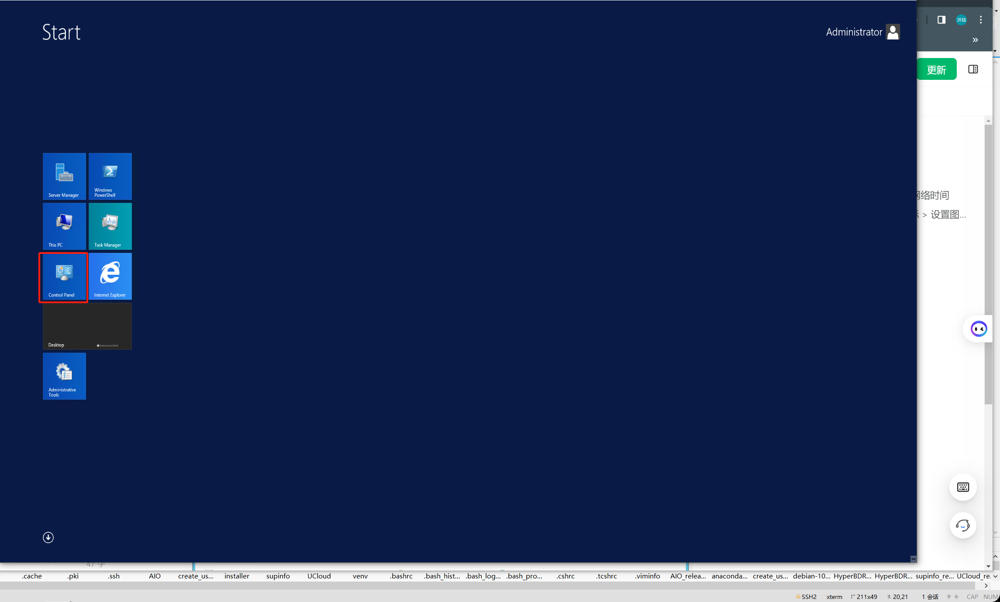


 
查看时间与时区

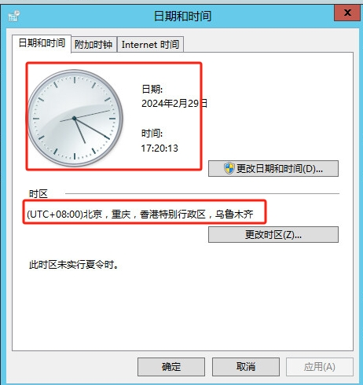


---

### Linux系统时间查看

1. **打开终端:**
   -   使用终端应用，如Terminal。
2. **执行命令查看当前系统时间：**
```
date
```


3. **执行命令查看当前系统时区：**
```
timedatectl
```


### 查看UTC网络时间：


1. **确认源端主机的时区和时间。**
2. **网络查询标准UTC时间并与源端主机比对。**


## 容灾主机初步调研
### Windows操作系统版本获取

::: tip
示例操作系统：Microsoft Windows Server 2016 Datacenter
:::

#### 控制面板方式获取
打开 【控制面板】→【系统和安全】，系统获取相关信息。
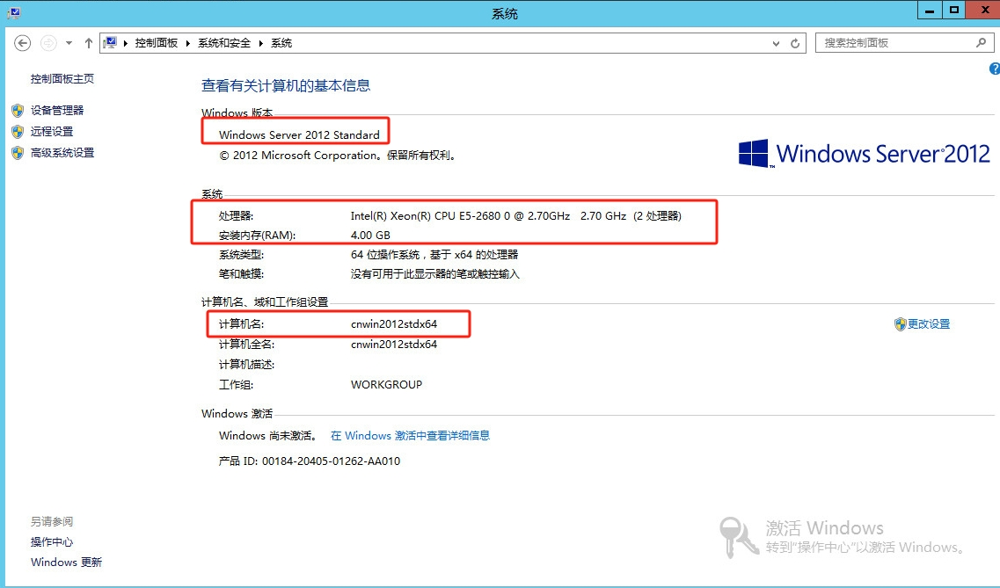

#### 命令行方式获取
登录Windows服务器，快捷键 Win + R 打开 CMP 窗口，执行以下命令：
```powershell
systeminfo
```


输出内容中，您可以查看OS名称。

> **主机名：** NGINX-WEB  
> **OS名称：** Microsoft Windows Server 2016 Datacenter

### Linux操作系统版本获取
> 示例操作系统：CentOS 7.9

运行以下命令，查看操作系统版本。
```shell
cat /etc/redhat-release
```

输出内容即为操作系统版本信息。  


### 检查主机是否支持Agent容灾
检查源主机的操作系统和版本，并与Agent支持列表进行比较，判断灾备主机是否支持Agent容灾。

### Agent支持列表

::: tip
【√】: 完整支持 
:::

::: tip
目前Linux Agent 仅支持官方发布的Ubuntu LTS版本，对于其他基于Ubuntu的定制化版本，我们暂时不提供支持。  
如果生产环境中使用了定制化的Ubuntu版本，我们需要产品侧进行内部评估，并根据实际现场情况进行必要的定制化构建，一旦构建完成并通过了内部完整性测试，我们将会提供更新，以支持您的生产环境。
:::

| **操作系统**[生产源端] | **版本** | **支持信息** |
| :---: | :---: | :---: |
| **Windows Server** |  2003 SP2/R2 (64-bit) | √ |
| **Windows Server** |  2008(64-bit) | √ |
| **Windows Server** |  2008 R2(64-bit) | √ |
| **Windows Server** |  2012(64-bit) | √ |
| **Windows Server** |  2012 R2(64-bit) | √ |
| **Windows Server** |  2016(64-bit) | √ |
| **Windows Server** |  2019(64-bit) | √ |
| **Linux** | CentOS 6.5+(64-bit) | √ |
| **Linux** | CentOS 7.x(64-bit) | √ |
| **Linux** | CentOS 8.x(64-bit) | √ |
| **Linux** | Red Hat Enterprise Linux (RHEL) 6.x(64-bit) | √ |
| **Linux** | Red Hat Enterprise Linux (RHEL) 7.x(64-bit) | √ |
| **Linux** | Red Hat Enterprise Linux (RHEL) 8.x(64-bit) | √ |
| **Linux** | SUSE Linux Enterprise Server 11 SP1 (SLES)(64-bit) | √ |
| **Linux** | SUSE Linux Enterprise Server 11 SP1 (SLES)(64-bit) | √ |
| **Linux** | SUSE Linux Enterprise Server 11 SP3 (SLES)(64-bit) | √ |
| **Linux** | SUSE Linux Enterprise Server 11 SP4 (SLES)(64-bit) | √ |
| **Linux** | Ubuntu Server 12.04(64-bit) | √ |
| **Linux** | Ubuntu Server 14.04(64-bit) | √ |
| **Linux** | Ubuntu Server 16.04(64-bit) | √ |
| **Linux** | Ubuntu Server 18.04(64-bit) | √ |
| **Linux** | Ubuntu Server 20.04(64-bit) | √ |


## 源端Linux主机安装Agent
### 登录到HyperBDR容灾平台
根据容灾平台的用户名和密码，即可登录容灾平台，进行容灾操作。


### 复制Agent安装命令
点击上方的“配置管理”，然后点击左侧“生产站点配置”，选择 Agent模式并点击。


在“Linux” 区域，点击“复制命令”
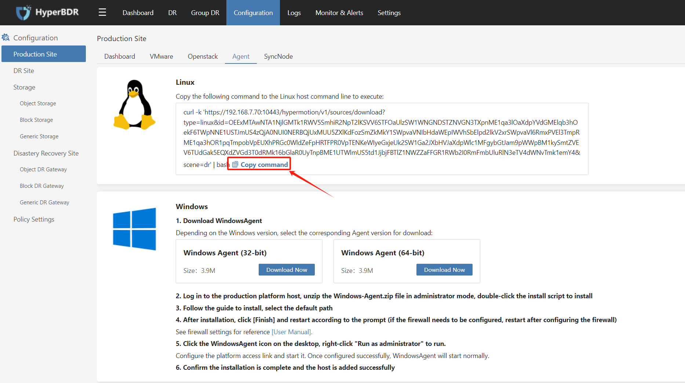

### 在源端主机里执行安装命令
登录源端主机，执行以下命令，即可成功安装Agent程序


## 源端Windows主机执行安装Agent

::: tip
默认HyperBDR容灾平台已安装完成。  
如果本地安装了杀毒软件，需要提前将Windows Agent软件添加到杀毒软件白名单中，使Agent程序能够正常运行。
为保证Windows Agent正常运行，主机上至少有1GB的可用内存。
:::

打开任务管理器的性能标签，查看系统可用内存
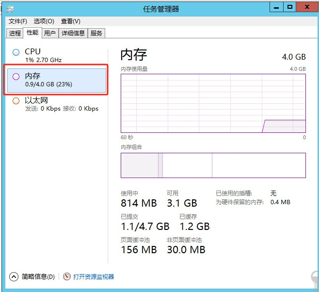

### 安装包下载到源端主机系统
 
登录HyperBDR平台，进入 **[配置管理]** -> **[生产站点配置]** -> **[Agent]**, 下载ZIP文件：


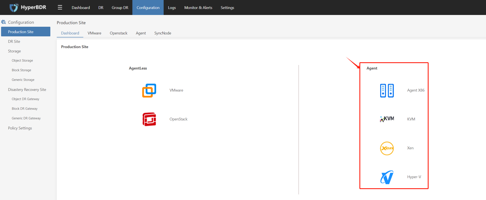

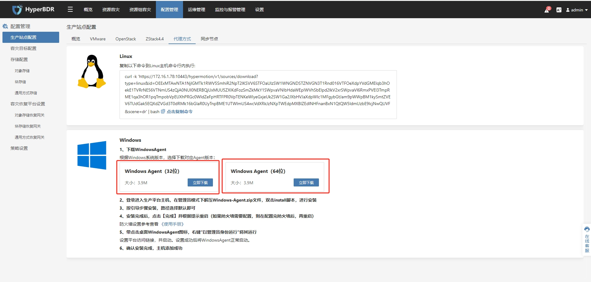


### 安装包解压缩并进行安装
解压缩安装包到当前目录。
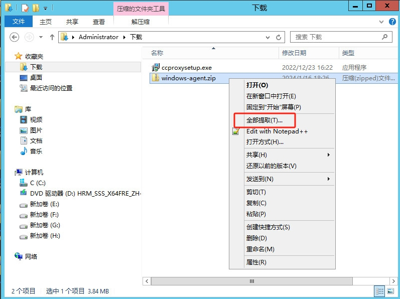

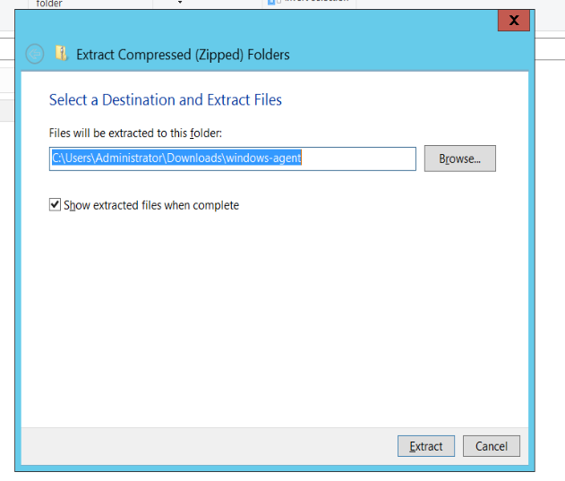

打开解压目录文件夹，右键点击Install.exe文件，以管理员权限运行此程序进行Windows Agent的安装。


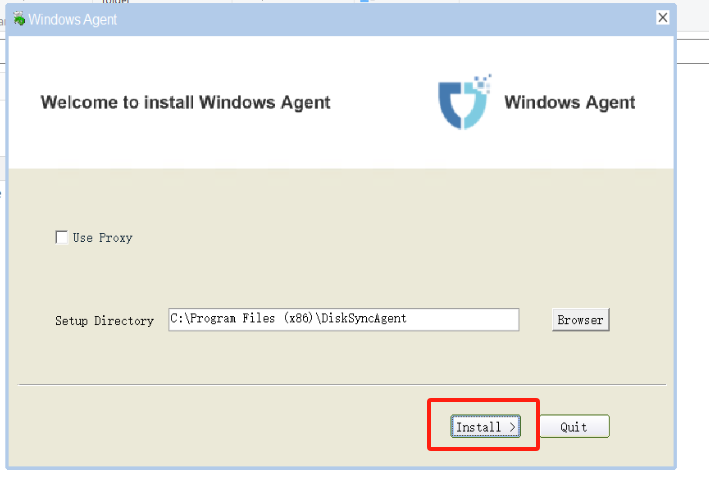

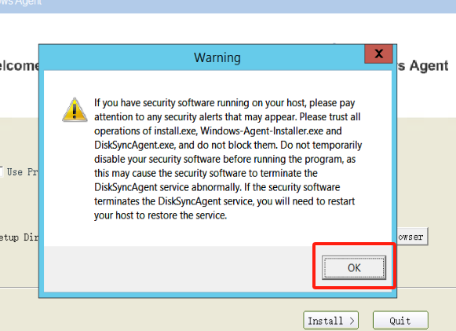

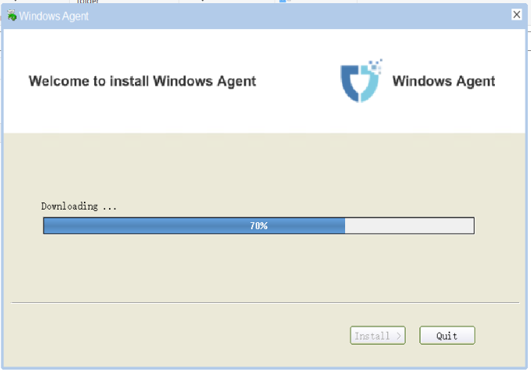


Windows Agent安装完成。


### 启动Windows Agent服务
右键点击桌面的Windows Agent快捷程序，以管理员权限运行。 

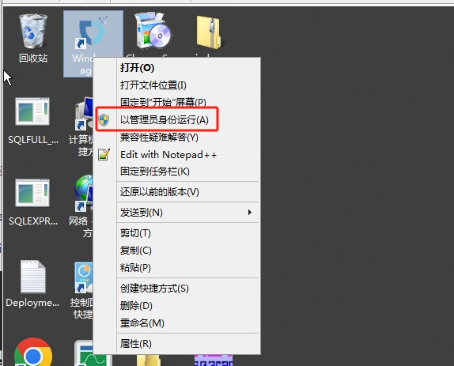

启动服务 

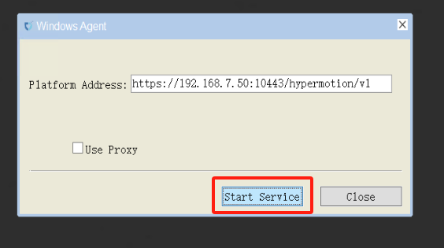

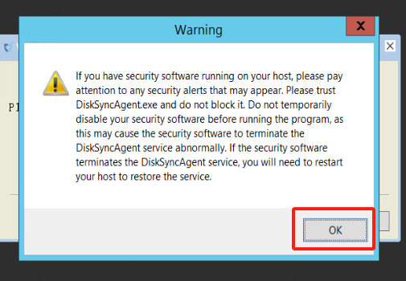


服务启动正常  


## 验证源端主机是否注册成功

::: tip
源端Linux主机安装Agent之后，会自动的注册到容灾平台。  
源端Windows主机安装并启动Agent之后，会自动注册到容灾平台。
:::

### 登录容灾平台
根据容灾平台的用户名和密码，即可登录容灾平台，进行容灾操作。


### 在容灾主界面查看主机
登录HyperBDR容灾平台后，单击顶部菜单栏的“资源容灾”，在左侧菜单栏选择“主机容灾”，查看主机是否已注册，确保主机状态为“已注册”，健康状态为“正常”。
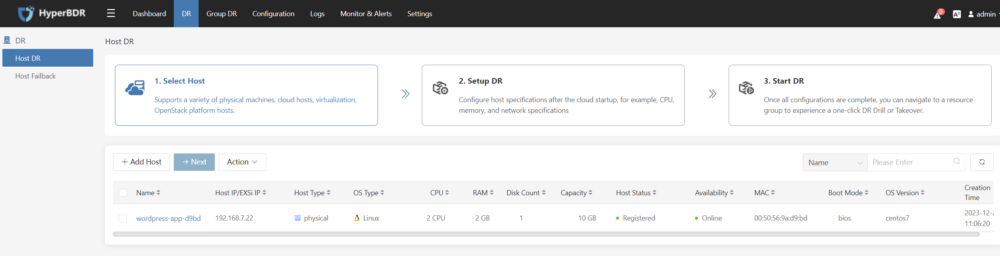


## (选项一：公网访问)测试Agent主机到华为云OBS公网网络连通性

::: tip
在测试前确保你的源端主机可以访问互联网。
:::

### Windows

::: tip
使用Windows命令提示符(CMD)执行测试操作。
:::

#### 公网DNS连通性测试
```shell

ping 8.8.8.8

```

成功返回：

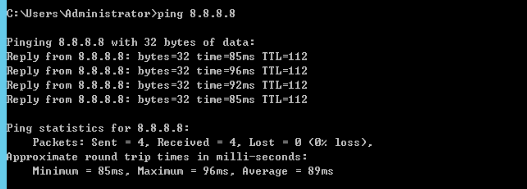

#### 华为对象存储连通性测试

```shell

ping https://obs.ap-southeast-3.myhuaweicloud.com

```

成功返回：


### Linux

#### 公网DNS连通性测试

```shell

ping -c 4 -t 2 8.8.8.8

```

成功返回：

```

ping -c 4 -t 2 8.8.8.8

PING 8.8.8.8 (8.8.8.8): 56 data bytes

64 bytes from 8.8.8.8: icmp_seq=0 ttl=111 time=43.362 ms

64 bytes from 8.8.8.8: icmp_seq=1 ttl=111 time=49.807 ms


--- 8.8.8.8 ping statistics ---
2 packets transmitted, 2 packets received, 0.0% packet loss
round-trip min/avg/max/stddev = 43.362/46.585/49.807/3.222 ms
```

#### 华为对象存储连通性测试

```shell

curl https://obs.ap-southeast-3.myhuaweicloud.com

```

成功返回：

```

<?xml version="1.0" encoding="UTF-8" standalone="yes"?><Error><Code>AccessDenied</Code><Message>Anonymous access is forbidden for this operation</Message><RequestId>0000018C1F508F2F9012234EA17641CE</RequestId><HostId>Z9v+cC1sRnaWw6x0vi8pxxYA0YVnKxbYHUPAFpnxkX8sLV44u5b02Z+ailn2wCnR</HostId></Error>#

```

::: tip
该命令主要用于测试华为云对象存储桶的可访问性。目前测试的对象存储服务域为华为云新加坡区域。如果需要在其他地区进行测试，请参考华为云官方文档查找对应的Endpoint域名地址。  
参考链接： [https://developer.huaweicloud.com/intl/en-us/endpoint?OBS](https://developer.huaweicloud.com/intl/en-us/endpoint?OBS)
:::


## (选项二：内网VPN访问)测试Agent主机到华为云OBS内网网络连通性

### Windows机器

::: tip
使用Windows命令提示符(CMD)执行测试操作。
:::

#### 华为云私有DNS连通性测试

::: tip
根据使用的对象存储区域，请参考以下文档查找私有NDS (Network Domain Service)地址。  
参考文档：[https://support.huaweicloud.com/intl/en-us/dns_faq/dns_faq_002.html](https://support.huaweicloud.com/intl/en-us/dns_faq/dns_faq_002.html)
:::

```shell
ping 100.125.1.250
```

成功返回：


#### 华为对象存储连通性测试

```shell

ping https://obs.ap-southeast-3.myhuaweicloud.com

```

成功返回：


### Linux主机

#### 检查对象存储Endpoint

确认对象存储服务Endpoint返回内网ip地址。


```
ping obs.ap-southeast-3.myhuaweicloud.com
```

成功返回：

```

PING obs.lz01.ap-southeast-3.myhuaweicloud.com (100.125.36.29) 56(84) bytes of data.

```

::: tip
华为云对象存储服务内部IP范围:100.125.xx。如果没有ICMP响应，则认为正常。
:::

#### 华为对象存储连通性测试

```

curl https://obs.ap-southeast-3.myhuaweicloud.com

```

成功返回：

```

<?xml version="1.0" encoding="UTF-8" standalone="yes"?><Error><Code>AccessDenied</Code><Message>Anonymous access is forbidden for this operation</Message><RequestId>0000018C1F508F2F9012234EA17641CE</RequestId><HostId>Z9v+cC1sRnaWw6x0vi8pxxYA0YVnKxbYHUPAFpnxkX8sLV44u5b02Z+ailn2wCnR</HostId></Error>#

```

::: tip
该命令主要用于测试华为云对象存储桶的可访问性。目前测试的对象存储服务域为华为云新加坡区域。如果需要在其他地区进行测试，请参考华为云官方文档查找对应的Endpoint域名地址。 
参考链接： [https://developer.huaweicloud.com/intl/en-us/endpoint?OBS](https://developer.huaweicloud.com/intl/en-us/endpoint?OBS)
:::


## (选项一：公网访问)测试源端主机到HyperBDR的网络连通性

::: tip
该步骤需要在HyperBDR安装完成后进行测试。
测试HyperBDR访问端口10443和30080。
:::

### Windows主机

::: tip
使用Windows命令提示符(CMD)执行测试操作。
:::

测试访问HyperBDR 10443和30080端口

执行命令:

```shell

ssh -v -p 10443 <HyperBDR 公网 IP>

```

测试结果：如果有以下输入结果，并且结果中包含[debug1: Connection established.]信息，则表示网络连通性没问题。

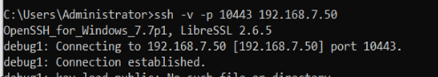

执行命令:

```shell

ssh -v -p 30080 <HyperBDR 公网 IP>

```


测试结果：如果有以下输入结果，并且结果中包含[debug1: Connection established.]信息，则表示网络连通性没问题。

### Linux 主机

测试访问HyperBDR 10443和30080端口

执行命令：

```shell

ssh -v -p 10443 <HyperBDR 公网 IP>

```

测试结果：如果有以下输入结果，并且结果中包含[debug1: Connection established.]信息，则表示网络连通性没问题。

```

OpenSSH_7.4p1, OpenSSL 1.0.2k-fips 26 Jan 2017

debug1: Reading configuration data /etc/ssh/ssh_config

debug1: /etc/ssh/ssh_config line 58: Applying options for *

debug1: Connecting to <HyperBDR Public IP> [<HyperBDR Public IP>] port 10443.

debug1: Connection established.

```

执行命令：

```shell

ssh -v -p 30080 <HyperBDR 公网 IP>

```

测试结果：如果有以下输入结果，并且结果中包含[debug1: Connection established.]信息，则表示网络连通性没问题。

```

OpenSSH_7.4p1, OpenSSL 1.0.2k-fips 26 Jan 2017

debug1: Reading configuration data /etc/ssh/ssh_config

debug1: /etc/ssh/ssh_config line 58: Applying options for *

debug1: Connecting to <HyperBDR Public IP> [<HyperBDR Public IP>] port 30080.

debug1: Connection established.

```

## (选项二：内网VPN访问)测试源端主机到HyperBDR的网络连通性

::: tip
该步骤需要在HyperBDR安装完成后进行测试。
测试HyperBDR访问端口10443和30080。
:::

### Windows 主机

::: tip
使用Windows命令提示符(CMD)执行测试操作。
:::

执行命令：

```shell

ssh -v -p 10443 <HyperBDR 内网 IP>

```

测试结果：如果有以下输入结果，并且结果中包含[debug1: Connection established.]信息，则表示网络连通性没问题。


执行命令：

```shell

ssh -v -p 30080 <HyperBDR 内网 IP>

```


测试结果：如果有以下输入结果，并且结果中包含[debug1: Connection established.]信息，则表示网络连通性没问题。

### Linux 主机

执行命令：

```

ssh -v -p 10443 <HyperBDR 内网 IP>

```

测试结果：如果有以下输入结果，并且结果中包含[debug1: Connection established.]信息，则表示网络连通性没问题。

```

OpenSSH_7.4p1, OpenSSL 1.0.2k-fips  26 Jan 2017

debug1: Reading configuration data /etc/ssh/ssh_config

debug1: /etc/ssh/ssh_config line 58: Applying options for *

debug1: Connecting to <HyperBDR Internal IP> [<HyperBDR Internal IP>] port 10443.

debug1: Connection established.

```

执行命令：

```

ssh -v -p 30080 <HyperBDR 内网 IP>

```

测试结果：如果有以下输入结果，并且结果中包含[debug1: Connection established.]信息，则表示网络连通性没问题。

```

OpenSSH_7.4p1, OpenSSL 1.0.2k-fips  26 Jan 2017

debug1: Reading configuration data /etc/ssh/ssh_config

debug1: /etc/ssh/ssh_config line 58: Applying options for *

debug1: Connecting to <HyperBDR Internal IP> [<HyperBDR Internal IP>] port 30080.

debug1: Connection established.

```

## **源端Windows主机防病毒软件检查与措施**

### 检查主机是否正在运行防毒软件

::: tip
如果Windows主机本地有防毒软件正在运行，在安装和使用Windows Agent时相关程序和文件会被误认为木马、病毒以及危险文件等，导致Windows Agent不能正常使用。
:::

在安装Windows Agent之前检查主机中是否运行防毒软件，并进行以下措施避免Windows Agent无法正常安装或运行的情况。

#### 如果您的主机正在运行卡巴斯基软件，请单击 [这里](https://docs.oneprocloud.com/userguide/faq.html#kaspersky).
#### 如果您的主机正在运行McAfee，请单击 [这里](https://docs.oneprocloud.com/userguide/faq.html#mcafee).

如果在您的主机上没有找到正在运行的杀毒软件，请继续浏览本文档的内容。

### 防病毒软件在Windows主机上运行时的应对措施

#### 选项1：加入防病毒软件白名单

::: warning
由于某些杀毒软件可能在后台运行，因此此方法可能无法完全避免杀毒软件引起的问题，从而导致Windows Agent无法正常工作。
:::

1. **关闭防病毒软件的保护特性。**

2. **安装Windows Agent(参考文档: [安装 Windows Agent](https://docs.oneprocloud.com/userguide/poc/agent-pre-settings.html#install-agent-on-the-source-windows-host)).**

3. **将以下目录和文件加入防病毒软件白名单(默认安装路径)。**

| **列表** | **属性** |
| --- | --- |
| C:\\Program Files (x86)\\DiskSync-Agent | 目录 |
| C:\\Program Files (x86)\\DiskSync-Agent\\hyper_exporter | 目录 |
| C:\\Program Files (x86)\\DiskSync-Agent\\CollHostInfo.bat | 文件 |
| C:\\Program Files (x86)\\DiskSync-Agent\\create_bcd.bat | 文件 |
| C:\\Program Files (x86)\\DiskSync-Agent\\DiskSyncAgent.exe | 文件 |
| C:\\Program Files (x86)\\DiskSync-Agent\\DiskSyncCtrl.exe | 文件 |
| C:\\Program Files (x86)\\DiskSync-Agent\\ExecPro_in.exe | 文件 |
| C:\\Program Files (x86)\\DiskSync-Agent\\ExecPro_un.exe | 文件 |
| C:\\Program Files (x86)\\DiskSync-Agent\\hyper_exporter.exe | 文件 |
| C:\\Program Files (x86)\\DiskSync-Agent\\Opcli.exe | 文件 |
| C:\\Program Files (x86)\\DiskSync-Agent\\reg_service.bat | 文件 |
| C:\\Program Files (x86)\\DiskSync-Agent\\reset.bat | 文件 |
| C:\\Program Files (x86)\\DiskSync-Agent\\uninst.exe | 文件 |
| C:\\Program Files (x86)\\DiskSync-Agent\\unreg_service.bat | 文件 |
| C:\\Program Files (x86)\\DiskSync-Agent\\WindowsAgentCmd.bat | 文件 |
| C:\\Program Files (x86)\\DiskSync-Agent\\hyper_exporter\\hp_exporter_service.exe | 文件 |
| C:\\Program Files (x86)\\DiskSync-Agent\\hyper_exporter\\hyper_exporter.exe | 文件 |
| C:\\Program Files (x86)\\DiskSync-Agent\\hyper_exporter\\reg_service.bat | 文件 |
| C:\\Program Files (x86)\\DiskSync-Agent\\hyper_exporter\\unreg_service.bat | 文件 |


4. **开启防病毒软件的保护功能**


在此过程中，如果防病毒软件提示以弹出窗口阻止windows Agent的安装和操作，或提示隔离文件，则需要手动进行“**allow**”或“**restore**”操作。


5. **启动Windows Agent服务(参考文档: [启动 Windows Agent 服务](https://docs.oneprocloud.com/userguide/poc/agent-pre-settings.html#start-the-windows-agent-service))**

::: warning
如果程序无法启动，请卸载Windows Agent并重复步骤 **[1]** 至 **[5]** 直到Windows Agent启动成功。
:::

6. **如果多次尝试后问题仍然存在，请联系我们寻求帮助。**

#### 选项2：卸载防病毒软件

::: tip
当选项1不能解决问题时，请考虑此选项。 
:::

安装Windows Agent前完全卸载杀毒软件可有效解决此问题。如果条件允许，请卸载系统上正在使用的防病毒软件，并禁止在主机容灾过程中重装防病毒软件。

#### 选项3：永久退出防病毒软件程序

::: tip
当选项1不能解决问题时，请考虑此选项。
:::

退出杀毒软件也可以使Windows Agent正常安装和使用。

::: tip
在安装和使用Windows Agent的过程中，确保防病毒软件没有运行是至关重要的。如果防病毒软件在使用Windows Agent过程中重启(手动重启或系统自动重启)，可能会导致Windows Agent不可用，导致HyperBDR容灾失败。
:::

## (选项二：内网VPN访问)Agent主机所在的网络设备配置华为云内网DNS地址

::: tip
如果你的容灾环境是通过华为云VPN与生产站点内网互联，VPC Endpont服务创建之后，需要在生产站点Agent主机所在网络增加华为云内网OBS VPC Endpoint服务解析地址。
:::

### 配置防火墙或交换机等网络设备

::: tip
Example: Palo Alto防火墙 
以下操作在防火墙 Web 管理界面进行。
:::

1. 导航到[网络] > [DNS Proxy]。

2. 单击 [添加] "以弹出 DNS 代理对话框。

3. 选择应启用 DNS 代理的接口。在下图中, 在以太网1/2 和1/3 接口上启用了 DNS 代理。

4. 选择防火墙应将 DNS 查询转发到的主服务器和辅机。该示例显示了在以太网1/2 和1/3 接口上启用 DNS 代理的配置。主 DNS 服务器配置为10.0.0.246（此地址配置为华为云内网DNS）。

::: tip
根据使用华为云资源所在区域来选择华为云内网DNS地址进行配置。  
华为云内网DNS服务地址参考： [https://support.huaweicloud.com/intl/en-us/dns_faq/dns_faq_002.html](https://support.huaweicloud.com/intl/en-us/dns_faq/dns_faq_002.html)
:::

