# AWS Pre-Settings(RC)

[[toc]]

:::tip
This document will apply only to HyperBDR version 5.6.0 and above. HyperBDR version 5.6.0 is scheduled for release on June 30, 2024.
:::

## About AWS Agentless Model

HyperBDR uses the AWS EBS Direct API to achieve agentless incremental data synchronization in production environments.

### Background of AWS EBS Direct API

The Amazon Elastic Block Store (Amazon EBS) Direct API provides a set of powerful functionalities to interact directly with EBS snapshots, enabling users to create, write, read, and compare snapshots efficiently. This suite of APIs is particularly advantageous for independent software vendors (ISVs) that offer backup and disaster recovery solutions, as it simplifies and optimizes the process of managing incremental changes and backups of Amazon EBS volumes.

### Key Functions of AWS EBS Direct API

1. **Create Snapshots**: The API allows for the creation of EBS snapshots. These snapshots can be used to back up the data of an EBS volume at a specific point in time.

2. **Write Data to Snapshots**: Users can write data directly to their EBS snapshots. This capability is essential for scenarios such as disaster recovery, where data from on-premises environments needs to be securely backed up to the cloud.

3. **Read Data from Snapshots**: The API facilitates the reading of data from existing EBS snapshots. This function is crucial for data verification, analytics, and recovery processes.

4. **Identify Differences Between Snapshots**: One of the most powerful features of the EBS Direct API is its ability to identify and track incremental changes between two snapshots. This is particularly beneficial for backup services that need to efficiently monitor and manage data changes without creating new volumes or utilizing EC2 instances for comparison.

### Use Cases

- **Backup and Recovery for ISVs**: ISVs that provide backup services can leverage these APIs to offer more efficient and cost-effective solutions. By tracking incremental changes through snapshots, ISVs can reduce the need for creating additional volumes and deploying EC2 instances, which in turn lowers costs and simplifies operations.
- **Disaster Recovery**: The ability to write data directly to snapshots enables quick disaster recovery solutions. During a disaster, on-premises data can be written to a snapshot, which can then be restored to either AWS or on-premises environments after recovery. This eliminates the need for complex data transfer mechanisms and ensures business continuity.

- **Incremental Backups**: Creating incremental snapshots from on-premises data into AWS volumes or the cloud ensures that businesses can maintain up-to-date backups. This is crucial for reducing data loss and ensuring that recovery points are as recent as possible.

In summary, the AWS EBS Direct API enhances the efficiency and cost-effectiveness of data management for EBS volumes by providing direct access to snapshot operations. This enables more streamlined and flexible backup, recovery, and data comparison processes, benefiting ISVs and businesses that rely on robust data protection strategies.

### Reference Links

- [AWS EBS direct APIs](https://docs.aws.amazon.com/ebs/latest/APIReference/Welcome.html)

## AWS IAM Preparation

### How to Create an IAM User in AWS with Specific Permissions

1. **Sign in to AWS Management Console**: Log in to the AWS Management Console using your administrator account.

2. **Navigate to IAM Console**:

   - In the services search box at the top of the console, type "IAM" and click to open the IAM console.

3. **Add IAM User**:

   - In the left navigation pane of the IAM console, click on "Users".
   - Click on the "Add user" button.

4. **Set User Details**:

   - Enter a username for the user. Use a descriptive username for easy identification later.
   - Choose the access type:
     - Programmatic access: Allows API access.
     - AWS Management Console access: Allows console login.

5. **Assign Permissions**:

   - Set permissions for the user. Use the following policy as a template:
     ```json
     {
       "Version": "2012-10-17",
       "Statement": [
         {
           "Effect": "Allow",
           "Action": [
             "ec2:CreateSnapshot",
             "ec2:CreateSnapshots",
             "ec2:DescribeSnapshots",
             "ec2:DescribeSnapshotAttribute",
             "ec2:DescribeRegions",
             "ec2:DescribeInstanceTypes",
             "ec2:CreateImage",
             "ec2:CreateTags",
             "ec2:DescribeVolumes",
             "ec2:DescribeVolumeAttribute",
             "ec2:DescribeVolumeStatus",
             "ec2:DescribeVolumesModifications",
             "ebs:StartSnapshot",
             "ebs:CompleteSnapshot",
             "ebs:PutSnapshotBlock",
             "ebs:GetSnapshotBlock",
             "ebs:ListChangedBlocks",
             "ebs:ListSnapshotBlocks",
             "ec2:DescribeInstances",
             "ec2:DescribeInstanceStatus",
             "ec2:DescribeImages",
             "ec2:DescribeImageAttribute",
             "ec2:DescribeNetworkInterfaces",
             "ec2:DescribeVpcs",
             "ec2:DescribeSubnets",
             "ec2:DescribeSecurityGroups",
             "ec2:DescribeTags"
           ],
           "Resource": "*"
         }
       ]
     }
     ```
     Ensure to customize the policy based on specific resource requirements and least privilege principles.

6. **Review and Create**:

   - Review the user details and assigned permissions.
   - Confirm and create the IAM user.

7. **Save User's Security Credentials**:
   - After creation, AWS will provide security credentials for the user, such as access keys and a sign-in link.
   - Securely store and share these credentials as needed.

**Reference Links**:

- AWS Official Documentation: [Creating IAM Users](https://docs.aws.amazon.com/IAM/latest/UserGuide/id_users_create.html)

## Setting Up a Sync Proxy Instance(Ubuntu 20.04)

:::tip
We'll first create this Sync Proxy host, and then proceed with necessary software installations after completing the installation of HyperBDR Console.
:::

1. **Launch an EC2 Instance with Network Planning**:

   - Before launching the instance, ensure networking requirements are planned based on communication needs:
     - **Public Network Communication**:
       - If Sync Proxy communicates with HyperBDR Console and Cloud Sync Gateway over the public network, ensure the instance can access the public internet.
     - **Private Network Communication (VPN or Direct Connect)**:
       - If using VPN or Direct Connect for communication:
         - Set up VPN or Direct Connect beforehand to ensure the instance can access HyperBDR Console and Cloud Sync Gateway, as well as AWS API endpoints.

2. **Instance Launch**:

   - Sign in to the AWS Management Console.
   - Navigate to EC2 and click on "Launch Instance".
   - Choose the **c5.large** instance type:
     - **vCPU**: 2
     - **Memory**: 4 GiB
     - **Network Performance**: Moderate
     - **Storage**: EBS only
   - Configure instance details including networking, storage, and security groups.
   - **Networking**:
     - Select the appropriate network configuration based on your earlier planning:
       - If using **Public Network**, ensure the instance has a public IP or Elastic IP.
       - If using **Private Network (VPN or Direct Connect)**, configure the instance to connect to the appropriate Virtual Private Cloud (VPC) or networking setup.

3. **Configure Security Groups**:

   - Ensure the instance's security group allows outbound traffic for accessing EBS Direct API endpoints.
   - Optionally, configure inbound rules based on security requirements.

4. **Configure Security Groups**:

   - Ensure the EC2 instance has a security group that allows outbound traffic to access the EBS Direct API endpoints.
   - Optionally, restrict inbound traffic to specific IP ranges or protocols based on security best practices.

5. **Test Connectivity**:
   - Test the connection from the Sync Proxy instance to HyperBDR Console:
     - Ensure the Sync Proxy can establish a network connection with HyperBDR Console to verify communication integrity.

## AWS and Huawei Cloud establish Site to Site VPN

### Huawei Cloud Site Create VPN

#### VPN Gateway

Create S2C VPN Gateway


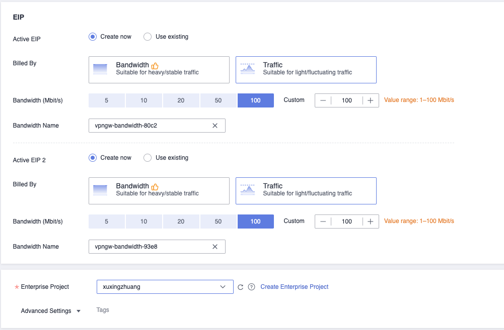

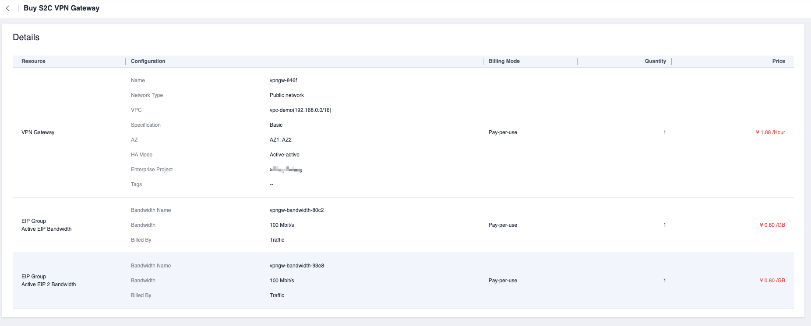

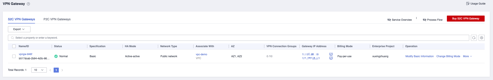

#### Customer Gateway

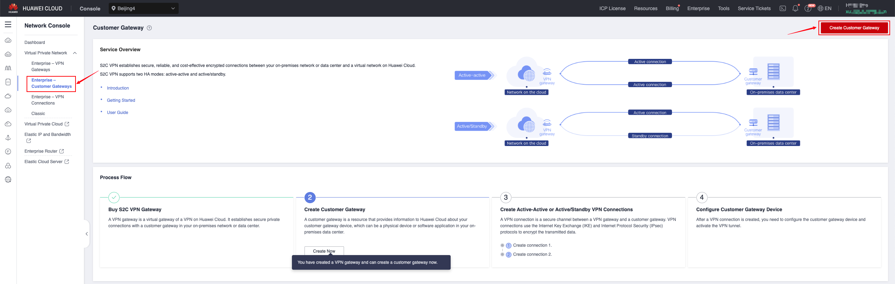

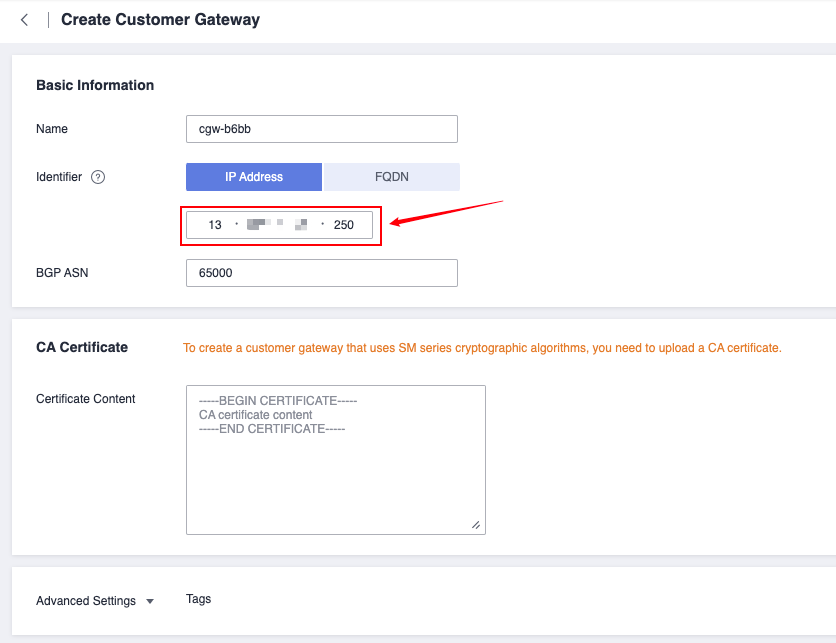

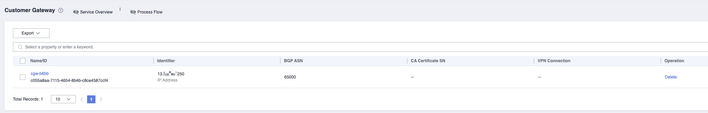

#### VPN Connections


### AWS Site Create VPN


Just keep PSK and Confirm PSK consistent with those on the AWS side.

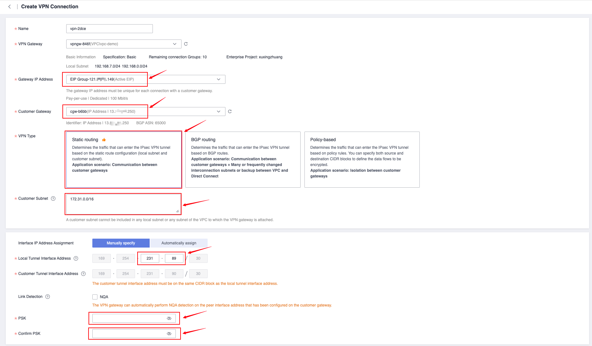

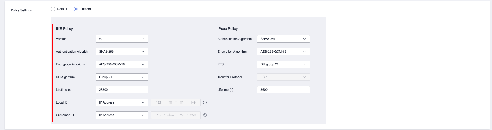

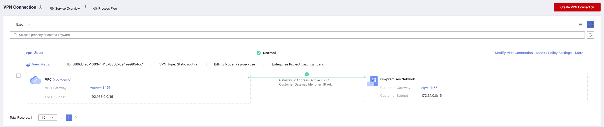

#### Customer Gateway

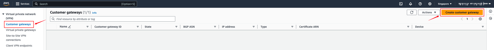

- For IP address, select the public IP address of Huawei Cloud, which is the address information displayed in the Gateway IP Address column of VPN Gateway. If you choose the active-standby or Active-Active mode, select the address of EIP 1.

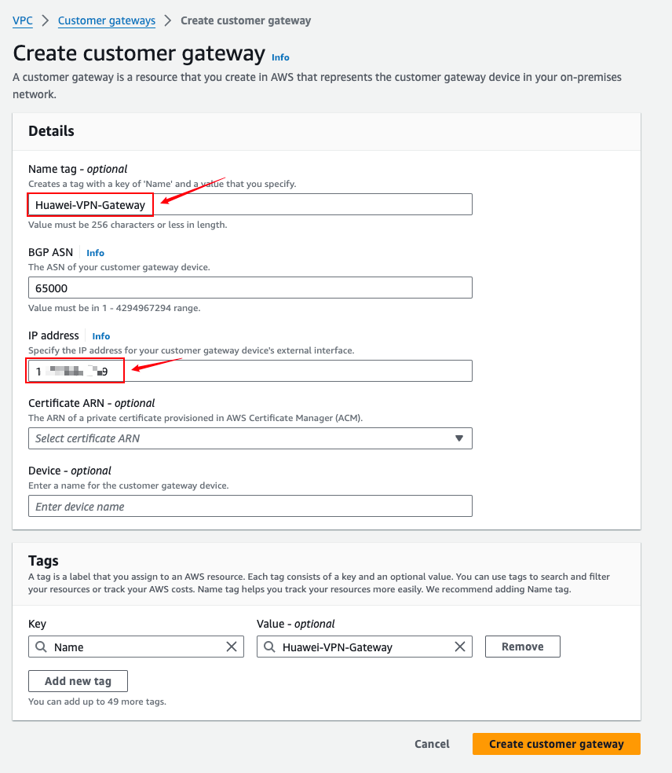


#### Virtual private gateways

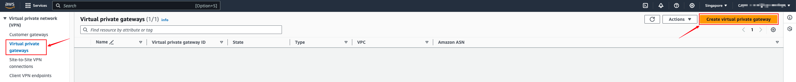


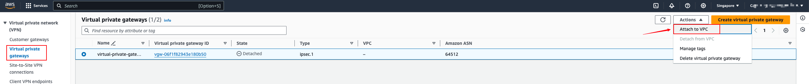

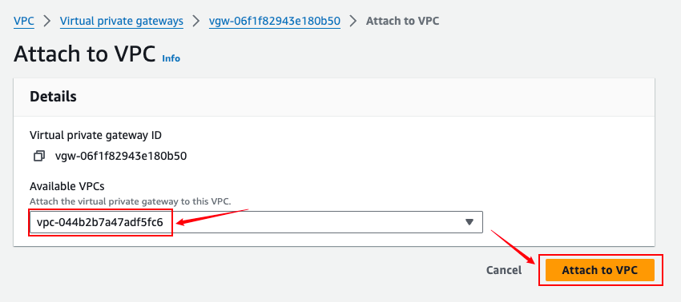

#### Site-to-Site VPN Connections

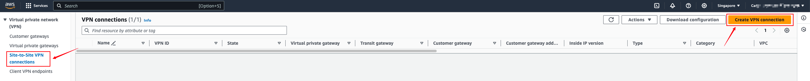


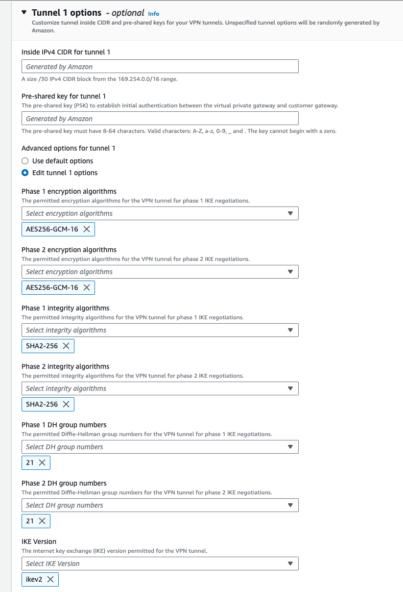

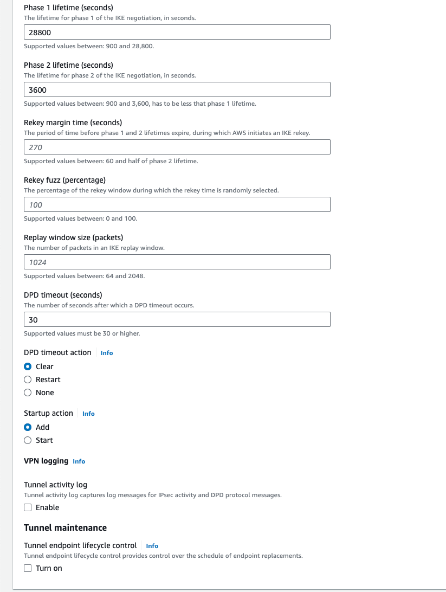


- Get the default PSK authentication code


Select the VPN Tunnel address, copy the value of the Pre-shared key option, and then use this value to fill in the connection PSK box on the Huawei Cloud side. You can also make custom modifications here as long as both sides are consistent.


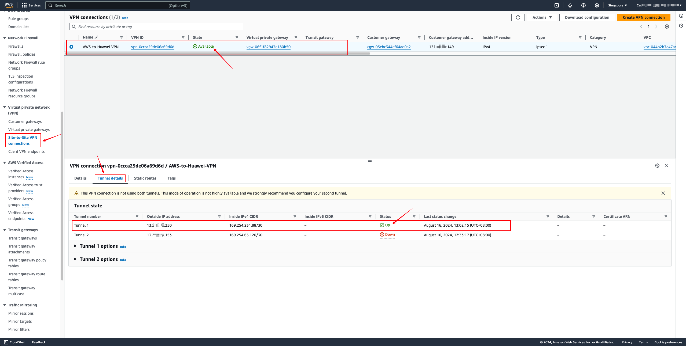

#### Adding routes on the VPC

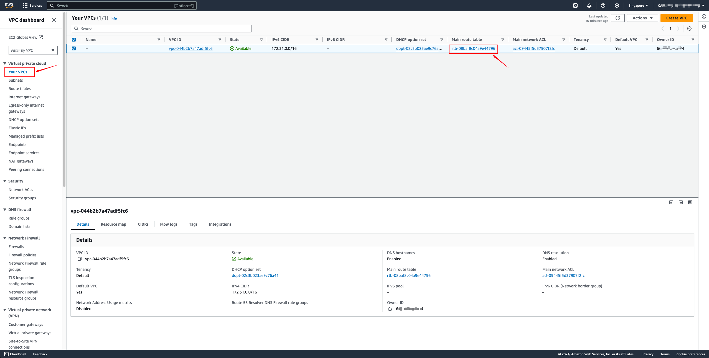


Add a static route to the target Huawei Cloud VPC network. Select Virtual Private Gateway for Target and the created VGW resource for Resource.

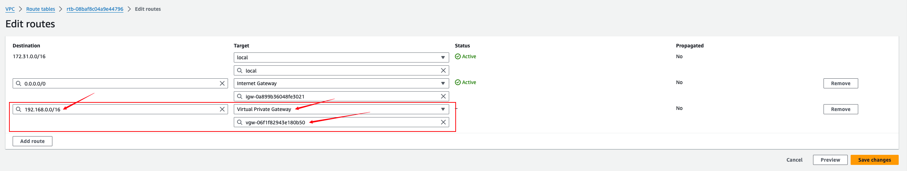

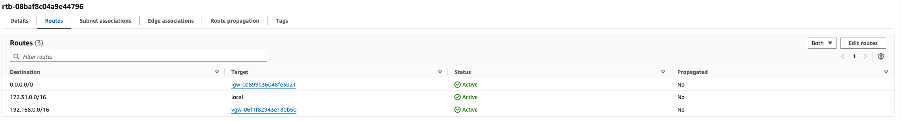

### AWS ec2 accesses Huawei Cloud object storage through the intranet

::: tip
If object storage mode is not used, this configuration is not required.
:::

#### Huawei Cloud VPN adds object storage (100.125.0.0/16) network

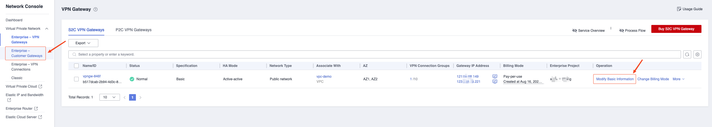


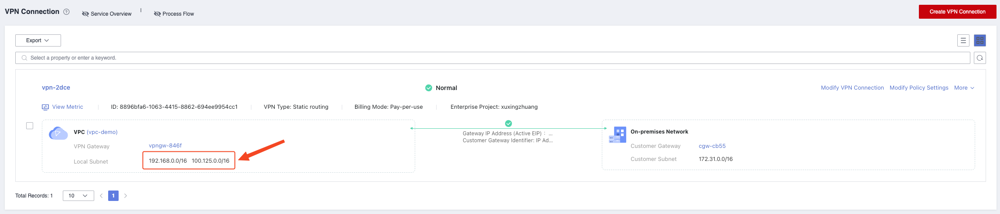

#### Add VPC Endpoint Service (DNS & OBS) on Huawei Cloud


#### Modify the local and remote IPv4 network CIDR addresses on AWS

Change the addresses allowed through VPN on both ends to 0.0.0.0/0

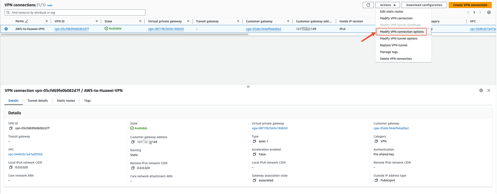

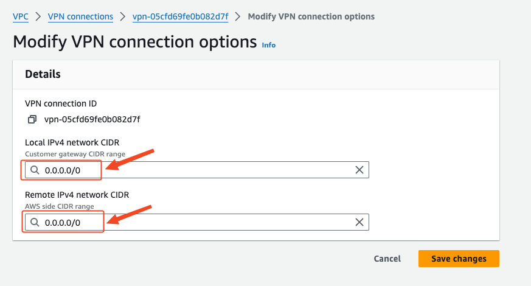

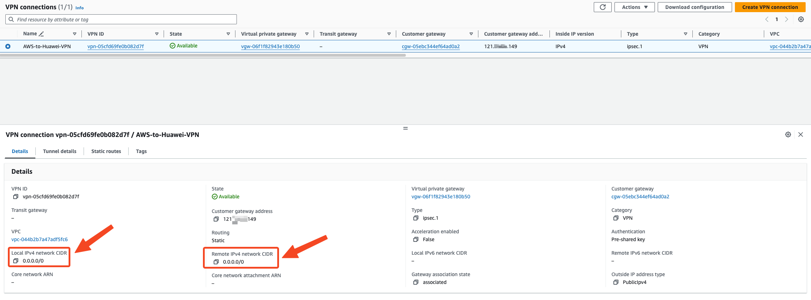

#### VPN Connections adds routes to the 100.125.0.0/16 network segment


#### Add a route to the 100.125.0.0/16 network segment in the VPC routing table

The next hop address is selected as the VGW device of the VPN VPG


#### Configure Sync Proxy EC2 to access DNS and OBS

**Modify the DNS configuration of Sync Proxy EC2**

> Log in to Sync Proxy EC2 by default.

Execute Command:

```

echo -e "\n[Resolve]\nDNS=10.10.0.23\nDomains=~myhuaweicloud.com" >> /etc/systemd/resolved.conf && systemctl restart systemd-resolved

cat /etc/systemd/resolved.conf

```

**Modify the daemon.json file of docker service and add DNS configuration.**

> Sync Proxy is installed by default.

```
vim /etc/docker/daemon.json
```

```json
{
  "default-ulimits": {
    "nofile": {
      "Name": "nofile",
      "Hard": 1048576,
      "Soft": 1048576
    }
  },
  "dns": ["127.0.0.53"]
}
```

Restart the Docker service.

```

sudo systemctl restart docker

```
