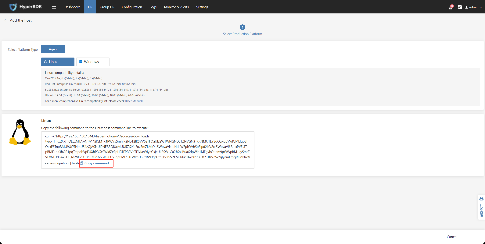
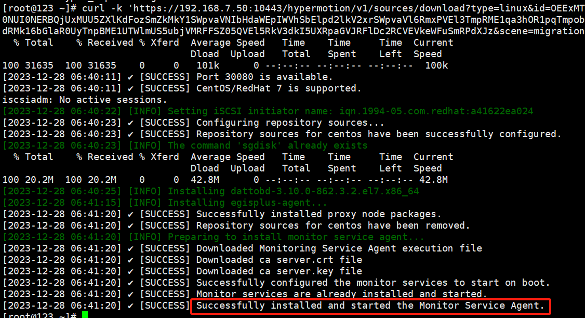
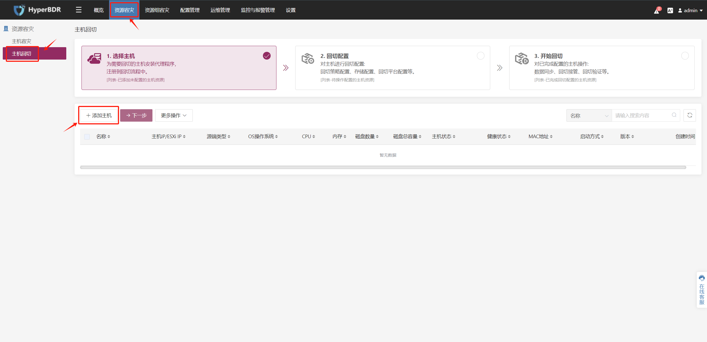
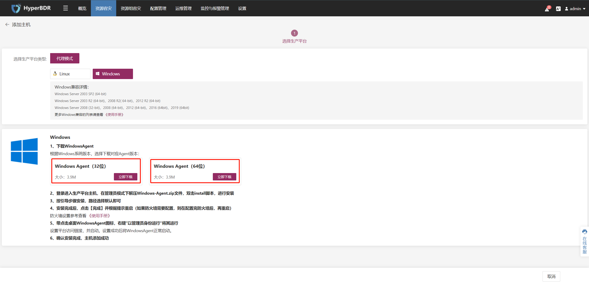

# Agent主机源端预设置

[[toc]]

## （内网VPN访问）测试回切主机与HyperBDR之间的网络连接

::: tip
在华为云端配置了VPN服务，并且华为云端通过VPN连接到生产站点。您可以执行以下测试。
:::

### 验证测试流程

登录到回切主机。

#### Linux回切主机

确保回切主机上运行ssh命令。

#### HyperBDR通过端口10443访问

测试命令：

```
ssh -v -p 10443 <HyperBDR Intranet IP>
```

测试结果：如果以下输出结果包含信息[debug1: Connection established.]，则网络连接正常。

```
OpenSSH_7.4p1, OpenSSL 1.0.2k-fips  26 Jan 2017
debug1: Reading configuration data /etc/ssh/ssh_config
debug1: /etc/ssh/ssh_config line 58: Applying options for *
debug1: Connecting to <HyperBDR Intranet IP\> [<HyperBDR Intranet IP\>] port 10443.
debug1: Connection established.
#### The HyperBDR is accessed on port 30080
```

测试命令：

```
ssh -v -p 30080 <HyperBDR Intranet IP>
```

测试结果：如果以下输出结果包含信息[debug1: Connection established.]，则网络连接正常。

```
OpenSSH_7.4p1, OpenSSL 1.0.2k-fips  26 Jan 2017
debug1: Reading configuration data /etc/ssh/ssh_config
debug1: /etc/ssh/ssh_config line 58: Applying options for *
debug1: Connecting to <HyperBDR Intranet IP> [<HyperBDR Intranet IP>] port 30080.
debug1: Connection established.
```

#### HyperBDR通过端口10081访问

测试命令：

```
ssh -v -p 10081 <HyperBDR Intranet IP>
```

测试结果：如果以下输出结果包含信息[debug1: Connection established.]，则网络连接正常。

```
OpenSSH_7.4p1, OpenSSL 1.0.2k-fips  26 Jan 2017
debug1: Reading configuration data /etc/ssh/ssh_config
debug1: /etc/ssh/ssh_config line 58: Applying options for *
debug1: Connecting to <HyperBDR Intranet IP> [<HyperBDR Intranet IP>] port 10081.
debug1: Connection established.
```

### Windows回切主机

确保回切主机上存在ssh命令，并打开CMD命令行。

#### HyperBDR通过端口10443访问

测试命令：

```
ssh -v -p 10443 <HyperBDR Intranet IP>
```

测试结果：如果以下输出结果包含信息[debug1: Connection established.]，则网络连接正常。

```
OpenSSH_7.4p1, OpenSSL 1.0.2k-fips  26 Jan 2017
debug1: Reading configuration data /etc/ssh/ssh_config
debug1: /etc/ssh/ssh_config line 58: Applying options for *
debug1: Connecting to <HyperBDR Intranet IP> [<HyperBDR Intranet IP>] port 10443.
debug1: Connection established.
```

#### HyperBDR通过端口30080访问

测试命令：

```
ssh -v -p 30080 <HyperBDR Intranet IP>
```

测试结果：如果以下输出结果包含信息[debug1: Connection established.]，则网络连接正常。

```
OpenSSH_7.4p1, OpenSSL 1.0.2k-fips  26 Jan 2017
debug1: Reading configuration data /etc/ssh/ssh_config
debug1: /etc/ssh/ssh_config line 58: Applying options for *
debug1: Connecting to <HyperBDR Intranet IP> [<HyperBDR Intranet IP>] port 30080.
debug1: Connection established.
```

#### HyperBDR通过端口10081访问

测试命令：

```
ssh -v -p 10081 <HyperBDR Intranet IP>
```

测试结果：如果以下输出结果包含信息[debug1: Connection established.]，则网络连接正常。

```
OpenSSH_7.4p1, OpenSSL 1.0.2k-fips  26 Jan 2017
debug1: Reading configuration data /etc/ssh/ssh_config
debug1: /etc/ssh/ssh_config line 58: Applying options for *
debug1: Connecting to <HyperBDR Intranet IP> [<HyperBDR Intranet IP>] port 10081.
debug1: Connection established.
```

## 在回切主机上安装Agent并注册到HyperBDR

### Linux 回切主机

#### 登录到HyperBDR控制台


#### 复制Agent安装命令

点击上方的 **'资源容灾'** 标签页，然后在左侧选择 **'主机回切'** 。点击 **'添加主机'** ，选择Agent模式。


在 **'Linux'** 部分，点击 **'点击复制命令'** 。



#### 在回切主机上运行安装命令

登录到回切主机，然后复制并运行Agent安装命令。等待安装完成。



### Windows 回切主机

#### 登录到HyperBDR控制台


#### 将Agent安装包下载到回切主机的本地。

点击上方的 **'资源容灾'** 选项卡，然后在左侧选择 **'主机回切'** 。点击 **'添加主机'** ，选择Agent模式。



在 **'Windows'** 部分，选择与您的回切主机版本相对应的安装包进行下载。




#### 源Windows主机上的防毒软件检查与措施

参考以下文档，在源Windows 回切主机上执行操作。

文档链接：[https://docs.oneprocloud.com/userguide/poc/agent-pre-settings.html#antivirus-software-inspection-and-measures-on-source-windows-host](https://docs.oneprocloud.com/userguide/poc/agent-pre-settings.html#antivirus-software-inspection-and-measures-on-source-windows-host)

#### **在Windows 回切主机上安装Agent**

参考以下文档，在Windows 回切主机上执行操作。

文档链接：[https://docs.oneprocloud.com/userguide/poc/agent-pre-settings.html#install-agent-on-the-source-windows-host](https://docs.oneprocloud.com/userguide/poc/agent-pre-settings.html#install-agent-on-the-source-windows-host)

## （内网VPN访问）测试回切主机与华为云OBS之间的网络连接

::: tip
已经在华为云端配置了VPN服务，并且华为云端通过VPN连接到生产站点。您可以执行以下测试。
:::

### Linux回切主机

#### 登录到回切主机

::: tip
确保在回切主机上运行ssh命令。
:::

#### 华为云私有DNS连接测试

::: tip
请参考以下文档，根据使用的对象存储区域查找私有DNS服务器地址。  
参考文档链接：[https://support.huaweicloud.com/intl/en-us/dns_faq/dns_faq_002.html](https://support.huaweicloud.com/intl/en-us/dns_faq/dns_faq_002.html)
:::

```shell
ping 100.125.1.250
```

成功响应：


#### 华为云对象存储连接测试

```shell
ping https://obs.ap-southeast-3.myhuaweicloud.com
```

成功响应：


::: tip
此命令主要用于测试对华为云对象存储桶的可访问性。当前示例测试的OBS域是华为云新加坡区域的。如果需要在其他区域进行测试，请参考官方华为云文档以找到相应的终端域地址。  
文档链接：[https://developer.huaweicloud.com/intl/en-us/endpoint?OBS](https://developer.huaweicloud.com/intl/en-us/endpoint?OBS)
:::


### Windows回切主机

#### 登录到回切主机

::: tip
确保在Failback主机上存在ssh命令，并打开CMD命令行。
:::

#### 华为云私有DNS连接测试

::: tip
请参考以下文档，根据使用的对象存储区域查找私有DNS服务器地址。  
参考文档：[https://support.huaweicloud.com/intl/en-us/dns_faq/dns_faq_002.html](https://support.huaweicloud.com/intl/en-us/dns_faq/dns_faq_002.html)
:::

```shell
ping 100.125.1.250
```

成功响应：


#### 华为云对象存储连接测试

```shell
ping https://obs.ap-southeast-3.myhuaweicloud.com
```

成功响应：


::: tip
此命令主要用于测试对华为云对象存储桶的可访问性。当前示例测试的OBS域是华为云新加坡区域的。如果需要在其他区域进行测试，请参考官方华为云文档以找到相应的终端域地址。  
文档链接：[https://developer.huaweicloud.com/intl/en-us/endpoint?OBS](https://developer.huaweicloud.com/intl/en-us/endpoint?OBS)
:::

## （内网VPN访问）测试回切主机与回切网关之间的网络连接

::: tip
如果回切测试环境通过华为云VPN连接到生产站点的内网，您可以执行此操作以测试回切主机与回切网关主机之间的网络连接。
:::

### Linux回切主机

#### 验证测试步骤

登录到回切主机。

#### 测试访问回切网关主机的10729端口

::: tip
确保在Failback主机上运行ssh命令。
:::

测试命令：

```bash
ssh -p 10729 root@<Failback Gateway Host Intranet IP>
```

验证结果：
如果可以正常访问密码，则访问正常。

### Windows回切主机

#### 验证测试步骤

登录到回切主机。

#### 测试访问回切网关主机的10729端口

::: tip
确保在回切主机上存在ssh命令，并打开CMD命令行窗口。
:::

测试命令：

```bash
ssh -p 10729 root@<Failback Gateway Host Intranet IP>
```

验证结果：
如果可以正常访问密码，则访问正常。