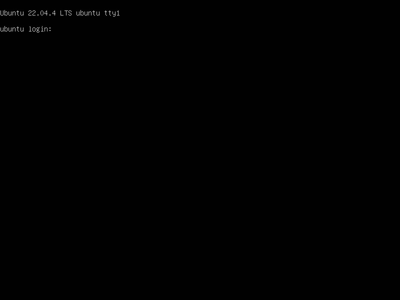
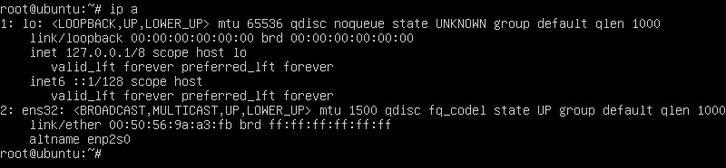
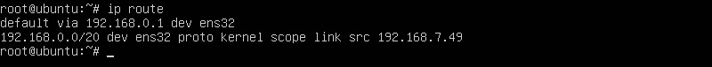

# 通用平台目标端部署与配置

[[toc]]

## 创建通用存储回切网关 - Agent

1. 使用下载的Hyperdoor镜像在源端生产环境创建虚拟机或物理机作为通用存储回切网关。
2. 通用存储回切网关作为回切时的数据接收和最后回切时的恢复主机。
3. 通用存储回切网关最小需要2C4G的计算资源配置；由于此主机为最后回切时的恢复主机，一般情况计算资源配置与回切主机一致即可。
4. 通用存储回切网关的存储配置（硬盘数量与硬盘分配容量）应与回切主机一致。

**配置示例：**
| 配置 | 回切主机 | 通用存储回切网关 |
| --- | --- | --- |
| CPU | 4 | 4 |
| 内存 | 8GB | 8GB |
| 系统盘分配容量 | 100GB | 100GB |
| 数据盘1分配容量 | 200GB | 200GB |
| 数据盘2分配容量 | 500GB | 500GB |

## 配置通用存储回切网关的IP地址 - Agent

::: tip
默认已经在源端生产环境创建虚拟机/物理机作为通用存储回切网关。
:::

### 登录到通用存储回切网关

::: tip
默认用户名：root  
默认密码：Acb@132.Inst
:::



### 手动配置网络

::: tip
Hyperdoor镜像系统默认网络配置为DHCP模式，如果您的网络支持DHCP，确认此虚拟机IP即可，无需进行以下操作；如果您的网络未使用DHCP需要手动配置虚拟机/物理机的网络。
:::

#### 确认虚拟机网卡设备名称

```shell
ip a
```



#### 清除网络配置信息

```shell
ip addr flush dev eth0
```

配置临时IP

::: tip
配置为示例信息，请根据实际情况替换IP地址/掩码 [192.168.x.x/20] 和网关地址 [192.168.0.1]
:::

```shell
ip addr add 192.168.x.x/20 dev ens160 && ip route add default via 192.168.0.1
```

#### 查看网络配置

```shell
ip a
```


```shell
ip route
```



## （内网VPN访问）测试通用存储回切网关到容灾目标云内网OBS网络的连通性 - Agent

::: tip
以下操作示例使用华为云。请根据您所使用的容灾目标云信息进行测试
:::

### 登录通用存储回切网关

::: tip
默认用户名：root  
默认密码：Acb@132.Inst
:::


### 私有DNS连接测试

::: tip
请参阅以下文档，查找基于所用对象存储区域的专用NDS（网络域服务）地址。  
参考文档： [https://support.huaweicloud.com/intl/en-us/dns_faq/dns_faq_002.html](https://support.huaweicloud.com/intl/en-us/dns_faq/dns_faq_002.html)
:::

```shell
ping 100.125.1.250
```

Success Response:


### 对象存储连接测试

```shell

ping https://obs.ap-southeast-3.myhuaweicloud.com

```

Success Response:


::: tip
该命令主要用于测试华为云对象存储桶所在区域的可访问性。目前，测试的OBS域适用于华为云新加坡地区。如果您需要在不同的地区进行测试，请参阅华为云官方文档，找到相应的Endpoint域名。  
文档链接:  [https://developer.huaweicloud.com/intl/en-us/endpoint?OBS](https://developer.huaweicloud.com/intl/en-us/endpoint?OBS)
:::

