# HyperBDR部署与配置

[[toc]]

## （内网VPN访问）测试HyperBDR到通用存储回切网关的网络连通性

::: tip
如果你的回切测试环境是通过容灾目标云VPN与生产站点内网互联，可以通过此操作步骤来测试HyperBDR到通用存储回切网关的网络连通性。
:::

### 验证测试步骤

登录到HyperBDR主机

#### 测试访问通用存储回切网关10729端口

测试命令：

```
ssh -p 10729 root@<Failback Gateway Host Intranet IP>
```

验证结果：  

可以正常访问到输入密码，则表示正常访问。

## 测试HyperBDR到vCenter/ESXi的管理网络连通性

::: tip
如果你的回切测试环境是通过容灾目标云的VPN与生产站点内网互联，可以通过此操作步骤来测试HyperBDR到vCenter/ESXi的管理网络连通性的网络连通性。
:::

### 登录到HyperBDR主机

### 测试访问vCenter地址的端口

::: tip
命令中将Vcenter的IP地址替换为实际生产环境中的IP地址
:::

测试命令：

```
ssh -v -p 443 <vCenter IP Address>
```

测试结果：
如果输入结果包括信息“[debug1: Connection established.]”，则表明网络连接没有问题。

```
OpenSSH_7.4p1, OpenSSL 1.0.2k-fips  26 Jan 2017
debug1: Reading configuration data /etc/ssh/ssh_config
debug1: /etc/ssh/ssh_config line 58: Applying options for *
debug1: Connecting to 192.168.10.2 [vCenter IP Address] port 443.
debug1: Connection established.
```

### 测试访问ESXi地址的端口

::: tip
命令中将ESXi的IP地址替换为实际生产环境中的IP地址
:::

测试命令：

```
ssh -v -p 443 <ESXi IP Address>
```

测试结果：
如果输入结果包括信息“[debug1: Connection established.]”，则表明网络连接没有问题。

```
OpenSSH_7.4p1, OpenSSL 1.0.2k-fips  26 Jan 2017
debug1: Reading configuration data /etc/ssh/ssh_config
debug1: /etc/ssh/ssh_config line 58: Applying options for *
debug1: Connecting to 192.168.10.2 [ESXi IP Address] port 443.
debug1: Connection established.
```

## 添加通用存储回切网关到HyperBDR

::: tip
默认已完成HyperBDR环境的部署。
:::

### 登录HyperBDR


### 添加通用存储回切网关

**Step 1.** 上方导航栏中选择 "配置管理"，左侧菜单栏选择"通用方式存储"，在"回切" - "回切网关管理"标签页中点击"添加"。

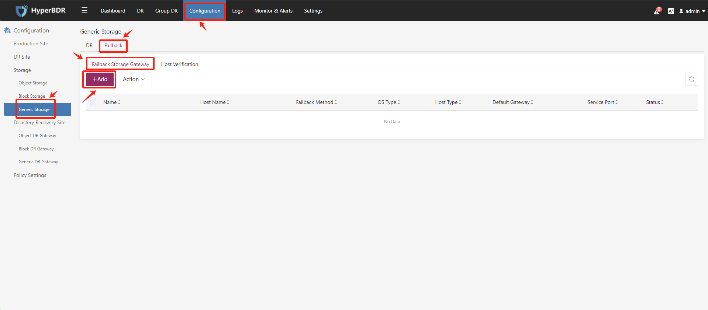

**Step 2.** 按照表单中的说明创建"通用存储回切网关"。填写通用存储回切网关的信息，确认后单击"下一步"。

::: tip
根据您的存储类型来配置"回切恢复模式"，您可以选择"对象存储"或者"云硬盘"。
:::

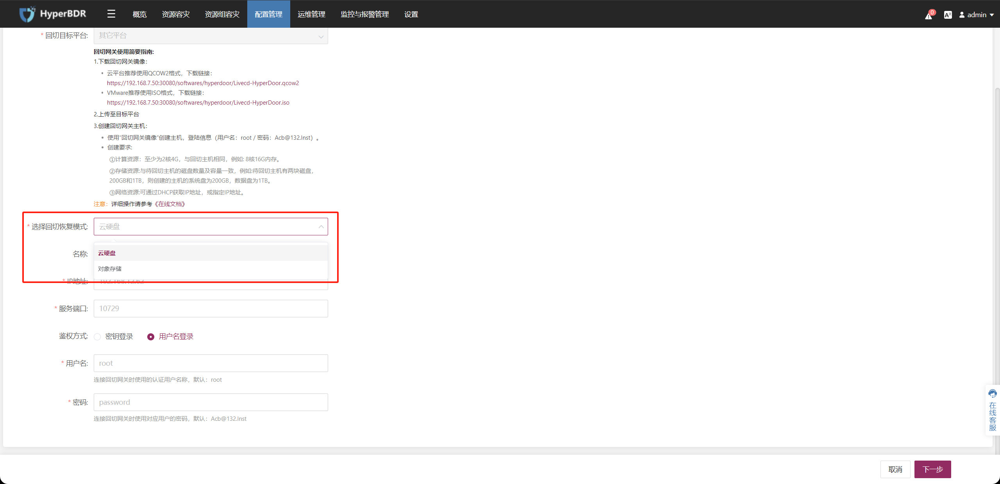

**Step 3.** "驱动修复"选项默认即可。

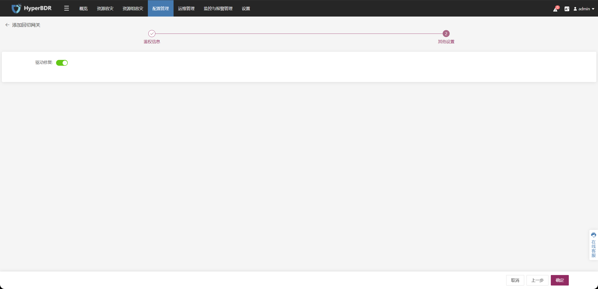

**Step 4.** 通用存储回切网关状态为可用即可。

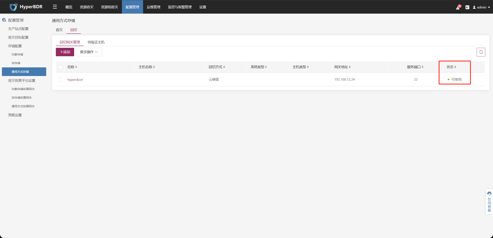

## 验证通用存储回切网关状态

::: tip
默认已完成HyperBDR环境的部署。
:::

### 登录HyperBDR控制台


### 检查通用存储回切网关的状态

在顶部导航栏上，选择[**配置管理**]，在左侧菜单中选择[**通用方式存储**] > [**回切**]，在回切网关管理中单击要确认的[**通用存储回切网关**]。

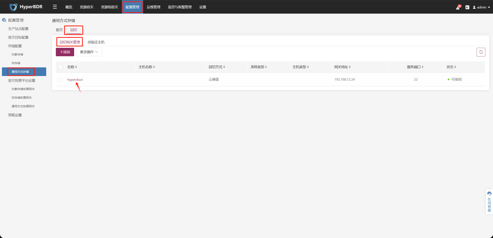

确认此通用存储回切网关的状态为[**可用**]即可。

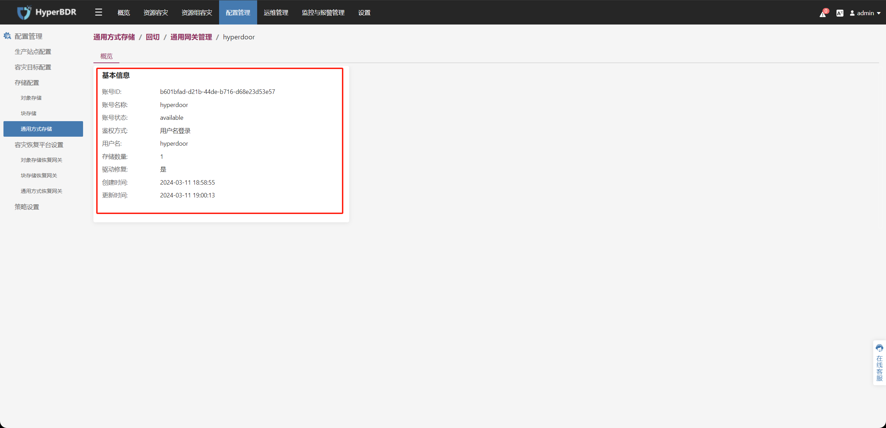


## 申请HyperBDR容灾回切授权

::: tip
默认已完成HyperBDR环境的部署。
:::

### 登录HyperBDR控制台


### 激活容灾回切Licnese

选择[设置] > [授权管理] >[容灾回切授权] ，点击 [添加]。

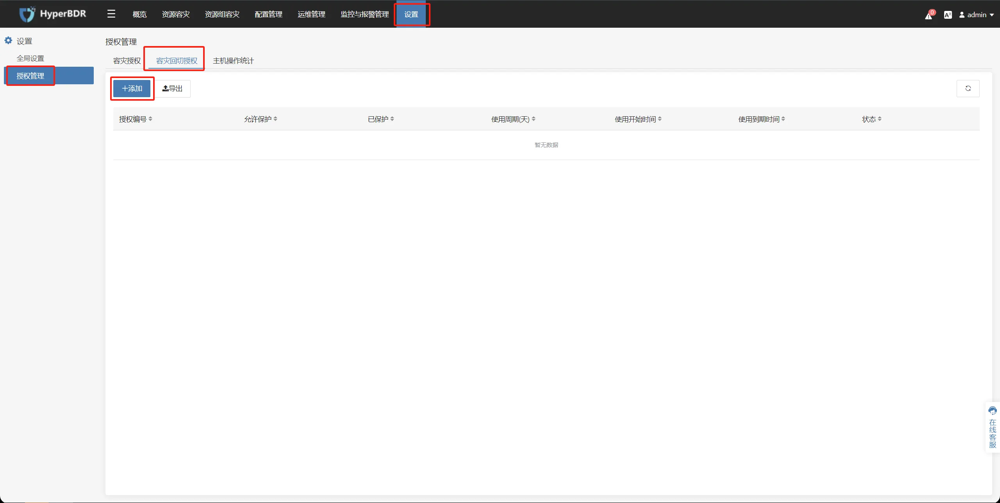

### 获取License激活码（容灾回切）

::: tip
有两种方法来获取License激活码
:::

#### 使用二维码激活License


扫描二维码并填写申请表。客服将在审查申请后通过电子邮件向用户发送激活码（附件）。

::: tip
请确保申请表上提供的电子邮件地址正确无误，否则将不会收到激活码。
:::

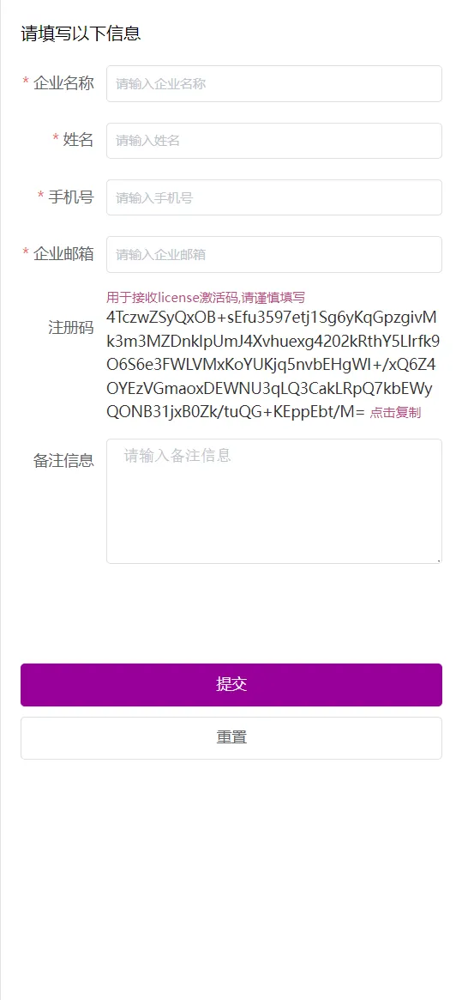

将收到的激活码填写后点击 [激活] 即可。

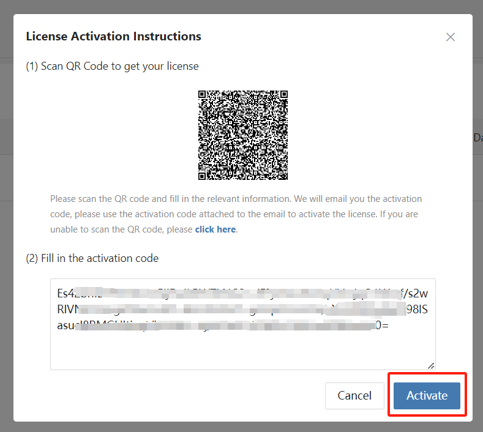

#### 使用注册码激活License

[点击此处] 获取注册码，并复制注册码


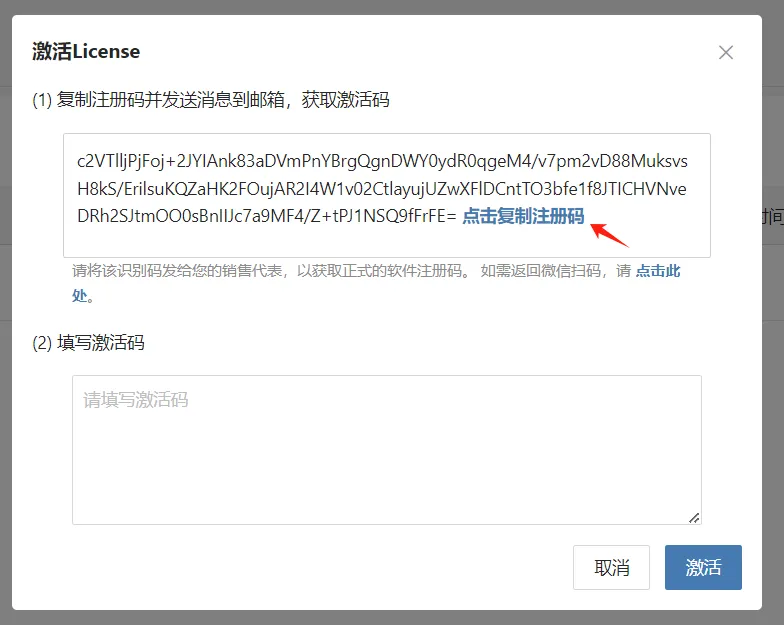


用户可以将注册码发送给销售代表或邮箱enquiry@oneprocloud.com ，将收到的激活码填写后点击 [激活] 即可。

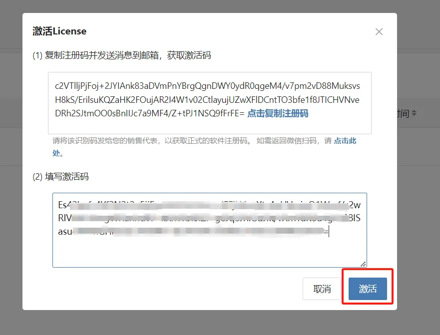

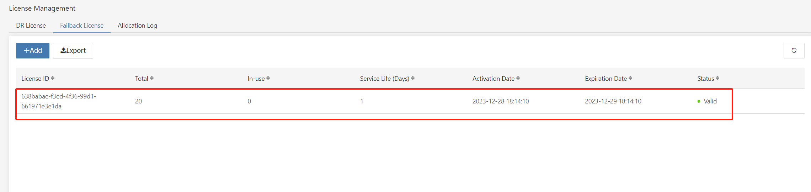

## 下载通用存储回切网关所使用的HyperDoor镜像

::: tip
Choose the available image file according to the production environment on the source. You will need to use the hyperdoor image to create a virtual machine/physical machine in the source production environment.
根据源生产环境选择可用的镜像文件。您将需要使用HyperDoor镜像在源生产环境中创建虚拟机/物理机。
:::

### ISO格式镜像下载
镜像下载地址：[https://downloads.oneprocloud.com/Livecd-HyperDoor-5.5.1.dev688.iso](https://downloads.oneprocloud.com/Livecd-HyperDoor-5.5.1.dev688.iso)   
镜像MD5文件下载地址：[https://downloads.oneprocloud.com/Livecd-HyperDoor-5.5.1.dev688.iso.md5](https://downloads.oneprocloud.com/Livecd-HyperDoor-5.5.1.dev688.iso.md5)

### QCOW2格式镜像下载
镜像下载地址：[https://downloads.oneprocloud.com/Livecd-HyperDoor-5.5.1.dev688.qcow2](https://downloads.oneprocloud.com/Livecd-HyperDoor-5.5.1.dev688.qcow2)  
镜像MD5文件下载地址：[https://downloads.oneprocloud.com/Livecd-HyperDoor-5.5.1.dev688.qcow2.md5](https://downloads.oneprocloud.com/Livecd-HyperDoor-5.5.1.dev688.qcow2.md5)

## 添加对象存储（容灾回切）

::: tip
默认已完成HyperBDR环境的部署。  
以下操作使用华为云作为示例，在HyperBDR控制台中配置并添加华为云对象存储桶。请根据您实际场景中的容灾目标云进行配置。
:::

### 配置步骤

- Step 1. 上侧菜单栏点击 [配置管理]，左侧选择 [存储配置] 中的 [对象存储]，选择 [回切] 标签页，点击 [+添加] 。

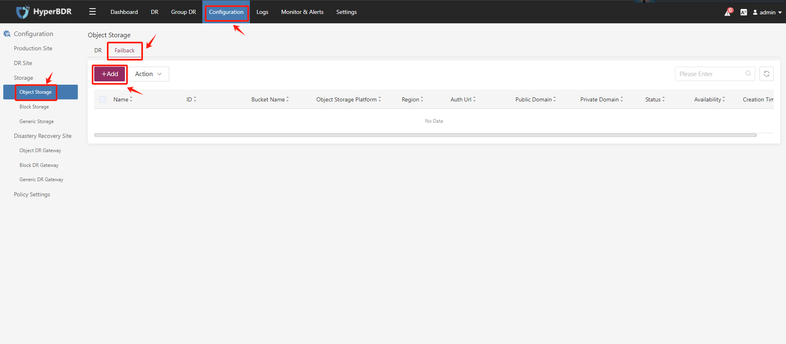

- Step 2. 在 [对象存储平台]，选择您所使用的华为云对象存储区域

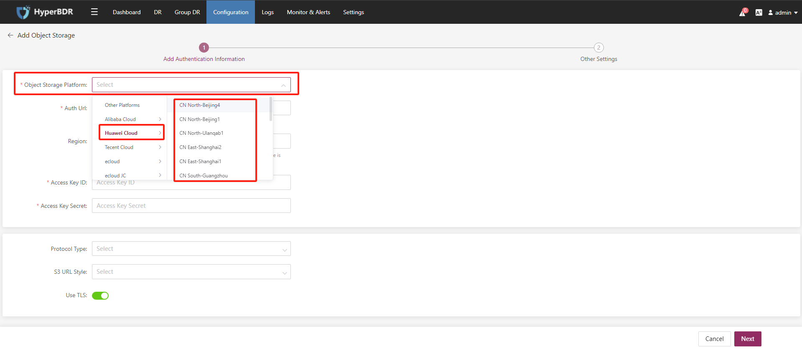

- Step 3. 填写用于鉴权认证对象存储的AK/SK，确认后点击 下一步

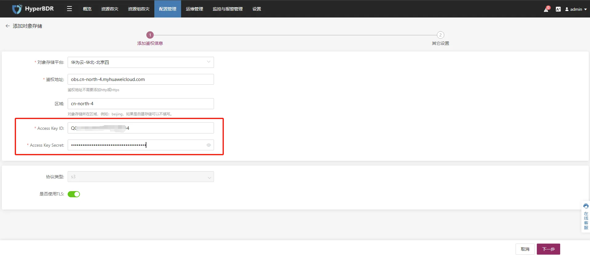

- Step 4. 设置对象存储桶的名称后点击 [确定]。

::: tip
您可以使用区域内已经存在的对象存储桶，或者新建对象存储桶并自定义名称。
:::

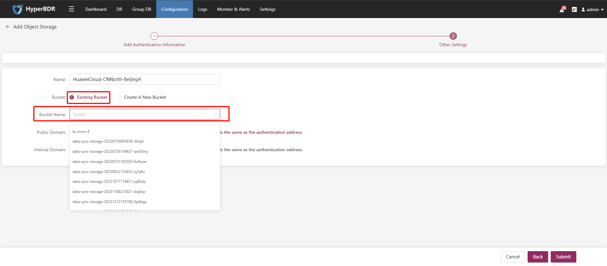


- Step 5. 对象存储（容灾回切）添加完成

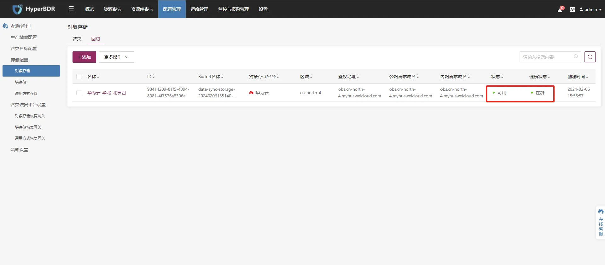

