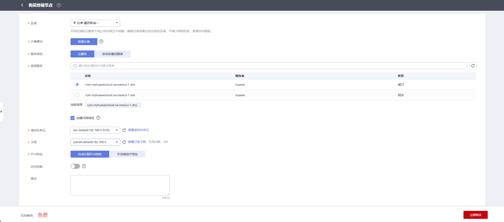

# 华为云

[[toc]]

## （内网VPN访问）创建并配置VPN服务

::: tip
华为云回切主机的VPC网络连接到本地vCenter/ESXi VM服务网络。  
如果HyperBDR所在的VPC网络在部署到华为云时已通过VPN服务连接到vCenter/ESXi服务网络，那么在这种情况下，您无需重新配置。
:::

### 配置文档

配置VPN。详情请参阅华为云官方文档。  

文档链接：[https://support.huaweicloud.com/intl/en-us/qs-vpn/vpn_03_0001.html](https://support.huaweicloud.com/intl/en-us/qs-vpn/vpn_03_0001.html)

## （内部VPN访问）- 创建VPC端点服务

::: tip
如果您的容灾恢复环境通过华为云VPN与生产站点的内部网络相互连接，并且在灾难期间生产站点需要通过VPN访问华为云HyperBDR和OBS服务，则需要在华为云购买并配置VPC端点服务。  
您需要购买两个VPC端点服务，一个用于OBS，另一个用于DNS。
:::

::: tip
如果在将容灾环境部署到华为云时已购买并配置了端点服务，则无需重复此配置。
:::

### 配置VPC端点 

华为云官方定义：如果您想通过VPN或云连接使用内部方法从本地数据中心访问OBS服务，可以通过连接终端端点以访问终端端点服务的方式实现。  
文档链接：[https://support.huaweicloud.com/intl/en-us/qs-vpcep/vpcep_02_0301.html](https://support.huaweicloud.com/intl/en-us/qs-vpcep/vpcep_02_0301.html)

#### 配置连接DNS的终端节点

| 参数 | 配置说明 |
| --- | --- |
| 区域 | 选择要激活的区域 |
| 计费方式 | 按需计费 |
| 服务类别 | 选择默认的“云服务器”，选中com.myhuaweicloud.<region\>.dns，并将类型设置为接口 |
| 虚拟私有云 | 选择与本地IDC VPN相互连接的VPC |
| 子网 | 选择VPN互连的子网 |

#### 选择OBS网关类型的终端端点

| 参数 | 配置说明 |
| --- | --- |
| 区域 | 选择要激活的区域 |
| 计费方式 | 按需计费 |
| 服务类别 | 选择默认的“云服务器”，选中com.myhuaweicloud.<region\>.obs, 并将类型设置为网关 |
| 虚拟私有云 | 选择与本地IDC VPN相互连接的VPC |
| 路由表 | 默认 |
| 策略 | 默认 |

::: tip
在服务类别部分，可能无法直接找到默认云服务类型的相应OBS服务。在这种情况下，您需要使用“按名称查找服务”进行搜索。您必须输入特定OBS服务的完整名称。请与华为云确认，因为华为云侧的目标OBS服务终端点在v1和v2版本之间可能存在差异。此外，每个地区的名称和v1/v2版本之间的关联以及对象存储桶资源池的关系需要澄清。如果您购买了v1 OBS终端节点，但您的对象存储桶在v2集群中，则必须相应地对齐。请事先与华为确认对象存储桶集群和OBS终端节点的具体版本。  

示例：v2版本OBS终端节点名称：sa-brazil-1.com.myhuaweicloud.v4.obsv2.lz002
:::

#### 配置VPN本地端OBS网关

在VPN连接点添加本地（华为云）OBS服务的内部子网范围。所有内部华为云OBS服务的子网地址为100.125.0.0/16。

## （内网VPN访问）创建并配置VPN服务 - Agent

::: tip
华为云回切主机的VPC网络连接到源生产环境网络。
注意：如果HyperBDR所在的VPC网络在部署到华为云时已通过VPN服务连接到源生产环境网络，那么在这种情况下，您无需重新配置。
:::

### 配置文档

配置VPN。详情请参阅华为云官方文档。  
文档链接：[https://support.huaweicloud.com/intl/en-us/qs-vpn/vpn_03_0001.html](https://support.huaweicloud.com/intl/en-us/qs-vpn/vpn_03_0001.html)

## （内网VPN访问）创建并配置VPN服务 - VMware

要求：华为云HyperBDR所在的VPC网络需要与本地vCenter/ESXi主机管理网络和上层虚拟机业务网络相互连接。

::: tip
如果在部署配置容灾环境时，HyperBDR所在的VPC网络已通过VPN服务与vCenter/ESXi业务网络连接，则只需在HyperBDR所在的VPC网络与vCenter/ESXi主机管理网络之间建立连接即可。
:::

有关配置VPN服务的详细信息，请参考官方华为云文档中提供的详细信息，您可以在以下文档中找到必要的指导。  
文档链接:[https://support.huaweicloud.com/intl/en-us/qs-vpn/vpn_03_0001.html](https://support.huaweicloud.com/intl/en-us/qs-vpn/vpn_03_0001.html)

## （内网VPN访问）创建华为VPC端点 - VMware

::: tip
如果在部署配置容灾环境时已完成VPC端点服务的购买和配置，则无需重复进行配置。
:::

参考文档: [https://docs.oneprocloud.com/userguide/poc/huaweicloud-pre-settings.html#create-huawei-vpc-endpoint](https://docs.oneprocloud.com/userguide/poc/huaweicloud-pre-settings.html#create-huawei-vpc-endpoint)