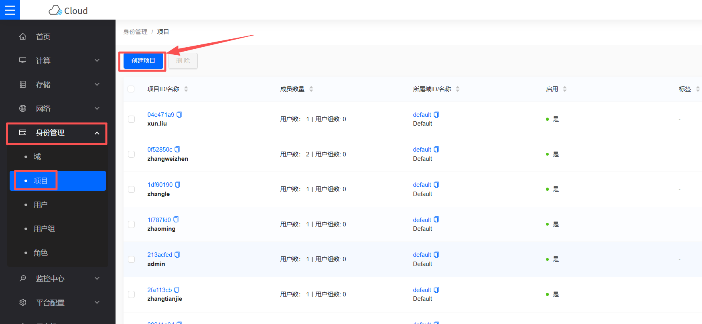
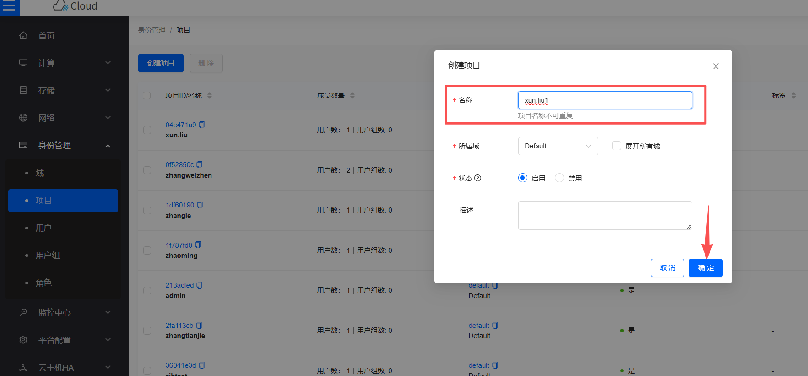
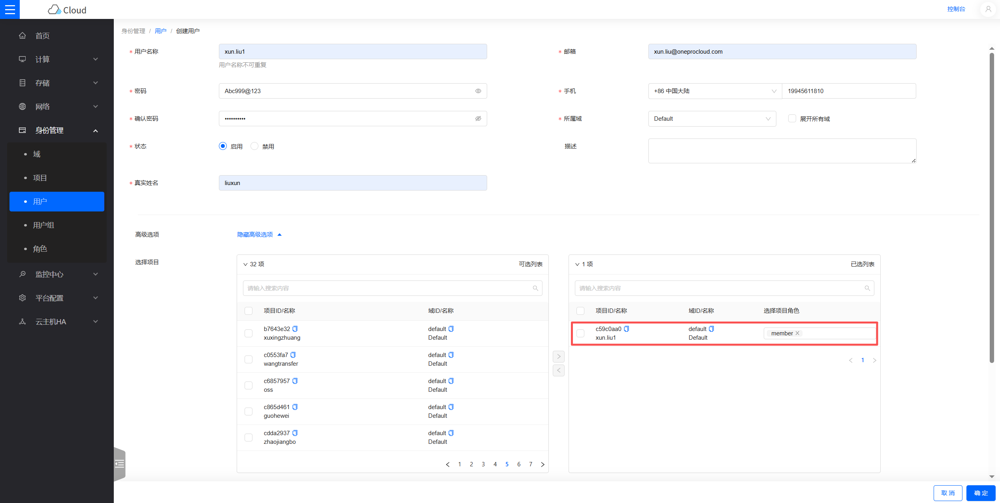
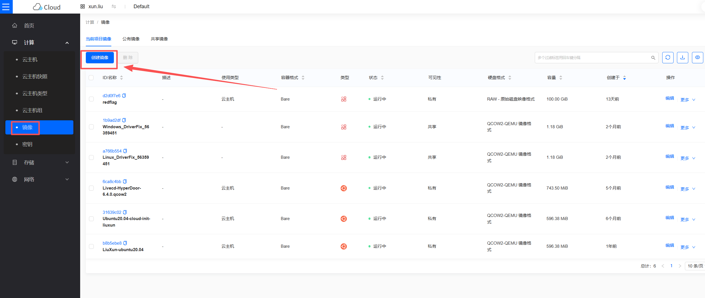
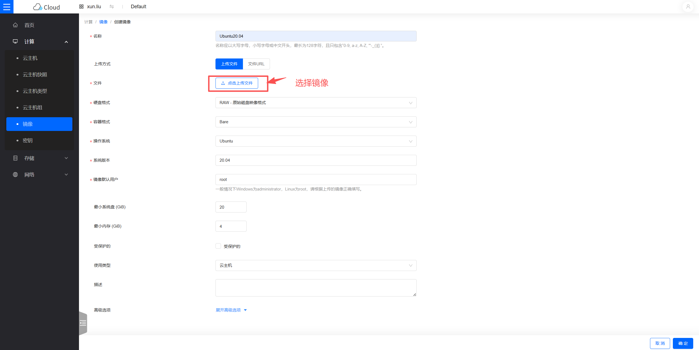
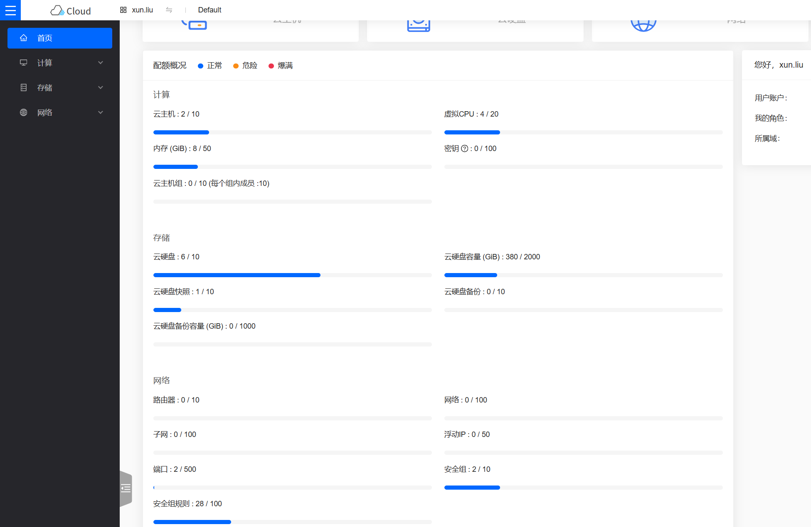

# OpenStack预设置

[[toc]]

## 为容灾目标端创建OpenStack租户

创建一个Openstack租户，并赋予相应的权限，详细要求请参考以下文档。

### 创建租户
注意：创建租户的步骤，每个OpenStack的版本有些许区别，以下为参考示例W版本。
#### 步骤一：创建项目



#### 步骤二：创建用户并绑定项目，选择项目角色member




## 配置 网络 & 子网
说明：根据以下灾难恢复网络场景建立您的网络。

1. 内部网络访问:

如果通过内部网络访问，请创建一个灾难恢复网络，并将HyperBDR 主机实例放置在此网络中。

2. 灾难恢复 网络:

为HyperBDR灾难恢复和备份创建专用的网络和子网，通过内网与源端IDC相互连接。

3. 业务 网络:

用于灾难接管和演练的业务网络和子网。

## 创建 HyperBDR 安全组

::: tip
HyperBDR 安全组名称: SG-HyperBDR
:::

### 创建安全组规则

::: warning
注意：对于安全组规则，根据自己平台的安全需要，设置相对应的规则即可。

:::

| No. | Action | Type | Protocol & Port | Source | Description |
| --- | --- | --- | --- | --- | --- |
| 1 | 允许 | IPv4 | TCP:22 | 0.0.0.0/0 | 默认允许Linux SSH端口 |
| 2 | 允许 | IPv4 | TCP:10443 | 0.0.0.0/0 | 允许 HyperBDR web 控制台 |
| 3 | 允许 | IPv4 | TCP:30443 | 0.0.0.0/0 | 允许 HyperBDR 运维管理平台 Web 控制台端口 |
| 4 | 允许 | IPv4 | TCP:30080 | 0.0.0.0/0 | 允许 HyperBDR HTTPS 服务端口 |

## 镜像下载 & 上传

### 镜像下载

::: tip
通过提供的镜像链接将Windows/Linux镜像下载到本地计算机。 
:::

### 镜像信息

#### Linux 镜像

* 版本： ubuntu 20.04 server
* 大小: 596.38 MB
* 下载链接: [https://downloads.oneprocloud.com/docs_images/ubuntu-20.04-server-cloud-init-amd64.qcow2](https://downloads.oneprocloud.com/docs_images/ubuntu-20.04-server-cloud-init-amd64.qcow2)  

#### Windows 镜像

* 版本：Windows Server 2016 Datacenter 64bit English
* 大小：12.11 GB
* 下载链接：[https://downloads.oneprocloud.com/docs_images/Windows_Server_2016_Datacenter_64bit_English_40G.qcow2](https://downloads.oneprocloud.com/docs_images/Windows_Server_2016_Datacenter_64bit_English_40G.qcow2) 
* 镜像的MD5值: 519444d4b0343e15fa014c50d906a832


### 导入镜像到OpenStack

#### 步骤一: 登录OpenStack
#### 步骤二: 创建镜像


等待镜像创建完成即可。

## 创建ECS实例用来安装 HyperBDR

### 登录OpenStack控制台

### 基于所需规格创建一台虚拟主机

> HyperBDR服务器所需规格如下


| 配置项               | 参数                                                      |
| :------------------ | :-------------------------------------------------------------- |
| 规格                |   8U16G                                                 |
| 镜像                | Ubuntu 20.04                                        |
| 系统盘              | 500GB                                                      |
| 网络                | <VPC-HyperBDR\>                                      |
| 子网                | <Subnet-HyperBDR\>  |
| 安全组              | SG-HyperBDR                                                     |
| 实例名称             | HyperBDR-Prod                                                  |
|登录用户名            | root                                                      |
| 密码               | <你的密码\>                                                            |


## 测试VPC之间的网络访问

### 测试灾难恢复VPC和业务VPC之间的网络连通性

- 步骤1: 登录到OpenStack并创建一个测试服务器  
在OpenStack上创建一个测试云服务器（使用Ubuntu20.04操作系统）。在配置网络时，选择业务VPC和子网。确保这台新创建的测试虚拟机的安全组具有允许端口22的入站访问策略。

- 步骤2: 从灾难恢复VPC到业务VPC进行网络测试访问

登录OpenStack控制台，并登录到HyperBDR 服务器，使用内部网络IP连接到业务VPC内的主机。


执行命令:

```sh
ssh root@<业务vpc主机IP地址>  22
```

测试结果:  
如果您能够成功访问并输入密码，表示正常访问。

### 测试业务VPC之间的网络连通性

- 步骤1: 创建一个新的测试云服务器，使用ubuntu20.04操作系统。在配置网络时，选择不同的业务VPC和子网。确保这台新创建的测试虚拟机的安全组具有允许端口22的入站访问策略。

- 步骤2: 通过控制台登录到不同vpc的测试云服务器，并使用以下命令进行双向命令测试。

执行命令:

```sh
ssh root@<测试主机IP地址> 22
```

测试结果:  
如果您能够成功访问并输入密码，表示正常访问。

## OpenStack账户配额检查

在灾难恢复过程中，确保OpenStack账户具有足够的资源配额以支持数据同步和灾难恢复非常重要。为防止因配额不足而导致灾难恢复的潜在失败，有必要在启动灾难恢复之前进行资源配额检查。

如果账户中的剩余配额不足，就有必要清理账户中的不必要资源，或者申请扩展资源配额。


### 源主机资源清单

需要收集等待灾难恢复的主机系统的计算和存储资源信息，并将详细信息输入到一个表格中。
| 资源类型 | 大小 |
| --- | --- |
| 源端主机的总数量  |  |
| 源端主机的总CPU数量 |  |
| 源端主机的总内存大小 |  |
| 源端主机的总磁盘数量 |  |
| 源端主机磁盘的总容量 |  |

### OpenStack账户资源配额检查

#### 登录OpenStack

#### 查看资源配额



#### 整理您的OpenStack账户资源配额并计算剩余配额


| 服务 | 资源类型 | 使用配额 | 总配额 | 剩余配额 |
| --- | --- | --- | --- | --- |
| 计算 | 云主机 |  |  |  |
| 计算 | CPU |  |  |  |
| 计算 | 内存 |  |  |  |
| 存储 | 云硬盘 |  |  |  |
| 存储 | 云硬盘容量 |  |  |  |
| 存储 | 云硬盘快照 |  |  |  |
| 网络 | 网络 |  |  |  |
| 网络 | 子网 |  |  |  |
| 网络 | 端口 |  |  |  |
| 网络 | 安全组 |  |  |  |
| 网络 | 安全组规则 |  |  |  |

#### 将剩余配额与源主机的资源进行比较

根据您的清单，将源主机的资源水平与OpenStack账户中的剩余资源配额进行比较，以评估是否满足灾难恢复的要求。

**1. 如果您正在使用对象存储恢复模式进行灾难恢复，请参考以下标准。**

> **计算: 云主机** 剩余配额 ≥ 源主机的总数  
> **计算: vCPUs** 剩余配额 ≥ 源主机的总CPU数  
> **计算: 内存 (MB)** 剩余配额 ≥ 源主机的总内存（MB）  
> **存储: 磁盘** 剩余配额 ≥ 源主机的总磁盘数  
> **存储: 磁盘容量(GB)** 剩余配额 ≥ 源主机的总磁盘容量（GB）    
> **存储: 云硬盘快照**  剩余配额 ≥ 保留快照数量     
> **网络: 网络** 剩余配额 ≥ 2   
> **网络: 安全组** 剩余配额 ≥ 2     
> **网络: 安全组规则** 剩余配额 ≥ 20    

**2. 如果您正在使用块存储恢复模式进行灾难恢复，请参考以下标准。**

> **计算: 云主机** 剩余配额 ≥ 源主机的总数 + Cloud_Sync_Gateway数量   
> **计算: vCPUs** 剩余配额 ≥ 源主机的总CPU数  + Cloud_Sync_Gateway的CPU数   
> **计算: 内存 (MB)** 剩余配额 ≥ 源主机的总内存（MB）+ Cloud_Sync_Gateway的内存数量   
> **存储: 磁盘** 剩余配额 ≥ 源主机的总磁盘数  + Cloud_Sync_Gateway的数量    
> **存储: 磁盘容量(GB)** 剩余配额 ≥ 源主机的总磁盘容量（GB）+ Cloud_Sync_Gateway的磁盘容量   
> **存储: 云硬盘快照**  剩余配额 ≥ 保留快照数量    
> **网络: 网络** 剩余配额 ≥ 2   
> **网络: 安全组** 剩余配额 ≥ 2   
> **网络: 安全组规则** 剩余配额 ≥ 20   

如果发现OpenStack账户中的剩余资源配额不足，就有必要清理账户中的不必要资源，或者向OpenStack管理员申请扩展资源配额。

