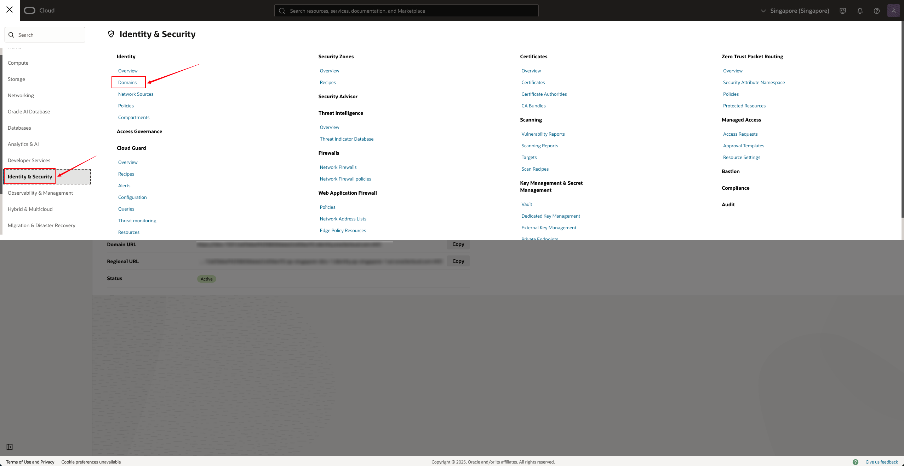
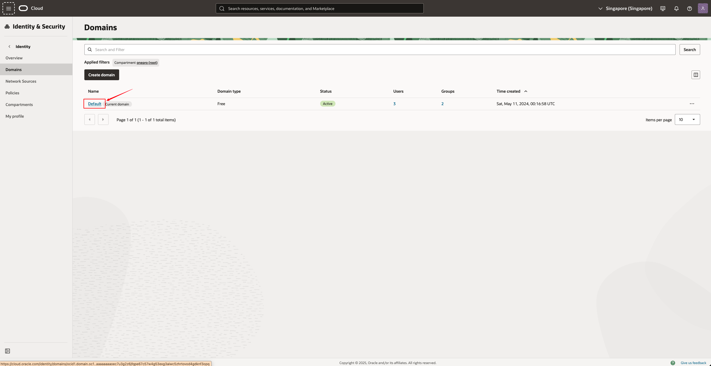
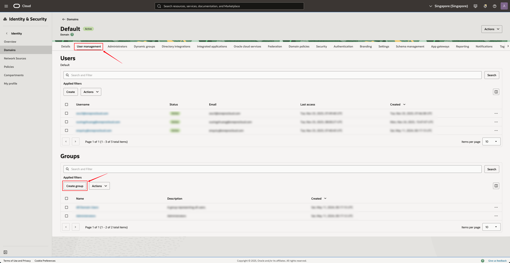
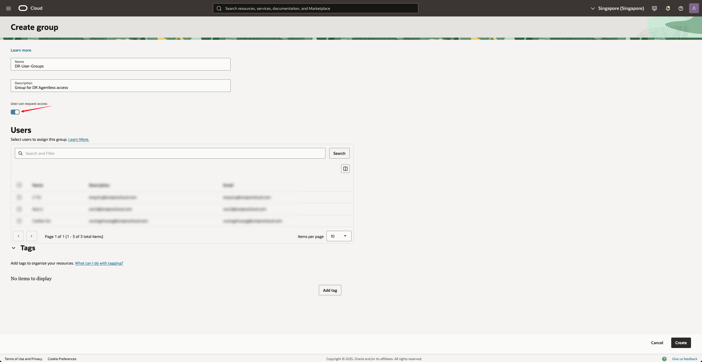
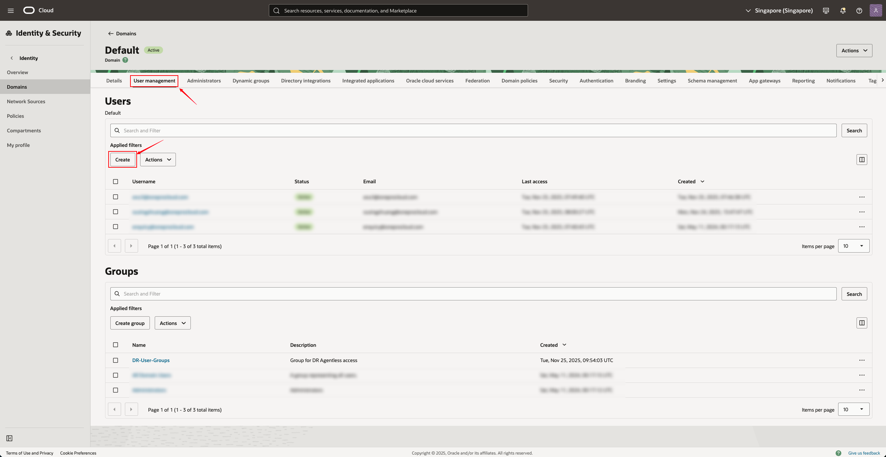
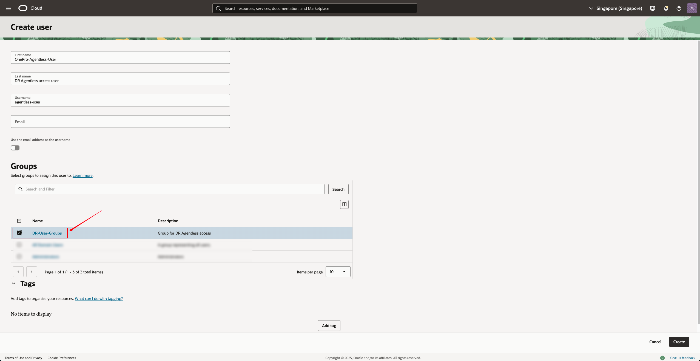
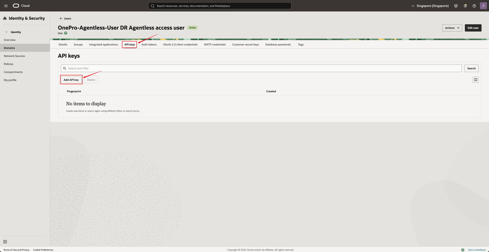
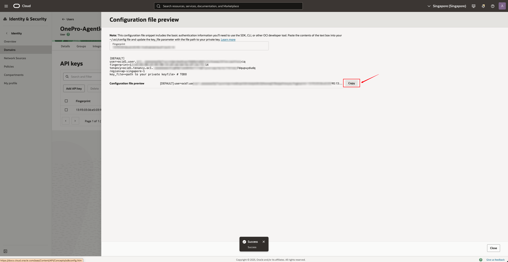
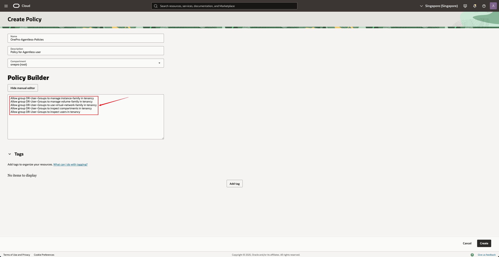
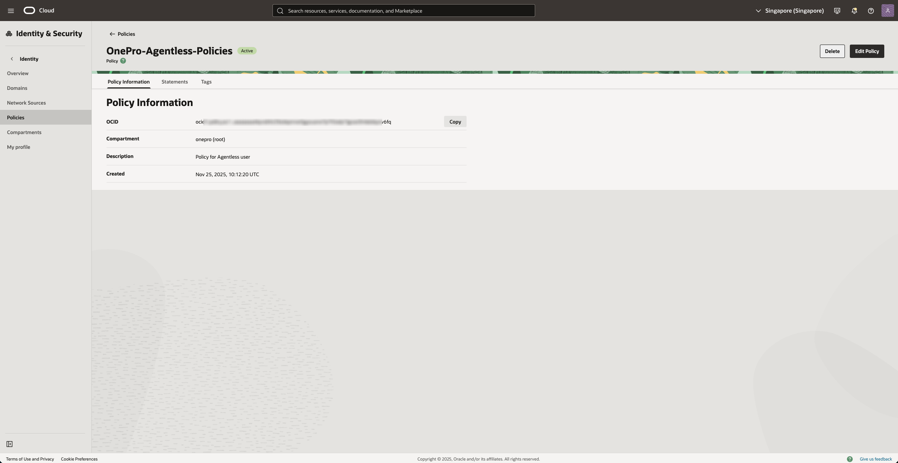

# Oracle Cloud 源端无代理预设置

> **适用场景**：用于在 HyperBDR / HyperMotion / OnePro 产品中，通过 Oracle Cloud（OCI）进行无代理（Agentless）资源发现、同步或容灾功能。
> &#x20;本文档指导客户如何创建 OCI 用户、用户组、授权策略、下载 API Key（公钥/私钥），并最终生成可用于产品端的认证信息。

***

## **目录**

1. 介绍

2. 前置条件

3. 创建用户组（Group）

4. 创建用户（User）

5. 生成并下载 API Key（用于无代理模式）

6. 创建访问策略（Policy）

7. 收集必要信息（Tenancy OCID / User OCID / Fingerprint）

8. 将配置信息录入到产品端

9. 常见问题（FAQ）

***

## 1. **介绍**

为了使用 HyperBDR / HyperMotion 访问 Oracle Cloud 资源（例如实例、磁盘、镜像等），需要在 OCI 中创建一个具备最小必要权限的账号，并通过 **API Key** 实现无代理访问。

本指南将指导如何操作：

* 创建用户组

* 创建用户

* 为用户生成 API 密钥对

* 创建最小权限的访问策略

* 获取最终需要填写到产品侧的认证信息

***

## 2. **前置条件**

* 已拥有 Oracle Cloud 管理员账号

* 拥有访问 OCI Console 的权限

* 登录地址：<https://cloud.oracle.com>

* 需要使用管理员权限进行用户与策略操作

***

## 3. **创建用户组（Group）**

1. 使用管理员账号登录 Oracle Cloud Console

2. 左上角点击 **"汉堡菜单（☰）" → Identity & Security → Domains"**

* 点击当前默认 Domain（一般为 *Default*）

* 上方菜单栏选择 **"User Management → Groups"（用户组）**

* 点击下方的 **“Create Group”**

**填写参数：**

| 字段 | 示例 | 描述 |
|---|---|---|
| Name | DR-User-Groups | 用户组名称 |
| Description | Group for DR Agentless access | 可选，建议填写用途 |
| User can request access | Yes | 开启 |

* 点击 **Create** 完成创建。

***

## 4. **创建用户（User）**

1. 在当前 Domain 下，点击上方菜单栏选择 **"User Management → Users"（用户）**

* 点击下方的 **“Create User”**

**填写参数：**

| 字段 | 示例 | 描述 |
|---|---|---|
| First Name | OnePro-Agentless-User | 用户名（唯一） |
| Last Name | DR Agentless access user | 可选 |
| Username | agentless-user | 可选 |
| Email | 可不填（根据设置） | 若启用邮件通知，可填写 |
| Use the email address as the username | Yes/No | 可选 |

* 下方的“Groups“，可以选择前边创建的组，将用户加入到步骤 3 创建的：**DR-User-Groups**

* 勾选加入的组之后，点击"**Create**"

***

## 5. **为用户生成 API Key（非常重要）**

> API Key 是产品连接 OCI 的核心认证方式。

1. 打开刚创建的用户，点击 **“API Keys”**

2. 点击 **“Add API Key”**

* 选择 **“Generate API Key Pair”**（让系统自动生成）

这里的Public Key，只需要 "**Download private key**"，下载之后，点击"Add"

* 下载以下内容（非常重要）：

| 文件 | 说明 |
|---|---|
| privateKey.pem | 私钥，用于在产品端录入 |
| publicKey.pem | 公钥 |
| config | 配置文件，可获得 fingerprint |
| oci_api_key_public.pem | 公钥副本 |

5. 保存 API Key 后，Oracle 会显示 Fingerprint，可复制保存。

***

## 6. **创建访问策略（Policy）**

> 我们需要创建一个策略（Policy），授权刚才的用户组拥有访问实例（instance）与磁盘（volume）的能力。

1. 进入 **Identity & Security → Policies**

2. 选择你的 **Root Compartment / Tenancy**（很重要，不要选错）

3. 点击右上角 **Create Policy**

**策略示例：**

| 字段 | 内容 |
|---|---|
| Name | OnePro-Agentless-Policies |
| Description | Policy for Agentless user |
| Compartment | Tenancy（根目录） |
| Policy Syntax | 见下方 |

**请在 Policy 中添加以下语句：**

将 **`DR-User-Groups`** 替换为实际的用户组名

创建后点击 **Create** 完成。

***

## 7. **收集必要信息（用于录入产品端）**

无代理模式下，你需要从 OCI 中收集以下信息：

| 信息项 | 获取方式 |
|---|---|
| Tenancy OCID | Console → Administration → Tenancy Details |
| User OCID | 打开用户 → “User OCID” |
| Region | 右上角区域选择器，例如 `ap-singapore-1` |
| Fingerprint | 在 API Key 页面可查看 |
| Private Key 内容 | 打开下载的 `privateKey.pem` |

建议将以上信息整理好，以便在 HyperBDR / HyperMotion 中填入。

***

## 8. **在产品端录入配置信息（示例）**

在 HyperBDR / HyperMotion 中添加 Oracle Cloud 账号时，将以下信息录入：

| 产品字段 | OCI 信息来源 |
|---|---|
| Tenancy OCID | Tenancy 详情页 |
| User OCID | 用户详情页 |
| Region | Console 右上角 |
| Fingerprint | 用户 API Key 详情 |
| Private Key | privateKey.pem 文件内容 |

[点击查看用户手册](../../../zh/userguide/dr/configuration/production-site.md#oracle)

完成后保存即可。

***

## 9. **常见问题（FAQ）**

### **Q1：API Key 下载后丢失怎么办？**

需要重新在用户页面生成新的 API Key，并更新产品端的配置。

### **Q2：策略授权一直失败？**

请确认是否选择了 **Tenancy（根 Compartment）**，子 Compartment 会导致权限不足。

### **Q3：用户加入了组但仍无权限？**

策略需绑定到用户组，而不是直接绑定到用户。

### **Q4：提示无权限访问实例或磁盘？**

请确认已添加以下策略：

`Allow group <group_name> to manage instance-family in tenancy`

`Allow group <group_name> to manage volume-family in tenancy`
