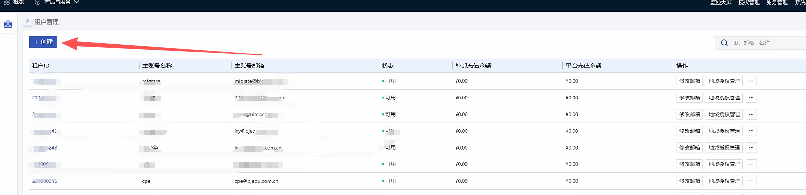

# 优刻得预设置

[[toc]]

## **为容灾目标端创建UcloudStack用户**

由于API限制无法直接使用Admin租户进行容灾/迁移，需要创建一个UcloudStack普通租户开始容灾/迁移，详细要求请参考以下文档。

### **创建租户**

注意：创建租户的步骤，每个UcloudStack的版本有些许区别，以下为参考示例2.13.2版本。

在平台选择，租户管理--创建



根据平台提示输入账号名称、邮箱、密码点击确认即可完成创建


## **配置 网络 & 子网**

说明：根据以下灾难恢复网络场景建立您的网络。

1. 内部网络访问:

如果通过内部网络访问，请创建一个灾难恢复网络，并将HyperBDR 主机实例放置在此网络中。

2. 灾难恢复 网络:

为HyperBDR灾难恢复和备份创建专用的网络和子网，通过内网与源端IDC相互连接。

3. 业务 网络:

用于灾难接管和演练的业务网络和子网。

## **创建 HyperBDR 安全组**

::: tip

HyperBDR 安全组名称: SG-HyperBDR

:::

### **创建安全组规则**

::: warning

注意：对于安全组规则，根据自己平台的安全需要，设置相对应的规则即可。

:::

| No. | Action | Type | Protocol & Port | Source    | Description                  |
| --- | ------ | ---- | --------------- | --------- | ---------------------------- |
| 1   | 允许     | IPv4 | TCP:22          | 0.0.0.0/0 | 默认允许Linux SSH端口              |
| 2   | 允许     | IPv4 | TCP:10443       | 0.0.0.0/0 | 允许 HyperBDR web 控制台          |
| 3   | 允许     | IPv4 | TCP:30443       | 0.0.0.0/0 | 允许 HyperBDR 运维管理平台 Web 控制台端口 |
| 4   | 允许     | IPv4 | TCP:30080       | 0.0.0.0/0 | 允许 HyperBDR HTTPS 服务端口       |

## **镜像下载 & 上传**

### **镜像下载**

::: tip

通过提供的镜像链接将Linux镜像下载到本地计算机。&#x20;

:::

### **镜像信息**

#### **Linux 镜像**

* **该镜像为Ucloud专用版本，内置qga服务**

* 版本： ubuntu 20.04 server

* 大小: 617 MB

* 下载链接: [https://downloads.oneprocloud.com/docs\_images/ubuntu20.04-server-qga.qcow2](https://downloads.oneprocloud.com/docs\_images/ubuntu20.04-server-qga.qcow2)

### **导入镜像到UcloudStack**

#### **步骤一: 登录UcloudStack**

#### **步骤二: 创建镜像**


等待镜像创建完成即可。

## **创建ECS实例用来安装 HyperBDR**

### **登录UcloudStack控制台**

### **基于所需规格创建一台虚拟主机**

> HyperBDR服务器所需规格如下

| 配置项   | 参数                   |
| ----- | -------------------- |
| 规格    | 8U16G                |
| 镜像    | Ubuntu 20.04         |
| 系统盘   | 500GB                |
| 网络    | \<VPC-HyperBDR\\>    |
| 子网    | \<Subnet-HyperBDR\\> |
| 安全组   | SG-HyperBDR          |
| 实例名称  | HyperBDR-Prod        |
| 登录用户名 | root                 |
| 密码    | <你的密码\\>             |

## **测试VPC之间的网络访问**

### **测试灾难恢复VPC和业务VPC之间的网络连通性**

* 步骤1: 登录到UcloudStack并创建一个测试服务器 &#x20;

在UcloudStack上创建一个测试云服务器（使用Ubuntu20.04操作系统）。在配置网络时，选择业务VPC和子网。确保这台新创建的测试虚拟机的安全组具有允许端口22的入站访问策略。

* 步骤2: 从灾难恢复VPC到业务VPC进行网络测试访问

登录UcloudStack控制台，并登录到HyperBDR 服务器，使用内部网络IP连接到业务VPC内的主机。

执行命令:

```bash
ssh root@<业务vpc主机IP地址>  22
```

测试结果: &#x20;

如果您能够成功访问并输入密码，表示正常访问。

### **测试业务VPC之间的网络连通性**

* 步骤1: 创建一个新的测试云服务器，使用ubuntu20.04操作系统。在配置网络时，选择不同的业务VPC和子网。确保这台新创建的测试虚拟机的安全组具有允许端口22的入站访问策略。

* 步骤2: 通过控制台登录到不同vpc的测试云服务器，并使用以下命令进行双向命令测试。

执行命令:

```bash
ssh root@<测试主机IP地址> 22
```

测试结果: &#x20;

如果您能够成功访问并输入密码，表示正常访问。

## **UcloudStack账户配额检查**

在灾难恢复过程中，确保UcloudStack账户具有足够的资源配额以支持数据同步和灾难恢复非常重要。为防止因配额不足而导致灾难恢复的潜在失败，有必要在启动灾难恢复之前进行资源配额检查。

如果账户中的剩余配额不足，就有必要清理账户中的不必要资源，或者申请扩展资源配额。

### **源主机资源清单**

需要收集等待灾难恢复的主机系统的计算和存储资源信息，并将详细信息输入到一个表格中。

| 资源类型        | 大小 |
| ----------- | -- |
| 源端主机的总数量    |    |
| 源端主机的总CPU数量 |    |
| 源端主机的总内存大小  |    |
| 源端主机的总磁盘数量  |    |
| 源端主机磁盘的总容量  |    |
