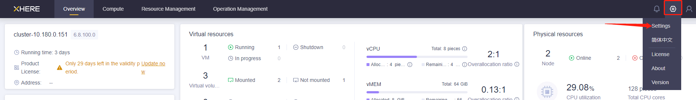
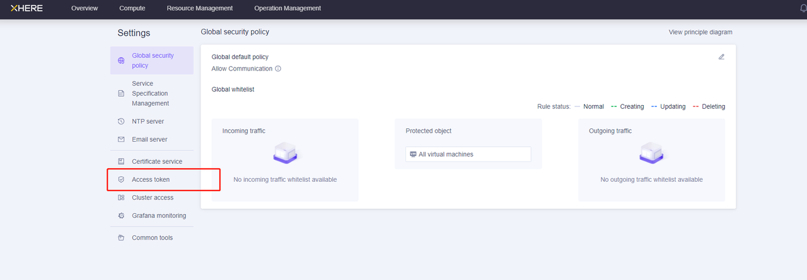
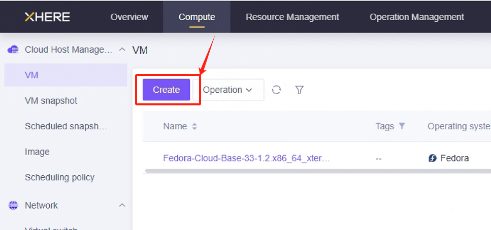
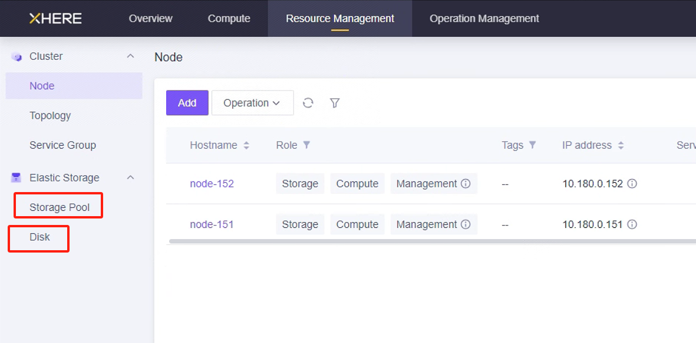
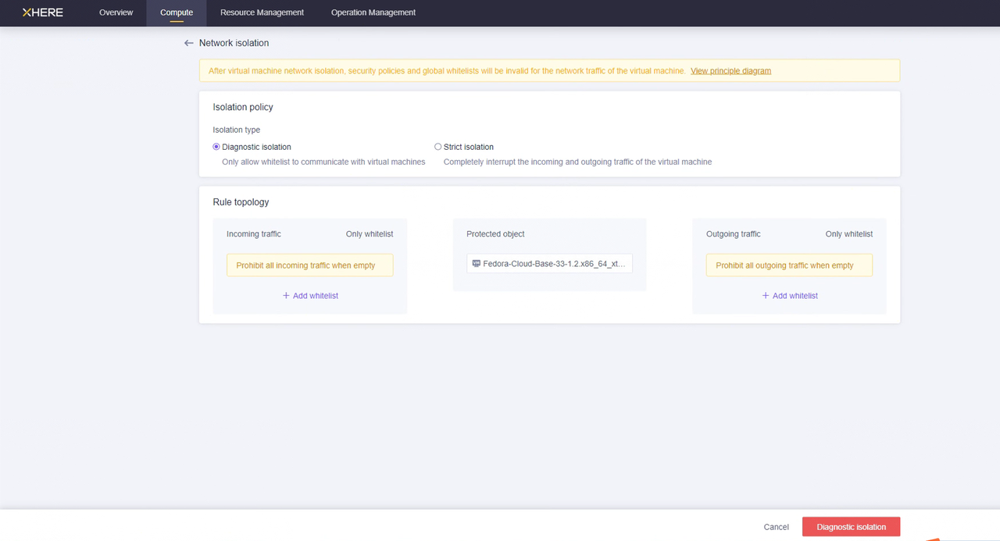

# XHERE 灾备预配置

## 为灾备目标创建与配置 XHERE 账户

### 创建用户并授予权限

XHERE 云平台部署完成后，默认账户通常为管理员账户，该账户拥有执行所有操作的权限。


### 管理用户访问密钥







点击"生成"后，只需输入名称即可为"admin"账户创建令牌。


## 桥接网络设置

 为满足灾备要求，需提前创建网络。


 所需网络包括： 

1.  HyperBDR 灾备工具所在的网络  

2.  云同步网关（Cloud Sync Gateway）所在的网络  

3.  灾备服务所在的网络  

 创建网络的方法如下：  


说明：请根据以下灾备网络场景建立您的网络。


1. HyperBDR 桥接网络：


如果通过内网访问，请创建一个灾备桥接网络，并将 HyperBDR 虚拟机实例置于此网络中。


2. 数据备份桥接网络：


专用于数据备份的桥接网络和子网，通过内网与本地数据中心（IDC）互联。


3. 业务桥接网络：


用于灾备接管和演练的业务桥接网络和子网。


## 测试桥接网络间的网络访问

>  预先创建的桥接网络需要确保彼此之间的网络通信  
>

### 测试本地 IDC 网络与 HyperBDR 桥接网络之间的连通性

+ 步骤1：登录 XHERE，在 XHERE 上创建实例 A 用于部署 HyperBDR 灾备工具。配置网络时，选择 HyperBDR 桥接网络和子网。确保此新创建实例的安全组具有允许端口 10443 和 30080 的入站访问策略。

+ 步骤2：部署 HyperBDR 灾备工具，并确保程序正常运行。 

+ 步骤3：从源 IDC 数据中心选择一台主机，测试其到 XHERE 上实例 A 的端口 10443 和 30080 的连接。  


 在源主机上执行命令：


```plain
ssh -v -p 10443 <实例 A 的内网 IP 地址> 
ssh -v -p 30080 <实例 A 的内网 IP 地址> 
```


测试结果：如果能够成功访问并输入密码，则表示访问正常。


### 测试 HyperBDR 桥接网络与数据备份桥接网络之间的连通性

+ 步骤1：在 XHERE 上创建一个新的实例 B。配置网络时，选择数据备份桥接网络和子网。确保此新创建的虚拟机测试实例的安全组具有允许端口 22、16100 和 10729 的入站访问策略。

+ 步骤2：登录到 HyperBDR 所在的实例。 


然后执行命令：


```plain
ssh -v -p 22 <实例 B 的内网 IP 地址> 
ssh -v -p 10729 <实例 B 的内网 IP 地址> 
ssh -v -p 16100 <实例 B 的内网 IP 地址> 
```


测试结果：

如果能够成功访问并输入密码，则表示访问正常。

### 测试本地 IDC 网络与数据备份桥接网络之间的连通性 

+ 步骤1：从源 IDC 数据中心选择一台主机，测试其到 XHERE 上实例 B 的端口 3260 的连接。此实例 B 即上文提到的实例。  


 在源主机上执行命令：


```plain
ssh -v -p 3260 <实例 B 的内网 IP 地址> 
```


测试结果：如果能够成功访问并输入密码，则表示访问正常。


### 测试 HyperBDR 桥接网络与业务桥接网络之间的连通性

+ 步骤1：创建一个新的虚拟机实例 C。配置网络时，选择业务桥接网络和子网。确保此新创建的虚拟机测试实例的安全组具有允许端口 22 和 10729 的入站访问策略。

+ 步骤2：登录到 HyperBDR 所在的实例。 


然后执行命令：


```plain
ssh -v -p 22 <实例 C 的内网 IP 地址> 
ssh -v -p 10729 <实例 C 的内网 IP 地址> 
```


测试结果：


如果能够成功访问并输入密码，则表示访问正常。


## 创建 HyperBDR 安全策略

 在 XHERE 中，可以为特定主机设置安全策略。例如：  


注意：对于源 IP 范围，建议使用安全范围替代 0.0.0.0/0。例如，如果您的公网 IP 地址是 110.242.68.66，源可配置为 110.242.68.66/32。


如果是公网环境，建议在端口 22 上设置白名单访问以确保安全。


## 上传Ubuntu20.04镜像到XHERE平台
该镜像用来部署容灾工具，且后续用来创建“云同步网关”，比较重要
> 因为XHERE平台，无法通过cloud-init服务为镜像注入密码，所以上传的镜像需要满足以下条件：
1. 镜像开启root用户远程登录
2. 镜像有root用户的默认密码

若无合适镜像，可以利用已有ubuntu20.04镜像，手动制作一个满足条件的镜像。


## 为 HyperBDR 创建虚拟机

### 登录 XHERE 控制台e

### 基于配置信息创建云实例

> HyperBDR 服务器的资源配置如下：
>





 在此页面，您可以选择 Ubuntu 20.04 镜像来创建用于安装 HyperBDR 工具的主机。为此主机选择 8U16G500G 的实例规格。  


## XHERE 平台账户配额检查

在灾备过程中，必须确保云账户拥有足够的资源配额来支持数据同步和灾备。为防止因配额不足导致灾备失败，需要在启动灾备前执行资源配额检查。

如果 XHERE 账户中的剩余配额不足，则需要清理账户中不必要的资源或申请扩大 XHERE 资源配额。


### 源主机资源盘点

需要收集待灾备主机系统的计算和存储资源信息，并将详细信息填入表格。


| **<font style="color:#373c43;">Resources Type</font>** | **<font style="color:#373c43;">Size</font>** |
| :--- | :--- |
| <font style="color:rgb(0, 0, 0);">The total number of source host</font> | |
| <font style="color:rgb(0, 0, 0);">The total number of source host CPU</font> | |
| <font style="color:rgb(0, 0, 0);">The total number of source host RAM(MB)</font> | |
| <font style="color:rgb(0, 0, 0);">The total number of source host disks</font> | |
| <font style="color:rgb(0, 0, 0);">The total disk capacity for source host(GB)</font> | |


### XHERE 账户资源配额检查

 在"资源管理"中查看相关资源。





## 修改云同步网关实例安全组的 SSH 策略

 您可以配置"云同步网关"实例的"网络隔离"，并通过白名单设置入站和出站流量的规则。





