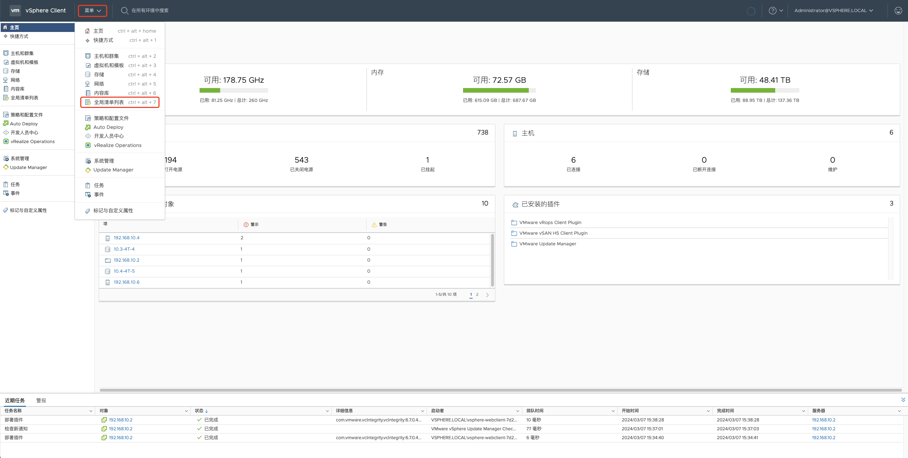
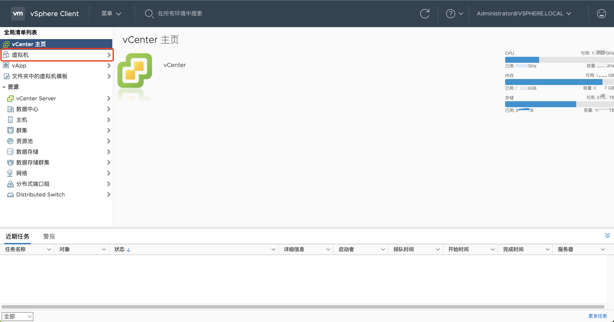
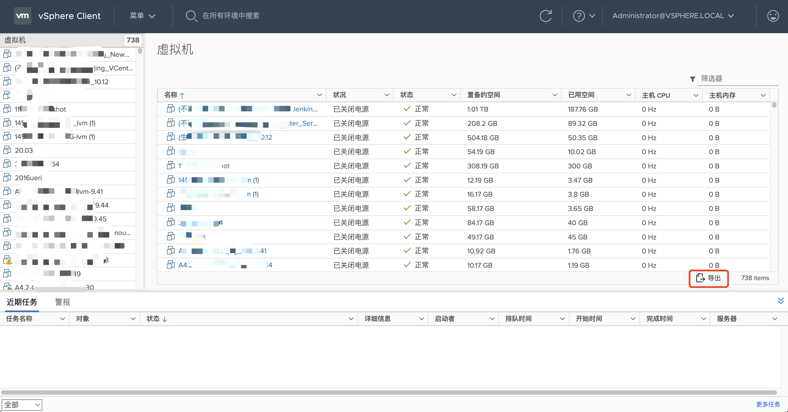
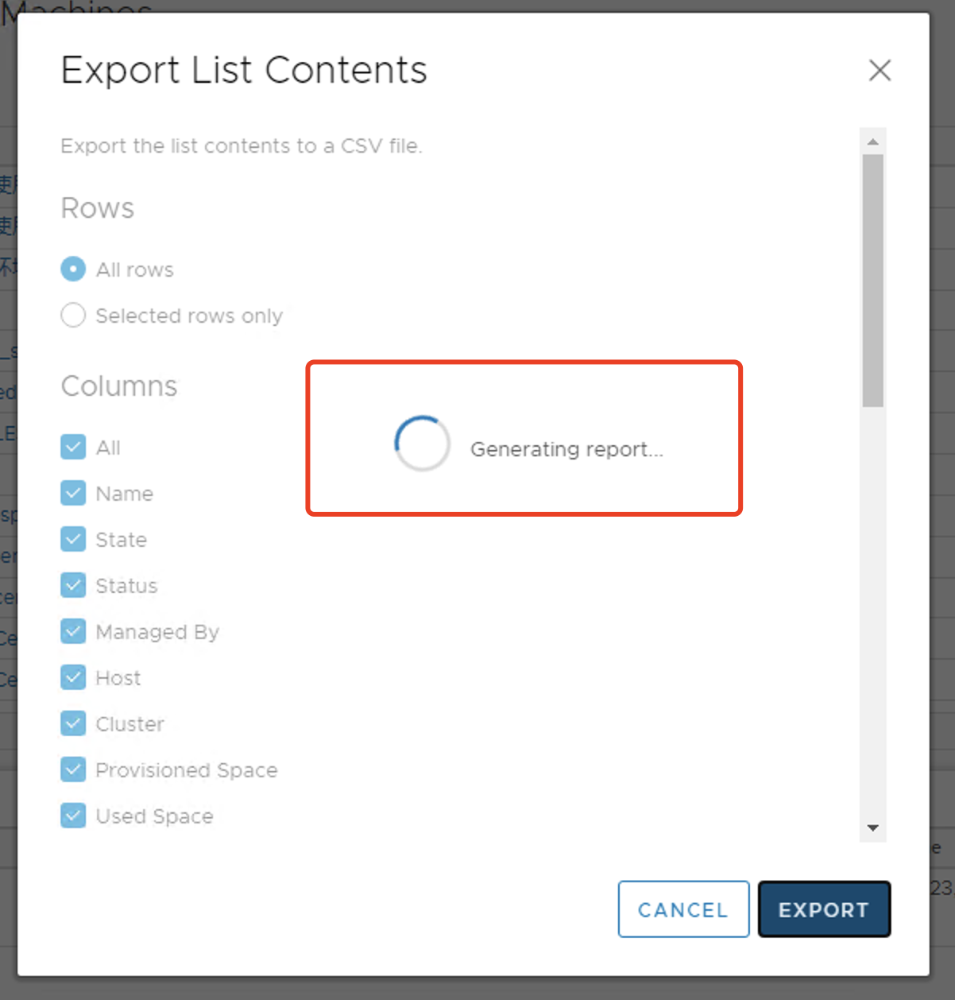
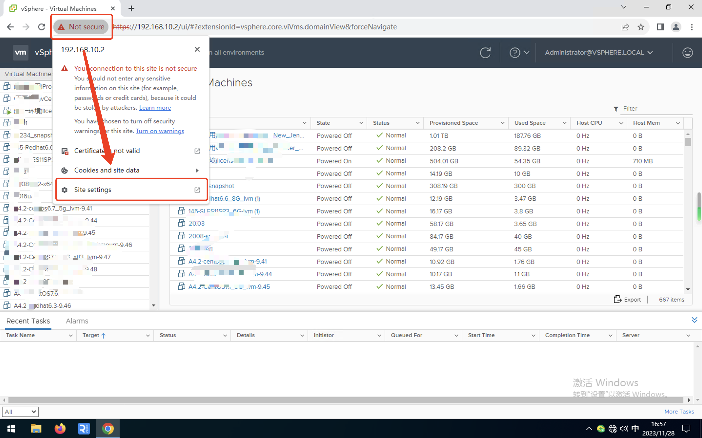
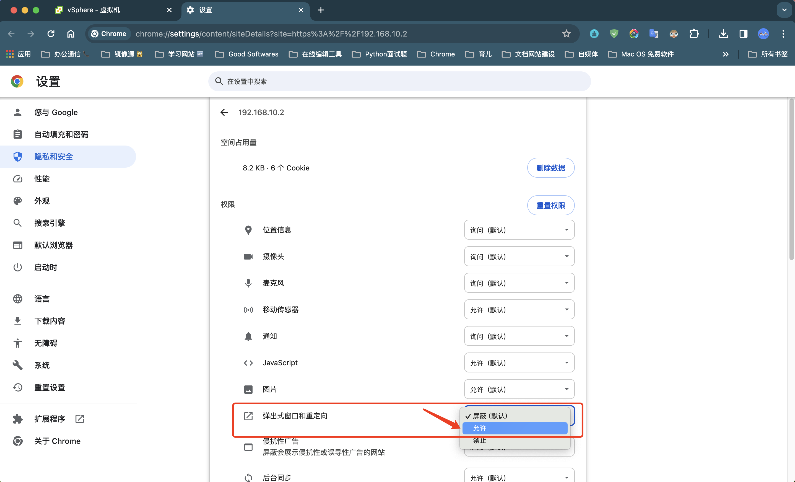

# 源端VMware主机快速调研"

This document is primarily designed to guide the initial investigation of user scenarios to determine whether they fall within the scope of product support during the early stages.

## Investigation Steps

### Host Information Collection

> Why we need this infromation? Investigate your VMware host information to assist us in analyzing whether your operating system type is compatible with HyperBDR for protection, and to determine how to effectively utilize cloud resources to provide protection for your system.

After these steps, you will get a csv file, please send back to us.

#### Login vCenter

#### Menu->Global Inventory Lists

#### Virtual Machines

#### Export

#### Select [All rows] and [All Columns]

Exporting

## FAQ

### The export operation has been blocked

After the configuration is complete, it is necessary to perform a page reload operation.
