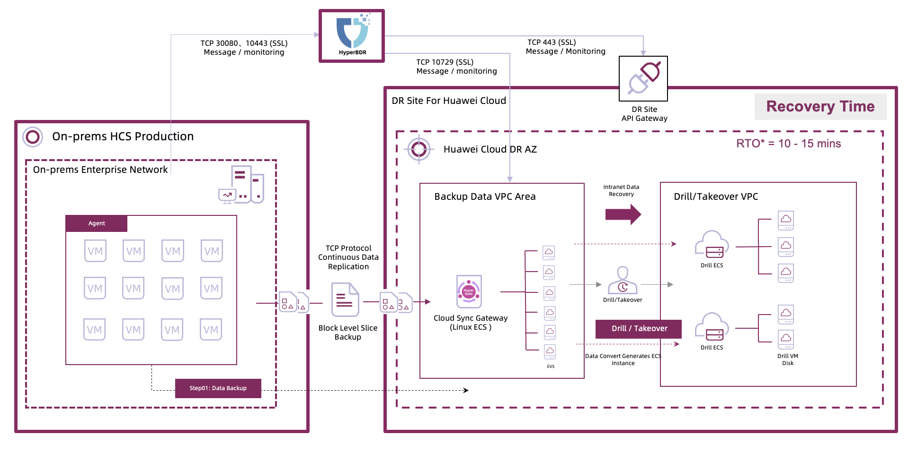

# HyperBDR 大规模跨云容灾最佳实践 墨西哥 IMSS 1200 台主机上华为云

***

## 一、项目概述

### 1.1 客户与场景

| 维度 | 说明 |
|------|------|
| **客户** | 墨西哥社保局（IMSS） |
| **行业/区域** | 社会保障（墨西哥）/跨平台容灾 |
| **业务特点** | 数百万民众承担着医疗、社会保障、健康管理等一系列关键服务 |
| **关键系统** | 医疗、社会保障、财务、人力资源、技术运维、数据管理 |
| **业务系统规模** | 1200 台虚拟机 |
| **主机磁盘汇总** | 磁盘总容量约 1760.56 TB |
| **源端环境** | 华为云本地 HCS |
| **容灾目标** | 在突发事件中快速恢复，满足《数据保护法》《数字政府法》等合规要求，确保业务连续性与公共服务稳定；关键业务 RPO 15 分钟、RTO 30 分钟内 |

本项目是跨平台云容灾的典型场景，适合作为政务与民生关键系统容灾的参考案例。

### 1.2 HyperBDR 在本项目中的核心价值

- **批量自动化 Agent 安装**：通过自动化脚本批量部署 Agent，将 1200 台主机的安装周期从 15+ 天缩短至 2 个工作日。
- **分批次+分级同步策略**：全量同步按 40–50 台/天并发推进，增量同步按业务重要性分为 15 分钟、1 小时、12 小时、24 小时、周、月策略。
- **Boot in Cloud + 编排**：灾难发生时一键拉起云侧资源并按依赖关系编排，10–15 分钟内批量启动业务主机。

***

## 二、业务挑战与 HyperBDR 的应对

跨平台云容灾场景往往面临以下挑战，本项目通过 HyperBDR 提供解决方案：

| 挑战 | 说明 | HyperBDR 的应对 |
|------|------|----------------|
| **大规模、复杂系统导致部署周期长** | 业务系统分布多个资源池，包含 1200+ 台虚拟机、7 种 Windows 与 11 种 Linux 版本，数据量大、系统复杂。 | 批量自动化 Agent 安装与统一纳管，显著缩短部署周期并降低人工复杂度。 |
| **合规与高可用要求严格** | 医疗与社会保障业务对业务连续性、数据安全和隐私合规要求高，需要严格 RPO/RTO。 | 基于策略化同步与分级 RPO 设计，保证关键系统 15 分钟 RPO；Boot in Cloud 与编排保证 30 分钟内 RTO。 |
| **异构环境与跨平台迁移难度高** | 本地 HCS 与公有云环境差异大，迁移与容灾链路复杂。 | 统一的 HyperBDR 迁移与同步平台，支持跨平台数据复制和云侧自动化资源创建。 |

这些挑战在多数跨平台容灾场景中具有共性，因此本项目展示的 HyperBDR 能力具有可复用的最佳实践价值。

***

## 三、HyperBDR 方案与架构

### 3.1 总体思路

以“批量迁移 + 分级同步 + 云侧编排接管”为总体思路：先分批完成源端全量同步，再按业务重要性设计多档 RPO 的增量同步策略，并通过 Boot in Cloud 与编排实现灾难时的快速接管与恢复。

### 3.2 架构要点

- **生产端**：华为云本地 HCS，1200 台虚拟机，涵盖多业务系统与多 OS 版本。
- **灾备端**：华为云公有云，按需弹性创建计算与网络资源。
- **存储层**：源端存储数据通过 HyperBDR 同步至云侧存储层，满足大规模数据复制需求。
- **复制关系**：全量同步分批并发推进；增量同步按 15 分钟/1 小时/12 小时/24 小时/周/月分级策略执行。

### 3.3 HyperBDR 核心能力在本项目中的体现

| HyperBDR 能力 | 在本项目中的应用 | 价值 |
|--------------|----------------|------|
| **Batch Migration（批量迁移）** | 按 40–50 台/天并发执行全量同步 | 平衡网络与存储压力，确保大规模迁移可控推进 |
| **Policy-Based Synchronization（策略化同步）** | 按业务重要性配置多档 RPO | 同时满足关键业务与一般业务的差异化容灾目标 |
| **Boot in Cloud + Orchestration（云端启动与编排）** | 灾难发生后自动创建云侧资源并按依赖关系拉起 | 10–15 分钟内批量恢复系统，满足 SLA 要求 |

***

## 四、实施要点与演练最佳实践

### 4.1 数据复制阶段

在演练前的数据复制阶段，本项目采用以下复制策略：

- **分批次全量同步**：按 40–50 台/天并发推进，降低网络与存储峰值压力。
- **分级增量同步**：关键系统 15 分钟/1 小时，其它系统 12 小时/24 小时/周/月分级同步。

数据复制过程持续进行，为后续演练和接管提供数据基础。

### 4.2 演练与接管阶段最佳实践

演练和接管是验证容灾方案有效性的关键环节。本项目采用 **Boot in Cloud 一键接管**，以下是演练过程中的详细步骤和最佳实践：

#### 4.2.1 演练前准备

| 步骤 | 时间 | 关键动作 | 目的 |
|------|------|---------|------|
| **资源校验** | T-1 天 | 校验云侧资源配额、网络连通性与安全策略 | 确保演练环境可用 |
| **策略复核** | T-1 天 | 复核分级同步策略与依赖编排顺序 | 降低演练中断与回滚风险 |

**演练前准备的关键要点：**

- 保持与生产一致的云侧镜像与网络配置。
- 明确依赖链路与恢复优先级（数据库先于应用）。

#### 4.2.2 演练与接管阶段

| 阶段 | 目标 | 详细步骤与 HyperBDR 关键动作 | 时间与结果 |
|-------|-----------|----------------------------------------|----------------|
| **阶段 1** | 启动核心系统 | 触发 Boot in Cloud，自动创建云侧资源并拉起数据库与核心中间件 | 10–15 分钟内完成核心系统启动 |
| **阶段 2** | 启动业务系统 | 按编排顺序并行拉起应用与支撑系统 | 业务系统进入可服务状态 |
| **阶段 3** | 验证与切换 | 完成一致性与可用性验证，执行业务接管 | 满足 RTO 30 分钟 SLA |

**演练过程中的 HyperBDR 最佳实践要点：**

- **依赖编排优先级**：数据库、认证、消息中间件优先启动。
- **并行恢复策略**：对无强依赖系统并行拉起，缩短整体时间。
- **一键接管回退**：演练完成后可快速回切，降低业务影响。

***

## 五、关键成果与指标

采用 HyperBDR 跨平台容灾方案，在 DR 演练及接管过程中可达到以下效果：

| 指标 | 结果 | HyperBDR 的贡献 |
|------|------|--------------|
| **部署周期** | 15+ 天缩短至 2 个工作日 | 批量自动化 Agent 安装与集中管理 |
| **RPO** | 关键系统 15 分钟，其他系统分级（1 小时/12 小时/24 小时/周/月） | 策略化同步与多档频率配置 |
| **RTO** | 批量启动 10–15 分钟，SLA 30 分钟 | Boot in Cloud + 编排自动化 |

***

## 六、项目总结

本项目成功验证了 HyperBDR 在跨平台云容灾场景下的有效性，为 IMSS 实现了可靠的容灾方案。项目取得的关键成果如下：

### 6.1 关键成果

- **高效部署**：1200 台主机 Agent 部署周期缩短到 2 个工作日。
- **合规与高可用**：满足医疗与社会保障业务的合规与高可用需求。
- **快速恢复**：10–15 分钟内批量拉起系统，满足 30 分钟 SLA。

### 6.2 项目价值

本项目展示了 HyperBDR 在跨平台云容灾场景下的核心价值：

- **提升业务韧性**：保障公共服务连续性与数据安全。
- **降低成本与复杂度**：统一平台减少人工运维与存储成本。
- **可复制性强**：适用于政务、医疗等关键行业的大规模容灾。

### 6.3 典型场景

本项目覆盖了政务与民生关键系统跨云容灾场景，对同类客户具有代表性和参考价值。
